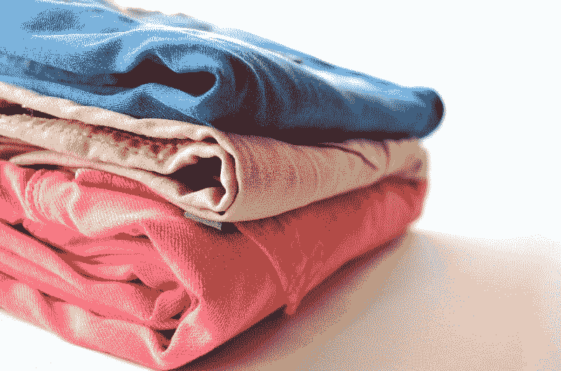
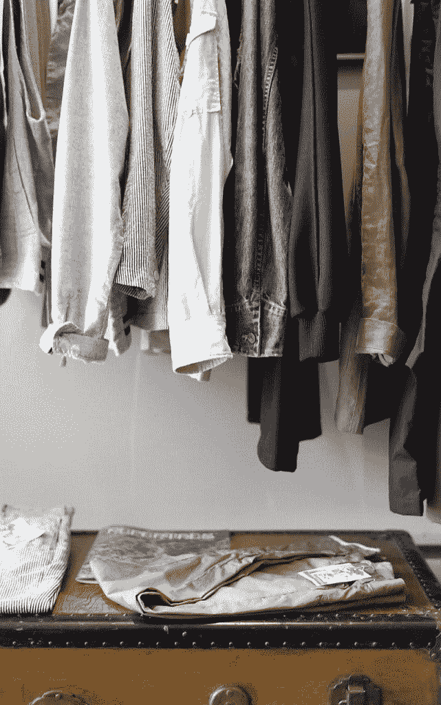
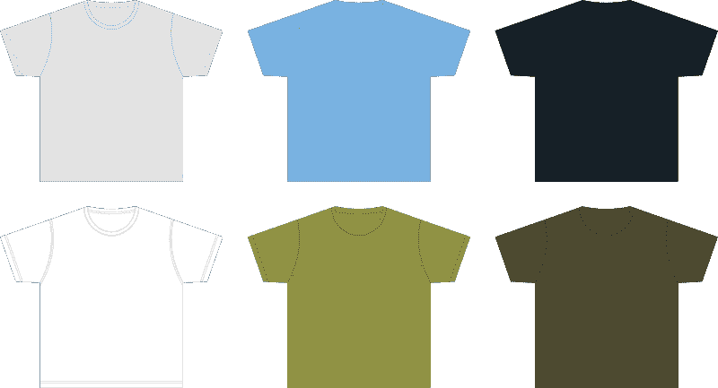

# Stitch Fix 赚钱吗？—市场疯人院

> 原文：<https://medium.datadriveninvestor.com/is-stitch-fix-making-money-market-mad-house-7bc6bf902598?source=collection_archive---------6----------------------->

理论上， **Stitch Fix(纳斯达克股票代码:SFIX)** 可能是目前最完美的公司。

Stitch Fix 的数字平台将用户与帮助他们购买衣服的造型师联系起来。然后顾客购买衣服，这些衣服由缝纫公司发货给他们。

然而，Stitch Fix 正在裁员 18%，其中包括 1400 名造型师。此外，Stitch Fix 还关闭了两个配送中心。

我猜对 Stitch Fix 造型的需求下降了，因为人们在家工作。解释一下，你不需要造型师的帮助来购买运动衫、t 恤衫和瑜伽裤。

# Stitch Fix 在成长吗？

商业期刊指出，相反，Stitch Fix 可以在克里夫兰和达拉斯等地增加 2000 个工作岗位。因此，我怀疑 Stitch Fix 的业务可能正在增长。

详细地说，被解雇的员工是在加州远程工作的造型师。这次裁员发生在《议会法案》在加州成为法律的五个月后。

《议会法案 5》将许多独立承包商、零工经济工人重新归类为全职雇员。因此，加州的最低工资、假期、加班、用餐时间、休假规则和失业保险现在适用于全职临时工。

因此，我认为 Stitch Fix 正在将其劳动力转移到监管较少的州，以节省资金。然而，这样的转变将增加其他州效仿加州的政治压力。

 [## 数据驱动始于数据素养|数据驱动的投资者

### 光是听到“数据”这个词就令人生畏。老实说，只有 21%的全球员工对自己的工作充满信心

www.datadriveninvestor.com](https://www.datadriveninvestor.com/2020/03/22/data-driven-starts-with-data-literacy/) 

Stitch 在冠状病毒之前就已经在生长了。在截至 2020 年 1 月 31 日的季度中，Stockrow Stitch 的收入增长率为 22.01%。该收入增长率高于截至 2019 年 10 月 31 日的季度的 21.46%，但低于 2019 年 7 月 31 日的 35.77%。

# Stitch Fix 赚钱吗？

**Stitch Fix(纳斯达克代码:SFIX)** 上个季度赚了更多的钱。例如，截至 2020 年 1 月 31 日，Stitch 的季度营业收入为 850 万美元。

该营业收入高于 2019 年 10 月 31 日的 16 万美元，但低于 2019 年 1 月 31 日的 1541 万美元。相反，Stitch Fix 的季度毛利从 2019 年 1 月 31 日的 1.6315 亿美元上升至 2019 年 10 月 31 日的 2.013 亿美元，再上升至 2020 年 1 月 31 日的 2.0219 亿美元。

相比之下，Stitch Fix 的季度共同净收入从 1197 万美元增长到 2019 年 1 月 31 日；至 2019 年 10 月 31 日的 18 万美元，至 2020 年 1 月 31 日的 1143 万美元。

有趣的是，缝针可以产生现金。Stitch Fix 报告截至 2019 年 1 月 31 日的期末现金流为-584 万美元。期末现金流于 2019 年 7 月 31 日上升至 1，425 万美元，于 2019 年 10 月 31 日上升至 1.5178 亿美元。相反，截至 2020 年 1 月 31 日，Stitch Fix 的期末现金流降至 1421 万美元。

最后，Stitch Fix 有更多的现金。Stitch Fix 的现金和短期投资从 2019 年 1 月 31 日的 2.7711 亿美元上升至 2019 年 10 月 31 日的 2.9728 亿美元，至 2020 年 1 月 31 日的 3.0058 亿美元。因此，Stitch Fix 在 2019 年底的现金比 2018 年底多。

# Stitch Fix 有什么价值？

我认为 **Stitch Fix(纳斯达克代码:SFIX)** 因其技术能力而具有价值。

例如，Stitch Fix 声称在 2019 年 2 月雇佣了超过 100 名数据科学家和超过 3900 名造型师。*此外，Stitch Fix 还在南旧金山、达拉斯、凤凰城和宾夕法尼亚州的伯利恒运营履行中心。

Stitch 声称在 2019 年 9 月美国消费者新闻与商业频道拥有 320 万活跃客户。每个客户都是潜在的收入来源，因为 Stitch Fix 向每个用户收取 20 美元的造型费。

因此，史迪奇可以从那些害怕去百货商店和精品店购物但仍然想看起来时尚的女性身上赚钱。解释一下，Stitch 的造型师可以帮助这些人在不接触新冠肺炎的情况下买到他们想要的时装。

# Stitch 的市场在增长吗？

此外，Stitch Fix 的市场可能会增长，因为百货商店和时装零售商正在快速消亡。例如，J. Crew、True Religion、Neiman Marcus Group 和 J. C. Penney **(纽约证券交易所代码:JCP)** 已经宣布破产。引人注目的是，一个标志性的百货品牌[巴尼斯百货](https://www.vox.com/the-goods/2020/2/5/21113525/barneys-bankruptcy-closing-liquidation-sale)已经彻底消亡。

与此同时，**(纽约证券交易所代码:JWC)** 计划关闭 19 家门店。全球数据分析师尼尔·桑德斯*今日美国*称，诺德斯特龙将关闭 14%的足迹。

因此，人们在时尚购物方面的实体选择将会减少。因此，越来越多的人会寻找其他地方来购买时装，如缝针。

# Stitch Fix 能和亚马逊抗衡吗？

然而，**亚马逊(纳斯达克股票代码:AMZN)** 正在大力推进时尚。

例如，亚马逊计划在 2020 年秋季推出一个新的奢侈品时尚平台， *Quartz* [推测](https://qz.com/1781553/amazon-said-to-be-launching-new-luxury-fashion-platform/)。亚马逊计划建立一个平台，为品牌提供网上商店，并获得亚马逊的物流网络和客户服务资源。

Quartz 推测，这个网络可能包含 12 个时尚品牌。然而*石英*无法识别那些品牌。

相反，Stitch Fix 列出了大约 20 个品牌。这些品牌包括一些大牌，如倭黑猩猩，卡尔文克莱恩和拉尔夫劳伦。

因此，Stitch Fix 有一些亚马逊想要建立的基础设施。然而，亚马逊有资源快速建立这样的基础设施。特别是，截至 2020 年 3 月 31 日，亚马逊拥有 492.92 亿美元的现金和短期投资。相比之下，Stitch Fix 在 2020 年 1 月 31 日有 3.0058 亿美元的现金和短期投资。

在这种情况下，我认为没有一个财力雄厚的捐助者，Stitch Fix 无法生存。因此，我怀疑像**梅西百货(纽约证券交易所代码:M)** 、**(纽约证券交易所代码:TJX)** 或诺德斯特龙这样的大型零售商可以收购 Stitch Fix 来扩大销售。特别是，梅西百货或诺德斯特龙百货可以通过 Stitch Fix 销售来自其供货中心的时装，并利用现有资源。

# Stitch Fix 是好货吗

我认为市场先生在 2020 年 6 月 11 日将 **Stitch Fix(纳斯达克股票代码:SFIX)** 定价过高，为 22.80 美元。解释一下，我认为 Stitch Fix 赚不到足够的钱来证明这个价格。

然而，Stitch Fix 在 2020 年保持了其份额值。Stitch Fix 从 2020 年 1 月 2 日的 25.06 美元开始，到 2020 年 6 月 8 日升至 25.53 美元，然后在 2020 年 6 月 11 日降至 22.80 美元。此外，Stitch Fix 的股价在 2020 年 2 月 21 日达到 29.37 美元的峰值。

总之，我认为 Stitch Fix 的价值是理论上的。所以，我建议所有投资者远离 Stitch Fix。你需要避免缝针，因为没有证据表明这家公司可以产生大量的现金。

*[https://news room . stitch fix . com/WP-content/uploads/2019/02/stitch fix _ fact sheet-19-02-19 . pdf](https://newsroom.stitchfix.com/wp-content/uploads/2019/02/StitchFix_FactSheet-19-02-19.pdf)

*原载于 2020 年 6 月 11 日 https://marketmadhouse.com**[*。*](https://marketmadhouse.com/is-stitch-fix-making-money/)*