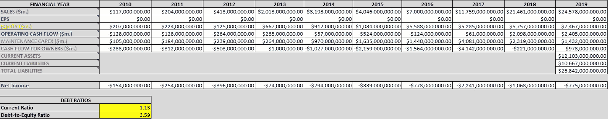
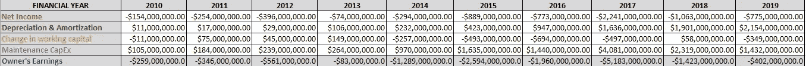
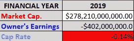
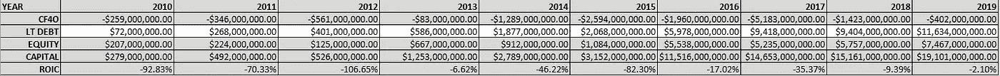
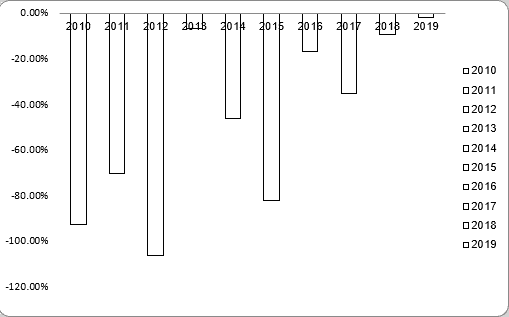

# 特斯拉的股票真的有那么高吗？

> 原文：<https://medium.datadriveninvestor.com/is-teslas-stock-really-that-high-a33fa7219eb1?source=collection_archive---------7----------------------->

## 对特斯拉财务状况的深入分析

Photo by [Ishant Mishra](https://unsplash.com/@ishant_mishra54?utm_source=medium&utm_medium=referral) on [Unsplash](https://unsplash.com?utm_source=medium&utm_medium=referral)

埃隆·马斯克无疑是企业家世界中的成功人物，众所周知，他身上那种绝对疯狂的气质造就了他。这就是我们如此喜欢他的原因。甚至当他在 twitter 上说了一些愚蠢的话，最终让他损失了 4000 万美元。

这不正是现在股价这么高的原因吗？

想想吧。

特斯拉并不是有史以来最赚钱的公司，那么为什么它的股价如此之高？

我相信原因很清楚:埃隆·马斯克。

拜托，不要说你不想投资一个和乔·罗根一起抽大麻并一直在推特上发布迷因的人的公司。

但是难道没有别的原因吗？埃隆马斯克(Elon Musk)不是特斯拉股票如此之高的真正原因吗？我很好奇，所以就去挖了。

# 基本数据输入

从这张电子表格中我们可以得出什么结论？

Print Screen from my excel Spreadsheet

## 净收入

嗯，首先，我们可以看看**净收入**，看到特斯拉从一整年都没有盈利。

目前，我们正在等待特斯拉的 Q2 报告，该报告将在几天内发布，如果报告显示盈利，特斯拉可以进入 SP500 指数。这是最近价格飙升的原因之一。显然，该公司的净收入历史并不太好。

 [## 金融顾问今天应该拥抱虚拟实践模式的 5 个理由|数据驱动…

### 随着对办公空间长期租赁的需求在新冠肺炎疫情时代彻底崩溃，办公空间的需求也在下降

www.datadriveninvestor.com](https://www.datadriveninvestor.com/2020/05/21/5-reasons-why-financial-advisors-should-embrace-the-virtual-practice-model-today/) 

## 所有者的现金流

这个指标不太正确。不过这也不是完全错误的。

它考虑了**经营现金流**和**资本支出**。它只是没有考虑到业主的收入，但不要担心，我会告诉你一分钟。

当你查看运营现金流时，你会发现直到 2018 年还没有盈利，这太疯狂了。

那还不算太糟，是吗？嗯，当然，那时候不盈利，但现在盈利了。

当然，经营现金流不是正的，但是资本支出呢？问题是，OCF 只考虑制造产品和销售产品的成本。它没有考虑维持运营的成本，维持工厂运转的成本，工人的工资等等。

考虑到资本支出，我们可以看到唯一盈利的一年实际上是 2019 年，利润甚至没有达到 10 亿美元。10 亿美元对于像你、我和世界上 99%的人来说可能是很多，但对于一家现在价值 2780 亿美元的公司来说，这还不到他们价值的 0.5%。相比之下，苹果，一家比特斯拉大 6 倍的公司，在 2019 年赚了他们价值的 4%。

你看到这里的问题了吗？一家市值较大的公司不应该比一家规模较小的公司拥有更大的市值比例。

## 资产与负债

**总**负债/资产比率(电子表格中没有显示)并没有那么糟糕。是 73%的比例。无论如何都不算好，但当你看到**目前高达 88%的负债/资产比率时，也没那么糟糕。**

你知道他们的大部分流动资产在哪里吗？现金。可能是债券或类似的东西，但它仍然是现金。超过 60 亿美元的现金。他们总资产的近 20%是现金。

# 所有者收入

这是实际所有者的收入，也就是说，如果所有者愿意，他们可以带回家。从中我们能得出什么结论？

Print Screen form my excel Spreadsheet

我们得到所有者收益的方法是:我们取**净收入**，加上**折旧&摊销**，加上**营运资本变化**，减去**资本支出**。

我们可以看到没有一年是真正盈利的。这是公司在每个财政年度末实际得到的。

这里没什么可谈的，只说公司不盈利。

# 资本化率

帽子是什么？率？简单来说，就是每年的收益与市场资本总额的比率。

该公司以目前的**市值**生存下去应该在 8%以上

你可能会问“*市值是多少？”*

市值是一个简单的指标。你拿一只股票的已发行股份数乘以股票价格。这是公司当前的市场价值，投资者在某个时间点赋予公司的价值。

先说清楚。这家公司不可能在 278，210，000，000 美元的市值下生存。

# 投入资本收益率

我相信这个标准不需要介绍。这实际上就是一家公司与投入资本相比所获得的回报

Print Screen from my Excel Spreadsheet

该公司投资的资本没有回报，尽管它一年比一年好。

如果特斯拉连一个正的 ROIC 都没有，我们怎么能指望它在当前的市值下生存下去呢？

# 增长

很抱歉，我真的不能在这里放一张图片，因为这些数字几乎都是负数，excel 不知道如何分析负数。仅仅这些信息就能让你对公司的状况有一个很好的了解。

嗯，增长本身一点也不差。实际上已经很好了。

在过去的 9 年里，股票增长了 49%。

过去 9 年净收入增长 20%。

过去 7 年收入增长 79%。

看，长得不错。问题是，对于这种增长，该公司已经完全忽视了利润，好像它不是一个问题。

我本想告诉你公司的价值是什么，但我做不到。为什么不呢？嗯，现金流甚至不是正的。从来没有过，我也无法预测 2020 年的现金流可能是多少。也许在 2021 年 2 月，当 2020 年的年度报告出来时，我可以对该公司进行评估。

现在，我们能从所有这些数字和它们之间复杂的关系中得到什么呢？

依我拙见，特斯拉虽然是一家伟大的公司，但并不是一项好的投资，以下是总结的原因:

1.  可怕的净收入，即使有 19%的增长
2.  惊人的经营现金流
3.  贫困业主的收入
4.  可怕的资本化率
5.  我无法计算贴现现金流
6.  股票正处于顶峰

以上是我的理由。你可能不同意，也可能不同意。，但我现在不会把钱押在特斯拉上。也许明年或几年后，只是不是现在

*我从 Hamish Hodder 那里下载了电子表格，请在* [*他的 youtube 频道*](https://www.youtube.com/channel/UCODr9HUJ90xtWD-0Xoz4vPw) *给他爱。*

**访问专家视图—** [**订阅 DDI 英特尔**](https://datadriveninvestor.com/ddi-intel)