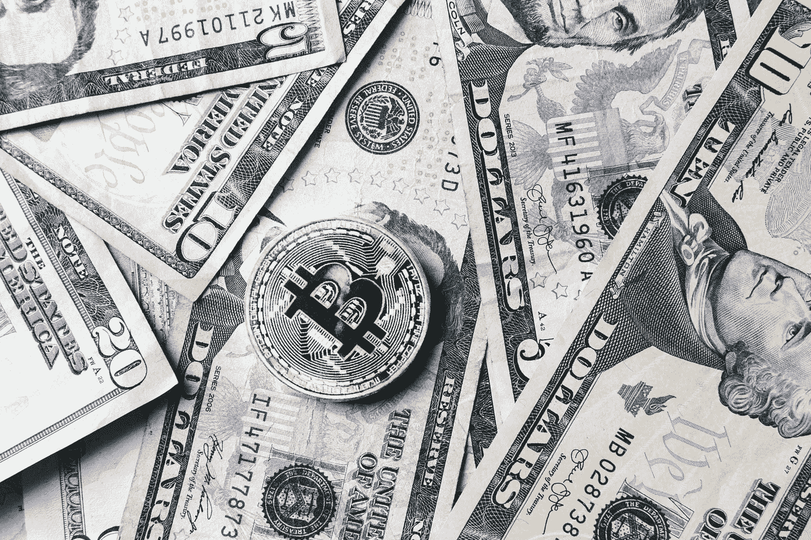
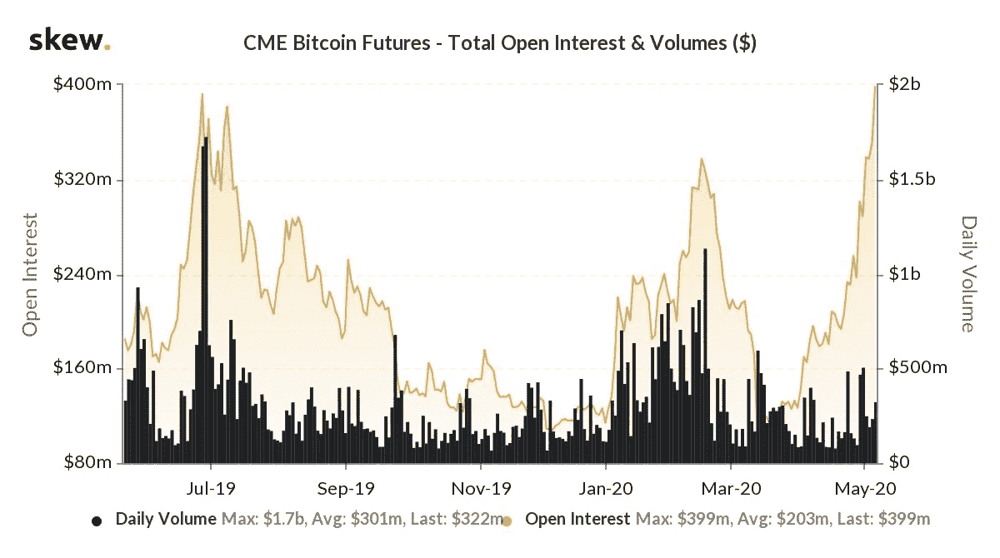
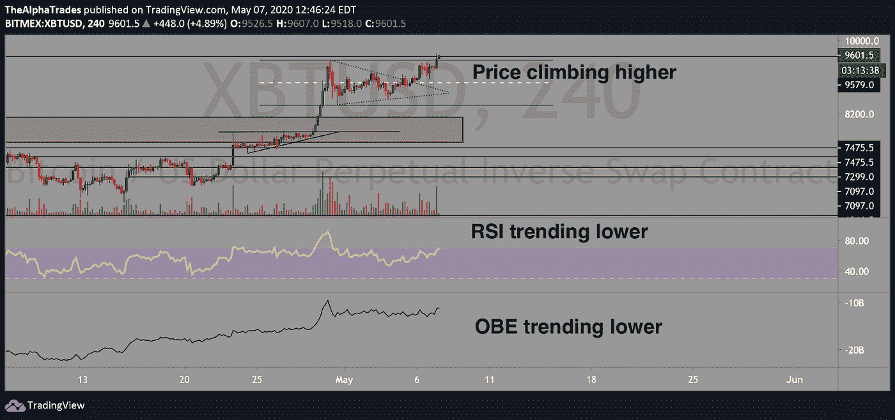

# 比特币减半定价了吗？

> 原文：<https://medium.datadriveninvestor.com/is-the-bitcoin-halving-priced-in-83702871e6bf?source=collection_archive---------17----------------------->

## 2019 年 6 月趋势线阻力触及——能否跌至 4000 美元？

Photo by [Sarah Pflug](https://burst.shopify.com/@sarahpflugphoto?utm_campaign=photo_credit&utm_content=Picture+of+Bitcoin+Coin+On+Bills+Of+Cash+Money+%E2%80%94+Free+Stock+Photo&utm_medium=referral&utm_source=credit) from [Burst](https://burst.shopify.com/money?utm_campaign=photo_credit&utm_content=Picture+of+Bitcoin+Coin+On+Bills+Of+Cash+Money+%E2%80%94+Free+Stock+Photo&utm_medium=referral&utm_source=credit)

早上好，欢迎来到另一个阿尔法交易市场分析。我正在以 Amol(我们的首席分析师)发布视频的速度撰写这些文章，但这些市场发展迅速，所以从现在开始，这些文章将更多地是视频分析的后续文章。有道理，对吧？

# 让我们开始吧——比特币在做什么？

昨天比特币在价格上出现了猛烈的拉锯，把我所在社区的大部分人(包括 Amol 和我)都震出了头寸。在波动的大部分时间里，我都站在场外，因为除了说价格试图盘整之外，很难以任何方式理解价格。这是阿尔法交易社区最令人钦佩的特征之一——我们不追逐交易，而是耐心等待更合适的机会，当价格下跌或在关键水平找到支撑时出击。

让交易来找你，如果你错过了交易，那就是生活。有时候睡觉或者上厕所的 5 分钟是值得的…相信我。

回顾昨天的剧本，我们认为如果比特币真的见顶，可能不会通过多个关键价格水平直接下跌。顶部之后通常会出现回调，然后回撤至近期高点。了解到这一点，我在 9250 附近进了一个空单，然后在我的位置上加了一点多，直到 9300。然后比特币得到了一个强大的推动，我在比特币阻止我出局之前结清了我的空头头寸([在这里了解止损如何工作](https://www.investopedia.com/articles/stocks/09/use-stop-loss.asp))。紧接着是一个近乎即时的回调，价格波动对我来说太大了，几个小时都无法交易。现在价格已经攀升到 9300 点以上，并且保持良好，这可能意味着昨天的价格下跌是[一个空头陷阱](https://www.investopedia.com/terms/b/bulltrap.asp)。

 [## 加密货币行业是死是活？数据驱动的投资者

### 九月初，我们在 X-Order 内部就代币市场的未来进行了一场辩论。有趣的是，我们的观点是…

www.datadriveninvestor.com](https://www.datadriveninvestor.com/2019/12/12/will-the-cryptocurrency-industry-be-dead-or-alive/) 

比特币目前很难被推低，自从价格突破 9000 英镑以来，我已经接受了这个现实。我仍然认为，与股票市场和实体经济(主街)中正在发生的事情的影响相比，比特币减半事件不足以将价格保持在目前的水平。事实证明，有足够的 FOMO 将价格推高至冠状病毒爆发前的水平，但这是基于美国今天早上报告的 316 万失业救济人数。这使我们在仅仅两个月内失业人数超过 3300 万。

美国迟早会有 3300 万人失业，这将在股票价格和加密货币估值方面影响经济。伴随这些失业救济申请的是潜在的破产和无力偿债，我们可能会从 5 月到 7 月开始看到这种情况。我并不期待 V 型复苏，尽管像赫兹、福特、 [J.Crew](https://www.wsj.com/livecoverage/coronavirus-2020-04-30) 、[梅西百货](https://www.marketwatch.com/story/macys-looks-to-raise-5-billion-in-debt-to-avoid-bankruptcy-report-2020-04-21)和其他几家公司都处于破产或资不抵债的边缘，但我怀疑我是唯一一个认为快速复苏和恢复牛市的机会已经不存在的人。

标准普尔 500 只比 COVID 之前的顶部低了大约 16%，但熊市的大幅反弹在市场大幅崩盘后很常见，也很难交易。

# 比特币减半事件

比特币有一个关键事件即将发生，那就是[减半](https://www.coindesk.com/bitcoin-halving-explainer)，在这个点上，每 10 分钟进入流通的比特币数量(被称为块奖励)将减半，从 12.5 减少到 6.25。这大约每四年发生一次，下一次发生在 5 月 10 日左右。

这种供应冲击将导致该资产更加稀缺，但许多人不明白，稀缺程度降低并不能保证价格上涨，除非对该资产的需求相应增加。我认为，尽管比特币的用户群有所增长，但网络的实施和增强水平反映了价值的深化，但还没有达到比特币在 2017 年周期顶部前后经历的炒作水平。从基本面来看，即使从长远来看(比如从现在到 2022 年，在我们可能陷入的衰退的冲击下)，价格继续走低，资产现在可能更有价值。总之，这意味着如果你在未来几年简单地“HODL ”,你会错过很多交易机会，但这都是在你的交易策略的背景下— *这些都不是交易建议*。

让我们考虑比特币的每日时间框架，其中你可以看到 2019 年 6 月的关键高点(约 13，900)，价格随后在 2 月中旬出现较低的高点(接近 10，500)。截至本周，价格接近触及趋势线下高点。可能性是比特币拒绝了那条趋势线，大幅回调。然而，由于传统市场中财力雄厚的人强烈而非理性的看涨热情，比特币可能会抓住美联储的火箭筒，冲破阻力。尽管由于过去八周缺乏任何有意义的回调，价格被过度拉伸，但多头目前仍有动力。通常情况下，当一项资产有那么多周的上涨时，价格调整往往会很剧烈。一个很好的例子是，从 2017 年 12 月到 3 月，比特币上涨了 20 倍。最终，在接下来的几个月里，价格下跌了约 85%。如果比特币现在遵循同样的轨迹，它会把我们带到大约 1400 点。那可能不会发生，但它*可能*。

如果比特币突破最近的周高点 10，584 附近，那么它在触及另一个重要的支撑阻力(SR)水平之前达到 11，500 的可能性将非常高。

CME 比特币期货的未平仓合约高于 2019 年 7 月顶部时的水平，但相比之下，现在与 2019 年 7 月相比的成交量要低得多。我们不完全确定这意味着什么，如果你有线索，[请联系我们](https://bit.ly/2YDdJCL?fbclid=IwAR35cG5Oe3pHVA4Bp8ENIOsXb773CrYUjewXyWvOcRtfVfnsKsiv_nM3ER0)。

关于技术指标，我们能说的是，有明显的看跌背离——RSI 一直处于持续下降趋势，表明动能实际上正在下降。平衡交易量(OBE)揭示了大玩家的投资方向以及推动市场的方式，与 RSI 的趋势相同。

总结到此为止——祝你好运，注意安全，不要 FOMO！

Source: Alpha Trades, LLC

# 处于优势

感谢您成为这个社区的一员。如果你对这篇文章有共鸣，请[订阅 Discord 服务器](https://bit.ly/2KJ1oor)。你可以免费进入社区频道，在那里我们每天发布大量免费有用的内容。(我们将从 2020 年 5 月 5 日开始提高[优势社区订阅](https://bit.ly/3bUdg3a)的价格)。更多细节请看下面的视频。

Is Bitcoin halving priced in? | Alpha Trades via Youtube

# 放弃

Alpha Trades，LLC 提供的信息不用于制定任何财务决策，也不是购买、持有和/或销售特定产品、数字资产或 ICO 的请求或建议。

访问我们的完整服务条款:【https://bit.ly/3faVeeV 