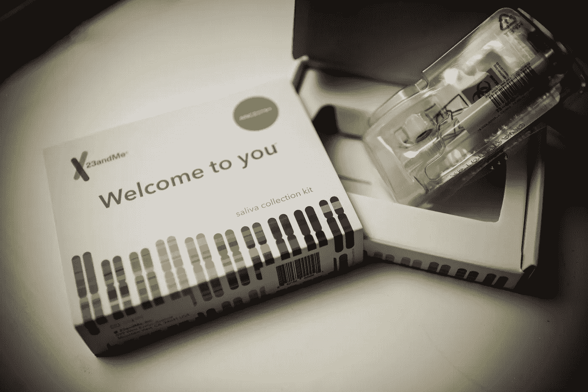
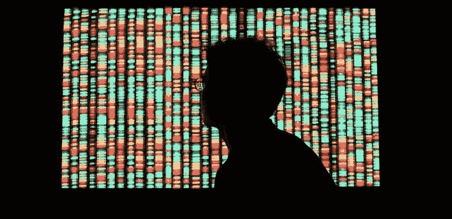
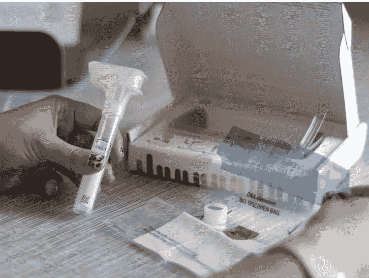
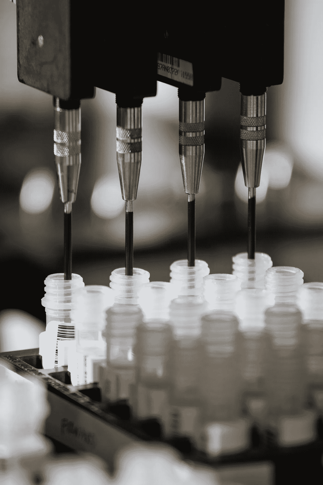

# 消费者 DNA 热潮结束了吗？

> 原文：<https://medium.datadriveninvestor.com/is-the-consumer-dna-fad-over-569f414d78b5?source=collection_archive---------15----------------------->

## DNA 检测公司都在裁员，客户流失很快…我们来看看为什么！

23andMe is the industry’s leading consumer DNA company but its future looks bleak.

***安东尼·布隆伯格***

23andMe 公司的首席执行官何在最近接受美国消费者新闻与商业频道采访时表示，由于面向消费者的基因测试销售下滑，她的公司将裁员 100 人。

“这对我们来说是缓慢而痛苦的，”首席执行官安妮·沃西基告诉美国消费者新闻与商业频道，该公司估计裁员将削减约 15%的公司员工。

*关于 23andMe 的一些事实:*

*   是一家私人控股的个人基因组和生物技术公司，总部设在加利福尼亚州森尼韦尔
*   以提供直接面向消费者的基因检测服务而闻名，在这种服务中，客户提供唾液样本，实验室对其进行分析，以生成与客户的祖先和健康相关主题的遗传易感性相关的报告
*   由于其基因健康测试，之前与美国美国食品药品监督管理局(FDA)关系紧张
*   是第一家开始提供祖先常染色体 DNA 测试的公司

The human genome is nearly-fully sequenced thanks to the Human Genome Project, enabling these biotechnology companies to analyze consumer’s DNA.

# 繁荣时期:

几年前，在电视和互联网广告的推动下，告诉人们他们的祖先和健康状况的 DNA 测试开始蓬勃发展，这些广告承诺人们可以从他们的基因中获得独特的见解。

 [## 2019 年即将改变世界的技术|数据驱动的投资者

### 很难想象一项技术会像去年的区块链一样受到如此多的关注，但是……

www.datadriveninvestor.com](https://www.datadriveninvestor.com/2019/01/17/the-technologies-poised-to-change-the-world-in-2019/) 

在 2018 年期间，曾经购买过测试的总人数翻了一番，将 23andMe、Ancestry 和几家较小公司的数据库扩大到总共超过 2600 万人。

# 半身像:

现在，所有迹象都表明，99 美元的消费者测试在 2019 年的销售大幅放缓。

《麻省理工技术评论》最近发表的计算表明，最大的公司只销售了 400 万到 600 万个，这意味着数据库在这一年中只增长了 20%。这将是 DNA 测试行业有史以来最慢的增长率。

> [享受你看到的金融和投资报道？在我的网站上查看更多！](https://www.anthonyblumberg.com/)

# 不确定原因:

不清楚为什么消费者不再成群结队地购买测试品。这可能是因为市场被挖掘出来了，没有多少人会好奇他们有多少法国人或尼日利亚人，或者他们是否有秃顶的风险。

其他人可能担心他们的 DNA 数据保持隐私，因为全球执法机构已经开始访问较小的祖先数据库来进行基因搜索。

拥有超过 1600 万人的最大数据库的 Ancestry 没有回答销售是否放缓的问题。去年，Ancestry 推出了新的健康产品，一些分析师认为这是为了刺激“重新测试”市场，或诱使消费者支付额外的测试费用。

A 23andMe example testing kit.

上个月，生产将 DNA 转化为比特和字节的机器的 Illumina 公司在财报电话会议上指出了直接面向消费者的基因市场的“弱点”。Illumina 首席执行官 Francis deSouza 向投资者指出，他的公司现在对近期的机会持“谨慎的看法”，指的是祖先和健康测试市场。

“由于市场何时恢复增长的能见度有限，我们已经大幅降低了全年预期，以反映近期的不确定性，”deSouza 在电话会议上告诉投资者。

# 早期采用者的干旱

另一个解释是，公司已经没有对了解他们的健康和家族史感兴趣的用户了。有一部分人愿意花 99 美元(或更多)购买这些信息，仅仅是因为他们好奇，这是有道理的。

但如果没有重大的产品升级，说服那些看不到价值或持观望态度的人可能会更具挑战性。

高科技全球投资者安东尼·布隆伯格(Anthony Blumberg)说，“我怀疑，对这些信息感兴趣的人越来越少，可供发展的人也越来越少。”

根据从报告和公开声明中收集的数据，大约有 3000 万人接受了检测。23andMe 表示，迄今已售出约 1000 万份测试。根据去年的一份声明，Ancestry 的出货量已超过 1500 万。

如果这些公司能够成功地找到专注于健康的新应用，而不仅仅是祖先，那么达到下一个 3000 万或许才是可能的。其中一些测试已经开始获得联邦监管机构的批准，用于糖尿病风险和某些与癌症相关的突变，但还有更多研究正在进行中。

“我认为有一个更广泛的问题，那就是最终的医学价值仍然没有得到证实，”麻省理工学院技术报告解释说。“有很多研究正在进行，但大众市场消费者的价值还不存在，因此市场规模仍有上限。”

> 想看更多关于高科技产业内部运作的报道吗？[看看这篇关于 Berkshire Grey 的文章，Berkshire Grey 是一家新的人工工业和机器人初创公司！](https://www.anthonyblumberg.com/blog/the-robots-are-coming-new-robotics-and-ai-startup-raises-hundreds-of-millions-to-automate-jobs)

# 隐私

由于对脸书和谷歌等科技巨头收集的数据以及他们如何保护和使用这些数据的质疑越来越多，今年 rivacy 一直在消费者的脑海中。

在遗传学领域，最大的新闻涉及金州黑仔。根据基因匹配发现了一名嫌疑人，这引发了人们对是否可以根据远亲的 DNA 找到个人并将其定罪的担忧。

据麻省理工科技报道，考虑进行 DNA 测试的用户可能会因为 Facebook.up 等大型科技公司的隐私丑闻而拒绝接受测试。

“很难做出直接的归因，因为这是健康和社交媒体之间不同的关注点，”布隆伯格说。“但如果有一些溢出效应，我不会感到惊讶，人们比过去更关心隐私，并决定保持中立。”

Ancestry 在最近的一份声明中指出，它仍然致力于保护用户隐私，因为它希望推动增长。“多种因素正在塑造新兴的消费者基因组学类别，因此不可能从任何单一数据点得出结论，”一位发言人说。

The consumer industry is pushing the boundaries of what biotechnology can do, including aid medical efforts such as curing cancer.

# 寻找下一个健康应用

M 这个领域的任何公司都希望，一旦他们找到让用户接受这些测试的真正令人信服的理由，销售就会加速。

如今，23andMe 等公司正专注于开发各种不同的健康报告，从评估用户患心脏病和糖尿病等疾病的风险，到他们对药物产生不良反应的可能性。他们认为，其中一种或几种组合，或者这些健康产品可能会改变现状。

23andMe 的发言人最近指出，该公司正在继续与联邦监管机构合作，以获得更多直接面向消费者的健康测试的批准。此外，它还计划更加重视今年春天发布的糖尿病报告，以及其他可能与数百万人相关的报告。

一些专家认为，未来几年还有机会对大量人群进行测序，研究为什么有些人会生病，而有些人不会，并将这些见解应用到医学实践中。与此同时，统计数据清楚地表明早期采用者的浪潮正在消退。

*本文为* [*原载*](http://www.anthonyblumberg.com/blog/is-the-consumer-dna-fad-over) *我的财经、科技、旅游网站:*[*https://www.anthonyblumberg.com/*](https://www.anthonyblumberg.com/)

如果你喜欢这篇文章，可以在那里看到更多的文章和评论。一定要给这篇文章一些掌声，并在下面留下评论；真的很感谢！