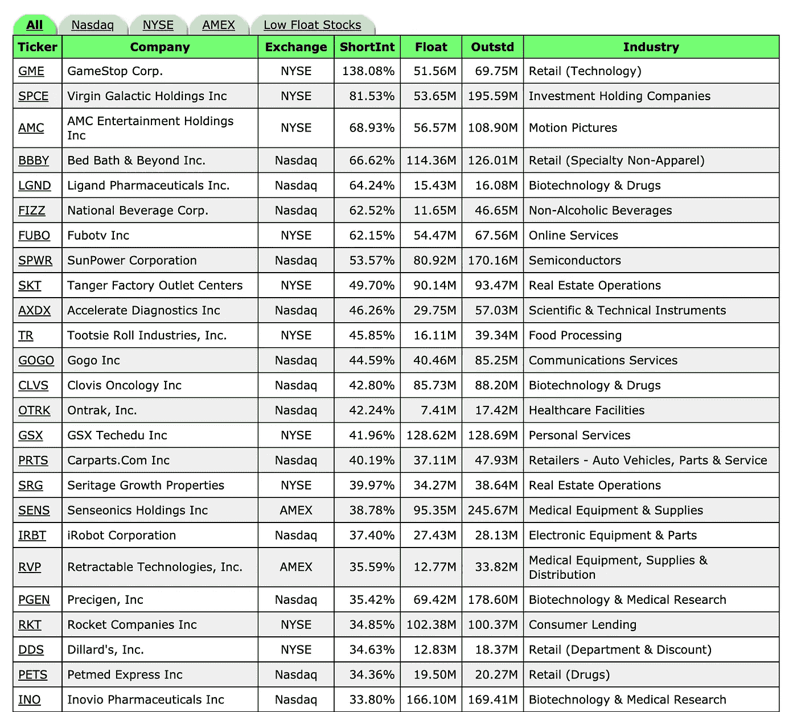

# GameStop (GME)空头挤兑结束了吗？

> 原文：<https://medium.datadriveninvestor.com/is-the-gamestop-gme-short-squeeze-over-20b18c84adcc?source=collection_archive---------3----------------------->

GameStop 股票将再次做空的 3 个原因

GameStop ( [纳斯达克:GME](https://finance.yahoo.com/quote/GME?p=GME&.tsrc=fin-srch) )的股价连续第二天飙升至历史高点，因为空头挤压导致股价飙升 145%至 159.18 美元，然后一路下跌，收盘于 76.79 美元。Reddit 的 [WallStreetBets](https://www.reddit.com/r/wallstreetbets/) 和其他社交媒体网站上的散户投资者通过协调针对华尔街机构卖空股票的高风险交易，发起了做空行动。

在本文中，我们将讨论 GameStop 在“大卫和歌利亚”之战激烈进行时再次做空的三个原因。

*准备好开始你的股票交易之旅了吗？* [*开立一个 Webull 交易账户*](http://bit.ly/3nWkbxT) *即可获赠 4 只价值高达 3700 美元的免费股票。*

 [## 如何在华尔街 Bets Reddit 上赚钱

### 从 Reddit 和其他社交媒体网站交易热门股票的 3 步指南

stocktechie.medium.com](https://stocktechie.medium.com/how-to-make-money-on-wallstreetbets-reddit-ed9d3da46961) 

## 短期浮动

在撰写本文时，GameStop 是美国股市中被卖空最多的股票，约有 7000 万股被卖空，占 GameStop 总流通股的 138%。当 WallStreetBets 的交易员协调第一次卖空交易时，许多卖空者不得不补仓，并在此过程中损失了 33 亿美元。通常情况下，这种幅度的损失会缓解空头的压力，但周一的价格行动将价格从挤压状态一路拉回到 76 美元的收盘水平，这表明新的卖空者已经加入了竞争。S3 合伙公司(Bernstein Partners)管理合伙人鲍勃斯隆(Bob Sloan)表示，尽管最初的卖空者回购了股票，但持股数量仍保持在相对相似的水平。这表明，我们没有消除做空压力，而是将做空兴趣转移给了新一轮的卖家。因此，GameStop 仍然有很大的空头浮动，再次做空的可能性仍然存在。

截至 2021 年 1 月 29 日的更新:

疯狂的一周结束了。罗宾汉关闭了采购业务，将价格从 500 美元一路降至 112 美元，然后才回升。周五，GME 价格收于 325 美元的关键水平，这是最后一个重要的买入期权价格。空头兴趣有所下降，但仍保持在 100%以上，因为新的卖空者继续买进。由于短期浮动百分比很高，挤压仍然存在。

截至 2021 年 1 月 27 日的更新:

即使价格暴涨，短期浮动已经上升而不是下降。这证实了更多的卖空者已经进入，挤压压力并没有减轻。

List of Most Heavily Shorted Stocks in the US as of January 25th, 2021 (Source: highshortinterest.com)

## 期权定价

加上高度的空头浮动，华尔街交易员进行“万福玛利亚”看涨期权押注的倾向是推动空头挤压的原因。周五卖空交易后，最高看涨期权执行价格从 60 美元升至 115 美元，以解释股价的大幅上涨。随着周末对 GameStop 的所有新闻报道，周一盘前交易期间价格升至 104 美元，使得 115 美元的看涨期权在周一开盘时变得异常昂贵。一周以来，我们首次看到看跌期权的交易量高于看涨期权，显示了多头的疲软潜力。

周二进入市场，看涨期权执行价格再次扩大到最高 200 美元，价格由市场开盘决定。随着执行价格的扩大，我们预计华尔街的交易员会更容易接受“万福玛利亚”期权。这些交易者购买越多的超值期权，就越有可能出现另一次挤压。

## 华尔街赌注情绪

尽管许多新交易员在周一的交易中亏损，但华尔街押注的情绪依然强劲。最大的牛市信号是，尽管盘中波动，但价格每天都在继续收高。尽管许多交易员预计卖空交易将“一劳永逸”，但他们现在意识到，这是一场长期战斗，需要持续的协调，以抵御机构的攻击。

尽管胜算可能对他们不利，但随着埃隆马斯克(Elon Musk)、查马斯帕里哈皮蒂亚(Chamath Palihapitiya)、卡梅隆文克莱沃斯(Cameron Bernstein)和其他人表现出兴趣，华尔街的交易员们财力雄厚。

大卫和歌利亚之间的战斗仍在继续…

准备好开始你的股票交易之旅了吗？ [*开立一个 Webull 交易账户*](http://bit.ly/3nWkbxT) *即可获赠 4 只价值高达 3700 美元的免费股票。*

一如既往，我很想知道你的交易进展如何。请在下面的评论区留下你的评论或问题，我会尽快回复你。

交易愉快！

*以上内容仅代表一种观点，仅供参考。是* ***而不是*** *的投资建议。找一个有正式执照的专业人士寻求投资建议。本网站的内容仅用于教育目的。*