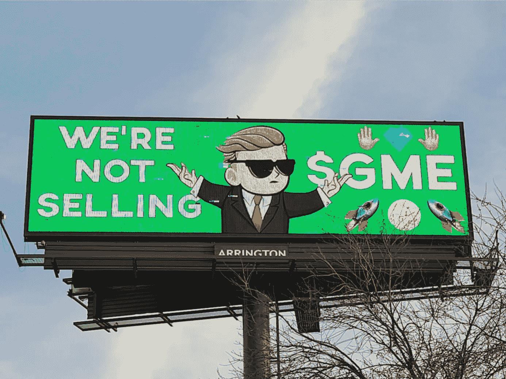
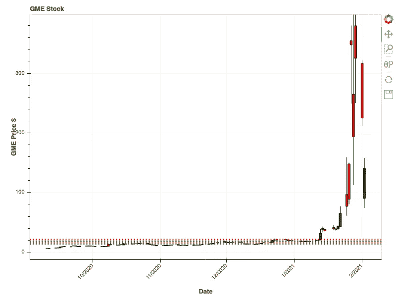

# GameStop (GME)的故事结束了吗？

> 原文：<https://medium.datadriveninvestor.com/is-the-gamestop-gme-story-over-23fda5d90a14?source=collection_archive---------19----------------------->

Photo by [Markus Spiske](https://unsplash.com/@markusspiske?utm_source=medium&utm_medium=referral) on [Unsplash](https://unsplash.com?utm_source=medium&utm_medium=referral)

## 最近的抛售让普通投资者觉得。

整个投资界都在谈论 GameStop Inc .([$ GME](https://stocktwits.com/symbol/GME))。如果你在常规交易日访问 StockTwits 的链接，你会看到大量的帖子。大家都**看好**它！

购买股票的需求如此之高，以至于[罗宾汉](https://www.cbsnews.com/news/robinhood-block-trading-of-gamestop-stock/)和其他券商限制了你可以购买的股票数量。这样做对吗？我不知道，我不是律师，也不知道罗宾汉和其他经纪公司是如何运作的。尽管如此，这仍有操纵市场的味道，也正是这种味道将华尔街投资者搅成了泡沫。

> 我赚了更多的钱…

自从这些限制以来，GME 的价格稳步下降。这很有道理，去除需求，价格就会下降。当然，这只会增强 r/WSB 人群“坚守阵地”的决心他们抱怨[短梯攻击](https://marketrealist.com/p/short-ladder-attacks-explained/)，交易量如何因此枯竭，以及**市场被操纵**。

他们是 100%正确的，市场总是被操纵来对付“小人物”，在这次 GME 事件之后，他们将继续如此。

## **GME 短梯攻击**

截至本文发稿时，GME 在盘前市场的交易价格为每股 92 美元(T21)。在过去的几天里，这是一个巨大的下降，而“弱智者”(不是我对他们的称呼，他们这样称呼自己)大声喊着他们在“坚持到底！”

他们在全国各地购买广告牌，告诉世界他们不卖。正如我之前写的，[这对他们来说是私人的](https://medium.com/datadriveninvestor/the-wall-street-rebellion-has-begun-c2cabad16410)。

> 对于婴儿潮一代和/或接近那个年龄的人来说，现在正在关注这些“千禧一代的博客帖子”:你意识到，即使你没有受到 08 年崩盘的不利影响，你的孩子或许孙子也很可能受到影响？我们不是敌人，我们是同一战线的。[ [通过 Reddit](https://www.reddit.com/r/wallstreetbets/comments/l6omry/an_open_letter_to_melvin_capital_cnbc_boomers_and/)

[https://www.reddit.com/r/wallstreetbets/comments/lbb12w/billboard_went_full_retard_north_of_dallas_along/](https://www.reddit.com/r/wallstreetbets/comments/lbb12w/billboard_went_full_retard_north_of_dallas_along/)

但是我真的很担心。我想知道，这场用迷因武装起来的华尔街叛乱是否即将被屠杀。

## 情绪会在市场上毁掉你

> 我知道大胆的交易者，也知道老的交易者。我不认识什么大胆的老交易员。—未知

几年前，当我积极交易的时候，我花了很多时间和真正的长期交易者交谈。他们喜欢和我聊天，因为他们认为我是一个反向指标。如果我非常看好市场或某只股票，他们就会做相反的交易。

99%的时候，他们都是对的。作为一名散户，我总是站在市场的后面。我在最高点买入，在最低点卖出。我把我的钱搅拌掉，直到我问一个日内交易者朋友我做错了什么。我最好的前进道路是什么？

除了我在风险管理方面的问题，我的朋友告诉我，我对市场太情绪化了。我在向市场展示我的扑克脸，然后被骗了。他说‘情绪会在股市里毁了你’。

他是对的，经过深刻的自我反省，我从主动交易转为被动交易。我的技能更适合长期和被动投资。我让**坐在我手上的钱比每天买卖的钱多得多。**

看看 GME 的抛物线价格走势，它的上下波动就像一个糟糕的猎鹰太空 X 火箭。上升很好，但是着陆并不好。

那么，我为什么要担心呢？

我要么再次成为**的反向指标**，要么看着**MAGA assats**在用手机记录自己的同时冲击美国国会大厦的重播。只是这一次，它有了新的参与者和“新的使命”，让市场再次变得伟大。

只有时间能告诉我们这一切的归宿。

*关注我的* [*股票 Twits*](https://stocktwits.com/neuralmarket) *或者阅读访问我的博客* [*神经市场趋势*](https://neuralmarkettrends.com/) *。*