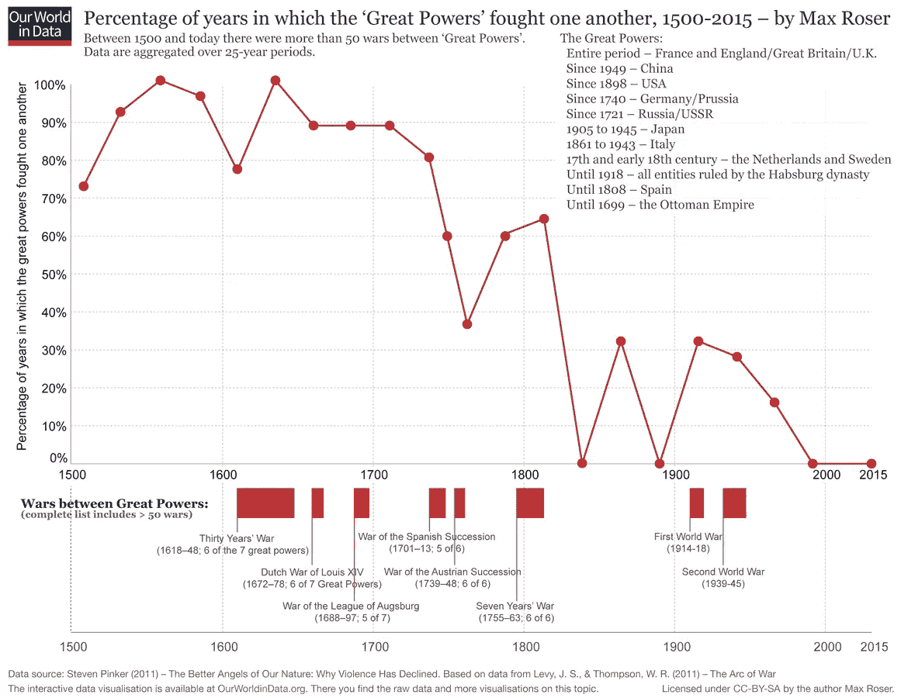
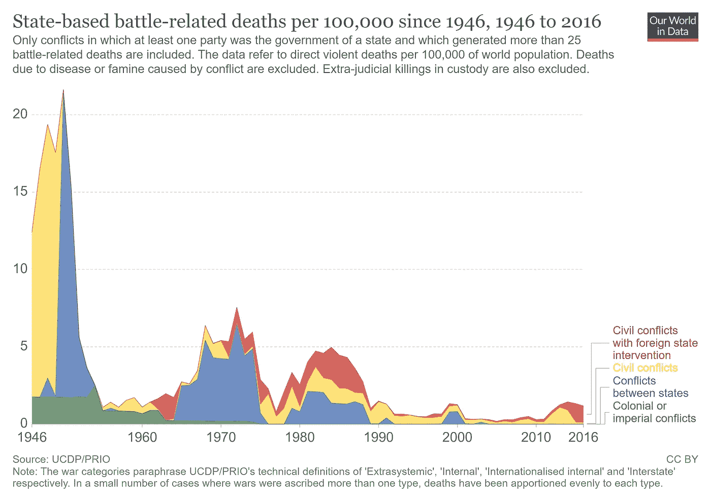
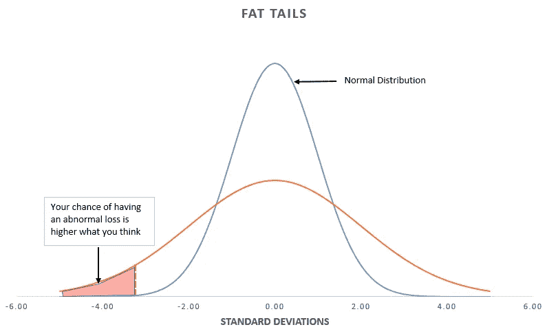

# “长久的和平”可持续吗？

> 原文：<https://medium.datadriveninvestor.com/is-the-long-peace-sustainable-1ba29697defd?source=collection_archive---------2----------------------->

Photo by [Jonathan Riley](https://unsplash.com/@jonathan_christian_photography?utm_source=medium&utm_medium=referral) on [Unsplash](https://unsplash.com?utm_source=medium&utm_medium=referral)

## 数据表明，我们生活在漫长的和平时代。会盛行吗？

当人们看一看媒体标题时，似乎世界正陷入混乱。冠状病毒(新冠肺炎)爆发、内乱、核战争威胁、气候变化、民粹主义、民族主义和威权主义的复兴、“失业”未来、不平等加剧、内战、恐怖主义、修昔底德陷阱、饥饿、贫困和发展中国家的疾病——不胜枚举。

有了这样的头条新闻，不足为奇的是——根据[2015 年 YouGov 调查](https://ourworldindata.org/uploads/2016/12/Optimistic-about-the-future-2.png)——只有 6%的美国人、4%的英国人和德国人以及 3%的法国人认为世界正在变得更好。这一切都与[事实](https://www.forbes.com/sites/stevedenning/2017/11/30/why-the-world-is-getting-better-why-hardly-anyone-knows-it/#52a12d667826)显示的相反。几乎在人类生活的所有关键方面——如贫困、健康、文化水平等。—今天的世界比过去好得多。(诚然，尽管正在进行的新冠肺炎疫情可能会破坏部分进展，但危机迟早会结束。)

例如，平均每天(自 1990 年以来)有超过 10 万人脱贫。1950 年，63%的世界人口生活在极度贫困中；今天这个数字[不到 10%](https://ourworldindata.org/grapher/world-population-in-extreme-poverty-absolute) 。

Source: Our World in Data

事实上，正如尤瓦尔·n·哈拉里[所写的](https://www.economist.com/open-future/2018/09/26/we-need-a-post-liberal-order-now)，“在人类历史上，饥饿致死的人数首次少于肥胖致死的人数；瘟疫杀死的人比老年少；暴力杀死的人比事故少。”

## 支持长期和平的证据

可以自信地说，我们生活在人类历史上最和平的时代；换句话说，自第二次世界大战结束以来，我们一直生活在被美国历史学家约翰·路易斯·加迪斯称为“长久和平”的[时期在人类历史的大部分时间里，人类认为战争是理所当然的，而和平仅仅被认为是战争之间的喘息。](https://archive.org/details/longpeace)[来自在线项目*的数据*](https://ourworldindata.org/war-and-peace#)我们的世界在数据中显示，自现代时代开始以来——直到 20 世纪中叶——大国之间一直处于战争状态。

Source: Our World in Data

然而，现在强国之间没有热战，上一次热战在几十年前就结束了。根据政治学家约翰·穆勒的说法，1984 年 5 月 15 日，世界上最强大的国家成功地保持了自罗马帝国时代以来最长时间的和平相处。

2017 年有近 7 万人[因国家武装冲突](https://reliefweb.int/sites/reliefweb.int/files/resources/Dupuy%2C%20Rustad-%20Trends%20in%20Armed%20Conflict%2C%201946%E2%80%932017%2C%20Conflict%20Trends%205-2018.pdf)丧生。另一方面，根据世界卫生组织的数据，每年有近 80 万人死于自杀。在长期和平的时代，一个人自杀的可能性是被士兵杀死的可能性的十倍以上。

事实上，有史以来第一次，大多数人、企业和政府在为未来做决策时，都不考虑他们的财产会被炸、工厂会被抢、资源会被掠夺的可能性。

 [## 如果资本主义失败了，那么还有什么选择呢？数据驱动的投资者

### 在当前政治领域的修辞之旅中，我们都可以面对面地接触到流行词汇，如…

www.datadriveninvestor.com](https://www.datadriveninvestor.com/2020/03/16/if-capitalism-is-a-failure-then-what-is-the-alternative/) 

值得注意的是，不仅大国之间的战争数量减少了，发展中国家之间的战争也消失了。自从 2003 年以美国为首的联军入侵伊拉克以来，就没有发生过国家间的战争。此外，与战争相关的死亡人数从 1940 年代末和 1950 年代初的十万分之十五下降到 2010 年的十万分之一。

Source: Our World in Data

在过去，和平意味着暂时没有战争。尤瓦尔·赫拉利在《德乌斯人》中指出，在我们这个时代，和平是完全不可能发生战争的，这适用于绝大多数国家。事实上，有史以来第一次，大多数人、企业和政府在为未来做决策时，都不考虑他们的财产会被炸、工厂会被抢、资源会被掠夺的可能性。

在《T2》中，史蒂芬·平克用七个零来标识长久的和平。[正如他写的](https://www.google.com/books/edition/The_Better_Angels_of_Our_Nature/8-vYCwAAQBAJ?hl=en&gbpv=1&bsq=zero%20is)，“零是的数

*   在冲突中使用核武器的次数；
*   两个冷战时期的超级大国在战场上交战的次数；
*   自第二次世界大战结束以来西欧国家之间的国家间战争；
*   自 1940 年代后期以来通过征服另一个国家来扩张领土的发达国家；
*   自第二次世界大战以来通过征服而不复存在的国际公认的国家。"

除了描述战争和死亡人数的统计数据，还有其他方法来衡量长期和平。正如《联合国教育、科学及文化组织(教科文组织)组织法》序言所宣称的那样，"由于战争始于人之思想，故必须于人之思想中筑起保卫和平之屏障"；因此，我们不仅应该在数字领域，而且应该在政策决策领域探索战争撤退背后的原因。

一个国家愿意使用武力的最重要特征之一是征兵的程度。第二次世界大战结束后，世界见证了征兵使用的下降，包括美国和大多数欧洲国家在内的许多国家完全禁止征兵。长期和平曙光的另一个指标是，自冷战结束以来，军事力量的[规模](https://data.worldbank.org/indicator/MS.MIL.TOTL.TF.ZS)占劳动力的比例从 1991 年的 1.034%下降到 2017 年的 0.798%。此外，全球军费开支占 GDP 的百分比[从 20 世纪 60 年代初的 6%下降到 2018 年的 2.14%。武装部队中的人口比例和一个国家的军费开支是衡量军国主义的最有效手段之一。因此，这两项指标的下降证实了过去几十年我们一直生活在长期和平之中的说法。](https://data.worldbank.org/indicator/MS.MIL.XPND.GD.ZS)

## 是什么导致了长久的和平？

不言而喻，我们正在享受一个以前无法想象的和平与繁荣的时代。国际关系发生这种根本性转变的原因是什么？我们应该调查这些原因，因为维持这种状况显然符合我们的利益。然而，这种现象可能没有单一的解释，最有可能的是，它是多种因素的综合，促进了长期的和平。

长期和平的最重要决定因素之一是核武器的存在。具有讽刺意味的是，核武器最初被设计成最可怕的大规模杀伤性武器，却成了二战后维持和平的关键。他们把当时超级大国——美国和苏联——之间的潜在战争变成了集体自杀行为，这很可能会结束他们各自的文明。核武器促使两国以更和平的方式解决争端。引用温斯顿·丘吉尔的话来说，“在这个故事中，我们很可能会通过一个极其讽刺的过程达到一个阶段，在这个阶段，安全将是恐怖的坚强之子，生存将是毁灭的孪生兄弟。”

长期和平的另一个原因是已经讨论过的生活水平的提高。毕竟，如果某个国家贫穷、饥饿且不识字，它更有可能与邻国发生战争以获取宝贵的资源——或者点燃民族主义情绪以巩固其合法性和统治者的吸引力。然而，近几十年来，人类在消除贫困、疾病、文盲和饥饿方面取得了巨大进步；因此，可以合理地得出结论，这些成就至少部分地有助于维护发展中国家之间的长期和平。

在他 1795 年的文章《永久和平》中，伊曼纽尔·康德写道，除了其他事情外，“商业精神[……]迟早会占据每个国家，它与战争是不相容的。”事实上，扩大国际贸易和全球化降低了战争的吸引力，因为潜在的战争将是一种经济自杀行为，因此，各国很少诉诸武力。彼此之间有着紧密商业联系的国家如果卷入战争，损失太大。根据 2000 年挪威诺贝尔研究所的约翰·r·欧尼尔在 T2 进行的一项研究，“与典型的两极化相比，如果两个国家在经济上都依赖于他们的商业关系，争端的可能性下降了 49%。”根据世界银行的数据，在这一点上，贸易的[份额](https://data.worldbank.org/indicator/NE.TRD.GNFS.ZS)作为 GDP 的一部分，在二战结束后翻了一番:从 1960 年的 24%到 2018 年的 59%以上。全球化的到来以及由此产生的全球参与者的相互依赖，有时被称为“资本主义和平”，扮演着重要的角色。

此外，对长期和平最重要的贡献之一——如果不是最重要的话——是民主的传播。根据民主和平理论，民主国家之间很少发生战争，因为

*   民主旨在和平地调和各种群体的利益，他们将这一逻辑投射到国际事务中；
*   民主制衡是对有专制倾向的领导人的反作用力，这些领导人经常为了个人荣誉或通过民族主义情绪唤起国内支持而将国家推入战争；
*   在民主国家，人们很容易对那些不断发动战争损害普通民众利益的无能或腐败的领导层不屑一顾。

二战结束时，只有 12 个民主国家；今天，有 99 个；自 20 世纪 50 年代初以来，生活在民主国家的世界人口比例已经翻了两番。毫无疑问，民主治理是全球和平的[关键](https://oxfordre.com/politics/view/10.1093/acrefore/9780190228637.001.0001/acrefore-9780190228637-e-287)支柱。

在当今时代，对我们大多数人来说，经济成就已经取代了军事成就，人类的价值观发生了变化，把和平的内在价值看得更高。

众所周知，巨大的变化从内部开始。第二次世界大战结束后世界文化的转变在一定程度上导致了长期和平的出现。在当今时代，对我们大多数人来说，经济成就已经取代了军事成就，人类的价值观发生了变化，把和平的内在价值看得更高。不久以前，战争被认为是光荣而崇高的。[正如史蒂芬·平克在*中写的*](https://books.google.com/books?id=R5KADwAAQBAJ&pg=PA165&lpg=PA165&dq=Today,+the+idea+that+it+is+inherently+noble+to+kill+and+maim+people+and+destroy+their+roads,+bridges,+farms,+dwellings,+schools,+and+hospitals+strikes+us+as+the+raving+of+a+madman.+But+during+the+19th-century+counter-Enlightenment,+it+all+made+sense.+Romantic+militarism+became+increasingly+fashionable,+not+just+among+Pickelhaube-topped+military+officers+but+among+many+artists+and+intellectuals.+War+%E2%80%9Cenlarges+the+mind+of+a+people+and+raises+their+character&source=bl&ots=qpa97HIetb&sig=ACfU3U3tgc2b_ICD2YbqueXw9bwL5zDiwA&hl=en&sa=X&ved=2ahUKEwjk19vL6PfpAhXySjABHbUSD84Q6AEwAHoECAoQAQ#v=onepage&q=Today%2C%20the%20idea%20that%20it%20is%20inherently%20noble%20to%20kill%20and%20maim%20people%20and%20destroy%20their%20roads%2C%20bridges%2C%20farms%2C%20dwellings%2C%20schools%2C%20and%20hospitals%20strikes%20us%20as%20the%20raving%20of%20a%20madman.%20But%20during%20the%2019th-century%20counter-Enlightenment%2C%20it%20all%20made%20sense.%20Romantic%20militarism%20became%20increasingly%20fashionable%2C%20not%20just%20among%20Pickelhaube-topped%20military%20officers%20but%20among%20many%20artists%20and%20intellectuals.%20War%20%E2%80%9Cenlarges%20the%20mind%20of%20a%20people%20and%20raises%20their%20character&f=false)悟现:

> 今天，认为杀害和残害人民并摧毁他们的道路、桥梁、农场、住宅、学校和医院是一种固有的高尚行为的想法，在我们看来是一个疯子的胡言乱语。但在 19 世纪的反启蒙运动期间，这一切都合情合理。浪漫的军国主义变得越来越流行，不仅在戴着尖顶帽的军官中，在许多艺术家和知识分子中也是如此。亚历西斯·德·托克维尔写道，战争“开阔了一个民族的心胸，提升了他们的品质”。埃米莉·左拉说，这就是“生活本身”;所有艺术的基础。。。约翰·罗斯金写道:“以及人类的高尚美德和才能。”。

此外，在分析长期和平的促成因素时，我们不应该忘记可以说是社会最重要的驱动力:技术变革。全球经济正逐渐从以提供商品和服务为基础的经济转向以信息和知识为中心的经济。根据麦肯锡全球研究所 2016 年的一份报告，在现代经济中，数字流对 GDP 增长的影响大于商品贸易。自古以来，工厂、土地、油井、金矿——换句话说，物质资产——拥有最大的价值。另一方面，如今数据正超越传统财富来源成为最重要的资产[，数据流已经成为全球经济增长的主要驱动力之一。此外，随着全球经济变得由知识和数据驱动，征服土地和工厂没有什么好处。](https://towardsdatascience.com/ai-powered-monopolies-and-the-new-world-order-1c56cfc76e7d)[用尤瓦尔·赫拉利](https://www.google.com/books/edition/Homo_Deus/H2t_CwAAQBAJ?hl=en&gbpv=1&dq=yuval+In+1998+it+made+sense+for+Rwanda+to+seize+and+loot+the+rich+coltan+mines+of+neighbouring+Congo&pg=PT10&printsec=frontcover)的话说，

> 1998 年，卢旺达掠夺邻国刚果丰富的钶钽铁矿石是有道理的，“因为”制造手机和笔记本电脑对这种矿石的需求很高，而刚果拥有全球 80%的钶钽铁矿石储量。“但是，”中国入侵加州并占领硅谷毫无意义，因为即使中国人能在战场上取得胜利，硅谷也没有可供掠夺的硅矿。相反，中国人通过与苹果和微软这样的高科技巨头合作，购买他们的软件，制造他们的产品，赚了数十亿美元。卢旺达一整年掠夺刚果钶钽铁矿石赚的钱，中国人一天的和平贸易就能赚到。

最后，保持长期和平的最重要因素之一是建立和随后扩大基于规则的世界秩序(或自由国际秩序)。由于第二次世界大战后基于规则的秩序的形成，国际关系一直由一个旨在伸张正义、确保和平、反对侵略和违反规范的总体规则框架来管理。在冷战结束后美国及其盟友的全球主导地位的支撑下，国际秩序的这一重大变化——战争是非法的——是全球和平的最重要贡献者之一。

在过去，如果一个国家想用更多的黄金来充实自己的国库，它可以宣战，从邻国那里征服一些领土，没有什么可以阻止它这样做。然而，在今天，这几乎是不可能的，因为每个国家的主权及其边界的不可侵犯性已庄严载入国际法，如果这些准则遭到违反，罪犯将受到惩罚。比如，1990 年伊拉克入侵科威特后，美国总统乔治·h·w·布什组织了一个由其他 34 个国家组成的国际联盟，有效地惩罚了萨达姆·侯赛因的伊拉克行动。

总之，正是各种因素的结合促成了长期和平的建立和维持，其中包括

*   核武器 MAD 理论(确保相互摧毁)的基础；
*   生活水平的提高——战争原因的重要性降低；
*   资本主义和平——全球化和日益增长的经济相互依存；
*   民主和平——民主在全世界的传播；
*   文化转变——人们变得更加和平；
*   技术变革——由于数字经济的到来，发动战争变得毫无意义；
*   基于规则的世界秩序的形成——禁止战争的强大机制。

## 长久的和平会实现吗？

然而，还远远不能保证长久的和平会无限期地持续下去，因为即将到来的技术发展很可能会为新型战争铺平道路。例如，网络战可能为伊朗和朝鲜等较小的流氓国家提供有效破坏对手稳定的能力。

此外，我们永远也不应该忽视“黑天鹅”，这一术语是由纳西姆·尼古拉斯·塔勒布创造的，用来描述被证明非常重要的罕见、重大和不可预测的事件(或所谓的“肥尾”，离群值)。黑天鹅是人类事件的固有特征，原因如下:它们开创了一个新的先例，而不是代表过去趋势的延续。比如，我们永远不应该说，我们永远不会再有第二次世界大战规模的战争，因为在那场冲突爆发之前，人们普遍认为，没有哪场战争会比第一次世界大战更糟糕(毕竟，第一次世界大战被称为“结束所有战争的战争”)。正如塔勒布[在他 2012 年的书*抗脆弱*中所说的](https://www.google.com/books/edition/Antifragile/QGaMDQAAQBAJ?hl=en&gbpv=1&dq=taleb+so-called+worst-case+event,+when+it+happened,+exceeded+the+worst+case+at+the+time.&pg=PA46&printsec=frontcover),“所谓的最坏情况事件，当它发生时，超过了当时最坏的情况。”

Statistical fat tails, or Black Swans. Source: Seeking Alfa

第二次世界大战后，人类大约有九次处于核毁灭的边缘[——主要是由于技术问题，如雷达将月球误认为导弹，一架美国飞机在古巴导弹危机最严重的时候意外闯入苏联领空，或者，最关键的是，苏联卫星发生故障，将反射的阳光误认为美国洲际弹道导弹(ICBMs)等。](https://www.businessinsider.com/when-nuclear-war-almost-happened-2018-4#september-26-1983-a-soviet-colonel-makes-the-biggest-gamble-in-history-8)

因为黑天鹅的必然性，所以没有理由认为长久的和平会是无限期的。世界和平的未来令人不安；然而，正如我们过去设法克服了如此多的威胁一样，只要我们采取必要的措施，永久和平的想法就很有可能成为现实。如果我们渴望永久和平，那么我们很可能需要某种形式的全球联邦，内部经济和社会事务留给各个国家，而一些严格定义的权力(如反恐行动和国际犯罪)则移交给一个国际机构。这是我们避免零和追求国家利益以及军事竞争的唯一途径。正如弗里德里希·哈耶克在《通往奴役之路》中所写的，“一个有效限制国家对个人权力的国际权威将是和平的最佳保障之一。”

然而，有理由认为，不仅通过建立一个全球邦联，永久和平也是可能的。如果民主和自由市场资本主义继续传播，我们的生活水平继续提高，技术变革加速我们的进步，等等。，那么也许维持长期和平的问题，用伊曼纽尔·康德的话说，“是一个逐渐找到自己解决办法的问题。”从长远来看，维持长久的和平应该是人类的主要目标之一。因为正如维克多·雨果所说，“和平是文明的美德。战争是它的罪行。”

*原载于* [*梅里恩西*](https://merionwest.com/2020/06/10/is-the-long-peace-sustainable/)