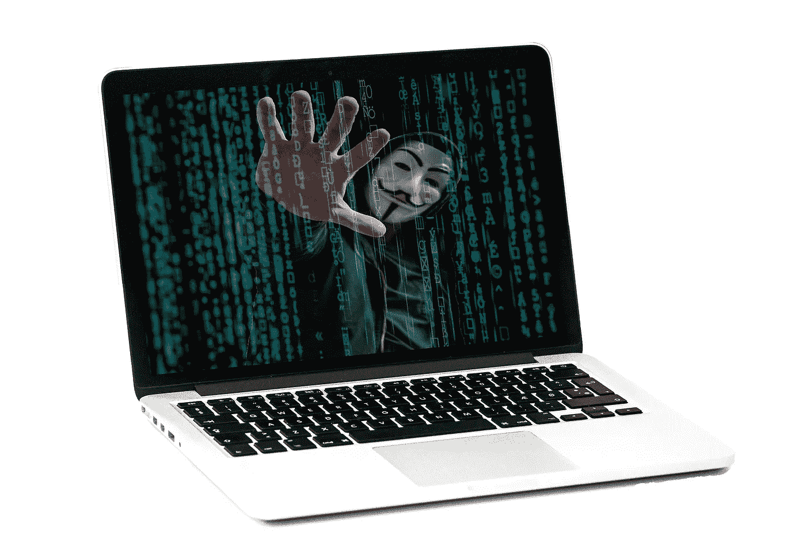

# 比特币的价格是否被操纵？

> 原文：<https://medium.datadriveninvestor.com/is-the-price-of-bitcoin-being-manipulated-955ecc866e14?source=collection_archive---------4----------------------->

## 来自前比特币狂热者的令人不安的数据

Image by [Robinraj Premchand](https://pixabay.com/users/iammrrob-5387828/?utm_source=link-attribution&utm_medium=referral&utm_campaign=image&utm_content=2972105) from [Pixabay](https://pixabay.com/?utm_source=link-attribution&utm_medium=referral&utm_campaign=image&utm_content=2972105)

虽然我不自称是比特币或其他数字货币的专家，但当我看到泡沫时，我确实知道。

对比特币价格投入的情感和关注是惊人的。每天都有大量关于比特币的文章，我必须涉水而过，才能找到我认为更有用的东西，比如投资和积累财富(而不是投机)。 ***这是一个典型的案例，投资者出于对错过的恐惧(*******)而不是基于他们所购买的资产的基本面来购买。****

*我最近读了 Research Affiliates 的研究副总裁亚历克斯·皮卡德(Alex Pickard)写的一篇启发性的文章，题为“[比特币:神奇的互联网货币](https://www.researchaffiliates.com/en_us/publications/articles/820-bitcoin-magic-internet-money.html)”，文章不仅指出比特币肯定存在泡沫，而且比特币的价格很可能被某些行为者操纵，以获得经济利益。*

*他在文章中提出了三个要点:*

> *永远知道你在投资什么。*
> 
> ***比特币不是资本资产，也不是价值储存手段。***
> 
> *几乎可以肯定，BTC 的价格是一个泡沫，而且很可能受到操纵。*

> *如果第三点是真的，这无疑会给 BTC 投资者带来灾难，不仅仅是正常的投机泡沫破裂。*

## *牛市还是熊市？*

*这篇文章不是我这种一直对比特币持怀疑态度的人写的。 ***皮卡德是早期投资者和爱好者*** 。从 2013 年开始，随着他越来越坚信比特币将作为一种数字货币腾飞，他继续增仓。*

*到 2017 年，他赚了足够的钱，辞去了他的日常工作，开始了全职矿工生涯，最初每天赚几千美元，直到他因为用电过多而被关闭，大约与此同时，比特币的价格大幅下跌。*

## *2021 年与 2013 年对比*

*皮卡德在此期间已经失去了对比特币的热情。正如他在文章中所说:*

> *在早期，比特币很容易被定义为一种在线现金系统，但今天它的含义要模糊得多。大多数支持者声称比特币是一种不可分割、抗审查、提供通胀保护的“数字黄金”。当然，像许多叙述一样，这一个依赖于支持者完全忽略数据。*

*他指出，比特币的极端波动性使得它既可以作为一种支付形式，也可以像黄金一样作为一种价值储存手段，比特币的价格没有在任何有意义的意义上与通胀挂钩，而且政府肯定已经从丝绸之路等非法经营中没收了比特币。*

> *人们用来购买比特币的所有主要原因目前都没有数据支持。*

**

*Image by [vicky gharat](https://pixabay.com/users/vickygharat-1717429/?utm_source=link-attribution&utm_medium=referral&utm_campaign=image&utm_content=5332845) from [Pixabay](https://pixabay.com/?utm_source=link-attribution&utm_medium=referral&utm_campaign=image&utm_content=5332845)*

## *诈骗？*

*更令人担忧的是，有数据显示，比特币的价格可能受到稳定的货币 Tether 的操纵。正在进行的诉讼称 ***Tether Limited 正在凭空捏造 USDT 购买比特币，推高价格。然后，代理商可以将比特币卖出，获得可观的利润。****

*这篇文章提供了一个图表，显示了 USDT 的发行和比特币价格之间的相关性，显示了两者的协同移动。当大量 USDT 发行时，比特币的价格就上涨了。当 USDT 的流量下降时，比特币的价格也会下降。*

> *虽然相关性不能证明因果关系，但它确实值得进一步调查。*

## *结果*

*如果比特币的价格没有受到欺诈的操纵，那么它只是在一个常规的投机泡沫中，最终仍有可能摧毁大量财富。*

*然而，如果欺诈指控是真的，那么 ***真的有可能关闭 Tether，随之而来的是，对比特币的人工支持将会消失。****

> *这将导致比特币价格的全面崩溃，可能永远无法恢复。*

*阅读[文章](https://www.researchaffiliates.com/en_us/publications/articles/820-bitcoin-magic-internet-money.html)，查看他的资料来源，自己拿主意，让我知道你对比特币未来的看法。*

*无论如何，海洋是充满泡沫的，投资者在那里需要小心！*

## *[点击这里获得我的新电子书《积累财富的内幕指南》的免费样本](https://buildingarks.gumroad.com/l/rykij)*

**

*image by author*

# *建造方舟*

*在职业生涯早期，我遵循传统的理财建议，努力积累财富，之后我开始学习投资。十多年后，我在经济上有了保障，并通过房地产和股票市场朝着完全财务独立的方向努力。我已经成功地建造了我的金融方舟，帮助我度过任何可能到来的风暴。*

*我创建了 [Building Arks](https://buildingarks.medium.com/about-building-arks-fa2edcf2f584) 来帮助像你一样忙碌的专业人士忽略主流建议，建立真正的财富。*

**

*Image by [jeffjacobs1990](https://pixabay.com/users/jeffjacobs1990-7438739/) on pixabay*

*如果你想在我每次发布新故事的时候收到邮件通知，你可以在这里加入我的邮件列表。*

****想通过在媒体上写作开始赚取额外收入吗？我第一年挣了 6000 多美元。*** [加入这里成为会员每月只需 5 美元。我将免费为你赚取一部分订阅费，你可以无限制地阅读像我这样的作者的数千篇文章，还可以开始自己的写作事业。](https://buildingarks.medium.com/membership)*

*您可能会发现有用的其他相关文章:*

* [## 价格与价值——到底有什么区别？

### 为什么买比特币不是投资。

medium.com](https://medium.com/datadriveninvestor/price-vs-value-whats-the-difference-anyway-20985d62bcd3)  [## 想做投资人？

### 别瞎猜了！或者，“为什么你不应该买特斯拉和比特币。”

medium.com](https://medium.com/makingofamillionaire/want-to-be-an-investor-7fdc49e28807)  [## 如何通过投资获得成功

### 来自本杰明·格拉哈姆的永恒教训

medium.com](https://medium.com/the-innovation/how-to-find-success-with-investing-411fb59d54f8) 

*我没有比特币的任何头寸(多头或空头)，也无意很快开仓。我与列出的任何网站都没有关系，也不从任何合作伙伴或我文章中的推荐赚钱。我不是律师，会计师，或注册理财规划师。所有材料都是基于我的知识和经验，出于提供信息的目的而真诚呈现的。它无意取代专业建议。在做出任何法律、税务或财务决定之前，你都应该向专家咨询。**