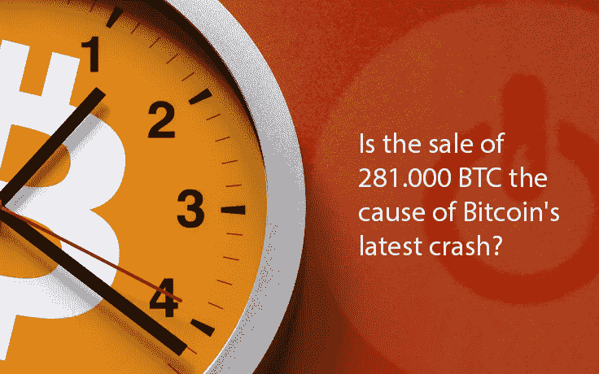
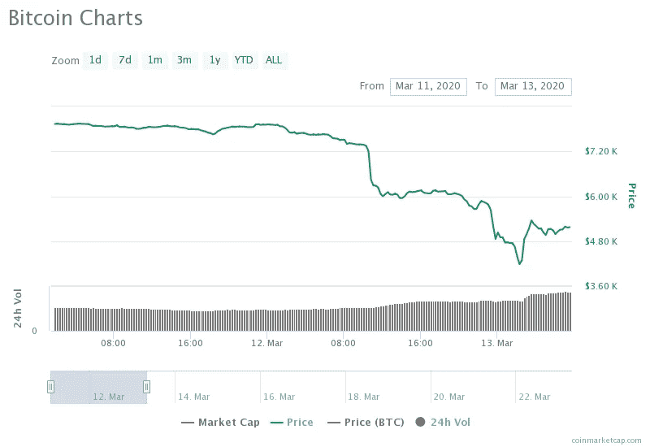

# 出售 281.000 BTC 是比特币最近崩盘的原因吗？

> 原文：<https://medium.datadriveninvestor.com/is-the-sale-of-281-000-btc-the-cause-of-the-bitcoins-latest-crash-37751ad7faa2?source=collection_archive---------10----------------------->

比特币不再是长久以来被打上烙印的神奇互联网货币。没有黑暗力量导致它的行为与传统市场相反。只是有很多怪胎和怪人，被剥夺权利的理想主义者，央行不可信的国家的公民，做着传统投资者认为疯狂的事情。

3 月 12 日，当世界卫生组织宣布冠状病毒(新冠肺炎)疫情时，加密市场已经崩溃。人们开始明白比特币到底是什么。世界上一些最大的公司，包括苹果和特斯拉，到当地的酒吧和餐馆，标准普尔&500 和其他全球市场的价格暴跌了 10%，带走了比特币。许多人警告称，比特币这种被认为不相关的数字资产已经崩溃，如果它与传统市场相关，它的用途和价值也就不复存在了。

加密社区确信，加密市场突然崩溃的原因是关于冠状病毒疫情的公告。

The Bitcoin Price Chart — March 12, 2020

# 281，000 个比特币的销售

在[coin metrics](https://coinmetrics.substack.com/p/coin-metrics-state-of-the-network-30a)3 月 17 日发表的一篇文章中，连锁数据支持这样一个事实，即短期 BTC 持有者最有可能对抛售负责，而不是新持有者。

他们引用的数字包括 28.1 万 BTC 在持有 30 天后开始转移，而 4131 人在被转移前一年多没有动过。

这一数据可能会让一些人认为，FOMO 在 2020 年初比特币价格上涨 30%时买入的是弱手。然而，人们不得不考虑廉价抛售如此大量比特币的可能动机。

很有可能，导致今年比特币价格上涨的人，正是导致其下跌的人。

# 为什么矿商会让市场崩溃？

让我们来看看大型矿商崩溃市场的几个原因:

*   清算杠杆化的竞争对手(许多较小的矿商在杠杆平台上对冲)；
*   在减半之前增加他们的市场份额(由于上述原因)；
*   在减半之前摆脱大的操纵者(如机构投资者)。

由于抛售，我们永远不会真正知道上述情况是否属实。但这两个原因“强大”到足以成为密码市场崩溃的原因。

***如果您想了解更多，请访问 BIDITEX 页面并提出您的问题，关注我们的*** [***推特***](https://twitter.com/biditex_com) ***，*** [***脸书***](https://www.facebook.com/biditex/) ***，*** [***中型***](https://medium.com/@biditex) ***，*** 用[***bidi tex***](http://www.biditex.com/)***投标你的空间。***