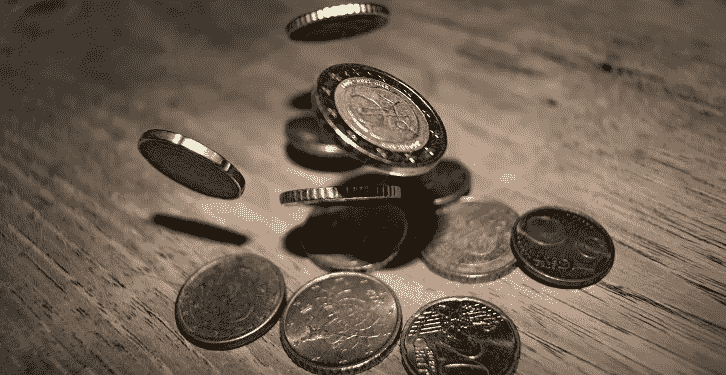
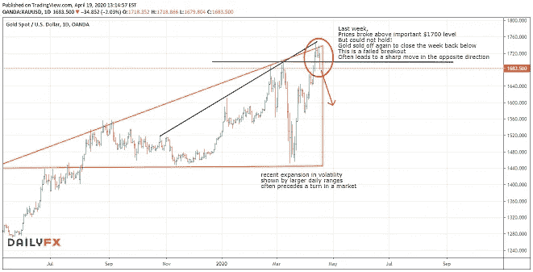

# 金色的光芒即将褪去吗？

> 原文：<https://medium.datadriveninvestor.com/is-the-shine-about-to-go-off-gold-189bda2e9ad7?source=collection_archive---------17----------------------->

最近我一直在让你关注黄金/白银比率的极端水平，以及这可能如何转化为贵金属市场的近期走势。虽然我最初的直觉是提高白银价格，通过这种方式我获得了一些小利润，但上周前景发生了变化。

要让黄金/白银比率下降(正如我所料)，白银只需相对于黄金升值。这并不一定会(在短期内)转化为更高的白银价格。

事实上，经过上周黄金的价格动作，我相信这种情况会发生，*起初，* **通过黄金价格的下跌。**

在过去几周的大日波动性显示出波动性显著扩大后，价格突破了 1700 美元的水平，然后迅速抛售，并在周五晚上收于这一关键价格区域下方。

 [## 机器学习的外汇交易挑战|数据驱动的投资者

### 机器学习是人工智能的一个分支，之前占据了很多头条。人们是…

www.datadriveninvestor.com](https://www.datadriveninvestor.com/2019/02/18/the-challenge-of-forex-trading-for-machine-learning/) 

我们现在可能会看到快速下跌，我认为下周初的任何日内反弹都是卖出的机会。

我想在这些困难时期支持你。

你希望能够发现这样的机会并从中获利吗？

我们提供令人难以置信的六周 100%免费访问我们的培训和指导服务的有限时间。*点击* [***此处***](https://go.mangrovetrading.com/corona)**即可了解详情。**

*-*

*请注意，一如既往，这不是投资建议，您应该在做出任何投资决定之前咨询您的财务顾问。我不是财务顾问，提供这些信息只是为了提供信息和教育目的。*