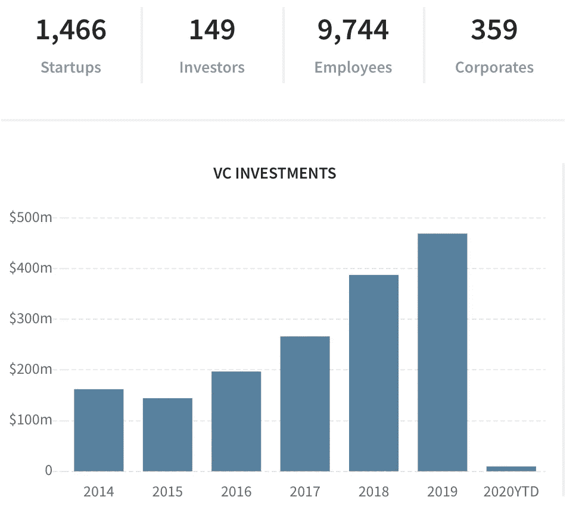

# 英国西南地区会是下一个硅谷吗？

> 原文：<https://medium.datadriveninvestor.com/is-the-south-west-region-of-the-uk-the-next-silicon-valley-e3b25a5eff29?source=collection_archive---------10----------------------->

随着英国退出欧盟的出现，英国的初创公司有望在推动未来经济方面发挥重要作用。西南部是 1 万多家科技公司的所在地，在布里斯托尔，科技行业是经济中增长最快的部分。

# 为什么是西南部？

英国西南部地区充分利用了科技的重要性，提供了必要的生态系统，旨在培育、发展和加速专门从事科技的初创企业。除了高水平的支持管理和建立新公司，还有其他一些原因可以解释为什么西南地区能够如此成功。

1.  教育——像布里斯托尔大学、巴斯大学、埃克塞特大学、南安普敦大学和萨里大学提供世界领先的计算机科学学位，并与许多实验室合作推动创新
2.  中心——学生周围支持的质量和数量有助于将想法发展成令人印象深刻的企业
3.  地理位置——离伦敦只有一个小时的路程，这是它的好处。这里的房租只有伦敦的一半，而且有通往英国大部分地区的火车，是一个利润丰厚的居住地
4.  集群——对技术的关注建立了一个可以发展创意的社区。拥有支持系统来帮助志同道合的人是成功的秘诀

除此之外，该地区还是英国一些最大的科技公司的所在地。像诺基亚、沃达丰、亚马逊、索尼和英国电信都在该地区开展业务。这推动了对一些公司最大问题的解决方案的需求，并产生了推动以技术为导向的商业理念的技术优先思维。

# “布里斯托尔正在蓬勃发展”

布里斯托尔是通过与布里斯托尔大学和全市科技实验室的合作，在机器人，人工智能和自动驾驶汽车方面进行创新的领先科技集群之一。它是两家价值数十亿美元的科技独角兽的家园。这座城市有许多卓越的孵化器、实验室和科技合作空间。最值得注意的是:

*   设置平方
*   单位 DX
*   发射空间
*   未来空间
*   NatWest 企业家加速器
*   东跑道(合作)
*   起源(合作)
*   TechSPARK

仅布里斯托尔的科技公司今年就筹集了[3 . 05 亿美元](https://www.business-live.co.uk/technology/bristol-leading-tech-hub-2019-16854067)，并且被评为[欧洲十大科技城市](https://www.bristolpost.co.uk/news/business/bristol-named-top-10-cities-1988931)。

 [## 风险投资家在给创业公司播种时会考虑什么标准？数据驱动的投资者

### 2017 年，风险投资资金攀升至十年来的最高水平。你的创业公司目前吸引风险投资的机会是…

www.datadriveninvestor.com](https://www.datadriveninvestor.com/2018/04/20/what-criteria-do-venture-capitalists-consider-when-seeding-a-startup/) 

这些城市的科技企业实现了 79 亿美元的总营业额，雇佣了大约 25，000 名员工。

目前位于布里斯托尔的顶级公司包括:

*   [Open Bionics](https://openbionics.com/) —一家机器人公司，为截肢者、研究人员和制造商创造负担得起的 3D 打印仿生手。由乔尔·吉布巴德和萨曼莎·佩恩于 2014 年创立的开放仿生公司迄今已筹集了 290 万美元
*   [FiveAI](http://www.five.ai/) —一家位于布里斯托尔和剑桥的初创公司，使用人工智能和机器学习来帮助加速自动驾驶汽车和公共交通的发展，并确保自动驾驶汽车能够在复杂的环境中安全准确地导航，尤其是在城市地区。FiveAI 迄今已筹集 3770 万美元资金，包括 2018 年 9 月由 Lakestar 牵头的 3500 万美元 A 轮融资。
*   [Xmos](https://www.xmos.com/) —为自动语音识别系统及其在亚马逊 Echo 等产品中的技术功能提供语音捕捉解决方案。Xmos 得到了一些高科技风险投资领域最大的公司的支持，包括 Amadeus Capital Partners、DFJ 思捷环球、基金会资本和罗伯特·博世风险投资。
*   [无手写](https://scribeless.co/) —已经建立了人工智能手写学习算法，可以将任何个人的笔迹学习到难以辨认的程度，允许任何人登录他们的平台，并在几分钟内大规模发送手写信件。这一轮由风险投资者 RLC 风险投资公司牵头，旨在将无划线定位为欧洲和美国领先的个性化手写工具。Ascension Ventures、SuperSeed 和一些战略天使投资者也参与了种子轮投资。
*   ultra haptics——正在开发一种使用超声波技术将触觉投射到用户皮肤上的系统。迄今为止，它已经筹集了 2860 万英镑的资金，包括一轮 1790 万英镑的 B 轮融资，投资方包括 IP Group、Woodford Investment Management 和 Cornes。

# 就连红杉资本也开始涉足了！

> 红杉向布里斯托尔的人工智能初创公司 Graphcore 投资了 5000 万美元。Graphcore 首席执行官奈杰尔·图恩(Nigel Toon)表示，红杉非常适合他的公司，因为它理解机器学习的重要性

Graphcore 和 Sequoia 的目标一致导致了双方的合作。图恩说过，“我们并不痴迷于融资，我们痴迷于与谁合作，红杉对如何扩大规模和建立成功的企业有着深刻的理解。"

这不是大型风险投资公司第一次进入西南地区，鉴于目前的生态系统，这肯定不会是最后一次。

# 统计数据

[科技](https://datacommons.technation.io/dashboard/f/geo/anyof_South%20West)提供的西南地区统计数据:

VC yearly investment in the South-West UK region

我们看到每年大约 30%的年增长率…谁知道 2020 年该地区会发生什么！

如果你是风险投资者/天使投资者，还没有考虑涉足该地区，也许现在是时候了。