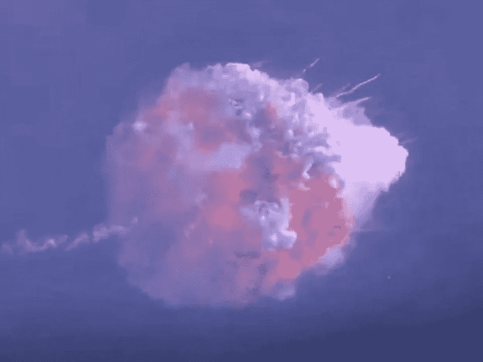
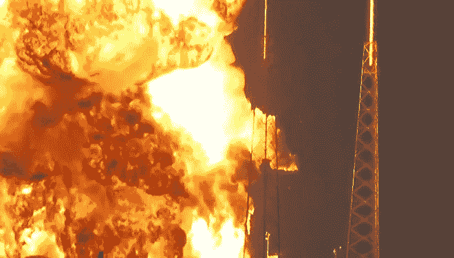

# SpaceX 星际飞船对宇航员来说是致命的吗？

> 原文：<https://medium.datadriveninvestor.com/is-the-spacex-starship-deadly-for-astronauts-f3e190cf6287?source=collection_archive---------7----------------------->

星舰对旅行者来说是致命的吗？

上周末，SpaceX 公司故意出色地爆炸了一枚猎鹰 9 号火箭，这是美国宇航局展示龙太空舱安全性的一次关键测试。猎鹰火箭 B1046 是 Block 5 系列中的第一个，具有增强的可重复使用性，包括升级的着陆腿和隔热罩。该火箭此前已将 Bangabandhu 和 Merah Putih 卫星送入地球静止轨道。它上一次成功的轨道飞行是在不到两个月前，由小型卫星 SS0-A 快速飞离加利福尼亚。

在最后一次飞行中，火箭从肯尼迪航天中心起飞，加速到[2.2 马赫](https://spaceflightnow.com/2020/01/17/falcon-9-crew-dragon-in-flight-abort-test-mission-status-center/)。然后在 T+90 秒时，SuperDraco 推进器点火，以 4 Gs 的速度加速太空舱离开助推级。太空舱进一步向火箭发出信号，关闭其九个引擎，以避免与火箭相撞，火箭在几秒钟后因空气动力应力而爆炸。龙太空舱随后到达 131，000 英尺的高度，然后脱下它的躯干并展开降落伞，在大西洋上成功溅落。

 [## 动荡迫使暴风雨中的平静|数据驱动的投资者

### 自然界中很少有东西是直线行进的，尤其是经济。当投资者和消费者希望平静时…

www.datadriveninvestor.com](https://www.datadriveninvestor.com/2019/03/25/volatility-compels-calm-amid-the-storm/) 

这次飞行是一个承认，即使是经过飞行验证的猎鹰 9 号火箭如果运载乘客仍然是危险的。虽然火箭的性能在过去五年中一直很出色，但助推器也不是没有问题。

**CRS-7**

2015 年 6 月，在 CRS-7 龙飞往国际空间站的过程中，火箭遭遇了最著名的灾难。支撑液氧罐 LOX 的支柱断裂引发了一个罐[破裂](https://www.spacex.com/news/2015/07/20/crs-7-investigation-update)，这导致火箭在飞行中解体。很可能这次失败迫使美国宇航局在 2020 年 1 月下令进行龙中止试验。

2016 年 9 月晚些时候，SpaceX 在等待发动机测试时，因猎鹰 9 号的另一次爆炸而失去了 Amos-6 飞船。爆炸追溯到加压氦罐内衬的[弯曲](https://www.spacex.com/news/2016/09/01/anomaly-updates)。油箱的弯曲刺穿了氧气瓶，并通过摩擦点燃了氧化剂。

虽然那是四年前的事了，而且坦克的可靠性问题已经解决了。猎鹰 9 号的着陆名声更差。

**第一架猎鹰重型**

让我们不要忘记 2018 年 2 月的第一次重磅飞行。这三个助推器成功推动马斯克的 Starman 踏上了火星之旅。返程航班更有趣。Thiacom 和 CRS-9 飞行中的两枚侧面火箭完美着陆。然而，核心级[在着陆前耗尽了茶-TEB 点火器的供应，并与海洋相撞。](http://spaceflight101.com/falcon-heavy-launches-on-inaugural-flight/)

**CRS-16**

在 2018 年 12 月的这一次，新鲜的猎鹰 9 号火箭将重复使用的龙发送到国际空间站。当液压泵故障[在重返大气层时卡住](https://www.theverge.com/2018/12/5/18127630/spacex-falcon-9-rocket-landing-failure-ground-cape-canaveral)栅格翼，导致助推器在海上坠毁时，返回变得更加令人兴奋。

**猎鹰重型 STP-2**

重型飞船的第三次飞行是丰富多彩的，有 24 颗卫星发射到轨道上，包括行星协会的光帆-2 号宇宙飞船。之前在 Arabsat 任务中飞行的侧助推器推动了这次飞行，并壮观地返回到佛罗里达州的着陆台上，没有发生任何事故。猎鹰核心级的高速燃烧迫使飞行器尝试以前所未有的 750 英里的速度降落，但再入[的热量](https://www.teslarati.com/spacex-ceo-elon-musk-explains-falcon-heavy-missed-landing/)对火箭来说太多了，它以推力矢量损坏的方式撞击了海洋。

**星际飞船**

当重型星际飞船在这十年间投入使用时，飞行中出现障碍似乎是不可避免的，这些障碍对乘客来说可能是致命的。这些挫折迫使美国宇航局下令龙中止试验。当 SpaceX 不可避免地向他们推销助推器以收回昂贵的开发成本时，美国宇航局可能会下令对星际飞船进行另一次中止测试，这听起来很合理。

这就对他们从受损的助推器中营救宇航员的选择提出了质疑。

**弹射座椅**

对于飞行员来说，逃生的最简单和最有效的方法就是弹射座椅。据报道，这些机制可以从零高度到 80，000 英尺的高度营救飞行员。据报道，洛克希德 SR-21 黑鸟能够以 3.25 马赫的速度弹射出去。仍然悬而未决的是乘员从动力驱动的火箭中弹射出去的安全性。第一任航天飞机指挥官罗伯特[克里彭](https://www.nasa.gov/centers/dryden/Features/crippen_recalls_sts-1.html)对它们的实用性表示怀疑，因为当固体火箭燃烧时，机组人员只能在较低的高度弹射。目前还不清楚陷入困境的液体助推器是否能够在危机中可靠地关闭引擎。

**胶囊**

自太空时代开始以来，火箭一直在将太空舱拖向轨道。从水星号到阿波罗号，直到今天的龙号，运载工具都包括了火箭舱，用于乘员逃生。当代星舰在其设计中排除了逃生舱，但当 SpaceX 未来向 NASA 推销星舰服务时，它可能会变得必要。太空舱的好处是，它是一个简单而成熟的设计，但它可能会大大增加船只的重量。

**寄生火箭**

航天著名的太空舱是有限的机器。水星、阿波罗和龙飞船在与助推器分离后都是无动力飞行器，只有推进器进行操纵。万一星舰在太空中遭遇严重灾难，太空舱可能就没用了。寄生[火箭是逃离一艘损坏的星际飞船后机动的一种选择，但它们尚未开发。任何用于轨道机动的有用火箭都可能非常昂贵，并且很难与星舰集成。在危机情况下，从星际飞船上发射飞行器也是不可能的。](https://science.howstuffworks.com/transport/flight/modern/airplanes12.htm)

**最后评论**

预测航空业的未来是一项变化无常的工作。五年前，很少有人能预测到马斯克在回收轨道火箭业务上的成功。虽然当代星舰没有安全机制:随着星舰设计的发展，有理由期待与 NASA 发射器相当的属性会及时加入。