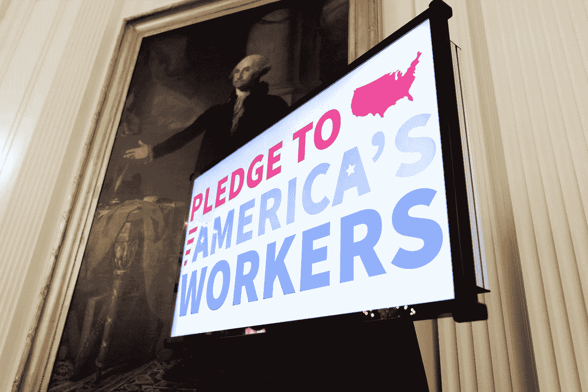

# 6 月份的就业报告真的是一缕阳光吗？

> 原文：<https://medium.datadriveninvestor.com/is-the-stellar-june-jobs-report-really-a-ray-of-sunshine-2babf8a87426?source=collection_archive---------4----------------------->

一些经济指标显示出有希望反弹的迹象。能持久吗？

A video display announces a Pledge to America’s Workers under the painting of George Washington during the American Workforce policy advisory board meeting Friday, June 26, 2020, in the East Room of the White House. (Official White House Photo by Shealah Craighead)

## 先说好消息

本周，美国总统唐纳德·特朗普在白宫简报室举行新闻发布会，就最近发布的、出乎意料的好的 6 月份就业报告发表评论。

 [## 人工智能如何在全球创造数百万个远程工作岗位|数据驱动的投资者

### 当人们谈论人工智能和就业市场时，他们经常谈论人工智能将如何从…

www.datadriveninvestor.com](https://www.datadriveninvestor.com/2020/02/26/how-ai-is-creating-millions-of-remote-jobs-around-the-world/) 

在他的简短讲话中，特朗普连续第二个月吹捧破纪录的就业数据，称美国失业率下降是“美国工人和美国家庭的惊人消息”。

好到难以置信吗？

5 月份，美国确实创造了破纪录的就业数字；特朗普政府可以正确地夸耀美国经济增加了 270 万个就业岗位，这是历史上最大的月度就业增长。

特朗普还可以正确地声称粉碎了经济学家的预期，随着经济努力从长期停工中复苏，经济学家的预期已经接近世界末日。

五月份的失业率从 14.7%下降到 13.3%，而不是像著名经济学家如圣路易斯美联储大学校长[詹姆士·布拉德](https://www.cnbc.com/2020/05/06/feds-james-bullard-says-the-jobs-report-on-friday-will-be-one-of-the-worst-ever.html)预测的那样上升到近 20%。

根据劳工部公布的数据，美国经济在 6 月份增加了 480 万个就业岗位。这个数字比经济预测者的预期多出 170 万个工作岗位。[路孚特](https://www.foxbusiness.com/economy/june-jobs-report-2020-coronavirus)调查的经济学家曾预计该报告将显示 12.3%的失业率和仅增加 300 万个工作岗位。

美国经济仅在过去两个月就增加了 750 万个工作岗位，这对美国工人来说是个好消息。对于小企业来说，这也是一个非同寻常的消息——自新冠肺炎疫情爆发以来，它们一直徘徊在崩溃的边缘。

失业率下降了两个百分点，现在降至 11.1%左右。

特朗普总统吹捧这些“历史性数字”，并指出非洲裔美国人的失业率从 16.8%大幅下降到 15.4%:“今天的宣布证明我们的经济正在复苏。它正以极其强劲的势头回归。”

休闲和酒店业创造了 210 万个就业机会，占创造就业机会的最大部分。餐饮服务行业增加了约 148 万个就业岗位，这是受疫情影响最严重的行业之一。

零售业增加了 74 万个工作岗位；教育和卫生服务增加了 56.8 万个工作岗位。新增制造业就业岗位 35.6 万个。

特朗普总统预测，“制造业看起来已经准备好真正起飞了”，并将这些工作岗位的增加归功于他的贸易政策和坚持将制造业带回美国。

就业报告进一步显示，非洲裔美国人增加了 70 万个就业岗位，西班牙裔美国人增加了 150 万个就业岗位。此外，6 月份又有 300 多万名妇女就业。

股市本周也显示出明显好转的迹象。道琼斯指数增长了令人鼓舞的 18 %,这是 20 年来最大的涨幅。

## 现在，坏消息是

与年初相比，失业率仍然上升了 7.6 个百分点，当时处于 50 年来的最低点。

不祥的是，这一关于 6 月份就业增长的令人愉快的宣布正值美国新增新冠肺炎病例首次超过 5 万例，单日感染人数达到创纪录水平。

亚利桑那、佛罗里达、德克萨斯和加利福尼亚都是感染人数激增的州。一些州如佛罗里达已经开始放松限制。如果疫情再次加剧，经济学家警告说，经济成本可能是可怕的。

特朗普重申了他的竞选承诺，即尽管新冠肺炎案件激增，但经济将迅速复苏。特朗普说:“我们在一些地区扑灭了大火，效果很好。”。“我们正在消除火焰，”他补充道。

Glassdoor 首席经济学家 Andrew Chamberlain 告诉福克斯新闻频道，“随着过去一周激增的新冠肺炎案件创下新高，未来几个月经济肯定会出现波涛汹涌的局面，因为第二波浪潮可能会再次关闭数百万美国小企业，并冻结招聘。”

尽管如此，张伯伦承认，好于预期的报告提供了“一个强有力的信号，表明一旦国家最终控制住冠状病毒，美国就业增长会以多快的速度反弹，企业会以多快的速度重新开业——这是未来几个月乐观的理由。”

许多人怀疑总统是否有能力兑现降低美国失业率的承诺，尤其是考虑到疫情的不可预测性。

然而，在新冠肺炎疫情爆发之前，美国在过去几年中经历了历史性的经济增长。在过去三年中，美国增加了 700 多万个就业岗位，失业率达到了 50 年来的最低水平。

此外，在疫情之前，川普政府监督了美国历史上最低的非裔美国人失业率。西班牙裔美国人、亚裔美国人、美国印第安人和阿拉斯加土著人、退伍军人、没有高中学历的人和残疾人的失业率达到或设定了历史最低水平。

现在，冠状病毒病例在一天内达到创纪录的数量，特朗普对过去两个月经济收益的控制，更不用说对过去三年经济收益的控制，可能比以往任何时候都更加脆弱。

(特约记者阿莱格拉·诺卡伊)(特约撰稿人布鲁克·贝尔)

**访问专家视图—** [**订阅 DDI 英特尔**](https://datadriveninvestor.com/ddi-intel)