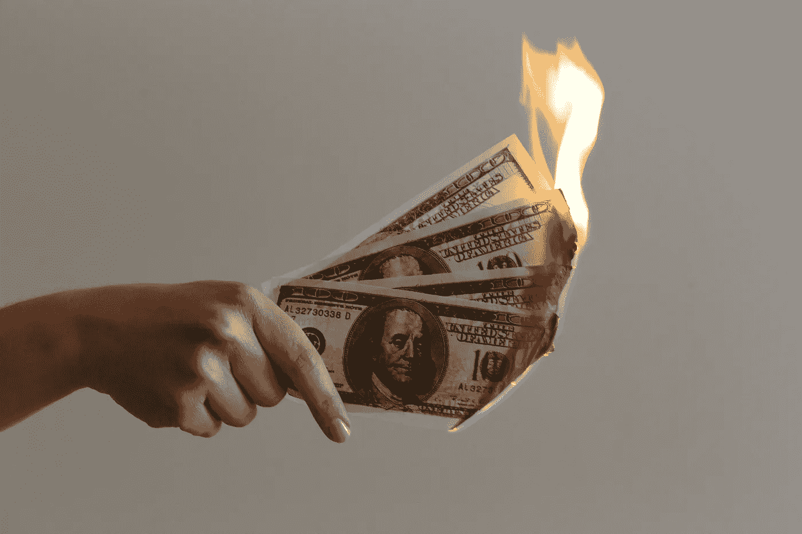
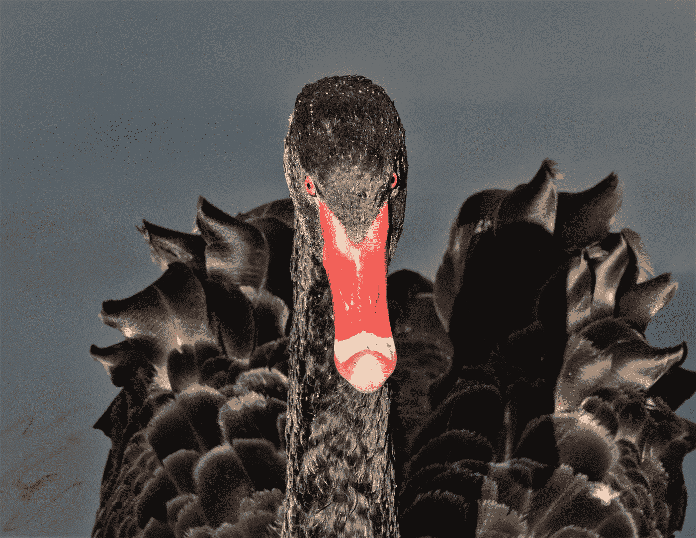
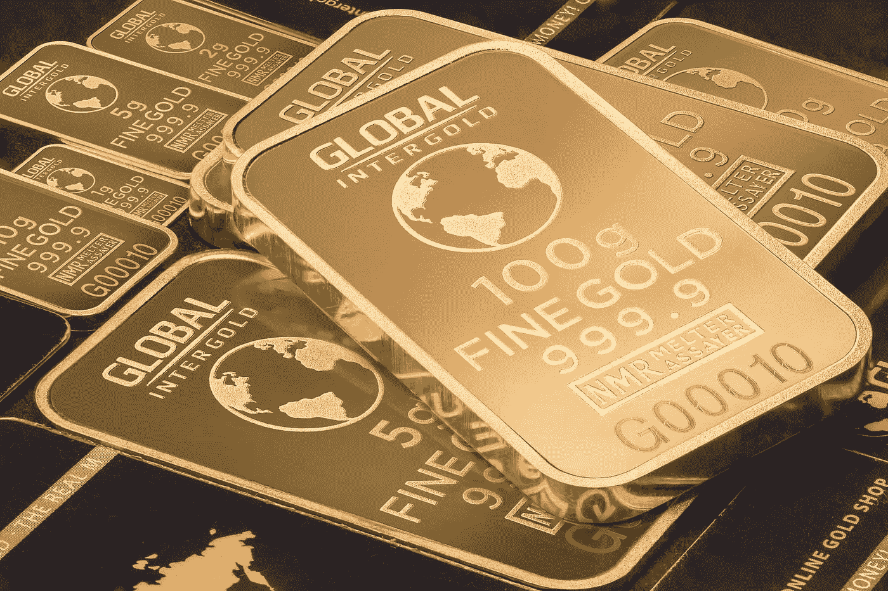

# 股市又崩盘了吗？

> 原文：<https://medium.datadriveninvestor.com/is-the-stock-market-crashing-again-34ac7253e32f?source=collection_archive---------5----------------------->

## 恐慌之前，请阅读它…

Photo by [Jp Valery](https://unsplash.com/@jpvalery?utm_source=unsplash&utm_medium=referral&utm_content=creditCopyText) on [Unsplash](https://unsplash.com/s/photos/money-fire?utm_source=unsplash&utm_medium=referral&utm_content=creditCopyText)

由于过去几天对新冠肺炎全球爆发的担忧增加，标准普尔 500 指数下跌了 12%左右。

芝加哥期权交易所波动率指数——或 VIX，被广泛称为股票市场的恐惧指标——跃升约 200%。

富时公司一天之内损失了 650 亿英镑。

投资者现在很恐慌，这种趋势可能会持续一段时间。

正如我们在本文中所讨论的，恐惧因素正在市场中发挥作用:

 [## ✋停止破坏你的投资

### 由卡洛斯·努内斯在首都

medium.com](https://medium.com/the-capital/stop-sabotaging-your-investments-9ac70130d7ef) 

但是请**不要惊慌！**

这是你能对你的投资做的最糟糕的事情。

当你恐慌的时候，你经常“低价卖出”,然后你不得不“高价买入”。

好吧，但是你能做些什么来减少你的恐惧并渡过这些混乱的水域呢？

# 多元化投资组合+保护

多样化的投资组合意味着你将投资分散在不同的资产类型上，这样你对任何一种类型的投资都是有限的。

这种做法有助于减少你的投资组合的波动性。

在你的投资中应用正确的多样化可以帮助减轻你的投资组合的风险和波动性，潜在地减少可能导致“贪婪”或“恐惧”的起伏。

 [## 更好的预算，打造更大的|数据驱动型投资者

### 即使是专家也承认它们并不完美。从 1 到 10 的范围内，安东尼·科普曼和德尔…

www.datadriveninvestor.com](https://www.datadriveninvestor.com/2018/11/08/budget-better-to-build-bigger/) 

正如我在上面的文章中提到的，没有完美的资产配置，你需要定义一个适合你的情况。

我在[重点文章](https://medium.com/me/stats/post/9ac70130d7ef)中分享了我的投资组合是如何分配的，仅供你参考，以防你想了解更多细节。

然而，今天我想谈谈我投资组合中针对**“黑天鹅”**的**保护部分**。

# 黑天鹅

Photo by [Bruce Jastrow](https://unsplash.com/@brucej6767?utm_source=unsplash&utm_medium=referral&utm_content=creditCopyText) on [Unsplash](https://unsplash.com/s/photos/black-swan?utm_source=unsplash&utm_medium=referral&utm_content=creditCopyText)

> 黑天鹅是一种不可预测的事件，超出了正常情况下的预期，具有潜在的严重后果。黑天鹅事件的特点是极其罕见、影响严重，以及事后将普遍未能预测它们解释为简单愚蠢的做法。*【1】*

黑天鹅理论是由纳西姆·尼古拉斯·塔勒布提出的，通常用于金融市场来描述可能导致市场崩溃的灾难性和罕见的事件。

金融市场中最近的黑天鹅事件包括:

## 1997 年:亚洲金融危机

这场金融危机发生在所谓的亚洲四小龙(包括韩国、印度尼西亚、泰国、马来西亚、新加坡和菲律宾)的巨大有序增长之后，导致这些国家的货币股市损失超过 70%,并在全球范围内造成金融影响。

## 2000 年:网络泡沫破裂

随后的崩盘见证了纳斯达克指数从 2000 年 3 月 10 日的 5048.62 点跌至 2002 年 10 月 4 日的 1139.90 点，跌幅达 76.81%。纳斯达克需要 15 年时间才能恢复到 2015 年 4 月 23 日的网络峰值。

## 2001 年:911 事件

在恐怖袭击后的第一天交易中，纽约证券交易所损失超过 7%。本周收盘时，道琼斯指数下跌 14%，S&P 下跌 11.6%。事实证明，这是又一次重大调整，最终在一年后的 2002 年 10 月结束。

## 2008 年:全球金融危机

近年来最臭名昭著的金融崩溃始于 2008 年 9 月，主要是由次级抵押贷款导致的不可持续的房地产市场泡沫。随着房地产市场的崩溃，另一家全球投资银行雷曼兄弟申请破产引发了崩溃。房利美和房地美紧随其后，美国政府别无选择，只能以 1870 亿美元收购这两家公司。美联储还以 850 亿美元救助了 AIG。

# 那么，作为一名普通投资者，我们能做些什么来保护我们的投资免受黑天鹅的影响呢？

如果你有一个多元化的投资组合，那么你的状况相当不错，然而，在你的投资组合中有一些针对“**黑天鹅事件”**的保护措施仍然是关键。

我喜欢在我的投资组合中保留的两种保护是**商品**和**期权。**

# 保护 1-商品

Photo by [Michael Steinberg](https://www.pexels.com/@michael-steinberg-95604) on [Pexels](https://www.pexels.com)

商品是商业中使用的一种基本商品，可以与其他同类商品互换，最常被用作生产其他商品或服务的投入。

投资者可以直接在市场上或通过期货和期权等衍生品买卖商品。

更广泛投资组合中的大宗商品被鼓励作为分散投资者、对冲通胀的工具，但也可以起到保护作用。

我喜欢放在投资组合中作为保护的商品是旧的。

**黄金**被广泛认为是通货膨胀的对冲工具，因为它的美元价格是可变的，随着通货膨胀的上升和美元价值的侵蚀，每盎司**黄金**的美元价格将会上升。

当市场面临压力时(比如现在)，黄金也被认为是安全的避风港。

由于黄金在历史上一直保持其价值，它可以作为一种抵御不利经济事件的保险。

当不利事件发生时，**投资者**倾向于将他们的资金转移到**黄金**中，由于供求规律，黄金价格会上涨。

# 保障 2-物超所值”选项

看跌期权赋予所有者在特定时间内以特定价格出售特定数量的标的证券的权利，而非义务。

许多资产都有看跌期权，包括股票、指数、商品和货币。

随着标的股票价格下跌，看跌期权变得更有价值。

相反，看跌期权会随着标的股票的上涨而贬值。

投资者经常使用看跌期权作为一种风险管理技术，以确保标的资产的损失不超过一定的金额，即执行价格。

一般来说，由于时间衰减，看跌期权的价值随着其到期时间的临近而降低，因为股票跌破指定执行价格的概率降低。

对于期权合约，我们还应该考虑金钱的金融概念。

> 在金融学中，货币性是基础资产(如股票)的当前价格(或未来价格)相对于衍生产品(最常见的是看涨期权或看跌期权)的执行价格的相对位置。[2]

就货币条款而言，期权可分为:

**不惜金钱**；如果[执行价格](https://en.wikipedia.org/wiki/Strike_price)与基础证券的当前现货价格相同，则[期权](https://en.wikipedia.org/wiki/Option_(finance)) **处于货币(ATM)** 。平价期权没有内在价值，只有时间价值。[【3】](https://en.wikipedia.org/wiki/Moneyness#cite_note-at-the-money-3)

**在金钱上；**货币(ITM) 期权中的**期权具有正的内在价值和时间价值。当执行价格低于现货价格时，看涨期权就兑现了。当执行价格高于现货价格时，看跌期权就兑现了。**

**出了钱；一个**无本金(OTM)** 期权没有内在价值。当执行价格高于标的证券的现货价格时，看涨期权就失去了价值。当执行价格低于现货价格时，看跌期权就出局了。**

我投资组合中的投资组合是为了保护自己。

如果你想更好地理解 Options 是如何工作的，我强烈推荐你观看下面这个来自 [Bill Poulos](https://medium.com/u/7892b046b8eb?source=post_page-----34ac7253e32f--------------------------------) 的视频:

 [## Bill Poulos:新手的看涨期权和看跌期权

### 这是一首老歌，但也是一首老歌。如果你在理解看涨期权和看跌期权(以及如何交易它们)方面有问题，请看…

medium.com](https://medium.com/@BillPoulos/bill-poulos-call-options-put-options-for-beginners-448f76497232) 

# 如何实施保护？

Photo by [javier trueba](https://unsplash.com/@javotrueba?utm_source=unsplash&utm_medium=referral&utm_content=creditCopyText) on [Unsplash](https://unsplash.com/s/photos/teacher?utm_source=unsplash&utm_medium=referral&utm_content=creditCopyText)

对于**黄金**，你有几种投资方式，比如:购买金属本身，购买黄金基金，或者购买黄金期权。

就我而言，我发现购买黄金基金很容易。

我投资了 T4 的 IAU iShares 黄金信托基金，这基本上是一个费用很低的基金，旨在反映黄金价格。

该基金旨在提供一种简单且具有成本效益的投资方式，类似于黄金投资。

作为参考，在我写这篇文章的时候， **iShares Gold Trust IAU** 年初至今的总回报率约为 8%,尽管存在所有的市场担忧和恐慌。

对于 **OTM 看跌期权**，我尽可能地模仿来自**马克·斯皮兹纳戈尔**的策略，称之为“尾部对冲”

一开始，我不知道作为一个普通投资者该如何实施这个策略，直到我看到了杰西·费尔德的这篇文章。

所以如果你想更好地理解什么是尾部对冲，以及如何在细节上实现，请阅读这篇文章。

 [## 担心股市崩盘？以下是你如何对你的投资组合进行“尾部对冲”

### 上周，我在 twitter 上分享了一篇文章，其中因《黑天鹅》而出名的纳西姆·塔勒布被问到，“最大的……

thefelderreport.com](https://thefelderreport.com/2016/08/15/worried-about-a-stock-market-crash-heres-how-you-can-tail-hedge-your-portfolio/) 

使用文章中描述的策略，我定期购买我的保护产品，这使我能够将投资组合中合理的一部分投资于标准普尔 500 指数。

举个例子，我大约一周前买了保护**SPY 2019 年 4 月 20 日看跌期权**，这基本上是一个价外看跌期权(strike 比标准普尔 500 指数低 35%左右)，到期日是 2020 年 4 月 17 日。

为了购买期权，我通过 VTI (Vanguard Total Stock Market)投资了我目前在标准普尔 500 指数中暴露的总头寸的大约 0.5%，每 60 份合约支付大约 570 美元。

在我写这篇文章的时候，这些合同的价值飙升到了 5000 多美元，基本上在不到一周的时间里增长了 880%左右。

这个价值有助于抵消我的 VTI 头寸大幅下跌造成的部分损失，最重要的是，它有助于在恐慌加剧时保持我内心的平静。

需要提醒的是，这个世界上没有免费的午餐，所以这两个策略会给你的回报带来一些阻碍。

这就像一份保险，你需要支付额外的费用才能拥有它，不管你是否会使用它。

如果一切运行良好，你的保护将随着时间的推移而失去价值，但这应远远补偿你的整体投资组合的增长。

然而，当“黑天鹅”发生时，至少你可以减少损失。

我认为这是一个可以考虑的选择，而不是试图预测市场波动的不可能任务。

此外，当金融市场出现急剧下跌时，就像我们现在看到的一样，这是一个审查你的投资组合的好机会，如果必要的话，可以使用再平衡策略。

通过重新平衡，你增加了低买高卖的可能性，并将投资组合的风险带回你可接受的水平。

最后，投资组合没有完美的保护，但如果你想降低风险，并留在“市场游戏”中，这些都是可供探索的选择。

> "如果你不玩，你就赢不了。"朱迪思·麦克诺特

希望是有用的！

如果你有其他关于投资的想法，我很乐意听到你的意见。最好的学习方法是分享我们的经验。

免责声明:本文仅供参考，它说明了我如何使用我的钱，它不应该被认为是财务建议。在做出任何重大财务决定之前，你应该咨询一位公正的财务专家。

来源:

[1]investopedia.com

[2]wikipedia.org