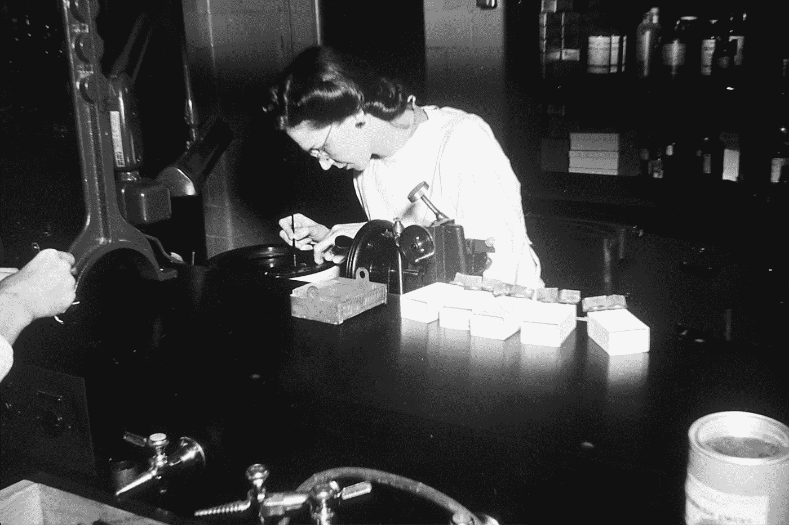

# 发展中的新冠肺炎有基于遗传因素的可能性吗？

> 原文：<https://medium.datadriveninvestor.com/is-there-a-genetic-factor-based-probability-in-developing-covid-19-a17809e6f6a7?source=collection_archive---------18----------------------->

Photo by [National Cancer Institute](https://unsplash.com/@nci?utm_source=medium&utm_medium=referral) on [Unsplash](https://unsplash.com?utm_source=medium&utm_medium=referral)

*我坐在第五十二街
的一个酒吧里
不确定和害怕
随着聪明的希望在不诚实的十年
结束:
愤怒和恐惧的浪潮
在地球上光明
和黑暗
的土地上循环，困扰着我们的私人生活；难以启齿的死亡气味冒犯了九月的夜晚。*

我的一个亲爱的朋友 CY 分享了本周《经济学人》的一篇题为“严重新冠肺炎的风险并不一致”的文章，其中对那些因新冠肺炎而面临最大死亡风险的人进行了深思熟虑的讨论。概括地说；年龄、性别、肥胖、癌症、器官移植、吸烟和贫困都有影响。事实上，这是一次重要的讨论，目的是为了在未来尽可能避免更多的死亡。这也有助于加强我们的科学认识，并改善对未来疫情的政策反应，而不仅限于冠状病毒。

然而，前面有一个非常简单的问题，我不仅没有看到任何答案，而且完全不知道是否有人提出这个问题。鉴于我的社会科学背景，我可能会问不恰当的科学问题。即使如此，证伪我的问题的假设将有助于消除一种可能性。另一方面，如果这个假设指出了一个有意义的相关性，那么探究潜在的因果关系难道不是一种谨慎的做法吗？

在这篇一页纸的文章中，我不再赘言，提出了这样一个问题:**鉴于数百万无症状冠状病毒病例已被检测或以其他方式检测，是否有办法根据遗传、社会和其他因素来确定感染转变为新冠肺炎病的概率？**

自然，健康状况不同的人患这种疾病的风险也不同。因此，这样的研究需要足够大的样本基数来应用不同的过滤器。在这个例子中，一个具有相似健康特征和社会/生活方式因素的样本组必须在遗传因素的基础上进行检查。然后，这项研究将修正遗传因素，并着眼于不同的社会因素进行交叉检验。最终，应该尝试许多不同的分组来验证或证伪无效假设，该假设表明遗传和社会/生活方式因素确实对感染转化为疾病有影响。

 [## 冠状病毒；惊慌失措；字里行间的 z |数据驱动的投资者

### 围绕冠状病毒的话题；更准确地说，新冠肺炎几乎占据了整个新闻预报的头条…

www.datadriveninvestor.com](https://www.datadriveninvestor.com/2020/03/23/coronavirus-a-to-panic-z-between-the-lines/) 

这是一个政治敏感问题。尤其是如果有一个基因 X 或条件 Y 或组合 Z 显著影响感染新冠肺炎的风险。证伪将帮助我们更轻松地呼吸，并创造一个公平的竞争环境，为所有人提供通用的建议。

但如果问题有可取之处呢？

如果某些内在因素可以显著降低风险呢？

如果某些生活方式因素结合基因构成影响了疾病发展的概率，那么这种知识会如何影响社会呢？

这里是有一个[少数派报告](https://en.wikipedia.org/wiki/The_Minority_Report)的敏感性，还是我们在不确定的背景风险水平上真的被祝福了？

知道这个或那个因素与疾病发展之间存在有意义的因果联系，会改变社会处理医疗反应的方式吗？应该吗？

在这个问题上有更多的洞察力使我们更加见多识广，但也导致了一种不公平感，这种不公平感在越来越压抑的肮脏气氛中几乎难以忍受，这种气氛使有意识的人和无意识的人一样窒息。不管是不是出于道德方面的考虑，如果某个地方的某个人不是为了利他主义或其他目的而关注此事，我会感到惊讶。无论是被证伪还是被证实，我坚信这个问题应该被提出来，公众应该得到答案。

Photo by [Miguel Bruna](https://unsplash.com/@mbrunacr?utm_source=medium&utm_medium=referral) on [Unsplash](https://unsplash.com?utm_source=medium&utm_medium=referral)

*夜幕下毫无防备
我们的世界陷入昏迷；
然而，到处都点缀着
讽刺的光点
闪现在正义的
交换信息的地方:
我，像他们一样由
爱欲和尘埃组成，
被同样的
否定和绝望所困扰，
展现出肯定的火焰。*

(这两段摘录自 W.H .奥登 1939 年 9 月 1 日的作品——关于[诗](https://poets.org/poem/september-1-1939)和[进一步信息](https://en.wikipedia.org/wiki/September_1,_1939)，请点击链接。)

2020 年 5 月 30 日，伊斯坦布尔