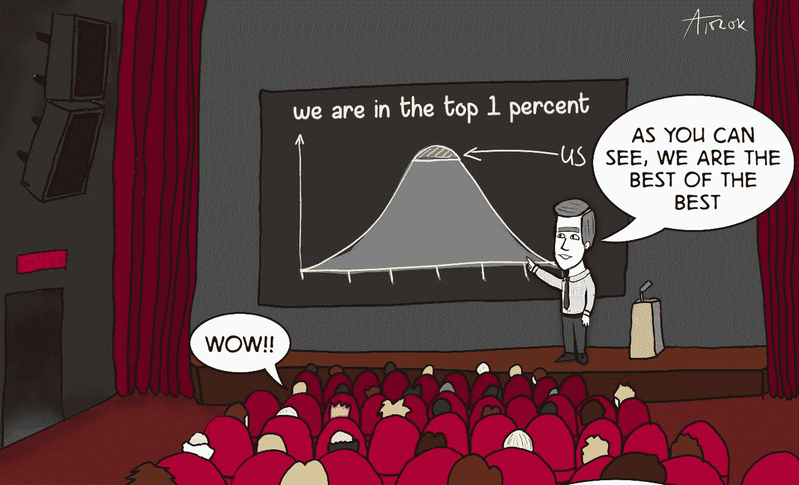

# 没有统计学知识可以做数据科学吗？

> 原文：<https://medium.datadriveninvestor.com/is-there-data-science-without-statistics-70d671649dc3?source=collection_archive---------10----------------------->

## 随着机器学习的自动化，这个领域变得更加开放，有人可能会问我们将来是否需要统计技能

## 自动化机器学习的世界

今天，如果你想成为一名数据科学家，有无数的课程承诺快速进入数据领域。当然，没有人相信一个人可以在几周内了解一个复杂领域的来龙去脉，这个领域需要数学/统计、软件工程方面的硬技能，以及 R&D 开发方面的软技能。然而，由于自动化，培训机器学习技术人员似乎是明智的:这些人拥有释放数据分析能力的工具和 API 的知识。

> 由于自动化，培训机器学习技术人员似乎是明智的

其实我也在尽量多的使用这样的工具。原因是自己实现这些方法通常是没有意义的，并且容易出现错误。

A basic understanding of statistics is required to understand the top 1% of jokes. Comic strip with permission from [@the_data_department](https://www.instagram.com/the_data_department/)

## 自动化数据科学的现实

尽管如此，我仍然认为缺乏统计学知识是求职者在面试中的一个危险信号。尽管工具做了大量的繁重工作，我们仍然需要我们的专业知识来避免分析和建模中的常见错误。

假设你的任务是决定你的产品是否被市场接受。您有几个指标显示了营销活动、销售流程以及客户保持率和客户流失率的代表。一个常见的错误是去寻找支持自己先入之见的结果。是的，许多工具都有内置的修正，但是，除非你一次测试所有的假设，否则系统无法检测你是否需要修正。另一个相关的错误是挑选:当你选择支持你的假设的样本时。这可能更加危险。比方说，你把它带给一个专家来咨询你的结果，如果这个专家对你的数据还没有一些了解，那么讨论就已经是有偏见的，并且可能是无用的。

缺乏统计知识在 ML 管道的后期也是危险的。虽然拟合 ML 模型可以像调用 *fit* 函数一样简单，但是为工作选择正确的模型需要理解不同的模型*如何对数据建模*。我经常看到人们使用经验法则“XGBoost 用于结构化数据，神经网络用于非结构化数据”。虽然这是一个有用的启发，但它远不是完整的解决方案。XGBoost 很酷，我经常使用它，但是要特别注意我打算部署它的领域。我们首先要考虑的是，训练+测试数据对未来的潜在结果是否有足够的描述性。我们必须记住基于树的算法是如何工作的，以及为什么它们在外推问题上很弱。在更一般的层面上，这是一个拟合不足的例子:我们的模型未能捕捉到未来事件的方差。虽然检测过度拟合通常很容易，但不足拟合是隐藏在细节中的魔鬼。当我们处理非结构化数据时，欠拟合问题更加普遍。特别是，因为欠拟合不能通过建立一个具有更多神经元的更深层次的网络来直接解决。

> 虽然检测过度拟合通常很容易，但不足拟合是隐藏在细节中的魔鬼。

通常的方法是在生成的模型上测试不同的假设，这通常需要了解数据的统计细节，例如它的分布或由输入的小差异(即噪声)引起的输出的预期方差。

## 未来数据科学家的必备技能

我坚信数据科学自动化工具在不久的将来会变得更加强大。这是整个领域都需要的东西。缺乏工具和自动化意味着今天的公司必须为每一个洞察付出高昂的代价。我这里说的不是 Deepmind，而是比如一个卖葡萄酒的区域性网店。我们需要降低数据科学的成本，让每个人都能享受到它的好处。在这些案例中，我清楚地看到了*机器学习技术人员*的位置。对于这一点，在不了解基本假设的情况下，学习线性回归的公式就足够了。

我喜欢在每周文摘中阅读人工智能如何以 99%的准确率解决以前不可能完成的任务。生活在一个能感受到科学进步的时代真好。另一方面，99%并不总是足够的。那 1%的人有谁敢说模型是错的？在许多应用程序中，由于速度/成本/可伸缩性，这甚至不可能是人类对 AI 做出的每个决定进行双重检查。因此，在构建这些模型时，我们应该有具备重要知识的人员在场。当我们打算使用的模型对人们的生活有严重和直接的影响时，这种关键知识在任何时候都是需要的，在 R&D 也是需要的，在那里我们可能还不知道新产品的确切效果。

> 99%并不总是足够的。那 1%的人有谁敢说模型是错的？

 [## 一瞬间学会数据科学！？数据驱动的投资者

### 在我之前的职业生涯中，我是一名训练有素的古典钢琴家。还记得那些声称你可以…

www.datadriveninvestor.com](https://www.datadriveninvestor.com/2020/07/23/learn-data-science-in-a-flash/) 

进入专家视图— [**订阅 DDI 英特尔**](https://datadriveninvestor.com/ddi-intel)