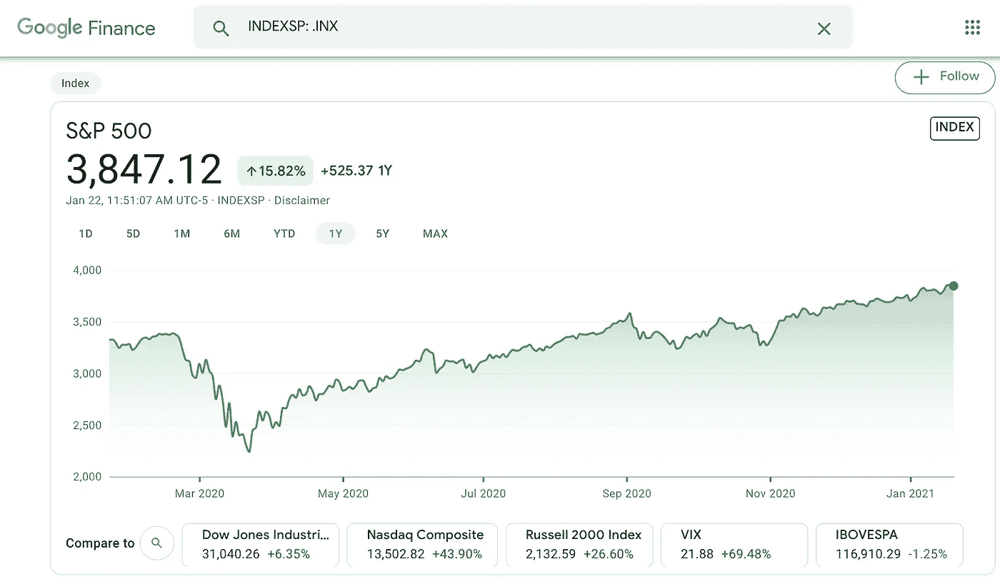
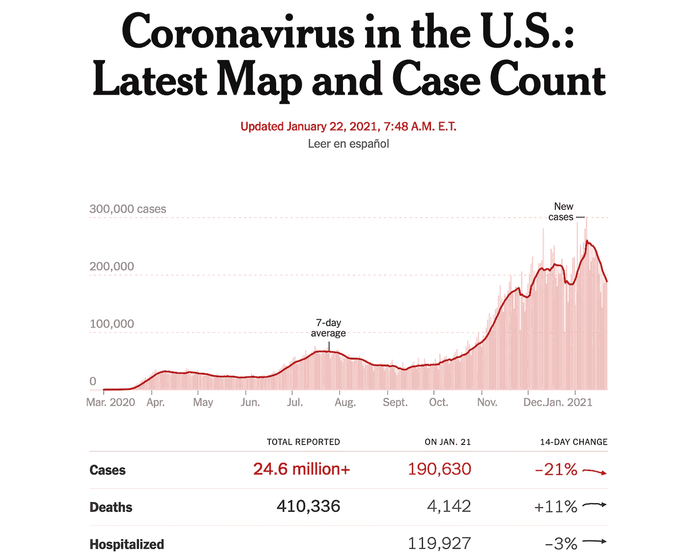
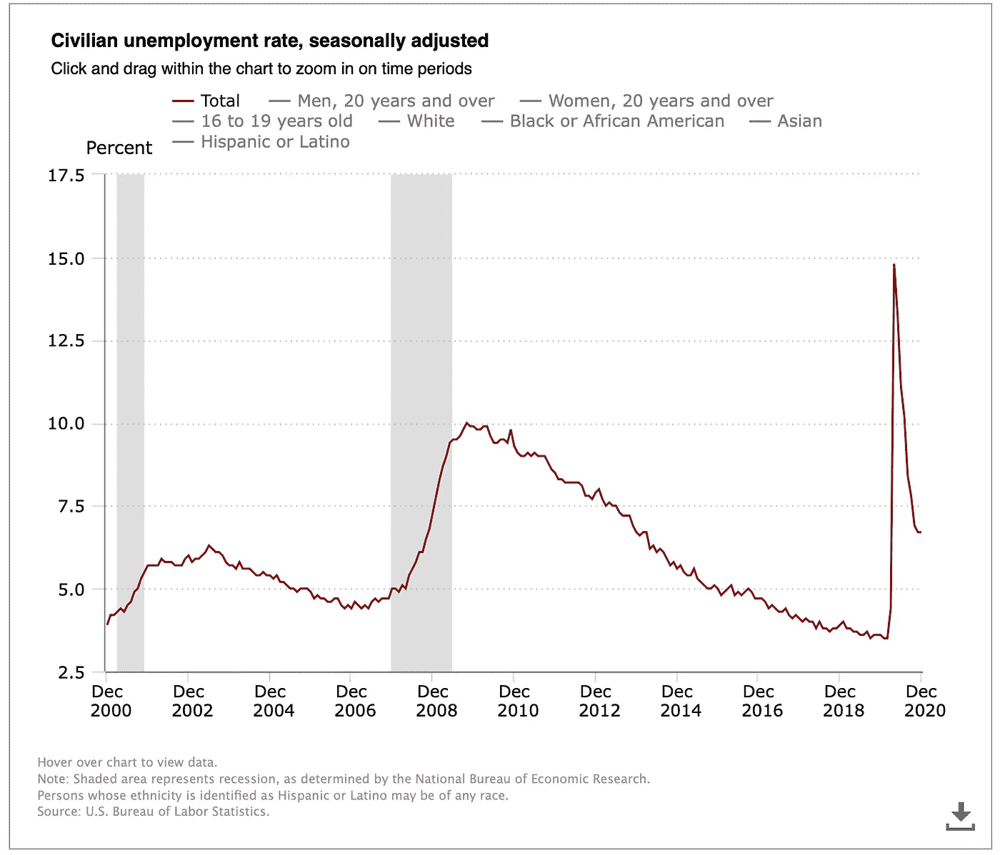
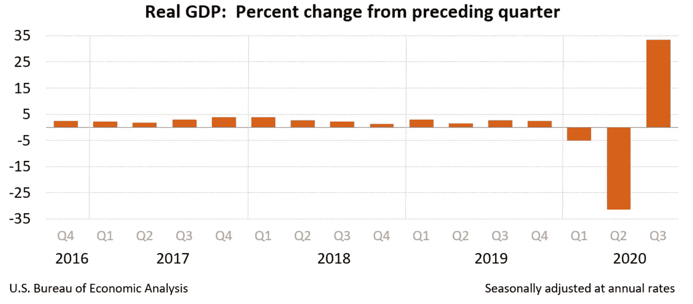

# 这股市疯了吗？？？

> 原文：<https://medium.datadriveninvestor.com/is-this-stock-market-mad-fe0f777109c6?source=collection_archive---------8----------------------->

## 对投资的思考现在我们有了一位能干的首席执行官…

Photo by [engin akyurt](https://unsplash.com/@enginakyurt?utm_source=unsplash&utm_medium=referral&utm_content=creditCopyText) on [Unsplash](https://unsplash.com/s/photos/crazy?utm_source=unsplash&utm_medium=referral&utm_content=creditCopyText)

乔·拜登总统。只需说几次或两百次。听起来很棒，不是吗？科学和理智终于回到了椭圆形办公室，回到了领导层，回到了管理我们国家的轨道上。

但问题是。前任总统和他的犯罪集团已经造成了损害。拜登说，他预计疫情的死亡人数将超过 50 万。由于失业率再次飙升，经济陷入困境。[拜登接手的是二战以来最大的预算赤字和最高的债务水平。](https://www.factcheck.org/2021/01/what-president-biden-inherits/)

然而，市场越来越高。市场疯了吗？？让我们看看，好吗？

# **1。** **当前股市……**

这是过去一年的 S&P500 股票指数的价格图表。这是在一场可怕的病毒性疫情病毒中发生的，这场病毒在不到一年的时间里杀死了近 50 万美国人。全世界有 200 万人死亡。这意味着世界上最强大的国家，名义上是美国，尽管只有世界人口的二十分之一，却有世界上四分之一到五分之一的人死于冠状病毒。

S&P500 Stock index per Google/Finance (Author is using the web image under the Fair Use Doctrine)

尽管冠状病毒病例也在飙升，但股票市场仍在飙升，如下图所示。

Daily coronavirus case rate from NYT (Author is using the web image under the Fair Use Doctrine)

有人有信心，有信心，认为市场对一篮子美国公司进行了适当的估值吗？

考虑到冠状病毒股票市场在 2020 年下半年的出色表现，我写了几篇冷静、深思熟虑、见解深刻的文章。

 [## 疯狂的股价有意义吗？

### 根据诺贝尔奖得主罗伯特·席勒的说法，他们确实…

medium.com](https://medium.com/datadriveninvestor/insane-stock-prices-make-sense-c04c94587320)  [## 这个市场要完蛋了！！！我现在应该投资吗？

### 对市场和投资的思考

medium.com](https://medium.com/datadriveninvestor/this-markets-gonna-die-should-i-invest-now-9084614439c0) 

我确实研究了一位诺贝尔经济学奖得主的不同观点，他自己的分析让他认为，尽管我进行了双重分析，但市场相对于其他资产实际上是公平估值的。我投票取消他的诺贝尔金饰品，但我有什么资格质疑他的分析？阅读上面两篇文章中的第一篇，深入了解罗伯特·希勒的数据、分析和观点。

# **2。** **当前经济中的几个图表……**

下一张图表显示了前两次衰退和市场崩溃，用灰色竖线标出——网络泡沫和房地产崩溃。你会看到每一次失业都在飙升。房地产崩盘是美国自 20 世纪 30 年代大萧条以来经历的最痛苦的失业状况。在那些认为房价永远不会下跌的人群的智慧所导致的崩溃中，有什么是撑杆跳高的呢？今天的失业是由疫情造成的，而由我们群众的智慧选出的总统的无能加剧了失业。

Civilian unemployment rate, 20-year chart. The author is using this website image under the fair use doctrine.

这些失业数字对经济的影响是立竿见影的。当失业率飙升时，该国的国内生产总值崩溃了。当失业率从最严重的峰值有所缓解时，GDP 以相反的方向恢复，如下图所示:

U.S. Gross domestic product 4-year chart. The author is using this website image under the fair use doctrine.

关于 GDP 图表的最后两个条形，需要指出一些重要的东西。确保我们知道图表显示的是什么:条形图代表与上一季度相比的百分比变化。

与 2019 年第四季度相比，2020 年 Q1 的销量下降了约 5%。2020 年的 Q2 比之前已经很低的 Q1 下降了 30%。

因此，第三季度的增长是从 Q2 深处开始的。不要被最后一小节的幅度所迷惑。这一增长并不意味着经济回到正轨。我们远低于这个水平。

回想一下，当你下降一个给定的百分比时，你需要超过这个百分比才能回到你之前的位置。因此，你需要 30%以上的涨幅才能从 Q2 的崩盘中回到 Q1 的底部。

举一个例子，如果你的商店销售额下降了 50%，如果与上一季度相比下降了一半，你的下一季度销售额需要翻一番才能恢复到危机前的水平。你需要销售额增长 100%才能从 50%的暴跌中恢复过来。同样，你需要销售额增长 66.7%，才能从 40%的暴跌中恢复过来。你需要销售额增长 43%才能从 30%的暴跌中恢复，等等…

这有意义吗？所以，这意味着我们的经济远没有达到疫情之前的水平。股市在错误的星球上。

这里只是用一点代数来说明这在数学上是如何工作的。你可以把得出的方程代入 excel 或者手工做，来确认我上面写的内容(或者直接跳过这个——没有必要，除非你不被我上面说的说服)。

让我们称 X 为你在周期 1 的销售额或市值等，Y 代表下一个周期 2，Z 代表上一个周期 3。

y 看到 m 相对于前一时期的 X 有所下降:

Y = X — (m*X) = (1-m)*X

要使 Z 回到 X 中的值，我们必须从 Y 中看到 n 增加了多少？

Z = (1+n)*Y = X

(1+n)*(1-m)*X = X

1+n = 1/(1-m)

n = [1/(1-m)] — 1

可以代入 m=0.5(对于 X 到 Y 之间 50%的下降)。你看到你需要一个 n=1 (100%)的增量，使 Z 与 X 匹配，回到你开始的地方。

# **3。** **拜登的计划……**

拜登的疫情计划和经济计划深深交织在一起。经济主要是由个人组成的，你和我，出去买食物，化妆品，汽车，我们日常生活需要和想要的东西。我们经济的三分之二是由个人购买驱动的——这支持了试图满足这些购买需求的公司。

正如你在上面的图表中所看到的，当我们的集体和个人购买力下降时，经济也会下降。

如果你想提振经济，你必须提振个人买家。全部都是。没有涓滴幻想。把钱给所有的人，是的，这也意味着给你不喜欢的人。如果你想回到你所拥有或工作的公司，那么你需要所有人的口袋里有钱，不管你是否赞成他们。不管沉不沉，我们都在这艘船上。

拜登的第一要务是控制疫情——这样我们就可以畅通无阻地出去买东西了。是的，修复疫情和修复经济是一回事。所以这意味着我们闭嘴，戴上我们该死的面具。这意味着我们卷起袖子开始接种疫苗。成长。在个人自由之前考虑国家。

接下来的部分很关键，因为它一石多鸟。拜登有重大计划来升级我们的各种国家基础设施，特别是交通。这一对现代绿色交通基础设施的投资将让数百万人就业并启动经济，同时直接解决气候变化问题。这是一项两万亿美元的投资，涉及美国的广大地区，包括:

*   重建交通基础设施，从道路和桥梁到电网和宽带互联网。
*   将僵化的汽车行业转向制造电动汽车和充电站。
*   升级我们国家的公共交通系统，实现零排放
*   加快我国发电行业向可再生能源的转变。
*   通过升级我们所有的房屋和建筑来节约能源。
*   建造新的可持续住宅。
*   走向可持续农业和保护。

这些代表了数百万份高薪工作。这些工作将刺激经济。这些工作必须分配给所有人，甚至是你不喜欢的人。如果有人落在后面，那么这些人最终会拖累经济。这是因为以这样或那样的方式，我们都直接或间接地为每一个贫困的人付出了代价。每个人都必须受益，否则没有人受益。

这些基础设施政策将由皮特·布蒂吉格制定和指导，我在这里提到过他:

 [## 但是交通部长的职位被选中了

### 拜登提名他的主要对手之一市长皮特…

medium.com](https://medium.com/predict/buttigieg-tapped-for-transportation-secretary-4cba2c8479d) 

这些计划的总体好处远远超过任何负面影响。也有负面影响。在下一节中，我们将只关注一个可能的负面因素。尽管有这些担忧，让我们支持拜登的计划，让美国，我们所有人，再次站起来。

# **4。** **拜登计划可能对股市产生的影响……**

我们需要拜登的计划，我们需要它为我们所有人服务，让我们重新回到清洁、可再生能源驱动的经济中，为我们的孩子和子孙后代带来光明的未来。

是的，任何雄心勃勃的计划都有一些成本和风险。

数万亿美元将被注入经济。当这种情况发生时，像股票这样的资产就会膨胀到远远超过其实际价值。

回想一下，去年 3 月股市暴跌时，特朗普非常愤怒。而不是他和他的政府对疫情的致命反应。不，他愤怒是因为他希望他亲手挑选的美联储主席采取更多措施来支撑市场:

 [## 特朗普对鲍威尔感到愤怒，希望美联储采取更多措施阻止股票下跌:报道

### 随着美国股市暴跌，唐纳德·特朗普总统本周再次攻击美联储董事长杰罗姆·鲍威尔

www.marketwatch.com](https://www.marketwatch.com/story/trump-furious-with-powell-wants-fed-to-do-more-to-arrest-stock-market-decline-report-2020-03-12)  [## 据报道，特朗普对股市因冠状病毒担忧而暴跌感到愤怒

### 美国消费者新闻与商业频道 2020 年 2 月 26 日皮帕·斯蒂文斯据报道，唐纳德·川普总统对股票暴跌感到愤怒，认为…

www.msn.com](https://www.msn.com/en-us/money/markets/trump-reportedly-furious-about-stock-market-plunging-on-coronavirus-fears/ar-BB10o1pg)  [## 当冠状病毒导致股市暴跌时，特朗普崩溃了

### 星期一早上，股票市场急剧下跌，预示着自…以来最大的经济冲击

www.gq.com](https://www.gq.com/story/coronavirus-stock-market) 

下面是一张截图，显示了特朗普在 2020 年向经济注入了多少现金:

M1 includes funds that are readily accessible for spending. The author is using this website image under the fair use doctrine.

尽管经济形势严峻，股市还是顺从地随着现金过剩的调子走高。

不幸的是，同样的事情也会发生在拜登为疫情控制措施提供资金和升级我们国家的基础设施的合理和健全的决定上。

大量现金涌入经济，人为地吹大了所有泡沫之母，其后果必然是有代价的。迟早的事。(我倾向于更快)市场必须崩溃。我们至少要为去年市场的过度行为买单。市场将在 2021 年继续其非理性繁荣，持续时间越长，清算将越痛苦。

我的计划是继续投资。我是一个长期买入并持有的投资者，这意味着我知道我说的或希望的任何事情都不会对市场产生任何影响。它的行为是随机的，没有人，不管多聪明，有能力预测市场的行为。

我们的个人财务计划必须适应疯狂和长期的市场起伏和平静(想想日本的“失去的十年”)，必须适应我们对短期现金的需求，以及我们对储蓄和长期投资的需求，以满足我们家庭未来的需求和退休。

# **5。** **谢谢……**

感谢您的阅读。请分享。如果你喜欢这篇文章，请在这里看看几个相关的故事:

 [## 这个市场要完蛋了！！！我现在应该投资吗？

### 对市场和投资的思考

medium.com](https://medium.com/datadriveninvestor/this-markets-gonna-die-should-i-invest-now-9084614439c0)  [## 这个市场是 F@#&*d！！！出口在哪里？？？

### 对市场和投资更冷静、更全面的思考

medium.com](https://medium.com/datadriveninvestor/this-market-is-f-d-wheres-the-exit-46c551e1b935)  [## 这个市场被操纵了

### 展示了这场持续 7 个月的疯狂反弹背后的原因

medium.com](https://medium.com/datadriveninvestor/this-markets-being-manipulated-8c5c0d8db7f4)