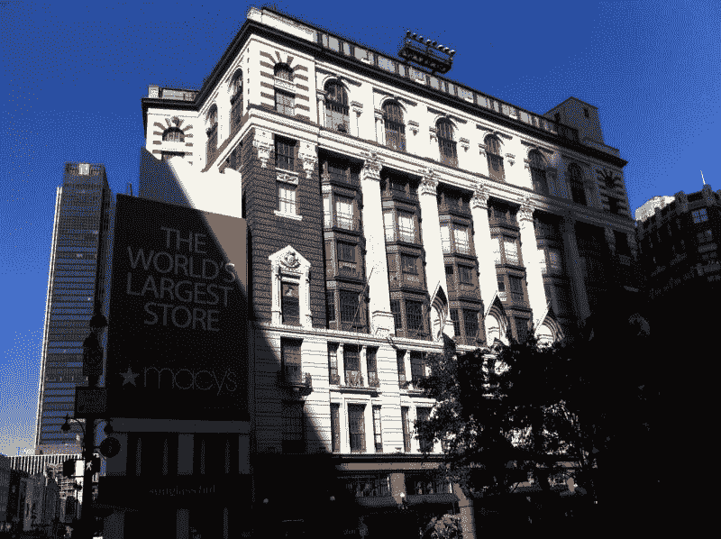
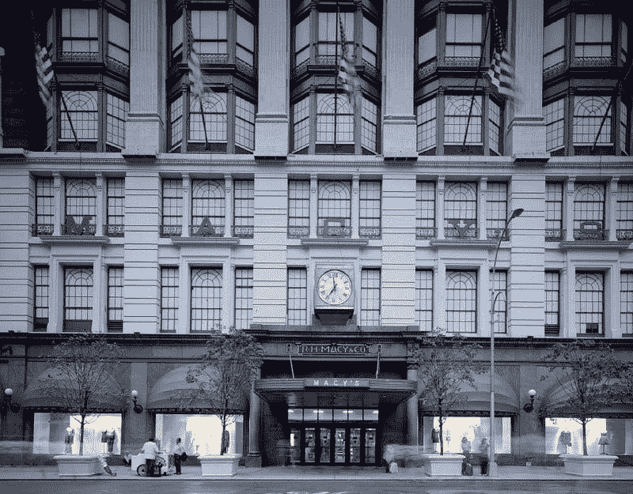
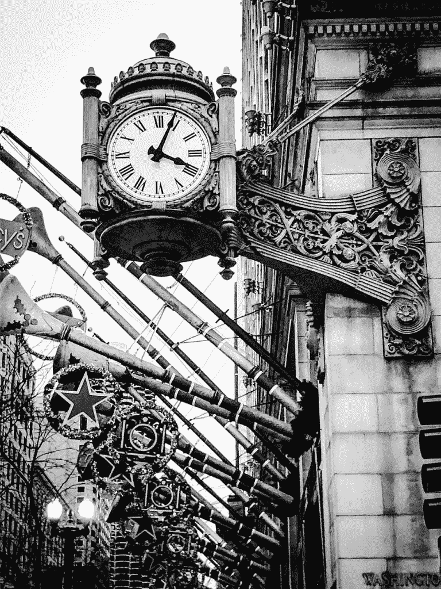
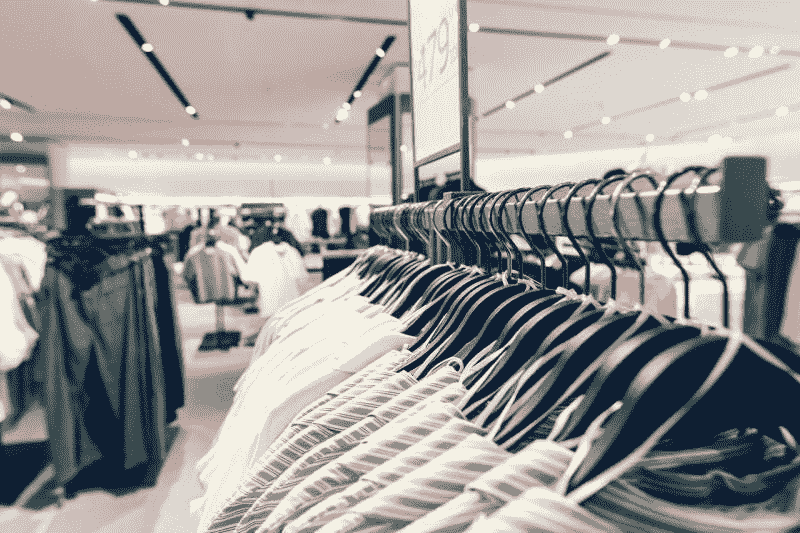
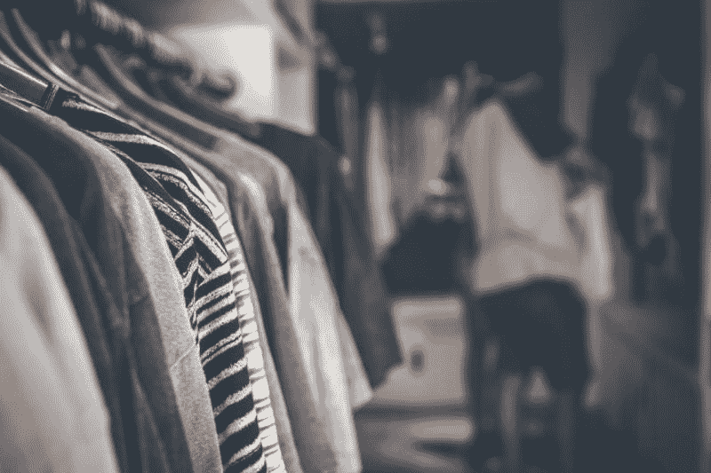
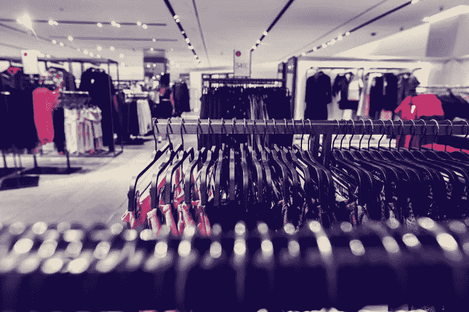

# 这是梅西百货的末日吗？—市场疯人院

> 原文：<https://medium.datadriveninvestor.com/is-this-the-end-of-macys-market-mad-house-a04d067802d8?source=collection_archive---------13----------------------->

冠状病毒可能是梅西百货公司的末日。值得注意的是，他们会把梅西百货从美国消费者新闻与商业频道的标准普尔 500 指数上扔下去。

在冠状病毒爆发期间，梅西百货的股价从 2020 年 3 月 2 日的 12.99 美元跌至 2020 年 4 月 2 日的 4.66 美元。然而，2020 年 4 月 6 日，梅西的股价回升至 5.54 美元。

令人震惊的是，梅西百货的市值从 2019 年 4 月 2 日的 76.05 亿美元跌至一年后的 14.88 美元。此外，梅西百货的市值从 3 月 2 日的 40.22 亿美元降至 2020 年 4 月 2 日的 14.88 亿美元。

因此，标准普尔(S&P)将把梅西百货从吹嘘的标准普尔 500 移到其小型股 600 指数，*雅虎财务*。事实上，雅虎！估计梅西百货在 2019 年 3 月 31 日至 2020 年 3 月 31 日期间股价下跌了 70.6%。

因此，梅西百货在一个月内损失了三分之二的价值。而且，在冠状病毒爆发之前，梅西百货就已经麻烦不断了。

# 冠状病毒如何杀死梅西百货

因此，一个拥有 871 家商店的零售商；该公司 2020 年 1 月 31 日报告的季度收入为 85.77 亿美元，2020 年 4 月 2 日的股价为 4.66 美元，市值为 14.88 亿美元。

梅西百货的命运显示了冠状病毒是如何将零售业的末日推向可怕的新高度的。分担梅西痛苦的一个群体是它的员工。哥伦比亚广播公司(CBS)这家百货公司的传奇人物将让其 12.5 万名员工中的大部分人暂时休假。

梅西百货面临的一个明显的危险是，在疫情结束后，它的许多顾客将永远不会回来。梅西百货的另一个问题是，它的许多员工不会回来。

因此，梅西百货将面临重新开业、重新进货和重新配备员工的费用，因为它的店面没有产生收入。此外，梅西百货还必须支付租金、水电费、税收和其他与商店相关的费用。

 [## 投资区块链前要问的三个简单问题(也是一个困难的问题)|数据…

### 现在是了解区块链的最佳时机。不同货币之间的增长率，比如…

www.datadriveninvestor.com](https://www.datadriveninvestor.com/2020/03/12/three-simple-questions-and-one-difficult-one-to-ask-before-investing-in-a-blockchain/) 

梅西百货可以通过永久关闭店铺来削减开支。然而，梅西百货仍将面临清空和关闭已关闭门店的费用。此外，在不景气的房地产市场上，那些空荡荡的商店可能没有买家。

# 梅西百货能生存吗？

梅西百货有办法继续销售商品、赚钱和生存。

我认为梅西百货可以在**亚马逊(NASDAQ: AMZN)、** **、易贝(NASDAQ: EBAY)、阿里巴巴(NYSE: BABA)、Overstock.com(NASDAQ:OSTK)、**或其自己的网站上出售关闭的商店的商品。此外，梅西百货可以将一些关闭的商店变成“履行中心”

解释一下，员工可以接收网上订单，从货架上取下商品，然后打包发货。此外，梅西百货可以通过 Instacart、 **Grubhub(纽约证券交易所股票代码:GRUB)、** Postmates、亚马逊、 **Lyft(纳斯达克股票代码:LYFT)** 或**优步(纽约证券交易所股票代码:UBER)** 提供当天送达服务。

# 数字清算销售能拯救梅西百货吗？

因此，梅西百货可以持有“数字清算销售”,并遵守就地安置订单和社交距离。因此，梅西百货仍然可以从那些关门的商店里的所有商品中赚钱。

重要的是，数字清算销售可以让梅西的员工继续工作，并带来一些收入。我不知道梅西百货能否从数字清算销售中赚到足够的钱来生存，但有收入总比没有收入好。

我怀疑数字清算销售可能有一个优势。梅西百货可以雇佣更少的员工，减少雇佣费用。此外，梅西百货可以付给从事销售工作的员工更少的钱。

# 梅西百货能赚钱吗？

在冠状病毒之前，梅西百货赚了些钱。例如，截至 2020 年 1 月 31 日的季度，梅西百货的收入为 85.77 亿美元，毛利润为 33.1 亿美元。

此外，梅西百货在同一天报告了 3.4 亿美元的季度共同净收入和 5.6 亿美元的营业收入。令人印象深刻的是，梅西百货上一季度的运营现金流为 14.36 亿美元，期末现金流为 380 美元。

不幸的是，我认为梅西百货缺乏生存的资源。值得注意的是，截至 2020 年 1 月 31 日，梅西百货仅有 6.85 亿美元的现金和短期投资。然而，梅西百货在同一天报告了 51.88 亿美元的库存。不幸的是，大部分库存都被锁在商店里，积满了灰尘。

最后，梅西百货报告称，截至 2020 年 1 月 31 日，该公司可借入的总资产为 211.72 亿美元。相反，梅西百货同日公布的总负债为 90.45 亿美元。

# 谁能拯救梅西百货？

梅西百货面临的一个问题是以合理的利率借钱。更大的问题可能是找到贷款人。我怀疑在今天的商业环境下，大多数贷款人会拒绝给梅西百货一分钱。

一个潜在的救星是美国的美联储，它可以向陷入困境的零售商提供无息或低息贷款。然而，我不知道这种信贷额度是否合法，也不知道这种贷款在政治上是否可行。

另一个解决方案是美国财政部；或者美联储，来保证梅西的工资，支付梅西的员工，直到疫情冠状病毒结束。美联储付得起员工的工资，因为它能创造货币。

美联储每印一美元或扩大信用，就会创造出货币。因此，理论上，美联储可以无限制地向梅西百货这样的公司发放贷款。

引人注目的是，英国政府将支付英国雇员 80%的工资。因此，英国工人每月最多可领取 2160 英镑(2672.02 美元)。为了澄清，保守党政府将工资支出限制在每月 2700 英镑(3340.02 美元)。

我怀疑，如果冠状病毒疫情和留在家里的命令继续下去，我们可以在美国看到类似的计划。我相信这样的工资保证对于拯救美国经济和梅西百货这样的公司免于被遗忘是必要的。

# 梅西百货有什么价值？

在目前的情况下，我相信不可能确定**梅西公司的**价值。

梅西百货的价值是不可能确定的，因为我们不知道商店何时重新开业，也不知道顾客是否会回来。请记住，**亚马逊(纳斯达克代码:AMZN)** 在冠状病毒来袭之前就已经杀死了梅西百货。我怀疑梅西百货在冠状病毒事件后的销售额可能会远远低于疫情事件前的销售额。

有一点是肯定的；然而，我预测我们不会很快看到另一个梅西的红利。我预测梅西百货 2020 年 3 月 12 日支付的 33.775₵ a 股股息将是很长一段时间内梅西百货支付的最后一笔股息。

我认为投资者需要避开梅西百货，因为没人知道这家百货公司的传奇在冠状病毒时代会有什么样的未来。因此，我认为梅西百货现在是一只垃圾股，只有投机者才应该买。

*原载于 2020 年 4 月 6 日 https://marketmadhouse.com**[*。*](https://marketmadhouse.com/is-this-the-end-of-macys/)*