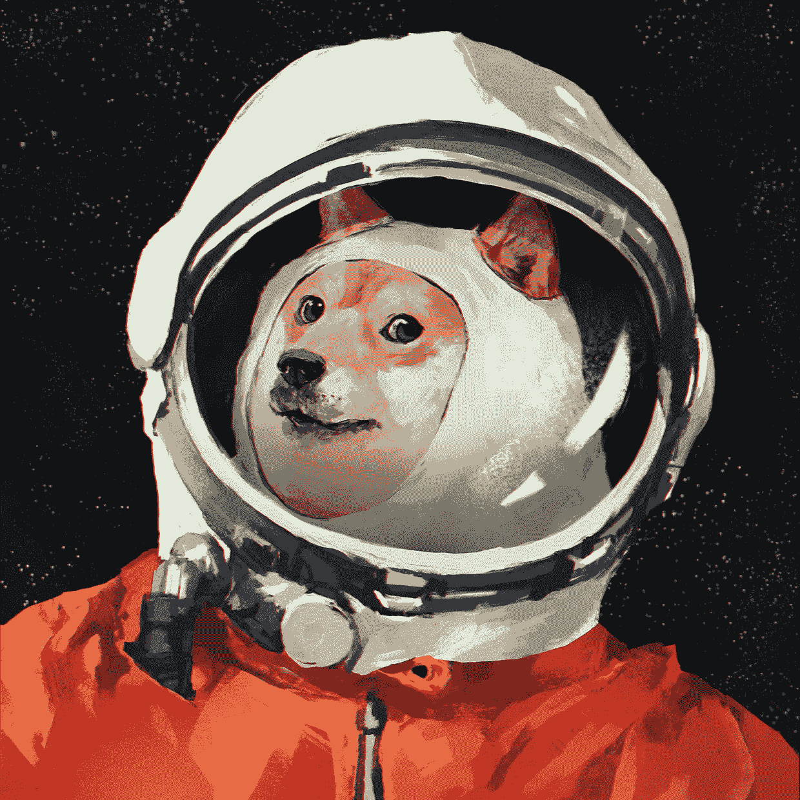
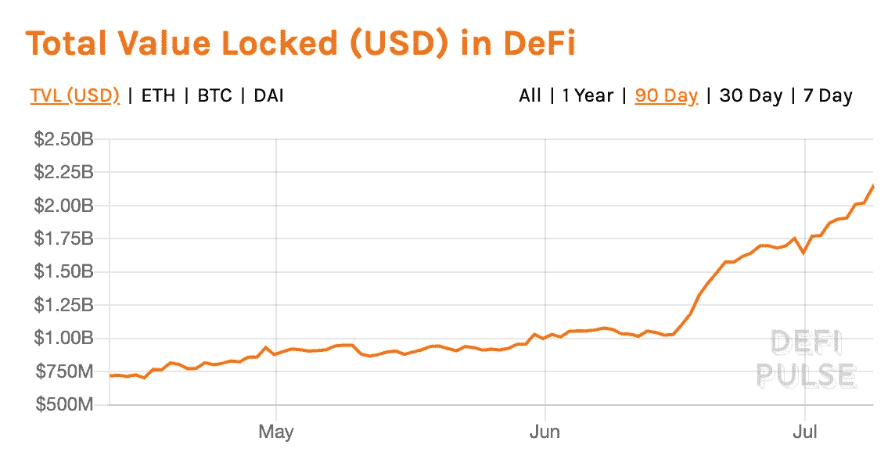
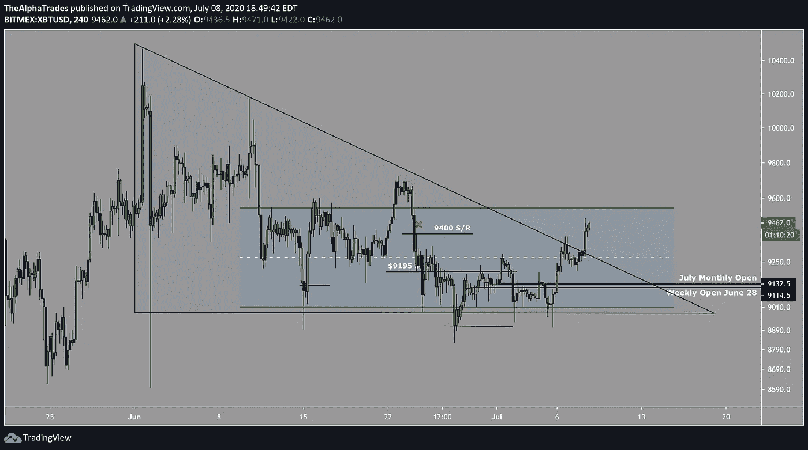
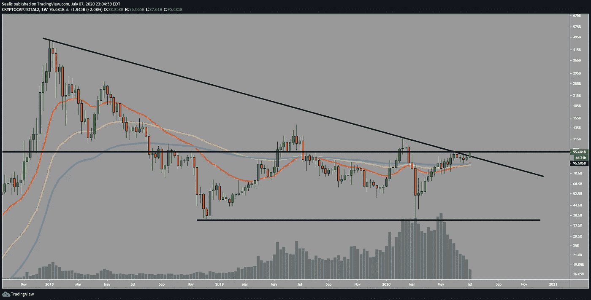
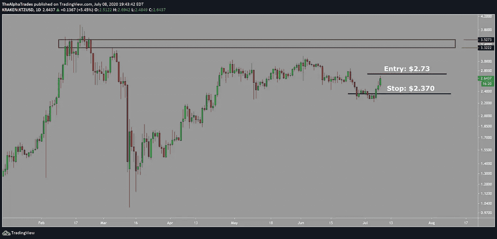
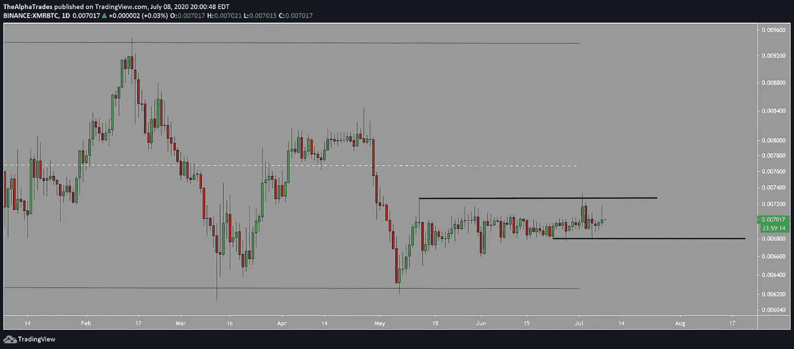
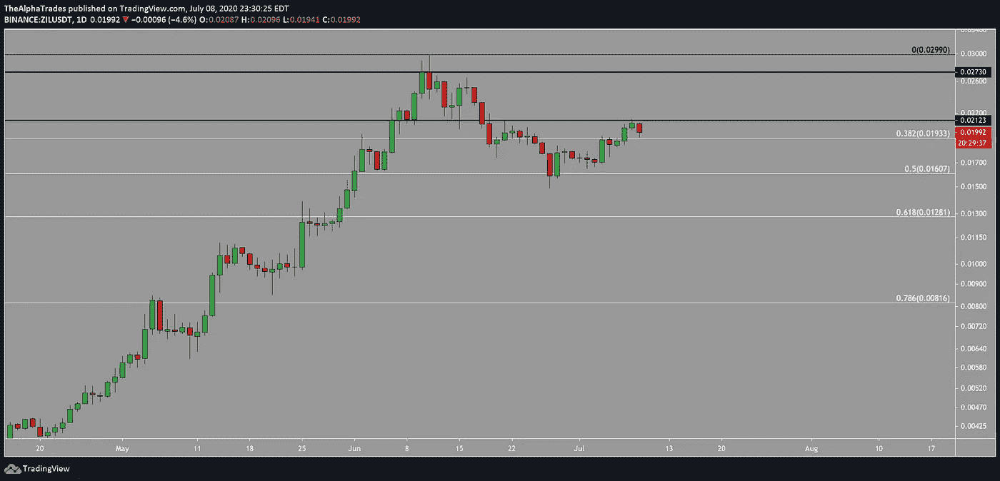
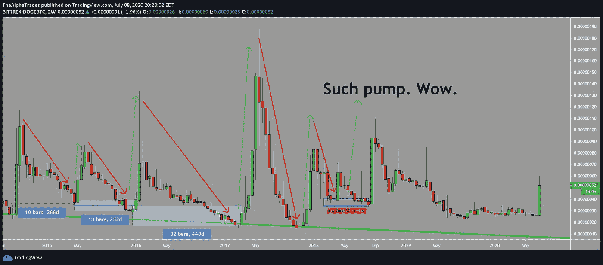
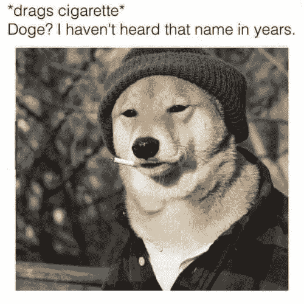

# 这是 Alt 赛季的开始吗？比特币需要持有 9000 美元| AlphaTrades

> 原文：<https://medium.datadriveninvestor.com/is-this-the-start-of-alt-season-bitcoin-needs-to-hold-9000-alphatrades-38d5bf458f1?source=collection_archive---------4----------------------->

## 多格科恩，齐利卡，莫内罗，特佐斯！🚀太棒了。

*被困在 Medium 的付费墙后面？* [*注册我们的 Discord 服务器*](https://discord.gg/a97qq2s) *查看#公告免费获取全文:*[*https://discord.gg/a97qq2s*](https://discord.gg/a97qq2s)

Doge to the moon; Image by Ilya Brovkin via Behance.

# 外卖:

1.  **比特币**持有支持。那我们就有更多的上升空间。
2.  在抖音商人的推动下
3.  **四种替代硬币设置**我们的优势会员会对我们免费赠送感到不满。

*欢迎阅读 AlphaTrades 的另一份每周加密货币简讯。如果你是来看周三视频的，请滚动到底部。否则，我们已经添加了时间戳，将引导您直接进入图表分析。我们在这里还谈到了股票和经济***。**

*[【复制我们的比特币主图，设置警报！】](https://www.tradingview.com/chart/vxxXy5t0/)*

# *每周节拍*

*DeFi 是这个词，它席卷了密码世界。[中国的](https://decrypt.co/34622/money-lego-defi-made-in-china)也在其中。约占 19 亿美元，DeFi 代表“分散金融”这是一种观念，你控制你的资产，而不是银行或政府，没有人能窥探你的生意。DeFi 已经超过了整个加密货币市场，一些项目在过去三个月里增长了 800%。*

* [## 区块链降低商品交易的风险和成本|数据驱动的投资者

### 我们将讨论 DLTs 在商品领域的当前实现，包括贸易和供应链管理…

www.datadriveninvestor.com](https://www.datadriveninvestor.com/2020/06/17/blockchain-reduces-risk-and-costs-in-trading-commodities/) 

[**中国区块链会谈继续**](https://www.trustnodes.com/2020/07/01/china-releases-commanding-heights-blockchain-plan) **:** 中国继续加大对区块链的研发力度，建立高端区块链研究机构，推出其“具有国际影响力的区块链开源社区”计划我们就不说剩下的流行语了。美国银行的人可能有更多的耐心，因为他们公开表示中国已经在加密货币竞赛中领先。

> “在采用 CBDCs 方面，中国似乎有明显的先发优势，无论是在时机还是在使用方面。”-美国银行分析师

严肃地说，他们似乎正在取得进展，将 CBDCs 纳入国家计划。

[**谷底**](https://www.coindesk.com/crypto-exchanges-volumes-bitcoin-volatility)**:**6 月份，主要加密货币交易所的交易量下降了 36%。无聊导致许多人放弃现货交易所，转而从事衍生品交易，在某些情况下，交易员可以利用高达 100 倍的杠杆。衍生品交易所的市场份额从 5%跃升至 37%。

[**Swiped**](https://research.binance.com/en/projects/swipe) :点对点交易所币安收购了 Swipe，这是一个流行的加密法定网关，允许加密货币轻松地作为法定货币使用。Swipe 提供加密钱包，可在任何接受 Visa 支付的地方使用 Swipe Visa 借记卡。它还具有一个公用事业令牌，这有助于保持低费用。这是件大事。

[**优惠待遇**](https://www.theblockcrypto.com/post/70511/ledgerx-consensys-tendermint-crypto-ppp-trump) : LedgerX、ConsenSys、Circle、BitFlyer、Blockfolio 和 Tendermint 是从 Trump 政府获得一些 PPP 减免的加密相关公司。

Total Value Locked in DeFi; Source: DeFi Pulse

# 比特币涨全船。

如果我们要对替代硬币做出任何预测，就不能忽视比特币这个领头羊。在我们开始之前，记住*这不是交易建议*；我们只提供教育和我们自己的意见。这份新闻简报会有点技术性，所以如果有任何不清楚的地方，请在[不和谐小组](https://discord.gg/a97qq2s)中发表评论或给我们发消息。

市场领导者 BTC 仍处于下降趋势。我们的分析师预计，如果 BTC 跌破趋势线，且未能再次测试该阻力位，则做空该股。自然地，如果从这里有一个明显的对该水平的再次测试，作为本地高点的支撑，我们将寻找做多的机会。

如果标准普尔 500 崩溃，BTC 可能会步其后尘。在这种情况下，减少一些筹码是明智的。但这留下了本周的问题 altcoin 空间到底发生了什么？

Bitcoin tests the monthly downtrend; Source: Alpha Trades

# DeFi 季节

第一项业务是向我们的优势社区大声疾呼，他们最近一直在*粉碎*alt 空间。尽管这些是交易量很小的资产，但我们很自豪地看到我们社区中有如此多的制图人才和普遍的冷静。

我们从付费会员那里收集了以下顶级创意。我们经常在炉边聊天，这当然有助于我们把握比特币市场的脉搏。这是我们一位会员的图表——基于每周的时间框架，加密货币的整体市值即将爆发。

Cryptocurrency market cap ready to break out of the triangle; Source: AlphaTrades

([时间戳:3:00](https://youtu.be/YpxQ7v5oLHw?t=180) ) [**泰佐斯**](https://tezos.com/)**【XTZ】**掬起大量的底面流动性。我们不会在这些简讯中兜售任何资产，但当我们看到一个好的设置时，我们会与您分享。XTZ 是一个真正的项目，在市场上有相当的流动性，你也可以在比特币基地交易。更安全的交易是在 2.73 的明确破位点做多，获利在 3.52 以下。

XTZ, Tezos trading setup; Source: Alpha Trades

([时间戳:4:42](https://youtu.be/YpxQ7v5oLHw?t=282) ) **Monero (XMR)** 从图表上标注的高低来看，XMR-BTC 保持在一个宽幅区间内。我们希望看到一个干净的突破 0.0074 以上的目标区间顶部。一个合理的止损将在 0.00675 灯芯以下。整天盯着图表是一件痛苦的事情，所以设置提醒，继续你的生活是明智的。

Monero trade setup from level to level; Source: Alpha Trades

([时间戳:6:04](https://youtu.be/YpxQ7v5oLHw?t=364) ) **齐力卡(ZIL-USDT)** 是我们的一个成员推荐的另一个设置。根据图表中的斐波纳契回撤水平，ZIL 有 50%的大幅回撤。如果收盘高于 0.0212，那就打开 0.272 的门。突破这一关口将增加创出更高高点的机会。

ZIL chart shows Fibonacci retracement levels; Source: Alpha Trades

([时间戳:8:55](https://youtu.be/YpxQ7v5oLHw?t=535))**Dogecoin(DOGE)**My*good*、[抖音](https://cointelegraph.com/news/dogecoin-gains-20-amidst-tiktok-pumping-challenge)和 shill-lords 是天作之合。我相信你已经看过[这个抖音的视频](https://twitter.com/onemanatatime/status/1280510626033553409?s=20)(免责声明，100%把那个视频当成笑话)。在过去的几天里，我们的 TweetDeck 一直充斥着 DOGE，这是一次令人捧腹的旅程。甚至彭博也掩盖了这种疯狂。自然地，无论是不是泵 n-dump，很多动作已经溢出到 altcoin 空间的其余部分。DOGE 上涨了约 35%，在过去 24 小时内交易量增长了 2000%。#DeFi，伙计们。

DOGE pumps regularly; Source: Alpha Trades

[【什么是 DeFi？】](https://blog.coinbase.com/a-beginners-guide-to-decentralized-finance-defi-574c68ff43c4)

下图追踪了我们的好孩子从 2015 年初到现在。通常，当 DOGE 触及底部绿色趋势线时，紧接着就是大规模的上涨。自 2017 年以来，趋势线有所支撑，但无论如何，我们预计 DOGE 在接下来的几天里会进一步下跌，然后再有一次大的飞跃。*过去的表现并不能保证未来的回报*，但是我们不会低估这些抖音罗宾汉式的交易者涌入替代硬币的能量。随着所有额外的 PPP 贷款资金四处流动，第二轮刺激[可能正在进行中，以及在这个隔离时代末期被压抑的挫折感，很多事情都可能发生。7 月 4 日可能已经过去，但我们认为焰火还没有结束。](https://www.reuters.com/article/us-usa-economy-stimulus-idUSKBN24818U)

这一价格变动对 DOGE 来说是一个积极的信号，因为多头已经挤出了近一年的流动性。

> "当我看到泡沫正在形成时，我会赶紧买入，火上浇油."——[乔治索罗斯](https://realmoney.thestreet.com/investing/stocks/why-would-a-billionaire-hedge-fund-manager-rush-to-buy-a-bubble--15351476)。

外面有很多机会，但要小心——如果这不是你的第一次竞技，请忘记使用 100 倍杠杆。我们仍然在从 COVID 危机中爬出来，场景与之前有很大不同(更不用说更多的监管，这应该是一件好事)。更好的时间投资是阅读[大傻瓜理论](https://www.investopedia.com/terms/g/greaterfooltheory.asp)，对这些项目做一些尽职调查，而不是仅仅[赌上你的刺激支票](https://seekingalpha.com/article/4354679-rise-of-robinhood-traders-and-implications)。

注意安全。

# 想免费试用 Advantage 两天吗？

[订阅 Discord 服务器](https://bit.ly/2KJ1oor)学习技术分析以及如何投资获利。询问 2 天的高级会员试用！

# 放弃

Alpha Trades，LLC 提供的信息无意用于制定任何财务决策，也不是购买、持有和/或销售特定产品、数字资产或 ICO 的邀约或建议。

访问我们的完整服务条款:[https://bit.ly/3faVeeV](https://bit.ly/3faVeeV)* 

***访问专家视图—** [**订阅 DDI 英特尔**](https://datadriveninvestor.com/ddi-intel)*