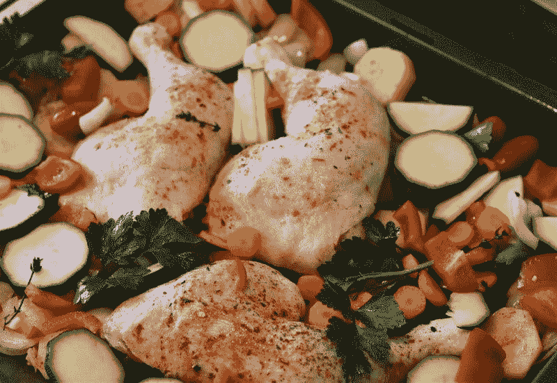
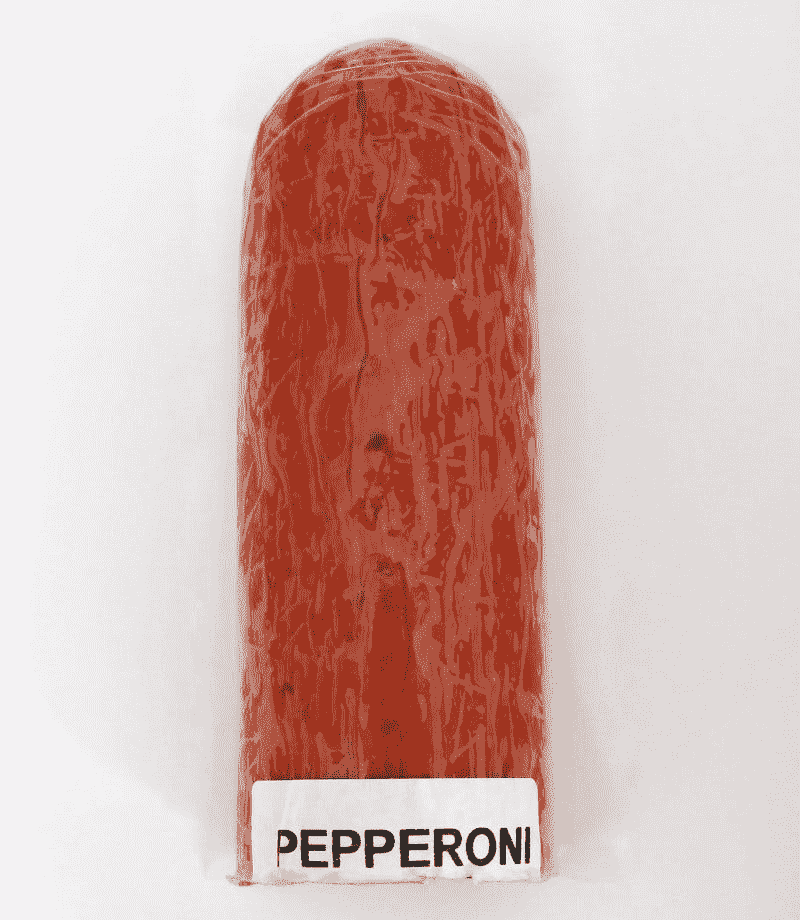
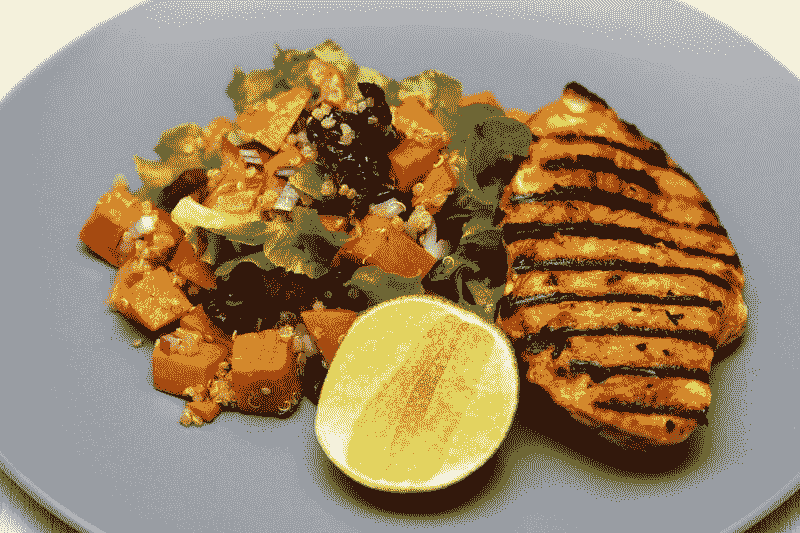
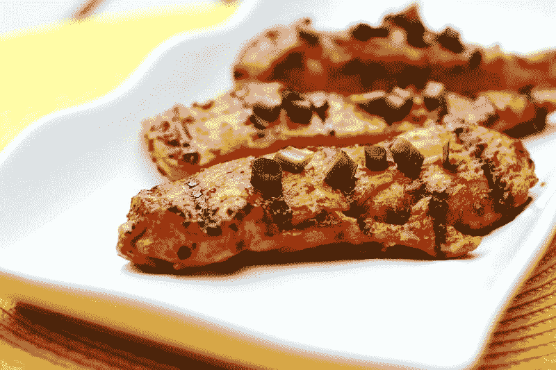
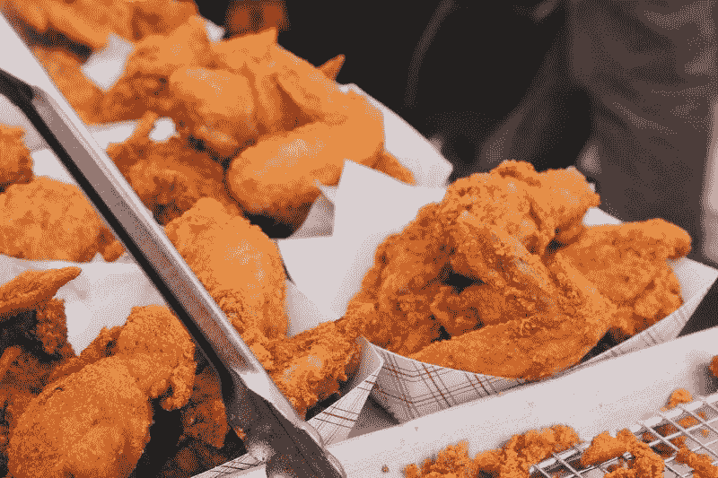
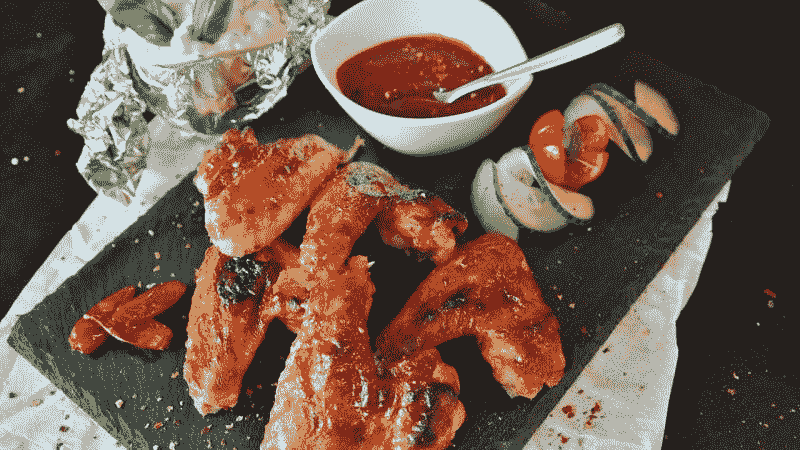

# 泰森食品靠肉赚钱吗？—市场疯人院

> 原文：<https://medium.datadriveninvestor.com/is-tyson-foods-making-money-from-meat-market-mad-house-3ccb5ea4b62?source=collection_archive---------14----------------------->

评估肉类替代品公司前景的一个好方法是考察肉类生产商，如**泰森食品(纽约证券交易所代码:TSN)** 。

泰森食品正在赚钱。2019 年 9 月 30 日，该公司报告季度毛利为 11.39 亿美元，收入为 108.84 亿美元。此外，泰森公布同一季度的营业收入为 6.04 亿美元，税后收入为 3.72 亿美元。

泰森食品公司的业务产生大量现金。该公司报告截至 2019 年 9 月 30 日的季度运营现金流为 9.78 亿美元。此外，2019 年 9 月 30 日的期末现金流为 7800 万美元。

因此，泰森食品本季度末的现金和短期投资为 4.84 亿美元，总资产为 330.97 亿美元。鉴于这些数字，我认为市场先生在 2019 年 1 月 20 日对泰森食品的估值是 89.86 美元。

# 泰森食品是成长股吗？

此外，肉类似乎是泰森的一项增长业务。Stockrow 估计泰森在截至 2019 年 9 月 30 日的季度收入增长率为 8.85%。

泰森食品在一个缓慢扩张的市场中发展迅速。Statista [预测](https://www.statista.com/statistics/189222/average-meat-consumption-in-the-us-by-sort/)美国年人均肉类消费量可能从 2017 年的 216.82 磅增长到 2028 年的 224.12 磅。

重要的是，Statista 发现美国最受欢迎的肉类是泰森的招牌产品；锅炉鸡。Statista 预测，美国年人均鸡肉消费量将从 2017 年的 91 磅增加到 2028 年的 94.3 磅。

 [## 一个企业在肚子上移动:如何照顾直觉|数据驱动的投资者

### 事实证明，直觉不仅仅是一种感觉。科学很清楚:你的直觉比你知道的更多…

www.datadriveninvestor.com](https://www.datadriveninvestor.com/2018/11/09/a-business-moves-on-its-stomach-how-to-make-allowances-for-gut-feelings/) 

因此，泰森食品是一家成长中的公司。特别是，泰森专注于美国的肉类选择:锅炉鸡。Statista 估计，普通美国人每周在家做两次鸡肉，每周在外面吃一次预煮的鸡肉。

我认为泰森公司处于有利地位，可以利用肉类消费的增加。泰森拥有的品牌有泰森、吉米·丹、希尔郡农场、希尔郡、棒球场、艾德尔斯、国家博览会、自然农场、李丽蕊、加洛·萨拉梅、博尼奇、赖特、布鲁斯公司、博索主席的保留地、Lady Aster、Wunderbar、Supreme Tender Pork、Barber Foods、Star Ranch Angus、ipb、Advance Pierre Foods、Russer、Nudges 和 Reuben。

# 泰森食品的增长是可持续的吗？

因此，泰森食品可能是一只成长型股票，即使肉类替代品的崛起，如超越肉类的。人们吃的肉越来越多，但反肉情绪正在增长。

肉类评论家声称；例如，畜牧业产生了 25%的温室气体排放，*《新食品经济》* [注](https://newfoodeconomy.org/climate-change-eat-less-meat-plant-based-impossible-burger-regenerative-ranching/)。与此同时，反肉类的信息来自“天使”营养学家戴安娜罗杰斯告诉*新食品经济*。

对肉类替代品的抵制越来越强烈；比如《超越肉类》和《不可能的汉堡》，NBC [注](https://www.today.com/food/there-s-growing-backlash-against-rise-fake-meat-here-s-t164597)。此外，越来越多的人开始接受纯素食主义，流行的纯素食餐馆和对纯素食主义批评者的强烈反对，福布斯杂志撰稿人珍妮特·弗格里夫透露。

全球数据[估计，2014 年至 2017 年间，美国自称素食者的人数从 1%增长到 6%。此外，好食品研究所和尼尔森声称，2017 年植物替代品的销售额增长了 17%，达到 35 亿美元。事实上，Forgrieve 估计 95%的美国超市出售植物性肉类替代品。](https://marketmadhouse.com/is-tyson-foods-making-money-from-meat/#41eda8ee2f2b)

# 政治对泰森食品公司是一种威胁吗？

因此，泰森和其他肉类制造商面临着日益敌对的政治气候和新的竞争对手。

是的，肉类生产商利润丰厚，影响力巨大。然而，在 20 世纪初，美国的酿酒商和酿酒商是强大而富有的行业。这并没有阻止少数激进分子实施禁令；1920 年全国禁酒。

我认为禁止吃肉是不可能的，但在 1900 年，大多数美国人认为禁酒是不可能的。仅仅 20 年后的 1920 年，禁酒令成为了美国的法律，由一项宪法修正案颁布。

# 禁肉要来了吗？

在 20 世纪早期，一个偏狭的清教徒少数群体以健康和道德为由提倡禁酒。今天，出于同样的原因，类似的少数人也在宣扬反肉情绪。

今天的清教徒把肉描绘成邪恶和不健康的，就像禁酒运动把酒描绘成邪恶和不健康的一样。同样，他们将酒精与不受欢迎的少数民族联系在一起；比如德裔美国人和爱尔兰人。一个世纪前。今天的势利小人将肉类与工人阶级白人、穆斯林、西班牙裔和非洲裔美国人联系在一起。

# 肉类节制即将到来

此外，我们将素食主义与受过教育的上流社会生活方式联系在一起。在 20 世纪初，他们将节制与中产阶级的清洁生活方式联系在一起。

他们还没有提到禁止肉类，但我认为有人推广这个想法只是时间问题。只有时间才能证明这个想法是否获得了政治支持。禁酒选出了三位共和党总统；沃伦·g·哈丁(俄亥俄州共和党)、卡尔文·柯立芝(马萨诸塞州共和党)和赫伯特·胡佛(加利福尼亚州共和党)。

因此，泰森食品可能面临一场生存的政治斗争。然而，政治威胁是理论上的，所以泰森现在可能是一个很好的投资。

# 泰森食品是好的分红股吗？

我认为**泰森食品(纽约证券交易所代码:TSN)** 是一只不错的分红股票。泰森公司计划在 2020 年 2 月 27 日派发 42₵季度股息。

股息从 2019 年 8 月 29 日的 37.5₵增长到 2019 年 11 月 27 日的 42₵。Dividend.com 报告称，泰森食品的股息在过去七年里一直在增长。

总体而言，泰森股份在 2020 年 1 月 20 日提供的股息收益率为 1.87%，年化派息为 1.68 美元，派息率为 24.77%。因此，我认为泰森是一个很好的股息股，但不是一个价值投资。

如果你欣赏肉类和股息，泰森是一个很好的股票调查。然而，这家公司可能会面临丑陋的政治潮流，这可能会摧毁其业务。

【https://marketmadhouse.com】原载于 2020 年 1 月 20 日**。**