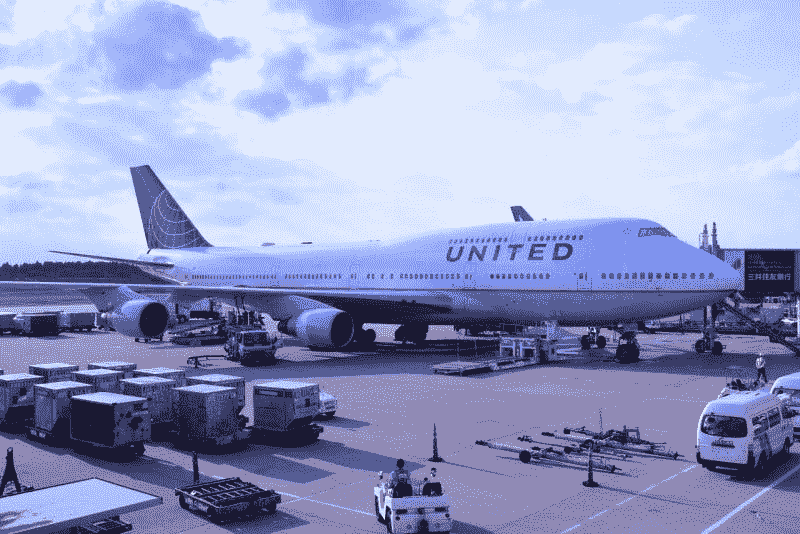
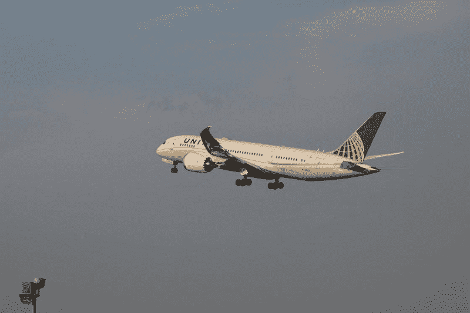
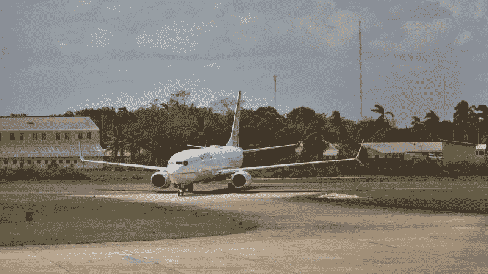
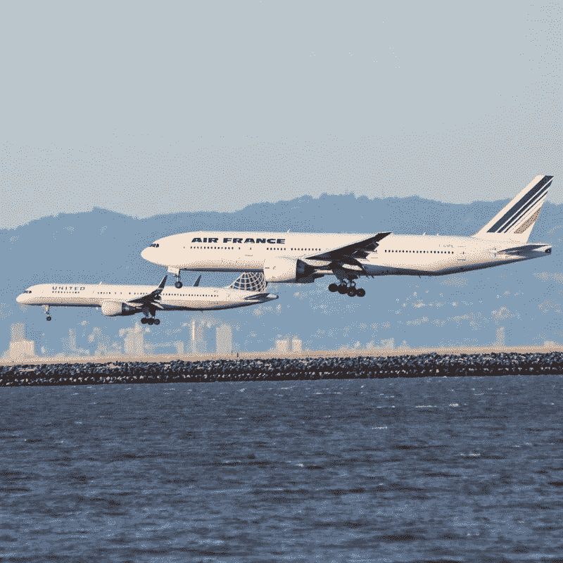
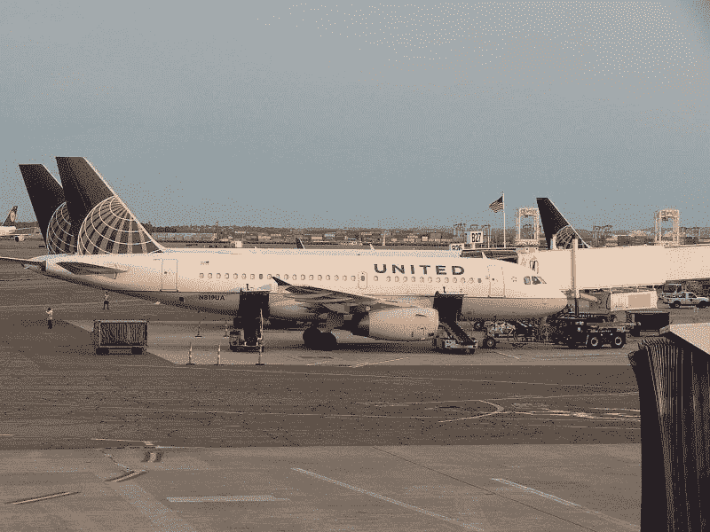
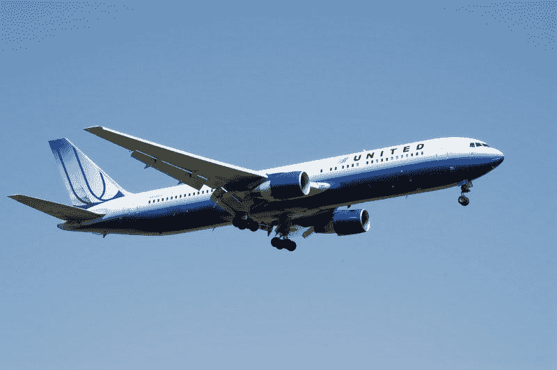

# 联合航空公司(UAL)死了吗？—市场疯人院

> 原文：<https://medium.datadriveninvestor.com/is-united-airlines-ual-dead-market-mad-house-9c321a428e96?source=collection_archive---------18----------------------->

联合航空公司(UAL)勉强生存。令人难以置信的是，**联合航空(UAL)** 仍在运营并计划一些新的航班。

然而，数据显示冠状病毒对**联合航空控股公司**来说几乎是致命的。例如，美联航计划在 2020 年 10 月的航班数量比 2019 年 10 月的、*少了 [40%，Points Guy](https://thepointsguy.com/news/united-airlines-bets-on-hawaii-mexico-beaches-in-october-schedule/)* 估计。

令人震惊的是，积分专家声称，美联航 2020 年 10 月的航班将比 9 月增长 34%。此外，美联航 2020 年 10 月的国内航班计划将是 2019 年 10 月的 33%。

此外，美联航 2020 年 10 月的国内航班时间表将不到 2019 年 10 月美国国内航班时间表的一半。美联航下个月将飞 2019 年 10 月国内航班计划的 46%。

# 令人难以置信的萎缩的联合航空公司(UAL)

从积极的方面来看，**美联航(纳斯达克代码:UAL)** 已经将计划于 2020 年 10 月进行的裁员削减了一半。不利方面[，据 *Axios* 估计，联合航空将于 2020 年 10 月 1 日](https://www.axios.com/united-airlines-layoffs-voluntary-leave-e4ae7003-9644-44cc-adca-4fea75993a65.html)裁员 16，730 人。美联航曾计划在 2020 年 10 月 1 日裁员 3.6 万人。

裁员是联合航空公司 7，400 名员工自愿离职的补充。总的来说，NPR 估计联合航空将裁员 25%。

Axios 声称，联合航空公司正试图通过给一些员工提供 12 个月的 25%工资加健康福利的假期来进一步减少劳动力。然而，联合航空公司可以提前 14 天通知这些员工。此外，美联航的空乘人员可以休 8 到 13 个月的健康假，但偶尔会搭乘航班。

令人不安的是，联合航空公司的管理层承认，唯一能防止进一步失业的是更多的联邦援助。一份联合新闻稿称:“T22 医疗法案 T23 的延长将是防止 10 月 1 日非自愿休假的一件事，并有望将对员工的任何潜在影响推迟到 2021 年初。”

详细来说，冠状病毒援助救济和经济安全(CARES)法案是国会在 3 月份通过的 2.2 万亿美元的救助计划。医改很快就会到期，在 2020 年 11 月 8 日大选之前，我预计国会不会通过另一个方案。

# 美联航能活下来吗？

**联合航空(UAL)** 是在赌一些人还想去旅行。联合航空公司正在安排更多飞往夏威夷、坎昆和 T2 巴亚尔塔港的航班。

曼联的希望是美国人厌倦了被关在家里，他们不顾一切地来到海滩，*积分盖伊*推测。此外，我认为 United 相信在家办公的人会意识到他们可以像在客厅工作一样轻松地在沙滩上工作。因此，我预测随着冬天的来临，许多在家工作的人将会迁移到气候温暖的地方。

 [## 押注旅游公司|数据驱动型投资者

### 秘密度假被搁置已经不是什么秘密了。航空公司和旅游公司实际上已经处于停滞状态…

www.datadriveninvestor.com](https://www.datadriveninvestor.com/2020/08/18/taking-a-bet-on-travel-companies/) 

# 传统的假期计划已经过时了

因此，联合航空公司赌上了传统假期计划的死亡。人们会在他们想去的时候去旅行，因为他们不再需要去办公室了。

有数据证明曼联的赌博是正确的。斯坦福大学经济学家尼古拉斯·布鲁姆估计，2020 年 6 月，42%的美国人在家工作。此外，这些工人中的大部分再也回不到办公室了。

纽约市合作组织估计，2020 年 8 月，因冠状病毒而在家工作的纽约人中，只有 8%的人回到了办公室。新闻报道显示，在家工作是美国企业界的新常态。

例如， **Pinterest(纽约证券交易所代码:PINS)** [将支付 8950 万美元](https://marker.medium.com/remote-work-is-killing-the-hidden-trillion-dollar-office-economy-5800af06b007)终止其未完工的旧金山高层办公空间的租约， *SF Gate* 报道。社交媒体公司 Pinterest 的首席财务官托德·摩根菲尔德告诉记者，该公司取消了租约，因为大多数员工都在家工作。同样， **Twitter(纽约证券交易所代码:TWTR)** 首席执行官托德·多尔西将让他的员工永久呆在家里。

因此，联合航空公司(UAL) 有一种方法可以利用在家工作和冠状病毒赚钱。美联航可以通过在 10 月和 11 月把所有不想呆在家里过冬的工人空运到气候更温暖的地方来赚钱。

# 商务旅行已死

然而，我认为这种迁移产生的旅行数量将只是商务旅行的一小部分。为了解释这一点，我猜想每一个在家工作的人飞往海滩，都会有几个商人参加 **Zoom(纳斯达克股票代码:ZM)** 会议。

去年，许多商人乘飞机去参加会议。现在，专业人士用数字方式开会。值得注意的是， **Zoom (ZM)** 用户数量从 2019 年 12 月的[1000 万上升到 2020 年 4 月的](https://marketmadhouse.com/is-zoom-nasdaq-zm-making-money/)超过 3 亿，商务应用声称。

史蒂夫·莱文(Steve LeVine)在 Medium 的 Marker*上写道:“办公室出差族——旅游业的主要利润中心——现在变成了居家旅行族，导致航空公司和酒店大屠杀。莱文估计，去年白领商务旅客占所有航空乘客的 60%至 70%。现在，这些旅行者唯一的旅行就是去他们的家庭办公室。*

# 美国联合航空公司(UAL)正在亏损吗？

**美国联合航空公司(UAL)** 季度收入从 2019 年 6 月 30 日的 114.02 亿美元降至 2020 年 6 月 30 日的 14.75 亿美元。

2020 年，美联航的季度营收从 2019 年 12 月 31 日的 108.88 亿美元降至 2020 年 3 月 31 日的 79.79 亿美元，再降至 2020 年 6 月 30 日的 14.75 亿美元。因此，Stockrow 估计，在截至 2020 年 6 月 30 日的季度中，联合航空的收入增长萎缩了 [-87.06%。](https://stockrow.com/UAL/financials/income/quarterly)

因此，联合航空公司在 2020 年 6 月 30 日报告了 16.37 亿美元的季度运营亏损。该季度运营亏损从 2020 年 3 月 31 日的-9.72 亿美元增长。相比之下，美联航 2019 年 6 月 30 日报告的季度营业收入为 14.72 亿美元。

此外，联合航空公司报告称，截至 2020 年 6 月 30 日，季度普通净亏损为-16.27 亿美元。相反，美联航在 2019 年 6 月 30 日报告的季度共同净收入为 10.52 亿美元。然而，季度普通净亏损从 2020 年 3 月 31 日的-17.04 亿美元缩减。

令人难以置信的是，Stockrow 估计美联航的季度净利润在 2019 年 6 月至 2020 年 6 月之间缩水了 110.31%。具体而言，美联航于 2019 年 6 月 30 日报告了 78.81 亿美元的季度毛利。2020 年 6 月 30 日，这一数字降至 7.37 亿美元。

# 联合航空公司(UAL)损失了多少钱？

联合航空公司报告称，2020 年 6 月 30 日的季度运营现金流为负-1.3 亿美元。一年前，2019 年 6 月 30 日，联合航空报告季度运营现金流为 27.1 亿美元。

有趣的是，美联航的季度期末现金流从 2019 年 6 月 30 日的 13.75 亿美元增长到 2020 年 6 月 30 日的 30.64 亿美元。不幸的是，那个季度末的现金流只是增长了，因为曼联借了大量的钱。

例如，联合航空公司报告 2020 年 3 月 31 日的季度融资现金流为 21.89 亿美元，这一数字在 2020 年 6 月 30 日增长到 23.82 亿美元。我认为这些数字表明曼联在过去两个季度借了 45.71 亿美元。

然而，在 2019 年 6 月至 2020 年 6 月期间，联合航空的现金和短期投资从 74.63 美元增长到 54.4 亿美元。此外，同期美联航总资产从 521.5 亿美元增长至 549.01 亿美元。因此，随着业务的萎缩，联合航空获得了一点价值。

# 市场先生对联合航空公司的看法是正确的

我的结论是，财务数据显示，市场先生对联合航空公司(纳斯达克代码:UAL)的预测是正确的。

例如，UAL 的股价从 2020 年 1 月 2 日的 89.74 美元跌至 2020 年 9 月 4 日的 38.21 美元。因此，在八个月内，联合航空公司的股票价值损失了一半以上。此外，联合航空公司的市值从 2020 年 1 月 2 日的 223 亿美元降至 2020 年 9 月 4 日的 105 亿美元。

因此，我认为市场先生对联合航空公司的定价有些准确。相反，我认为市场先生可能低估了 UAL 的风险和价值。

# 投资者需要避开联合航空公司

我认为投资者需要避开**联合航空公司(纳斯达克代码:UAL)** ，因为它是一家濒临倒闭的公司。我认为，除非冠状病毒在 10 月份完全消失，否则联合股东将会亏损，我认为这是不可能的。

因此，联合航空公司没有安全边际。我认为投资者需要避开曼联，直到疫情冠状病毒结束。目前，UAL 给投资者带来的只有风险，没有增长潜力。

*原载于 2020 年 9 月 7 日 https://marketmadhouse.com***。**

***访问专家视图—** [**订阅 DDI 英特尔**](https://datadriveninvestor.com/ddi-intel)*