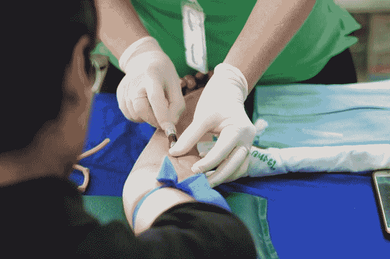

# Ventas Inc .在医疗保健行业赚钱了吗？—市场疯人院

> 原文：<https://medium.datadriveninvestor.com/is-ventas-inc-making-money-in-healthcare-market-mad-house-258b650ffc9c?source=collection_archive---------19----------------------->

Ventas Inc. (NYSE: VTR) 是一家可能从冠状病毒中获利的房地产投资信托基金(REIT)。

为了解释， [Ventas 声称](https://www.ventasreit.com/our-portfolio/properties-location)在 2020 年第二季度拥有 16 家护理机构、37 家住院和长期急性护理机构、3 家国际医院、9 个卫生系统、36 个医学研究和创新中心以及 347 栋医疗办公楼。因此，在可能是历史上最大的健康危机期间，Ventas 拥有大量的医疗保健设施。

然而，Ventas 容易受到冠状病毒的影响，因为它拥有 742 所老年住房设施。解释老年住宅是护理院或疗养院的委婉说法。疗养院或护理院是臭名昭著的冠状病毒热点。

# 冠状病毒能杀死文塔斯吗？

例如，截至 2020 年 7 月 26 日，美国疗养院中已有 43231 例新冠肺炎死亡。[医疗保险和医疗补助中心(CMS)](https://data.cms.gov/stories/s/COVID-19-Nursing-Home-Data/bkwz-xpvg/) 估计，在 2020 年 7 月 26 日之前，美国养老院中有 102，531 例疑似冠状病毒病例和 164，055 例确诊新冠肺炎病例。

因此，Ventas 既能从冠状病毒中获利，同时又能忍受新冠肺炎病毒的折磨。例如，医院、住院和长期急性护理机构以及护理机构可以护理康复中的冠状病毒患者。重要的是，保险或政府可以支付治疗费用

如果 Ventas 在其 36 个医学创新和研究机构中测试新冠肺炎疗法、药物和疫苗，他们可能会从冠状病毒中受益。例如，美国联邦政府正在投资 40 亿美元用于冠状病毒疫苗研究。

 [## 医疗保健行业的螺旋式项目管理方法|数据驱动的投资者

### 项目管理就是将知识、技能、工具和技术应用到活动中，以…

www.datadriveninvestor.com](https://www.datadriveninvestor.com/2020/08/04/spiral-project-management-methodology-in-healthcare/) 

# Ventas 赚钱吗？

Ventas 赚了一些钱。例如，2020 年 6 月 30 日，Ventas 报告的季度毛利为 8.7663 亿美元，季度收入为 9.43 亿美元。

此外，截至 2020 年 6 月 30 日，Ventas 报告的季度营业收入为 6447 万美元，季度普通净亏损为-1.7517 亿美元。此外，Ventas 赚钱越来越少，截至 2020 年 6 月 30 日的季度，其收入下降了 0.7%。

Ventas 在 2020 年赚的钱更少了。例如，Ventas 的季度收入从 2019 年 12 月 31 日的 9.96 亿美元下降。此外，季度毛利从 2019 年 12 月 31 日的 9.2071 亿美元下降。

此外，季度营业收入从 2019 年 12 月 31 日的 1.2461 亿美元增长。相比之下，季度共同净收入从 2019 年 12 月 31 日的 1144 万美元增长到 2020 年 3 月 31 日的 4.7312 亿美元。

# Ventas 能产生多少现金？

Ventas(纽约证券交易所代码:VTR) 产生了大量的现金。例如，Ventas 报告 2020 年 6 月 30 日的季度运营现金流为 4.0556 亿美元。

此外，截至 2020 年 6 月 30 日，Ventas 报告的季度投资现金流为 5.1718 亿美元，季度融资现金流为-20.95 亿美元。然而，我认为融资现金流表明 Ventas 偿还了 20.95 亿美元的债务。

因此，Ventas 在 2020 年 6 月 30 日报告的季度末现金流为-18.67 亿美元。季度末现金流从 2020 年 3 月 31 日的 28.86 亿美元下降。该季度末现金流从 2019 年 12 月 31 日的-6249 万美元增长。

最后，Ventas 报告 2020 年 6 月 30 日的短期投资为 10.29 亿美元，2020 年 3 月 31 日的现金和短期投资为 28.86 亿美元。这一数字从 2019 年 12 月 31 日的 1.461 亿美元增加到 2019 年 12 月 31 日的 1.461 亿美元。

我认为，这些现金显示了 Ventas 非常负责任的管理。为了解释这一点，Ventas 的管理层在可能的萧条开始时囤积现金。因此，Ventas 有可能在某个时候低价收购不良资产。

# Ventas 是价值投资吗？

**Ventas Inc. (NYSE: VTR)** 可能是价值投资，因为它有更多的现金，但其股价从 2020 年 1 月 2 日的 56.39 美元下跌到 2020 年 8 月 7 日的 41.52 美元，到 2020 年 8 月 13 日的 39.89 美元。

此外，Ventas 报告 2020 年 6 月 30 日的总资产为 245.89 亿美元，2020 年 8 月 13 日的市值为 148.8 亿美元。因此，你可以说市场先生为 Ventas 支付的价格过低。而且，2020 年 Ventas 的股价已经下跌。

有吸引力的是，Ventas 在 2020 年 6 月 30 日支付了 45₵的季度股息。该股息于 2020 年 3 月 19 日从 79.25₵落下。因此，Ventas 的股息很高，但正在下降。

如果你正在寻找一只支付股息的廉价成长型股票，那么 **Ventas (VTR)** 值得一试。因此，Ventas 可能是一个随着冠状病毒杀死住宅房地产、零售和办公房地产投资信托基金而蓬勃发展的房地产投资信托基金。

*原载于 2020 年 8 月 13 日 https://marketmadhouse.com**[*。*](https://marketmadhouse.com/is-ventas-inc-making-money-in-healthcare/)*

***进入专家视角—** [**订阅 DDI 英特尔**](https://datadriveninvestor.com/ddi-intel)*