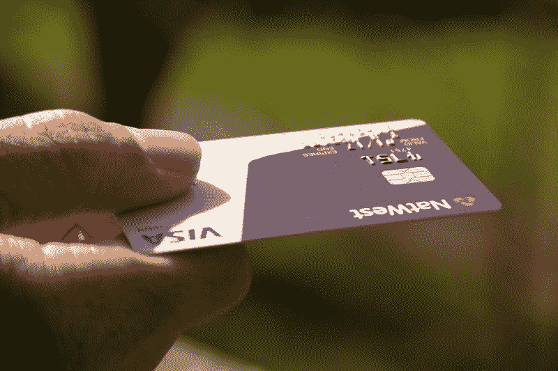
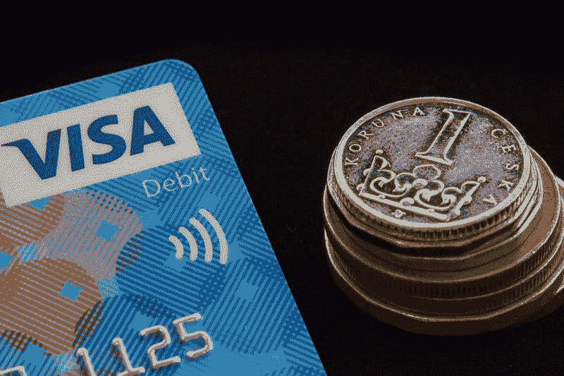

# Visa (NYSE: V)是冠状病毒时代的完美股票吗？—市场疯人院

> 原文：<https://medium.datadriveninvestor.com/is-visa-nyse-v-the-perfect-stock-for-the-coronavirus-age-market-mad-house-f5e201f5a015?source=collection_archive---------11----------------------->

Visa 可能是冠状病毒时代的完美股票。有趣的是，冠状病毒为 Visa 的产品创造了新的用途:支付服务。

例如，400 万美国人可以通过 Visa 借记卡获得冠状病毒刺激付款。然而，许多人可以扔掉这些卡，因为美国财政部没有为这些卡做广告， *Vox Recode* [声称](https://www.vox.com/recode/2020/5/29/21274397/coronavirus-stimulus-payments-debit-cards-checks-visa)。

刺激卡只是冠状病毒为 Visa 创造的一个机会。特别是，由于害怕新冠肺炎，许多美国企业拒绝接受现金或不鼓励使用现金。

 [## 银行和金融科技初创公司的未来|数据驱动的投资者

### 银行的概念没有太大变化，但随着技术的发展，旧的概念也在更新。不相信我？拿一个…

www.datadriveninvestor.com](https://www.datadriveninvestor.com/2019/10/22/the-future-of-banks-and-fintech-startups/) 

我认为那些政策将迫使许多美国人用卡代替现金。这可能有利于最大的支付卡提供商 Visa。Statista [估计，到 2020 年第四季度，Visa 的平台在美国支持 3.45 亿张信用卡，在美国以外支持 7.97 亿张信用卡。](https://www.statista.com/statistics/618115/number-of-visa-credit-cards-worldwide-by-region/)

# Visa 拥有世界上最大的支付处理网络

Visa 声称总共支持全球 200 多个国家的 33 亿张支付卡。此外，Visa 声称其平台为全球超过 4600 万个商户和超过 15900 家金融机构提供服务。*

令人印象深刻的是，Visa 声称其网络每秒可以处理超过 65，000 笔交易(TPS)。此外，Visa 声称其网络在 2018 年 6 月处理了超过 11 万亿美元的现金。最后，Visa 声称它可以处理超过 160 种货币的支付。*

如果这些说法是真的，Visa 是世界上的电子支付处理器。因此，Visa (NYSE: V) 拥有世界现在需要的基础设施。

除了信用卡，Apple Pay 和 Google Pay 等非接触式移动支付解决方案的使用也在蓬勃发展。例如， **Target(纽约证券交易所:TGT)** 、 **Walgreens(纳斯达克:WBA)**和 Family Dollar 等零售商正在接受移动支付，以限制冠状病毒的污染。

令人印象深刻的是，使用 Apple Pay 和 Google Pay 的澳大利亚人数量从 2019 年的 7.1%增长到 2020 年 5 月的 10.8%，罗伊摩根数字支付 [估计](https://www.roymorgan.com/findings/8408-digital-payment-solutions-march-2020-202005120625)。因此，无线数字支付(移动)和传统电子支付(卡)都在增长。

# 签证赚了多少钱？

**Visa Inc .(NYSE:V)**；然而，在 2020 年赚的钱更少了。例如，Visa 的季度收入从 2019 年 12 月 31 日的 60.54 亿美元降至 2020 年 3 月 31 日的 58.54 亿美元。

此外，Visa 的季度毛利在此期间从 60.54 亿美元降至 58.4 亿美元。因此，我喜欢 Visa 的一个原因是，它的总利润和总收入是一样的。因此，Visa 的收入反映了它的利润。

此外，2020 年前三个月，Visa 的营业收入从 40.16 亿美元降至 39.24 亿美元。此外，同期 Visa 的共同净收入从 32.72 亿美元降至 30.84 亿美元。

加上 Visa 的收入增长率从 2019 年最后一个季度的 9.95%下降到 2020 年第一季度的 6.55%。因此，尽管 Visa 赚的钱少了，但它的收入却在增长。

# Visa 产生的现金更少

值得注意的是，Visa 的运营现金流从 2019 年 12 月 31 日的 38.75 亿美元降至 2020 年 3 月 31 日的 14.67 亿美元。

奇怪的是，同期 Visa 的期末流量从 122.63 亿美元降至 5.53 亿美元。因此，Visa 的业务可以产生大量现金，但其现金流波动很大。

重要的是，Visa 正在增加对其业务的投资。Visa 的投资现金从 2019 年 12 月 31 日的 5.62 亿美元增长至 2020 年 3 月 31 日的 14.67 亿美元。

归根结底，Visa 是一家现金充裕的公司。截至 2020 年 3 月 31 日，Visa 有 134.15 亿美元的现金和短期投资。这一数字低于 2019 年 12 月 31 日的 143.04 亿美元。

归根结底，我认为 Visa 是一家现金充裕、价值巨大的公司。

# Visa 是否被高估？

我认为，2020 年 6 月 2 日，市场先生对 Visa (NYSE: V) 的估值相当于 196.36 美元。而且，Visa 的股价稳定。

例如，Visa 的股票在 2020 年 1 月 2 日以 191.12 美元开始，在 2020 年 5 月 29 日上涨到 195.24 美元，在 2020 年 6 月 2 日上涨到 196.36 美元。然而，2020 年 3 月 23 日，Visa 股价跌至 135.74 美元。

Visa 是一种保值的股票。我认为稳定的股价、增长和现金给了 Visa 很高的安全边际。因此，我认为签证是孤儿寡母的股票。

解释一下，对于需要稳定收入的人来说，寡妇和孤儿股票是一种足够安全的赚钱股票。我认为 Visa 属于这一类，因为它的现金和高增长率。

# Visa 是好的分红股吗？

Visa 于 2020 年 5 月 13 日支付了 30₵季度股息。5₵在 2019 年增加了股息，从 2020 年 7 月 15 日的 25₵增加到 2019 年 10 月 22 日的 30₵。

总体而言，截至 2020 年 6 月 2 日，每股 Visa 股票的股息收益率为 0.62%，年度股息为 1.20 美元，派息率为 23.88%。我认为这些数字使维萨成为一只优秀的股息股。令人印象深刻的是，Dividend.com[将 11 年的股息增长归功于](#tm=3-ticker-best-div-capture&r=ES%3A%3ADividendStock%3A%3AStock%23V--NYSE&f_28=true&only=meta%2Cdata%2Cthead) Visa。

如果你想要一家稳定、现金充裕、具有高增长潜力的公司，那就要支付股息。我认为签证是一个很好的选择。如果你想与数字世界一起成长，你的投资组合中需要 Visa。

*来源签证情况说明书:

[https://USA . visa . com/dam/VCOM/download/corporate/media/visa net-technology/aboutvisafactsheet . pdf](https://usa.visa.com/dam/VCOM/download/corporate/media/visanet-technology/aboutvisafactsheet.pdf)

*原载于 2020 年 6 月 2 日 https://marketmadhouse.com**[*。*](https://marketmadhouse.com/is-visa-nyse-v-the-perfect-stock-for-the-coronavirus-age/)*