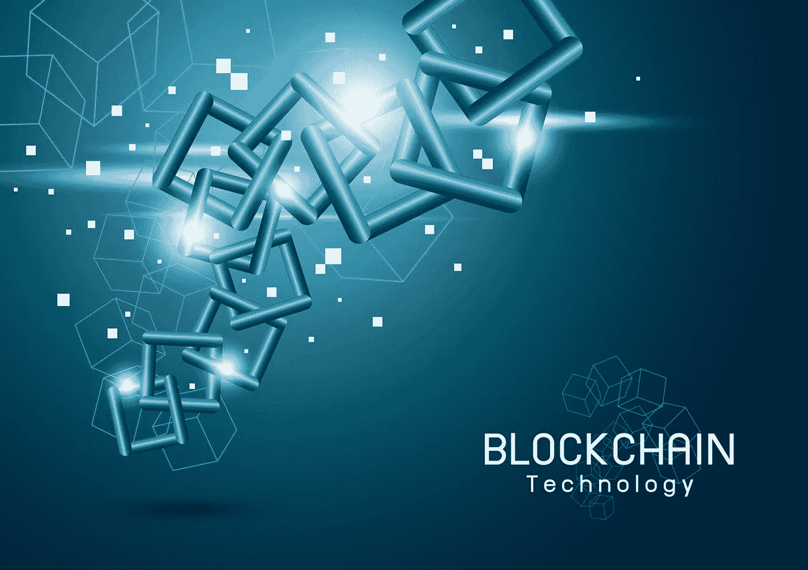

# 基于区块链的系统投票可能吗？(带音频)

> 原文：<https://medium.datadriveninvestor.com/is-voting-on-blockchain-based-system-possible-6655dd673583?source=collection_archive---------8----------------------->

有一种普遍的误解，认为投票不能以安全的方式数字化进行。然而，区块链科技的出现改变了一切。

假设我们看到美国总统唐纳德·特朗普。美国也是世界上第一个民主国家。他对结果不满意，因为他告诉人们，他要去最高法院，因为乔·拜登使用了不公平的手段，并在选举中投票。因此，如果世界上最强大的国家是这样，那么其他国家呢？怎么让其他国家的人对行业有信心？即使在新冠肺炎目前的情况下，一些选民仍然因此无法投票。同样，在印度，拉胡尔·甘地先生(来自反对党)在选举失败时总是抱怨 EVM，但在赢得选举时他什么也不说。

美国的选举是全球最昂贵的，民主党和共和党都在积聚财力来击败对方。根据响应政治中心(Center for Responsive Politics)的数据，预计今年的选举将打破障碍，耗资约 140 亿美元。有 60 个国家的 GDP 较低。到 2016 年大选结束时，希拉里·克林顿和特朗普之间的账单超过了 63 亿美元。目前，白宫竞选花费 24 亿美元，国会竞选花费惊人的 40 亿美元。

在印度(世界上最大的民主国家)；2014 年投票后，2019 年人民院选举的选民总数增加了 8430 万。选举是在需要大量时间的间隔中进行的。新选民的数量已经增加到 9 亿，其中 1500 万在 18-19 岁之间。与 2014 年的 90 万个投票站相比，这次将设立总共 10 万个投票站。

投票系统采用区块链技术的主要原因= >

1.  权力下放；处理您所有数据的中央实体，您只能通过与该实体通信来获取您需要的信息。它将所有数据保存在一个位置。这使得未来的黑客更容易攻击它们。如果中央系统要更新其软件，整个系统将停止运行。在一个分散的框架中，数据不是由一个人保存的。网络中的所有人目前都拥有该信息。如果你想在一个分散的网络中与你的好友交流，你可以在没有第三方的情况下明确地做到这一点。
2.  安全性；个人的真实身份受到保护；你总是可以看到他们的公共地址所做的所有购买。从金融体系的角度来看，这种开放程度是前所未有的。它增加了一些主要组织所要求的额外和急需的透明度。
3.  不可变；一旦添加，里面的任何内容都不能更改或修改。

更新投票技术将包括更可靠、更简单的现代投票方式，并鼓励更多的人履行他们简单的公民义务。

在区块链；这可以通过智能合约来实现。这涉及到一种投票机制，该机制保证他们想要的特定候选人的投票只需注册一次(通过使用令牌)(在候选人的钱包中),并在区块链上无限期记录。

**案例研究:跟随我的投票**

一个在线开源投票门户网站通过鼓励选民自由检查投票箱来提供选举结果信息。使用最先进的创新技术，如区块链技术和椭圆加密技术。目标是通过鼓励人们有效地联系和引入非强制性的社会问题解决方案来培养诚实和自由。
程序；使用网络摄像头和政府颁发的 ID，选民可以登录并使用 Follow My Vote 的安全移动投票平台远程匿名投票给他们喜欢的候选人。然后，当他们选出自己的候选人后，他们将使用他们的特殊选民 ID 打开投票箱，找到他们的选票，并验证他们是否都在场，是否正确。

优势= >

1.  这可能会大大降低我们的选举费用，并释放纳税人的资源，用于我们文化的其他极其重要的方面，如提高我们学校系统的效率或修复我们破旧的基础设施。
2.  提高投票率也可能是安全在线选举的一个副产品。
3.  让投票变得更加舒适和有效，保证投票的公平性，并让选民相信他们的政府已经听到了他们的声音。

希望你喜欢。

希望得到积极的回应。

请关注我的@Medium 简介 [Yash Kamal Chaturvedi](https://yashkamalchaturvedi.medium.com/)