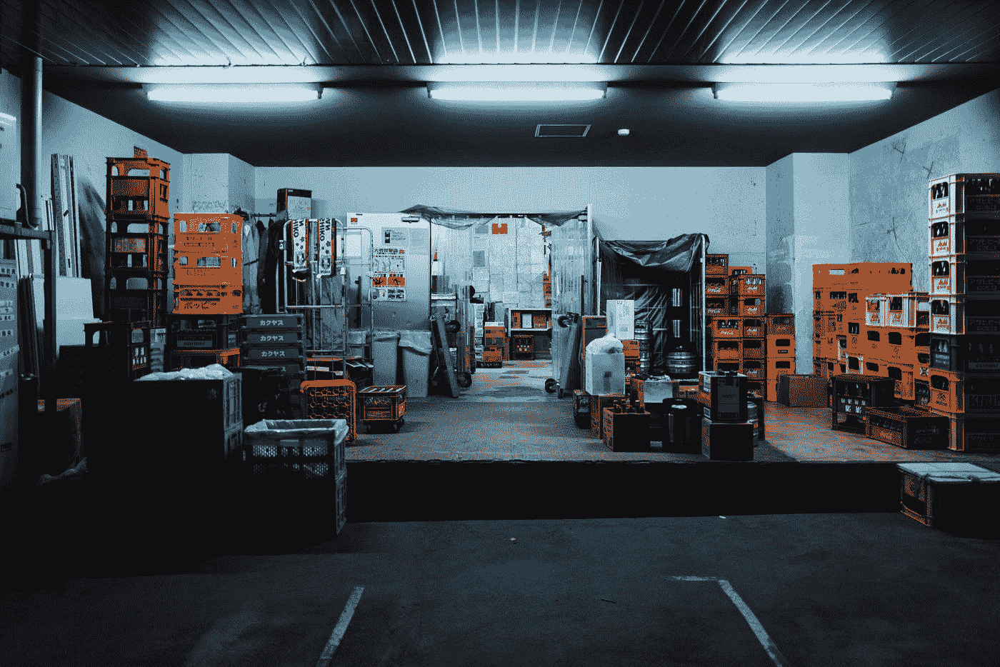

# 仓库封建主义是美国经济的新规范吗？

> 原文：<https://medium.datadriveninvestor.com/is-warehouse-feudalism-the-new-norm-in-the-american-economy-dd8d9bfb0259?source=collection_archive---------7----------------------->

## 亚马逊(Amazon)和沃尔玛(Walmart)开始以创纪录的水平招聘员工，人数已经超过了疫情之前的水平。这是好消息还是令人担忧的原因？

Photo by [George Kedenburg III](https://unsplash.com/@gk3?utm_source=medium&utm_medium=referral) on [Unsplash](https://unsplash.com?utm_source=medium&utm_medium=referral)

寒假期间，仓库的就业人数正在增加。从 4 月到 10 月，美国增加了 146，700 个新的仓库工作岗位，因为亚马逊和沃尔玛等公司旨在利用零售购物的新在线时代。

这可以被视为朝着正确方向迈出的一步，但这些工作的质量也必须得到考虑。工人们通常报告在不尊重工人福利的危险条件下工作 12 小时。一名工人称工作中心为[“一个 COVID 盒子”](https://www.businessinsider.com/warehouse-workers-face-anxious-holiday-season-as-e-commerce-explodes-2020-11)。许多其他人报告说，在工作时担心自己的健康，因为同事和经理不遵守口罩要求，工作的性质使社交距离变得特别困难。

根据[劳动统计局的数据，2020 年 10 月，大约有 126.8 万人受雇于仓储行业。不断增长的仓库工人正在取代传统的零售工人。随着梅西百货、J.C. Penney 和 Nordstrom 等公司关闭商店，并可能在不久的将来倒闭，很容易理解仓库就业的增加。](https://www.bls.gov/iag/tgs/iag493.htm)

许多专家，如房地产数据公司 CoStar Group 的高级顾问胡安·阿里亚斯(Juan Arias)吹捧仓储业是“我们经济的支柱”胡安表达了他对工人安全的关心，并希望为了我们的经济，他们不要出什么事。然而，像这样的人没有抓住重点。

如果我们的经济仅仅依靠过度工作和暴露于 Covid 的员工生存，这些员工为了买新衬衫或牛仔裤而工作 12 个小时，这真的是我们想要发展的行业吗？当然，工作岗位正在回归，但如果它们被取代，而取代的是那些为人们提供更好生活的其他行业的工作岗位，这可能不是一件好事。

现在，我们必须决定，人类的进步是否意味着人们以仓库工人为代价，以低成本将商品运送到他们家门口，或者我们是否愿意将我们的生产力集中到其他地方。不重要的工作让经济成员可以无意识地消费，这对人类来说可能不是一个好的方向。

 [## 利用区块链构建可持续循环经济|数据驱动投资者

### 自从工业革命开始以来，全世界都关注产品的生产和消费。很少或…

www.datadriveninvestor.com](https://www.datadriveninvestor.com/2020/11/17/building-sustainable-circular-economy-with-blockchain/) 

除了安全问题和生产能力的浪费，仓库工作还有其他问题。这造成了美国纳税人不得不补贴他们的局面。

根据无党派政府问责局的一项研究，沃尔玛和亚马逊是联邦援助项目受益者的最佳雇主，如食品券和医疗补助。亚马逊也有很多员工享受政府福利，在 T2 亚利桑那州，近三分之一的员工领取食品券。

你可能会对这些信息持怀疑态度——这很自然。一个常见的假设可能是“这些人很懒，他们中的大多数都是兼职工作，”但在 GAO 的研究中，大约 70%的联邦援助受益者都是全职工作。

那么，在发达国家，经常被建议从事最累人的工作周的全职员工，怎么可能连基本必需品都买不起呢？

虽然亚马逊和沃尔玛等零售公司雇佣了很多人，但毫无疑问，它们对经济造成了很多伤害。亚马逊和沃尔玛是美国一些最大的低工资公司，并导致纳税人为其员工维持基本生活水平做出贡献。

这些大公司能够忽视普通的安全措施，仍然让[纳税人补贴](https://www.goodjobsfirst.org/amazon)他们，很明显他们不是问题的唯一来源。主要问题是我们的政府允许他们这样做。尽管贫困在增加，中产阶级在减少，我们的政府继续让步，向不需要福利的公司提供福利。

显然，除了意识到这些做法并鼓励他人保护自己，我们大多数人都无法改变这种情况。这个行业及其可怕的标准很可能会增长。但是我们可以做一些事情来改变这个轨迹。

我们可以意识到，这个行业的成长是因为我们对物质主义和奢侈品的执着。我们也可以意识到，我们不需要亚马逊可以给我们的许多东西，我们可以选择极简主义。

许多人会认为这将损害经济，但人类的长期收益比短期经济的破坏更重要。我们需要重新考虑我们要把美国带向何方。我们是继续崇拜商品，还是为了我们兄弟姐妹的幸福做出牺牲？

最后，尽管有些理想化，但我认为这个问题的答案可能是普遍基本收入。亚马逊和沃尔玛的许多工人已经获得了政府的大量补贴，工人们将有选择和安全网去追求其他更有价值的东西，这些东西将永远改善人类，而不是增加这些公司的利润。

## 访问专家视图— [订阅 DDI 英特尔](https://datadriveninvestor.com/ddi-intel)