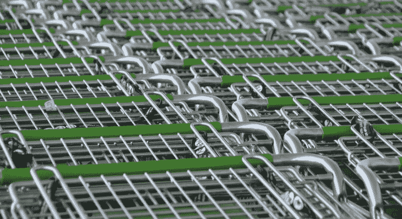
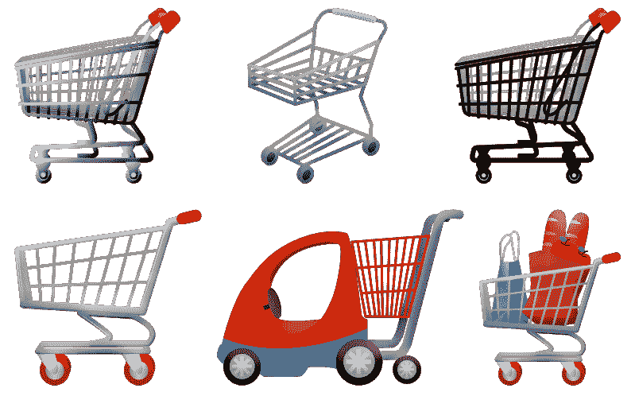
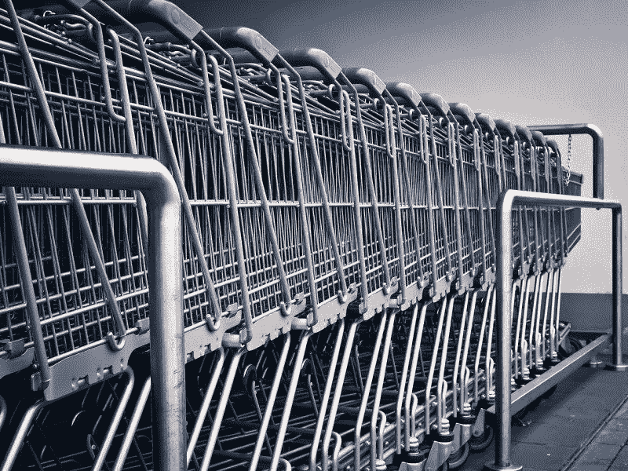
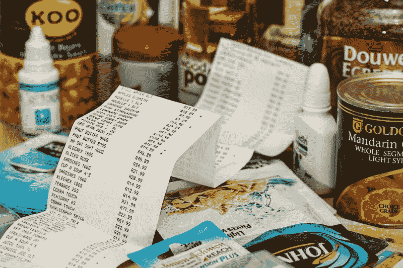
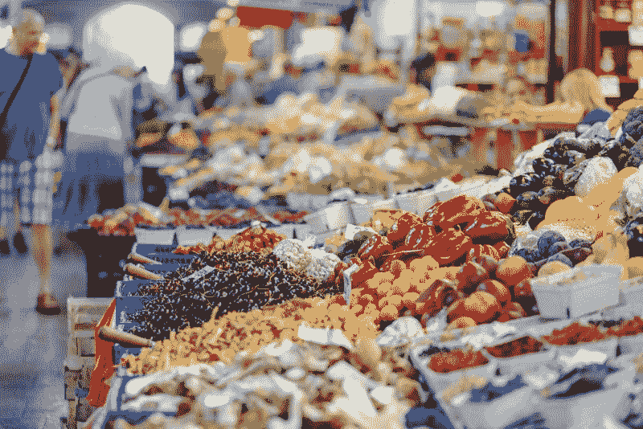

# 沃伦·巴菲特对克罗格的看法正确吗？—市场疯人院

> 原文：<https://medium.datadriveninvestor.com/is-warren-buffett-right-about-kroger-market-mad-house-6e1c734d328b?source=collection_archive---------15----------------------->

伯克希尔哈撒韦公司(纽约证券交易所代码:BRK。B) 对美国独立杂货商进行了惊人的投资；**克罗格(纽约证券交易所代码:KR)** 。

沃伦·巴菲特的公司；**伯克希尔哈撒韦公司(纽约证券交易所代码:BRK。A)** ，2019 年第四季度以 5.49 亿美元买入 1900 万股克罗格股票，*投资者商业日报* [报道](https://www.investors.com/news/warren-buffett-buys-kroger-biogen-sells-apple-q4-2019-13f/)。令人惊讶的是，Berkshire 减持了苹果公司(纳斯达克股票代码:AAPL)1%的股份，即 370 万股。

巴菲特在这里展示了他的反向观点，他拒绝了苹果是未来而克罗格是过去的传统观点。此外，巴菲特正在出售昂贵的股票以换取现金。2020 年 2 月 14 日，市场先生以每股 324.95 美元的价格收购苹果。我认为巴菲特先生认为苹果定价过高，我同意。

# 沃伦·巴菲特为什么要买克罗格股票？

我猜巴菲特购买克罗格的主要理由是，这家杂货巨头是目前为数不多的廉价股票之一。

2020 年 2 月 14 日，市场先生对克罗格的定价为每股 28.30 美元。然而，Kroger 在 2019 年 10 月 31 日报告的季度收入为 279.74 亿美元，总资产为 459.39 亿美元。

 [## 算法交易的机器学习|数据驱动的投资者

### 当你的一个朋友在脸书上传你的新海滩照，平台建议给你的脸加上标签，这是…

www.datadriveninvestor.com](https://www.datadriveninvestor.com/2019/01/30/machine-learning-for-stock-market-investing/) 

鉴于这些数字，我认为克罗格是一个价值投资，在价格下市场先生。我认为伯克希尔的购买表明巴菲特同意这一点。

# 克罗格是价值投资吗？

我认为 Kroger 是一项价值投资，因为它的足迹很广，拥有庞大的零售基础设施。

例如， [**克罗格**](https://marketmadhouse.com/kroger-and-the-future-of-grocery/) **(NYSE: KR)** 在 35 个州经营着 2761 家超市。克罗格的其他资产包括 44 个配送中心、222 个店内健康诊所、319 个珠宝店、2，270 个药店、1，537 个超市燃料中心和 36 个食品生产厂。*

克罗格还拥有一系列历史悠久的超市品牌，包括 Ralph's、Fred Meyer、Smith's King Soopers' Fry's、Copps、Baker's、Mariano's、Harris Teeter、City Market、Pick n' Save、QFC 和 Metro Market。

除此之外，克罗格还拥有 Vitacost 折扣维生素和补充剂在线零售商和家庭厨师送餐服务。此外，克罗格默里的奶酪，一个美食奶酪公司。

克罗格是有机和天然食品市场的主要参与者。Kroger [声称](http://sustainability.kroger.com/products-better-for-you-products.html)在 2018 年销售了 176 亿美元的天然和有机食品。具体来说，克罗格声称销售 9000 种有机食品。此外，克罗格声称其简单真理天然和有机品牌在 2018 年的销售额达到 23 亿美元。

因此，克罗格因其品牌和基础设施而具有很大的价值。

# 巴菲特是支持还是反对克罗格的杂货递送？

奇怪的是，巴菲特正在押注杂货递送的成功，而不是克罗格杂货递送的成功。

首先，巴菲特押注克罗格的实体店将保持巨大的价值。我猜巴菲特认为大多数人会在很多年里继续从实体店购买食品杂货。

因此，盖洛普[估计](https://news.gallup.com/poll/264857/online-grocery-shopping-rare.aspx)81%的人表示他们在 2019 年 8 月没有在网上购买杂货。然而，盖洛普发现 19%的美国人说他们在网上订购食品。

巴菲特正在对冲他的赌注，因为克罗格在网上杂货订购和交付上投入了大量资金。例如，*Kroger Fact Book **声称，2018 年 2 月，1600 家 Kroger 超市在网上订购了杂货。

# 巴菲特对冲了他在网上杂货配送上的赌注

再加上 Kroger 和 Instacart 关系密切。Kroger 的一份新闻稿声称，50%的 Kroger 商店或超过 1600 家超市都可以提供 Instacart 杂货店送货服务。

除了 Instacart Kroger 和英国的[**Ocado Group**](https://marketmadhouse.com/is-ocado-the-future-of-groceries-and-does-it-make-money/)**PLC(LON:OCDO)**计划在美国建立六个机器人客户履行中心(CFC)以支持当天杂货交付。

Ocado 的机器人将在 Kroger 的新 CFC 中拉动和包装杂货交付订单。超市新闻 [报道](https://www.supermarketnews.com/online-retail/kroger-names-location-sixth-ocado-warehouse)他们将在芝加哥以北的威斯康星州普莱森特普雷里找到最新的克罗格/奥卡多 CFC。因此，克罗格和奥卡多可以为芝加哥的顾客服务。芝加哥是美国第三大城市，2020 年有 270.6 万人。

因此，如果在线杂货递送失败或成功，巴菲特可以通过拥有克罗格赚钱。解释一下，人们仍然需要食物，克罗格可以通过实体店或快递来供应。

# 克罗格是杂货和送餐的未来吗？

此外，Kroger 的 2761 家超市可以作为 Instacart 等送货服务的社区送货中心。值得注意的是，许多超市有熟食店、比萨饼店、咖啡馆、厨房和其他可以提供热食和杂货的设施。

因此，除了 Instacart，Kroger 理论上可以从 [**Grubhub**](https://marketmadhouse.com/is-grubhub-losing-money/) **(纽约证券交易所代码:GRUB)** 赚钱。Grubhub 递送、热餐和熟食，而 Instacart 递送杂货。

我认为杂货递送的长期趋势将是提供热食和杂货的服务。例如，Grubhub 或 Instacart 可以为您提供牛奶、洗衣液和晚餐。

据报道，购买即将出售的 Grubhub 对克罗格或伯克希尔·哈撒韦来说都是明智之举。我认为 Grubhub 是一个收购目标，因为它很便宜。2020 年 2 月 14 日，市场先生给 Grubhub 的市值为 46.08 亿美元，股价为 50.39 美元。

# 克罗格赚钱了吗？

**克罗格公司(纽约证券交易所代码:KR)** 正在赚钱，2019 年 10 月 31 日，该公司报告季度毛利为 61.76 亿美元，季度收入为 279.74 亿美元。

但是，克罗格的收入低。Kroger 在 2019 年 10 月 31 日报告了 2.54 亿美元的季度收入。这一数字低于 2018 年 10 月 31 日的 6.47 亿美元。

Kroger 很难保持现金，它在 2019 年 10 月 31 日报告了负的期末现金流-8400 万美元。Kroger 无法保留现金，因为其运营成本高，Ocado CFCs 的新技术昂贵。

然而，Kroger 在 2019 年 10 月 31 日报告了 7.71 亿美元的季度运营现金流。这个数字高于一年前的 4 . 73 亿美元。因此，克罗格产生现金的能力正在增强，这也是巴菲特购买其股票的原因之一。

克罗格保留了一些现金。截至 2019 年 10 月 31 日，它有 15.79 亿美元的现金和短期投资。这一数额比 2018 年 10 月 31 日的 15.27 亿美元略有增长。

# 克罗格是好的分红股票吗？

最后，我认为巴菲特购买克罗格(纽约证券交易所代码:KR) 是因为他认为这是一只便宜的股息股票。

克罗格股份于 2020 年 2 月 13 日支付了 16₵股息。我认为这对 28.23 美元的股票来说是好消息。此外，我估计伯克希尔哈撒韦公司可以从其 1，900 万股克罗格股票中获得 304 万美元的股息收入。

总体而言，截至 2020 年 2 月 14 日，每股 Kroger 股票向投资者提供的股息收益率为 2.27%，64₵的年化支付率为 27.3%。Dividend.com 将 11 年的股息增长归功于克罗格。

因此，我认为克罗格是普通投资者的好股票，因为它的价格和股息都很低。我认为这些特性给了克罗格很高的安全系数。Kroger 有很高的安全边际，因为无论 KR 股票的交易价格是多少，你都会从股息中赚钱。

因此，Kroger 值得研究——如果你正在寻找一个好的廉价股息股票或巴菲特价值投资。

*来源: [*2018 克罗格事实书*](http://ir.kroger.com/Cache/1001254339.PDF?O=PDF&T=&Y=&D=&FID=1001254339&iid=4004136)

【https://marketmadhouse.com】原载于 2020 年 2 月 17 日**。**