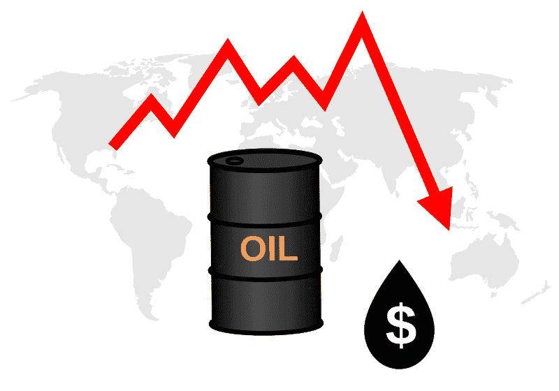
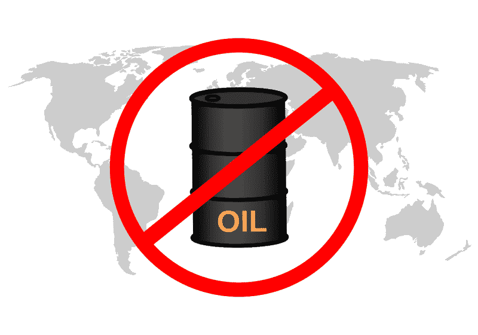
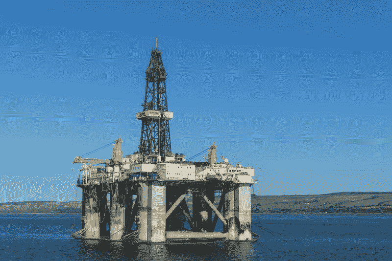
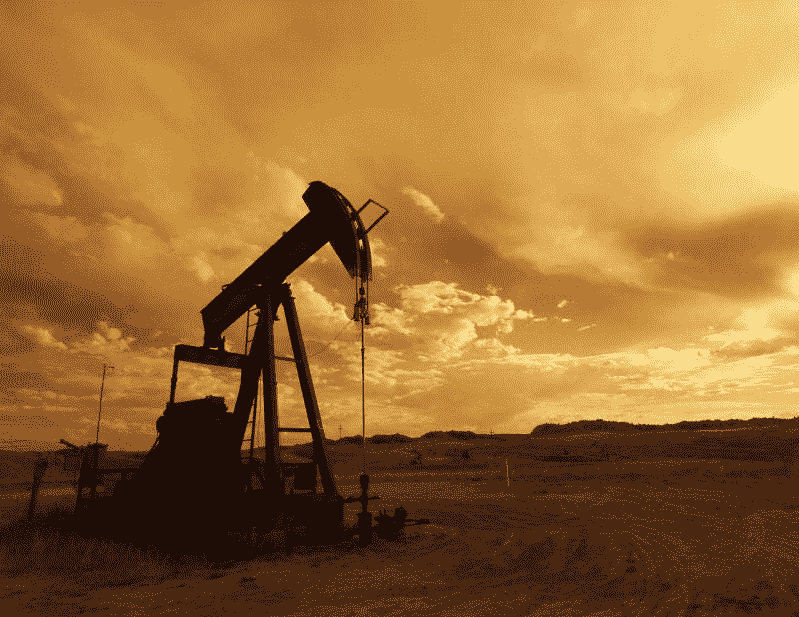
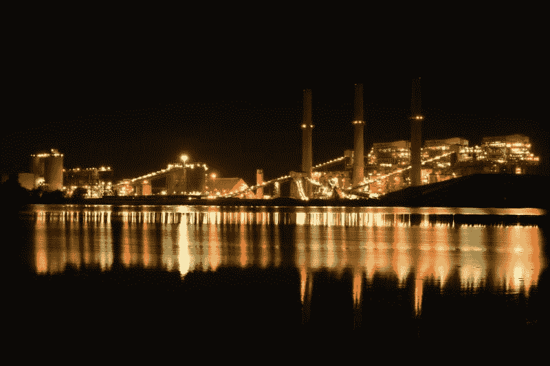

# 沃伦巴菲特对西方石油公司的看法正确吗？—市场疯人院

> 原文：<https://medium.datadriveninvestor.com/is-warren-buffett-right-about-occidental-petroleum-market-mad-house-d38bcc71acf4?source=collection_archive---------3----------------------->

油价的灾难性崩溃使沃伦·巴菲特对西方石油公司的投资受到质疑。

冠状病毒正在通过减少对汽油和柴油等石油产品的需求来破坏石油市场。令人难以置信的是，*市场内幕*一个受欢迎的原油品种；西德克萨斯中质油(WTI)于 2020 年 4 月 20 日以-37.63 美元/桶的负价格收盘。

然而，2020 年 4 月 23 日收盘时，WTI 价格升至每桶 16.50 美元，2020 年 5 月 4 日升至 21.27 美元。相比之下，市场先生在 2019 年 12 月 31 日为 WTI 支付了每桶 61.06 美元。因此，在 2020 年的前四个半月，WTI 损失了超过三分之二的价值。

# 石油价格暴跌

在这种情况下，许多观察家预测石油工业将会崩溃。例如，*雅各宾派的* Chris Saltmash 石油行业可能会收缩 10%。

此外，**高盛(纽约证券交易所代码:GS)** 预测，由于市场供应过剩，油价将再次暴跌。高盛分析师预计，由于巨大的供应和低需求，未来两个月将出现另一次石油崩盘。

**伯克希尔哈撒韦公司(纽约证券交易所代码:BRK。B)** 易受油价暴跌的影响，因为 Gurufocus 在 2020 年第一季度拥有 18，933 股**西方石油公司(NYSE: OXY)** 。此外，**伯克希尔哈撒韦公司(纽约证券交易所代码:BRK。A)** 拥有**森科尔能源公司(纽约证券交易所代码:SU)** 的 15，019 股股份。森科尔是一家加拿大石油公司。

2020 年，Occidental 的股价从 1 月 2 日的 42.58 美元跌至 2020 年 4 月 24 日的 13.81 美元。同样，森科尔的股价从 2020 年 1 月 2 日的 32.78 美元跌至 2020 年 4 月 24 日的 15.60 美元和 2020 年 5 月 4 日的 15.52 美元。

# 西方石油有什么价值？

二叠纪盆地、落基山脉、墨西哥湾、中东、哥伦比亚和非洲的西方石油和天然气。

[https://www . datadriveninvestor . com/2020/03/12/投资区块链前的三个简单问题和一个困难问题](https://www.datadriveninvestor.com/2020/03/12/three-simple-questions-and-one-difficult-one-to-ask-before-investing-in-a-blockchain/)

此外，Occidental 的子公司 OxyChem 生产 PVC 树脂(生塑料)、氯和苛性钠。重要的是，氯是一种消毒剂，可以杀死包括新冠肺炎在内的病毒，所以西方公司可以从冠状病毒中赚钱。是世界上最大的苛性钠制造商，苛性钠是肥皂和消毒剂的基本原料。OyxChem 在美国运营着 22 家制造工厂。

此外，西方石油公司拥有管道、天然气加工计划和三个大型天然气发电厂。因此，西方石油公司具有超越石油的价值。

# 西方石油赚钱了吗？

奇怪的是，Occidental 在冠状病毒之前做得很好。例如，在截至 2019 年 12 月 31 日的季度，Stockrow OXY 的收入增长率为 31.92%。

在该季度，西方石油公司的总收入为 62.82 亿美元，总利润为 42.75 亿美元。然而，Occidental 报告该季度运营亏损 10.86 亿澳元，普通净亏损 13.36 亿澳元。

有趣的是，西方石油公司在 2019 年 12 月 31 日报告了 20.9 亿美元的季度运营现金流。然而，Occidental 报告同一季度的期末现金流为负-17.91 亿美元。

# 西方石油不值钱吗？

因此，西方公司在冠状病毒之前一直在亏损。现在，西方石油公司面临一个新世界，它的主要资产之一；一年多来，石油可能几乎一文不值。

为了解释这一点，包括安东尼·福奇博士在内的一些专家认为，疫情冠状病毒可能会持续 18 个月。福奇是美国国家过敏和传染病研究所的主任，也是唐纳德·川普总统(佛罗里达州共和党)在流行病方面的首席顾问。

福奇澄清说，开发冠状病毒疫苗可能需要 18 个月的时间。疫苗可能是控制新冠肺炎病毒的唯一可行方法。

在这种情况下，西方石油公司可能需要几个月或几年才能重新盈利。因此，西方石油公司的股票可能会暴跌。

# 西方石油有什么价值？

然而，Occidental 在 2020 年 12 月 31 日有 35.12 亿美元的现金和短期投资以及 1093.30 亿美元的总资产。

此外，西方石油公司于 2020 年 3 月 9 日支付了 79₵ a 股季度股息。另外，Dividend.com[计算](https://marketmadhouse.com/is-warren-buffett-right-about-occidental-petroleum/#tm=3-comparison-center&r=ES::DividendStock::Stock%23OXY--NYSE&only=meta,data,thead)，西方石油公司在 2020 年 4 月 24 日向投资者提供了 19.04%的股息收益率，3.16 美元的年化支出，以及 17 年的股息增长。

我认为**Occidental Petroleum(NYSE:OXY)**是一只安全边际很低的廉价股息股。只有那些对风险有很高承受能力，能够承受损失的人，才需要在今天的石油市场上调查 OXY。我建议其他人远离西方石油公司，因为我认为 Oxy 和石油市场将很快崩溃。

因此，沃伦·巴菲特对西方石油公司先于冠状病毒的预测是正确的。然而今天，我认为 OXY 风险太大，不适合做价值投资。

*原载于 2020 年 5 月 4 日 https://marketmadhouse.com***。**