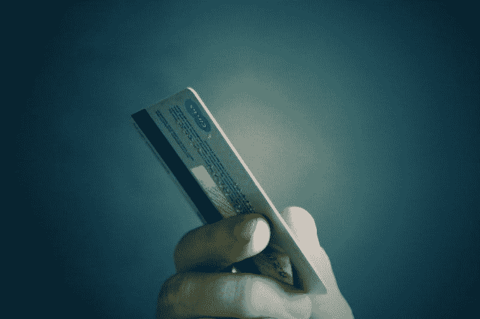

# 沃伦·巴菲特对富国银行的看法正确吗？—市场疯人院

> 原文：<https://medium.datadriveninvestor.com/is-warren-buffett-right-about-wells-fargo-market-mad-house-c4d183283686?source=collection_archive---------3----------------------->

沃伦·巴菲特正在抛售他最著名也是最有争议的股票之一。解释一下，**伯克希尔哈撒韦公司(纽约证券交易所代码:BRK。B)** 在 2019 年下半年出售了其在**富国银行&有限公司(纽约证券交易所代码:WFC)**21%的股份。

详细来说，**伯克希尔哈撒韦公司(纽约证券交易所代码:BRK。A)** 在 2019 年下半年出售了 8600 万股富国银行股票，路透社[估计](https://www.reuters.com/article/us-investment-funds-berkshire/buffetts-berkshire-buys-kroger-and-biogen-reduces-wells-fargo-and-goldman-stakes-idUSKBN2082M9)。巴菲特因持有令人深恶痛绝的怪兽银行的股份而招致了很多批评。

**富国银行(纽约证券交易所:WFC)** 备受争议，因为该银行可能支付 30 亿美元解决假账丑闻引起的投诉和诉讼，*《费城问询者报》* [报道](https://www.inquirer.com/news/wells-fargo-settlement-fake-accounts-doj-sec-20200221.html)。为了解释这一点，批评人士声称富国银行的员工以客户的名义开设了数百万个虚假账户来收取奖金。

事实上，美国货币监理署(OCC)美国消费者金融保护局在 2018 年因虚假账户对富国银行罚款 10 亿美元。此外，OCC 对前富国银行首席执行官 John Stumpf 处以 17.5 美元的罚款，并禁止他在 2019 年 1 月从事银行业工作，*费城问询者报*报道。

 [## 算法交易的机器学习|数据驱动的投资者

### 当你的一个朋友在脸书上传你的新海滩照，平台建议给你的脸加上标签，这是…

www.datadriveninvestor.com](https://www.datadriveninvestor.com/2019/01/30/machine-learning-for-stock-market-investing/) 

因此，富国银行存在严重的管理和道德问题。因此，巴菲特抛售这只股票可能是明智的。

# 富国银行赚钱了吗？

奇怪的是，富国银行正在赚大钱。例如，富国银行报告称，截至 2019 年 12 月 31 日，季度收入为 242.55 亿美元，季度毛利为 198.6 亿美元。

在同一季度，富国银行报告营业收入为 36.02 亿美元，普通净收入为 25.46 亿美元。因此，尽管人们对这家怪物银行怨声载道，富国银行还是继续赚钱。

另一方面，富国银行报告称，2019 年 9 月 30 日的季度运营现金流为负-129.75 亿美元。因此，富国银行在 Stockrow 提供数据的最后一个季度亏损了。

# 富国银行是一家现金充裕的公司

重要的是，**富国银行(纽约证券交易所代码:WFC)** 是一家现金充裕的公司。令人印象深刻的是，富国银行在 2019 年 12 月 31 日拥有 3231.23 亿美元的现金和短期投资，以及 1.3 万亿美元的流动资产总额。

因此，富国银行可以从其账户中支付 30 亿美元的诉讼和解金，但仍有 3，201.23 亿美元的现金。此外，富国银行公布的流动资产总额为 1.927 万亿美元。

因此，我认为富国银行是一家现金充裕的公司，是一项价值投资。事实上，我认为市场先生在 2020 年 2 月 25 日低估了富国银行 45.12 美元的股价。

# 巴菲特为什么要卖掉富国银行？

巴菲特；另一方面，可能会认为富国银行定价过高。因此，Berkshire 以高价出售 WFC 股票来赚钱。

此外，伯克希尔·哈撒韦公司可以以更低的价格回购富国银行的股票。此外，巴菲特认为还有其他价格更低的资产。值得注意的是，巴菲特正在购买一些股票，包括 [**、克罗格**](https://marketmadhouse.com/is-warren-buffett-right-about-kroger/) **(纽约证券交易所代码:KR)** 和 [**Biogen**](https://marketmadhouse.com/is-buffett-right-about-biogen/) **(纳斯达克代码:BIIB)** 。

然而，据路透社[估计](https://www.reuters.com/article/us-investment-funds-berkshire/buffetts-berkshire-buys-kroger-and-biogen-reduces-wells-fargo-and-goldman-stakes-idUSKBN2082M9)，伯克希尔哈撒韦仍持有价值 174 亿美元的 3.232 亿股富国银行股票。因此，富国银行仍然是伯克希尔哈撒韦的第三大持股。

因此，巴菲特仍然相信富国银行，这表明它可能有很大的价值。

# 富国银行有什么价值？

**富国银行(纽约证券交易所:WFC)** 是美国 10 个州最受欢迎的银行，Bankrate [估计](https://www.bankrate.com/banking/most-popular-bank-in-each-state/)。

重要的是，富国银行是美国人口最多的三个州中最受欢迎的银行；加利福尼亚州、得克萨斯州和佛罗里达州向 T21 索赔。《世界人口评论》估计，2020 年 1 月，这些州的总人口为 9048 万。

因此，富国银行是拥有近三分之一美国人口的三个州中最受欢迎的银行。为了解释，Worldometer [估计 2020 年 1 月美国人口为 3.31003 亿。](https://www.worldometers.info/world-population/us-population/)

CNN 财经[估计](https://money.cnn.com/2018/01/12/investing/wells-fargo-shutting-branches/index.html)2020 年富国银行在美国运营约 5000 家分行。然而，富国银行正在关闭大约 800 家分行。然而，富国银行的网站[声称](https://www.wellsfargo.com/locator/)该公司在 2020 年经营着 5400 家美国分行。

此外，富国银行[声称](https://newsroom.wf.com/press-release/innovation-and-technology/wells-fargo-launches-13000-card-free-atms-its-20-million)运营着 13000 台自动取款机(ATM ),这些取款机可以使用移动支付应用，如 Google Pay 和 Apple Pay。富国银行还声称，有 2000 万人使用其移动支付解决方案。

因此，富国银行有一个巨大的足迹，有助于其价值。此外，我认为富国银行的足迹可能是其价值的主要来源。

# 富国银行是价值投资吗？

我认为**富国银行(纽约证券交易所:WFC)** 是一项价值投资，因为它是一家在 2020 年 2 月 25 日拥有 1.928 万亿美元资产、每股 45.12 美元的公司。

此外，富国银行的 ATM 足迹为该股增加了大量价值。澄清一下，2020 年，大部分人都把自动取款机当做自己的银行。例如，他们使用自动取款机来获取现金和存款支票。如果你不到 35 岁，请谷歌一下支票这个词，因为我不想向你解释支票。

此外，富国银行于 2020 年 2 月 6 日支付了 51₵季度股息。因此，我认为 WFC 是一个体面的股息股票。Dividend.com[估计【2020 年 2 月 25 日，每股富国银行股票的股息率为 4.31%，年化派息为 2.04 美元，派息率为 49.61%。](https://www.dividend.com/dividend-stocks/financial/money-center-banks/wfc-wells-fargo/)

如果你在寻找一只支付可观股息的廉价股票，你需要考察一下富国银行。即使沃伦·巴菲特正在出售富国银行，这家巨型银行仍然是一项价值投资。

*原载于 2020 年 2 月 25 日 https://marketmadhouse.com***。**