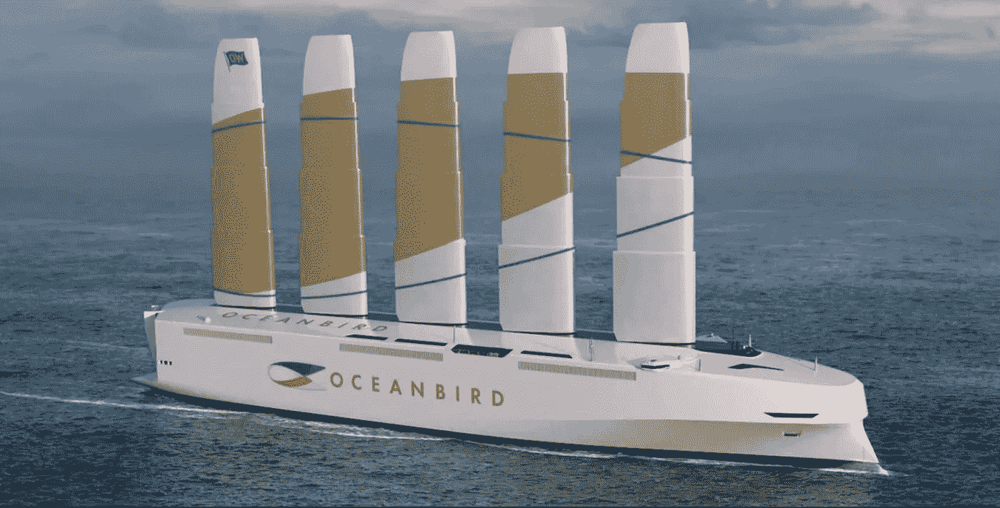

# 风力货船是货运的未来吗

> 原文：<https://medium.datadriveninvestor.com/is-wind-cargo-ships-the-future-of-cargo-b80118baea2c?source=collection_archive---------19----------------------->

## **绿色能源运输可减少 90%的排放**

Oceanbird — the wind powered cargo vessel. Photo by ([www.oceanbirdwallenius.com](http://www.oceanbirdwallenius.com))

温室气体排放肯定是全世界的一个问题。国际海事组织(IMO)估计，2012 年，来自航运的二氧化碳排放量相当于全球人为排放量的 2.2%，如果不采取行动，预计到 2050 年，二氧化碳排放量将增加 50%至 250%。我们非常接近，很快，先进的清洁能源船将成为海运货物的生态解决方案。

海运可以通过船、轮船、帆船或驳船跨越任何距离，跨越海洋和湖泊，穿过运河，或沿着河流。交付可能是为了贸易、娱乐或军事目的。虽然今天广泛的内陆运输不太基本，但包括众多水路在内的世界重要河流仍然很重要，是整体经济不可或缺的组成部分。

> 基本上，任何物质都可以被水移动；在任何情况下，当物质运输是以时间为基础时，水运就变得不合理了，例如，不同种类的短期产品。

在实现系统的“电气化”方面，有两个运输部门很难合作。汽车行业已经设法在该领域采取措施，这对减少有害排放和缓解气候危机至关重要。

但是在海运行业，我们有关于这个话题的好消息。自从 [*Wallenius Marine*](http://www.oceanbirdwallenius.com) 在九月宣布了一个可以改变这个运输部门未来的原型。

我们谈论的是将碳排放量减少惊人的 90 %,对于目前拥有大量碳排放的全球行业来说，这是一个重大变化。这项新技术旨在为一系列类似飞机机翼的巨大可伸缩“帆”提供动力，所谓的 *OceanBird* 将运送 7000 辆汽车(或重量相当的汽车)穿越海洋。

当完全展开时，垂直翼形帆高 80 米(262 英尺),能够利用空气的力量推动船只前进。这个海洋的杰作达到了一个令人难以置信的速度，几乎与传统方式，即化石燃料驱动的船只相当。

技术的进步令人难以置信，考虑到软件将使用数学算法来计算如何以及何时调整船的帆，以便不断地最大化其速度。这些正在进行的评估将使*海洋鸟*达到每小时 10 海里(节)的速度，以完成跨越大西洋的 12 天航程。

> 以传统方式运输货物的公司需要计算其商品的大量碳足迹。而旅行通常需要 8 天。

这些进步也可能在未来到达邮轮业，虽然也许不是很近。Wallenius Marine voyages 有一个与辅助电机同步的清洁燃料系统，可以非常有效地将船只驶入和驶出港口。

Oceanbird — the wind powered cargo vessel. Photo by ([www.oceanbirdwallenius.com](http://www.oceanbirdwallenius.com))

该公司仍处于设计阶段，在比例模型上测试所有这些技术。然而，*瑞典*合作，包括 SSPA 一家海军技术公司和 KTH ( *皇家理工学院*)，由*瑞典运输管理局*支持，作为联合融资人，他们一起接受订单直到 2021 年。可能在 2024 年交付。

当主船下水时，这将是海洋运载工具的真实事件。世界航海协会 IMO 已经确定了到 2030 年将全球运输的二氧化碳排放量减少 40%的目标。海洋之鸟将推动整个行业的发展、更新和重建。

> “我们正在向前推进，寻找一种可管理的方法，在大西洋和全球范围内运输货物，同时对生态环境的影响可以忽略不计。因为变革需要发生。我们需要在安排中发挥重要作用，推动交付方式。更重要的是，推动前进，这样 Oceanbird 可以产生任何效果。这是另一个时代的开始，也是我们向真正可支持的交通工具进军的继续。”-瓦伦尼斯·马琳。

自从我们发现如何驾驭微风，让海船行驶得更快更远以来，已经过去了许多年。微风帮助我们找到了我们的星球——现在它可以帮助我们保护它。

## 感谢您的阅读！📖

 [## 科学如何尝试使用电磁场治疗糖尿病

### 作为远程血糖控制

medium.com](https://medium.com/datadriveninvestor/how-science-tries-to-use-electromagnetic-fields-to-treat-diabetes-24166ae241eb)