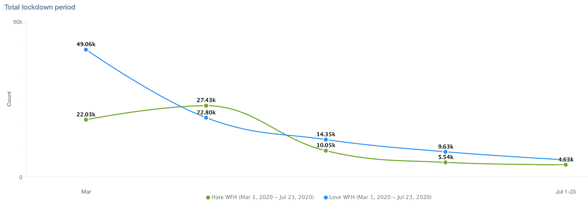
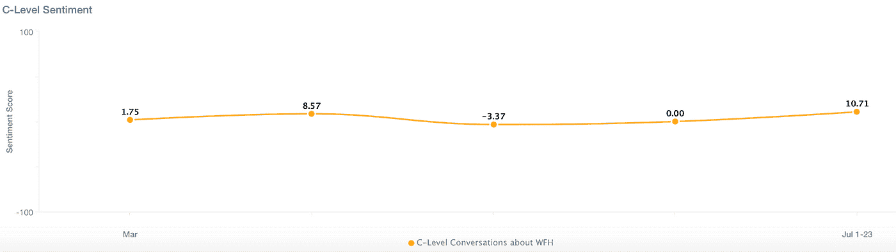

# 在家工作是永久的转变吗？社交媒体数据告诉我们什么

> 原文：<https://medium.datadriveninvestor.com/is-working-from-home-a-permanent-shift-what-social-media-data-tells-us-5edb200c5519?source=collection_archive---------14----------------------->

一位客户让我尝试使用社交媒体数据预测，在新冠肺炎危机最糟糕的时期结束后，公司是否会开始允许员工永久在家工作。

这个问题对多个行业都有重大影响:

*   零售老板们需要决定是重开他们的市中心商店，还是投资于离人们生活更近的“社区”商店
*   市中心的咖啡馆、酒吧和午餐场所需要决定是重新开业还是认输
*   那些押注房地产的人想知道，未来是否还需要商业办公空间，人们是否还会为市中心的公寓支付过高的价格。

而这仅仅是开始。构成供应商生态系统的数千家公司也将感受到对这些行业的永久性冲击——这些公司的高管迫切需要知道牌会落在哪边。例如，如果你提供用于商业建筑隔热材料的化学物质，你是否应该假设人们很快就会重返工作岗位，生产正常数量的化学物质？或者，在知道许多办公楼很可能会被废弃的情况下，你是否应该削减产量？

我没有水晶球，但我至少可以根据人们在社交媒体上发布的内容，了解他们对在家工作的普遍感受。当我向我的客户暗示这一决定最终将属于公司而不是员工时(因此衡量人们在社交媒体上的感受具有可疑的价值)，他认为如果员工强烈希望在家工作，他们会长期实现这一目标。

 [## 区块链驱动的社交媒体 2.0 能取代脸书吗？数据驱动的投资者

### 到 2021 年，活跃的社交媒体用户的数量预计将达到令人难以置信的水平，超过三分之一的…

www.datadriveninvestor.com](https://www.datadriveninvestor.com/2019/03/20/could-blockchain-powered-social-media-2-0-dethrone-facebook/) 

如果我们使用这个(未经证实但似乎合理的)前提，那么我们可以说，围绕 WFH 的情绪是一个领先指标，有助于预测公司是否会永久转向更灵活的远程工作政策。

快速浏览一下英语社交媒体，我们会发现:

我的数据池由推特、脸书和论坛组成。我查看了从 3 月 1 日到今天发布的大约 17 万条帖子。为了建立我的“讨厌 WFH”搜索，我寻找那些在同一个句子中谈论在家工作的人，比如“讨厌”、“糟糕”或“效率低下”在我的“爱 WFH”搜索中，我使用了“爱”、“快乐”和“更有成效”这样的词

对于我们这些喜欢在家工作的人来说，坏消息是积极情绪正在消退。起初人们非常热情，但是随着时间一个月一个月的过去，越来越少的人走上社交网络来告诉世界他们有多快乐。

这在一定程度上是不可避免的，因为人们逐渐习惯了这种情况，不再觉得有必要表达自己的感受，但这种轨迹对爱情 WFH 情绪不利。如果你看看每月的变化率，你会发现从 6 月到 7 月，爱 WFH 的帖子下降了 32%，而恨 WFH 的帖子只下降了 16%，这表明那些在恨 WFH 阵营的人对自己的立场更加坚定。

相反，我们可以假设决策将由公司而不是工人单方面做出，并观察高管们如何谈论这一概念。

以下是基于约 1000 名 C-Level 高管的 Twitter 账户得出的关于在家工作的平均看法:

高管们似乎还没有决定——起初他们对这个想法持开放态度，但随着时间的推移，他们变得越来越怀疑。最近，随着新冠肺炎的拖延时间超过许多人最初的预期，他们似乎又回到了这个概念上。

所以总而言之，我没有一个确定的答案告诉我的客户。我们还需要几个月的时间来观察“爱 WFH”这条线是否会继续以目前的速度下降。

不过，我的直觉是，在安全的情况下，我们中的许多人会回到办公室，因为我不相信人们对这个问题有足够强烈的感受，以至于真的发起一场集体斗争，推动重大的结构性变革。随着失业人数预计将进一步上升，工人们在谈判工作条件时的筹码将比过去更少，我怀疑他们不会愿意节外生枝，这样他们就可以继续在家工作。

这是爱尔·WFH 的悲观看法。也许相反，雇主会看到，即使我们大多数人都陷入孤立，业务或多或少照常进行，生产力水平保持不变，甚至有所提高，因为我们在办公室花更少的时间通勤或进行无意义的谈话，而是掌握了在家进行多任务处理的艺术。

也许我最好在太多高管阅读这篇文章之前，利用社交媒体来表达自己！我会尽量记得在秋季开始时发布更新，这样我们就可以看到情绪最终落在这个问题上。

## 获得专家视图— [订阅 DDI 英特尔](https://datadriveninvestor.com/ddi-intel)