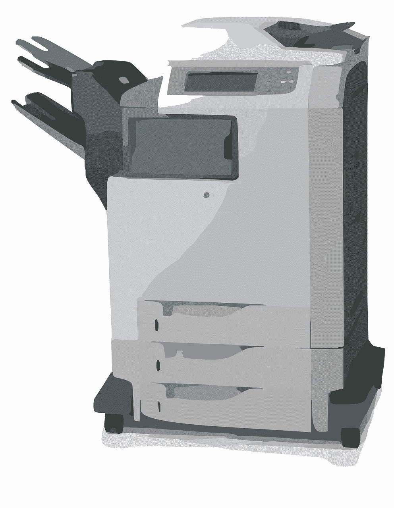
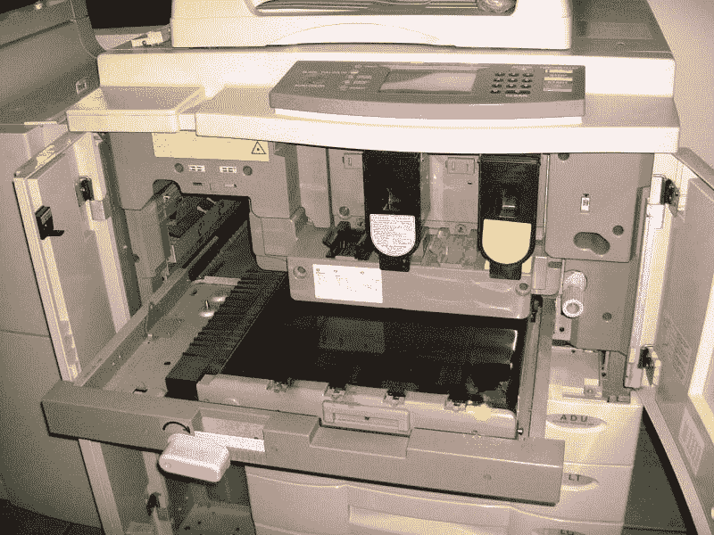
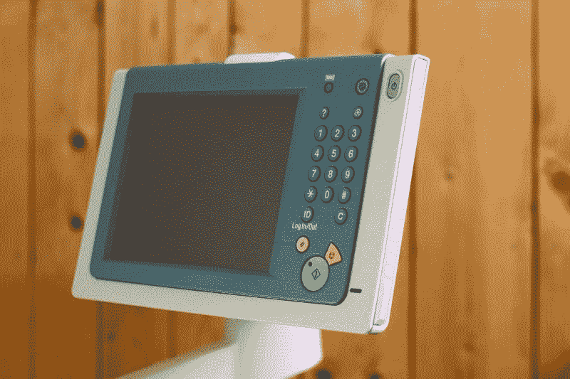

# 施乐公司(纽约证券交易所代码:XRX)赚钱吗？—市场疯人院

> 原文：<https://medium.datadriveninvestor.com/is-xerox-nyse-xrx-making-money-market-mad-house-c1471372fd3e?source=collection_archive---------6----------------------->

施乐公司(纽约证券交易所代码:XRX) 是最近比较有争议的价值投资之一。

几个月前，施乐的价值足以让 T2 惠普公司出价 300 亿美元收购 T3。然而今天，**李维·史特劳斯**首席执行官兼惠普董事会成员[奇普·伯格](https://seekingalpha.com/news/3585806-hp-director-says-xerox-was-wrong-deal)告诉美国消费者新闻与商业频道，他认为拥有施乐可能会让惠普破产。

具体来说，施乐的业务如此依赖物理办公室，以至于伯格认为施乐无法在冠状病毒导致的大规模工作场所关闭中存活下来。解释一下，施乐的业务是复印机和打印机的制造和维修。

对于 40 岁以下的人来说，复印机是一种可以复印文件的机器。因此，施乐的业务是纸质文件。

 [## 利用股市相关性的最佳方式|数据驱动的投资者

### 当阿尔弗雷德·温斯洛·琼斯开创了世界上第一个“对冲”基金(后来“d”被去掉了)时，他让其他投资者大吃一惊…

www.datadriveninvestor.com](https://www.datadriveninvestor.com/2020/02/02/the-best-way-to-use-stock-market-correlations/) 

因此，需要施乐服务的人越来越少，因为由于冠状病毒，数千万办公室工作人员在家工作，只使用数字文件。因此，对于许多专业人士来说，施乐正在随着实体办公室的消亡而消亡。

# 施乐是价值投资吗？

另一方面，我认为有些人会考虑施乐控股公司(纽约证券交易所:XRX) 的价值投资，因为它的价格。

解释一下，市场先生在 2020 年 1 月 2 日为施乐支付了 36.93 美元；施乐 2020 年 6 月 26 日 15.06 美元，XRX 2020 年 6 月 30 日 15.29 美元。因此，施乐在六个月内损失了超过一半的股价。

因此，如果复印机和打印机市场复苏，施乐的股价可能会上涨 50%。另一方面，如果疫情持续下去，人们不再回到办公室，施乐可能会失去它剩下的价值。

因此，如果复印机和打印机市场复苏，施乐的股价可能会上涨 50%。另一方面，如果疫情持续下去，人们不再回到办公室，施乐可能会失去它剩下的价值。

此外，冠状病毒爆发后，许多公司可能会将许多或大多数办公室工作人员转移到家中工作，以节省资金。因此，施乐的业务永远无法恢复。

# 施乐赚钱吗？

疫情开始时，施乐公司赚了一点钱。事实上，**施乐公司(纽约证券交易所:XRX)** 报告称，2020 年 3 月 31 日，其季度收入为 18.6 亿美元，季度利润为 7.12 亿美元。

相反，施乐公司公布同一季度的普通净亏损为-200 万美元。然而施乐公司也公布了 7000 万美元的营业收入。

施乐在冠状病毒时代赚了些钱。值得注意的是，施乐公司报告 2020 年 3 月 31 日的运营现金流为 1.73 亿美元，期末现金流为 26.65 亿美元。因此，施乐在同一天拥有 26.62 亿美元的现金和短期投资。

因此，就其股价而言，我认为施乐是一家现金充裕的公司。我猜施乐公司是通过出租复印机和其他设备来赚钱的。

不利的一面是，随着公司取消复印机租赁，施乐可能会失去这些现金。解释一下，没有一个负责任的经理会为一台在空荡荡的办公室里积满灰尘的复印机支付租金。

# 施乐是红利交易吗？

股息投资者会发现施乐很有趣，因为它很便宜，并将在 2020 年 7 月 31 日支付 25₵季度股息。

总体而言，Dividend.com[给予施乐](#tm=3-ticker-best-div-capture&r=ES::DividendStock::Stock%23XRX--NYSE&f_28=true&only=meta,data,thead)1 美元的年化股息，2020 年 6 月 30 日的股息收益率为 6.64%。因此，如果股息继续下去，投资者每年可以从施乐公司的股票中获得 1 美元。然而，施乐的股息仅增长了一年。

因此，施乐是一种廉价的股息股票。然而，我对施乐持怀疑态度，因为它的业务正在崩溃。因此，如果公司资金告罄，施乐公司的股息可能会随时终止。

# 为什么施乐是一项风险投资？

尽管有投资，我还是建议不要购买施乐。我认为这只股票风险太大，因为拥有施乐是在赌冠状病毒后世界会回到 2020 年前的状况。

特别是，施乐的所有者打赌，冠状病毒之后，大多数工人将返回办公室。我发现这种情况是不现实的，因为公司不必提供办公空间就能省下一大笔钱。

例如，一家不提供办公空间的公司不会支付复印机、休息室、秘书或接待员、安全、保险、饮水机、办公用品和办公家具租赁的费用。此外，公司可以省去租赁办公空间的费用。

# 办公室死了吗？

因此，公司可以通过让员工在家工作来省钱。我认为，如果公司通过让大多数办公室职员呆在家里来保持生产力，考验就会到来。

任何一位 CEO 看到自己的公司运转顺利，大部分员工都在家办公，都会奇怪为什么公司要花钱买办公室。首席执行官可能会想，我们为什么不卖掉办公室，把花在办公室上的钱再投资到能为公司赚钱的项目上呢？

例如，制造商可以将办公室租赁资金再投资于购买更多的机器或增加生产。因此，制造商可以增加产量和收入。

# 施乐的生存之战

我认为，随着冠状病毒疫情的持续，更多的高管会提出这样的问题。我预测疫情持续的时间越长，经济就会收缩得越厉害。在这种情况下，大多数公司将削减开支，办公室和复印机是显而易见的开支。

在这种情况下，施乐需要调整业务来赚钱。施乐可以做出的一个明显的调整是，向在家工作的员工或支持在家工作的公司(如复印店)销售更多的产品。

施乐明年将面临一场生存之战。聪明的投资者不会参与这场战斗。我对施乐股票的建议是暂时避开它，但明年再来看看。重新考虑施乐公司(NSYE: XRX) 如果它明年还能保值并赚钱。

*原载于 2020 年 6 月 30 日*[*【https://marketmadhouse.com】*](https://marketmadhouse.com/is-xerox-nyse-xrx-making-money/)*。*

**访问专家视图—** [**订阅 DDI 英特尔**](https://datadriveninvestor.com/ddi-intel)