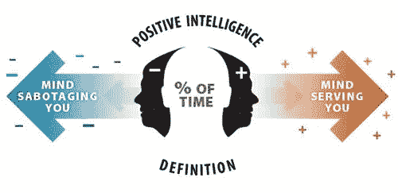

# 你的大脑是朋友还是敌人？让它成为你积极智慧的朋友

> 原文：<https://medium.datadriveninvestor.com/is-your-brain-friend-or-foe-e2a30703ed43?source=collection_archive---------3----------------------->

“如果你花很多时间在自己的脑袋里，你就是在一个糟糕的社区里度过的。”

当我的朋友说出那句话时，我正陷入一点担忧和自我怀疑之中。我的脑海里立刻浮现出一幅正在倒塌的长袍建筑、用木板封住的门窗、杂草丛生的院子和空荡荡的街道的画面(基本上是 20 世纪 80 年代的克利夫兰市中心)。

“伙计，我不想呆在这里！”我说，可能有点太大声了。

我认识的每个人都在他们糟糕的社区呆了很长时间。这是我们生活的这个世界的后果——更多的需求、责任和期望遭遇更大的不确定性、更少的选择和更弱的安全网。

有很多方法可以美化我们的社区，培养一种成长的心态是其中之一。作者兼高管教练 Shirzad Chamine 在他的书《积极智能:为什么只有 20%的团队和个人实现了他们的真正潜力，你如何才能实现你的潜力》中提出了一个强大的框架和行动计划，通过提高你的 PQ(积极智商)来建立你的积极智能。

## **我为什么要关心积极智力？**

因为研究证明，高智商能创造更好的结果

*   对 200 多项不同的科学研究进行了分析，这些研究总共测试了 275，000 多人，结果表明，较高的智商会带来较高的薪水，并在工作、婚姻、健康、社交、友谊和创造力方面取得更大的成功
*   PQ 较高的销售人员比 PQ 较低的销售人员多销售 37%
*   由高 PQ 经理管理的项目团队表现好 31%
*   智商高的医生做出准确诊断的速度要快 19%
*   在 20 多岁时表现出高智商的人(根据日记记载)平均会多活 10 年

更好的销售，更好的性能，更好的健康，更长的寿命。

似乎是值得学习的东西。

## **什么是正向智力和 PQ？**

Chamine 将积极智力定义为“你对自己思想的控制力，以及你的思想在多大程度上符合你的最佳利益。”基本上，你的思想是什么样的邻里关系。

PQ，也就是你的正智商，是“你的大脑作为你的朋友而不是敌人的时间百分比。”它用 0 到 100 的标度来表示，研究表明，75 的 PQ(意味着你的思想在 75%的时间里是你的朋友或好邻居)是一个临界点。“在它之上，你通常会被头脑的内部动力所提升，在它之下，你会不断地被这些动力所拖累。”80%的团队和个人得分低于临界点。

## **如何提高你的 PQ**

高智商人群使用以下三种策略中的一种或多种:

**策略 1:削弱你的破坏者**

破坏者，也称为内在批评者，是你头脑中与你作对的声音、信念和假设。

有 10 个，每个人至少有两个在喋喋不休

1. ***法官:*** 每个人脑袋里的“大师”破坏者。它不断地在你、他人、你的环境以及任何它能找到的事物中寻找缺点。

2. ***回避者:*** 着眼于积极愉快，避免处理困难和不愉快的任务、冲突和人。

3. ***控制者:*** 负责，寻求使人们屈从于它的意志，因为它相信从人和环境中获得最佳结果的唯一方法是控制他们

4. ***成功人士:*** 依靠不断的外部奖励、认可和表扬来获得自尊和自我肯定

5. ***超理性:*** 强调逻辑和理性是理解人和情况的唯一手段，往往会导致不耐烦或对被认为不符合逻辑的人或事不予理睬

6. ***高度警惕:*** 每时每刻都看到威胁，时刻保持警惕，为最坏的情况做准备

7. ***取悦者:*** 寻求通过不断帮助、取悦、拯救或奉承他人来获得认可和喜爱

8. ***焦躁不安:*** 寻找下一次冒险、新事物或肾上腺素激增，从重要的关系和工作中分心

9.*坚持者:需要完美、秩序和组织，以至于让每个人都焦虑和紧张*

*10. ***受害者:*** 通过关注内心的感受，尤其是负面的感受，获得关注和喜爱*

*为了削弱你的破坏者，你需要首先确定哪个(哪些)是当前活跃的，然后识别它告诉你的故事(通常，这个故事会看起来很有帮助，所以这一部分很棘手)，然后要么喊出来(“哦，又是你，编故事”)要么感谢它(“谢谢你试图保护我的安全。我有这个。")*

***策略二:强化你的圣人***

*圣人*的视角*本质上是法官的对立面。尽管法官发现所有事情都是错的(或可能是错的)，圣人却接受每一件事情作为礼物或机会。*

*好吧，我知道这听起来像是某种新时代的求爱，尤其是在新冠肺炎及其对我们生活中每一件事的影响中。Chamine 的高管客户对此也持怀疑态度，这就是为什么他教他们三种礼物技巧——写下可怕的事情，然后写下它在未来某个时候可能变成礼物或机会的三种方式。*

*你可以通过使用鼠尾草 5 种力量中的一种(或多种)来强化你的鼠尾草:*

*1.*

***2.当情况复杂或者你想在做决定前获得更多信息时，假装自己是一个着迷的人类学家，通过提问来寻找信息***

***3. ***创新:*** 当通常的答案不起作用时，采取创新者的心态，用“是的……来迎接想法。而且……”***

***4.***

*****5. ***激活*** :当你的破坏者控制了局面，先发制人，记下他们*可能会说的一切*，并识别、回应和感谢他们。*****

*******策略三:强化你的 PQ 大脑*******

*****你的 PQ 大脑由中间前额叶皮层、右脑、镜像神经元系统、ACC 和岛叶皮层组成(后三个区域控制你的移情反应)。*****

*****强化你的 PQ 大脑就像把你所有的注意力集中在你的身体和/或你的五种感官中至少一种的体验上一样“简单”,持续 21 天，每天至少 10 秒 100 次*****

*****是的，每天 100 次听起来很多，所以 Chamine 提供了一些提示:*****

*   *****例如，在日常生活中，当你刷牙时，关注牙刷摩擦牙龈的感觉*****
*   *****健身的时候*****
*   *****吃饭前还是吃饭时*****
*   *****当你听音乐的时候*****
*   *****当你在运动时(包括电子竞技)*****
*   *****与朋友和家人在一起*****

## *******底线*******

*****数据证明，积极的智力对你在工作、人际关系和生活中的表现有着真实而切实的影响。这本书包含了各种案例故事来展示积极智能在行动中的力量。更好的是，它提供了一个易于理解的框架和完全可行的方法来让积极的智能为你工作。*****

*****要了解更多关于积极智能的信息，请访问 Shirzad Chamine 的网站[这里](https://www.positiveintelligence.com/)。*****

*****要购买这本书，你可以从独立在线书店[书店](https://bookshop.org/books/positive-intelligence-why-only-20-of-teams-and-individuals-achieve-their-true-potential-and-how-you-can-achieve-yours/9781608322787)或[书店](https://www.indiebound.org/book/9781608322787)购买，或者在亚马逊或 [Barnes & Noble 购买。](https://www.barnesandnoble.com/w/positive-intelligence-shirzad-chamine/1104926941)*****

******Robyn M. Bolton 是 MileZero* *的创始人&首席导航员，她与大型组织的高管合作，超越创新理论和戏剧，以释放组织的潜力，创造真正的变化，并获得真正的结果。你可以在*[*www . mile zero . io*](http://www.milezero.io/)阅读更多关于她和她的作品*****