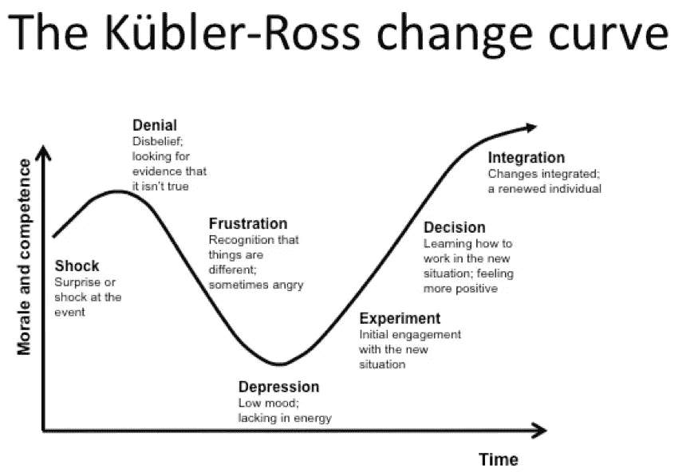

# 你的企业对变化做出反应了吗？

> 原文：<https://medium.datadriveninvestor.com/is-your-business-reacting-or-responding-to-change-59943c448520?source=collection_archive---------17----------------------->

当 COVID 19 正在全球传播，我们大多数人都处于一级防范状态时，讨论这个问题可能听起来很奇怪，但变化可能令人兴奋。

试着回忆你开始一个新项目的时候:想想你报名参加大师班最终征服墨西哥美食的时候，想想你混合面粉和水生下你的第一个发令员的时候，想想你决定你还太小不能跑 5 公里并买了那些新鞋的时候。在现实生活中，事情往往比我们想象的要稍微复杂一些，但是当我们决定致力于一个新的开始时，我们会感到兴奋和充满力量。

如果改变不是我们的选择，并且它对我们的影响不是有利的，那么改变是不受欢迎的，它是糟糕的。

在你问自己是否会对变化做出反应或回应之前，最好先概述一下反应和回应之间的区别。这两个术语通常可以互换使用，但它们有不同的含义。

反应是本能的，由我们大脑中调节战斗或逃跑模式的部分控制，而反应是随着时间的推移而产生的有意回答，尽管它仍然会考虑我们无意识的想法、感觉和价值观，但它主要是基于事实和逻辑思维。

 [## 将爱好展示变成赚钱机器|数据驱动的投资者

### 这是造梦者奥斯卡·冈萨雷斯响应号召的地方。他是一名独立的在家工作的顾问，担任…

www.datadriveninvestor.com](https://www.datadriveninvestor.com/2020/02/14/turn-hobby-showcase-into-money-maker/) 

事实上，事情比这还要复杂。当面对变化或悲伤时，我们会经历一系列的情绪，精神病学家伊丽莎白·库伯勒·罗斯用下图概括了这些情绪:

虽然我不想完全解开每个阶段，但关键是我们对变化的反应不是线性的，反应和回应之间的界限可能会模糊。

从我与客户打交道的经验来看，我认为我们经常会经历几次周期中的初始阶段，然后才到达另一端。

没有足够的时间来做出回应。在最初的震惊之后，当你认为恐惧和焦虑已经消散，你可能仍然没有准备好做出好的商业决策。

对你的企业来说，你能做的最好的事情就是要有自知之明。虽然你无法避免对变化做出反应，但你可以避免做出源于恐惧、否认、沮丧或悲观的决定，并给自己时间来制定适当的应对措施。

当面对变化和不确定性时，是时候让你的价值观来引导你了:你的品牌代表什么？这将如何影响你的适应方式？

从教练、导师或顾问那里寻求指导，并把他们作为讨论你的业务的共鸣板，可以帮助你更加清晰。

接触你的客户、合作伙伴和社区将为你提供所需的支持和信息，帮助你制定计划、发现机会并了解如何在这种新环境下提供最佳服务。

你已经完成了所有这些步骤，还是仍然处于反应模式？