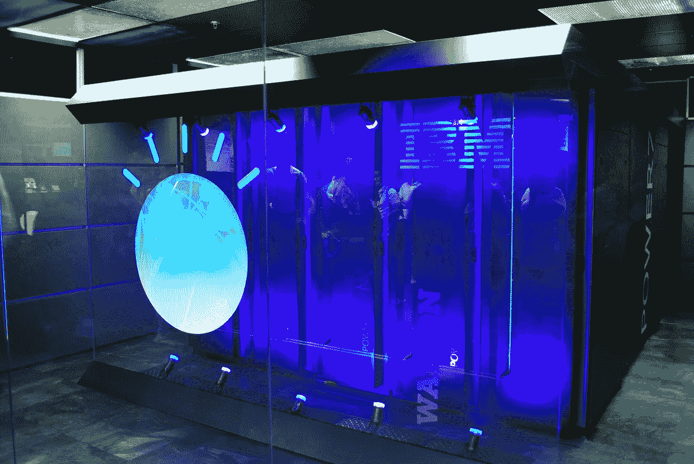

# 你们公司准备好用 AI 了吗？

> 原文：<https://medium.datadriveninvestor.com/is-your-company-ready-to-use-ai-c41e599fac7f?source=collection_archive---------19----------------------->

人工智能(AI)和机器学习——这些术语不再是未来的理论，而是获得了真正的应用。福布斯 Insights 民意调查以及戴尔技术和英特尔显示，人工智能是数字化发展的关键组成部分，但只有四分之一的受访 CxO(首席体验官)表示他们已经在公司实施了这些技术。组织中 AI 渗透率如此之低的原因是什么，你的公司准备好使用机器学习了吗？在这篇文章中，我们将分享我们对 AI 对企业的影响以及如何更快地实施它的想法。

在过去的 50 年里，企业一直在积极地实现流程自动化。在不久的将来，我们将完全摆脱人工处理信息的方式，取而代之的是能够高速处理大量信息的自主系统。如果企业接受数字现实，并在工作中引入新技术，它将能够显著提高生产率和财务效率。现在仅仅生产一种产品或服务是不够的，重要的是与消费者建立沟通。只有客户才能评价所提供的服务，并对自己的工作做出结论。因此，根据用户体验改进产品成为有效开展业务的关键。这适用于 B2B 和 B2C 公司。

 [## 人工智能和监督资本主义|数据驱动的投资者

### 大科技，总是现在:人工智能推动的大科技，已经使购物，搜索，在你的…

www.datadriveninvestor.com](https://www.datadriveninvestor.com/2020/03/04/on-artificial-intelligence-and-surveillance-capitalism/) 

自动化、灵活性、简单性是必须明确整合到任何组织流程中的术语。由于资源的有效利用，您的公司将提高客户忠诚度，并将比其他市场参与者具有竞争优势。为了明天开始使用机器学习并获得收益，有哪些必要条件？

*   创建或调整你在自动化过程中的角色，并灌输新的企业文化。
*   组建一个由专家组成的思想团队，准备面对掌握新技术的困难。
*   为人工智能训练准备数据。
*   选择一个提供 AI 即服务的机器学习平台或服务提供商，或者开发自己的解决方案。
*   培训你自己的专家，因为在市场上寻找专家是非常昂贵的。
*   运行、测试和实施项目。

# 从理论到实践

现在我们来谈谈那些在战略中有效运用新技术的公司。

**谷歌——神经网络**

该公司最重大的成就是在 DeepMind 中创造了可以做梦和创建不同寻常图像的机器。

谷歌致力于探索机器学习的各个方面，这有助于该公司改进经典算法，以及更有效地处理自然语音并进行翻译，改善排名和预测系统。

**Pinterest——内容搜索**

Pinterest 社交网络的主要功能是内容监管。而且公司正在尽一切可能提高这个过程的效率，包括使用机器学习。

如今，机器学习涉及到 Pinterest 业务运营的方方面面，从垃圾邮件和内容搜索的审核到广告货币化和减少新闻通讯的退订数量。

**IBM——下一代医疗保健**

最大的技术公司 IBM 正在放弃过时的商业模式，积极探索新的方向。该品牌如今最著名的产品是沃森人工智能。

在过去的几年里，沃森已经被用于医院和医疗中心，在那里它比肿瘤学家更有效地诊断了某些类型的癌症。

沃森还拥有巨大的零售潜力，可以充当顾问。IBM 提供其基于许可证的产品，使其独一无二且价格合理。

# 人工智能未来。

**1。学习效率更高的机器**

很快，人工智能将能够更有效地学习:机器将在最少人工参与的情况下改进。

**2。对抗网络攻击的自动化**

网络犯罪的增加迫使公司考虑防御措施。很快，人工智能将在监控、预防和应对网络攻击方面发挥越来越重要的作用。

**3。令人信服的生成模型**

很快我们将根本无法区分机器和人。在未来，算法将能够创建图片，模仿人类语言，甚至整个人格。

**4。快速训练**

即使是最复杂的人工智能也需要海量的数据进行训练。很快，机器学习系统将需要越来越少的信息和时间。

# 机器学习中的黑与白

但是，不幸的是，这些技术并不完美，人类对其实施的怀疑仍然很高。IDC 的一份最新报告声称，在可预见的未来，人工智能和机器学习将使生产力提高 4 倍，250 万个工业机器人将在世界各地的行业中工作。2020 年，大约 30%的办公室工作将实现自动化，到 2021 年，20%的企业应用程序将使用 AI 工作。

这听起来很棒，但在实践中，大多数公司仍然使用手工劳动来处理数据。他们的企业文化、惰性和不愿意应用新技术阻碍了业务发展。

*最初发表于*[*【https://geniusee.com】*](https://geniusee.com/single-blog/is-your-company-ready-to-use-ai)*。*