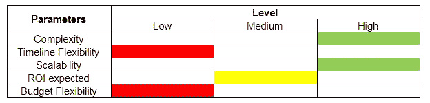
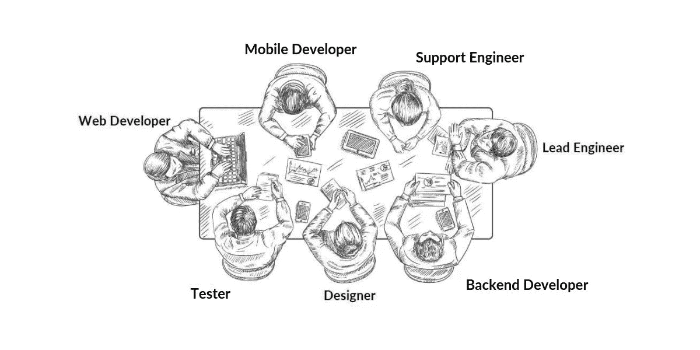

# 你的手机 App 开发预算现实吗？

> 原文：<https://medium.datadriveninvestor.com/is-your-mobile-app-development-budget-realistic-2f76ab77a227?source=collection_archive---------12----------------------->

> “问题”对人类的成长很重要。更正:识别问题是人类成长的必要条件。

如果我们没有认识到改变的需要，那么旧的系统、过程和弊端将会继续存在，最终，进化将会停止。同样，如果手机 app 开发预算不靠谱，也会影响整个业务流程。

# 你的组织文化鼓励对“问题”的不断探索吗？

***如果是的话，那么恭喜你，你还在成长为一家企业。随着问题而来的是解决方案。***

有时候，在引入可靠的解决方案之前，我们甚至没有意识到存在问题。

一个由移动应用开发公司[塑造的绝妙想法，总能将你的业务带到新的高度。](https://www.signitysolutions.com/mobile-app-development)

 [## 2020 年移动应用发展趋势|数据驱动的投资者

### 不可否认的事实是，智能手机正在改变运营模式、商业模式和市场…

www.datadriveninvestor.com](https://www.datadriveninvestor.com/2020/01/15/mobile-app-development-trends-to-follow-in-2020/) 

一个好的移动应用程序开发公司可以帮助你制定一个现实的移动应用程序开发预算，这样你就可以带来创新。

例如，出租车聚合应用程序使同城通勤变得轻而易举，或者数字钱包应用程序使我们的货币交易变得如此轻松。注意到现有系统需要一个解决方案并付诸行动的人成为了变革的倡导者。同样，你也可以成为企业的变革冠军。

> 你知道新西兰的移动应用公司以创新为基础，并在世界舞台上成功竞争吗？这是因为他们相信为客户积累经验，并以提供最好的服务为使命。

根据 [Clutch](https://clutch.co/app-developers/resources/list-of-mobile-app-statistics) 的一项调查，“70%的 app 开发公司在跳转到开发阶段之前，会在发现阶段进行投资。大多数公司在发现阶段花费 5000 美元。

而应用测试和部署平均花费 10，000 美元。此外，应用程序维护平均每年花费 10，000 美元，而大多数项目的规模在 5000 美元到 10，000 美元之间。

## **你在找专家开发你的手机应用吗？要了解印度和美国最好的移动应用程序开发，你需要探索许多公司和他们的应用程序。**

但是，在进入顶级服务应用的数据和代码世界之前，有一些关键步骤要遵循。最重要的一步是确定移动应用解决方案的预算。

> “成本效益分析”是商业成功的不二法门。有时，为了将成本最小化，将收益最大化，我们为移动应用开发设定了一个非常不切实际的预算。

# 本文将带您了解移动应用程序开发预算的各个财务方面。

# 1.要求

决定应用程序开发成本的最大因素是业务需求。大多数情况下，预算估计不切实际，因为客户不清楚他们到底想要什么。所以，把手机 app 的所有功能和特点罗列出来是非常重要的。

除此之外，利用你的关系网，尽可能多地联系开发人员。印度顶尖的移动应用公司会分析你的需求，然后进一步推进流程。因此，他们提供了可靠的移动应用程序开发预算。

理解该流程并了解确定解决方案预算的关键参数至关重要。有了基本的想法后，你应该能画出一个表格，如下所示:

此表将帮助您在使用[企业移动解决方案](https://www.signitysolutions.com/enterprise-mobility-solutions) **的整个开发过程中保持正轨。**

如上例所示，解决方案的高度复杂性可能会迫使您为解决方案花费额外的资金，而时间表和预算一旦确定，就不容易更改。这个过程会给你的思考过程指明方向，同时确定要投资的资金。

# 2.发展过程

在拿出固定金额之前，您需要对您选择的印度移动开发公司的开发流程有一些基本的了解。如果你知道你要做什么，你会对你的数字更有信心。基本开发过程将包括以下阶段:

## StageName &这里发生了什么？

**1。研究和框架:**在你分析了你的市场和印度移动应用用户的行为之后；您可以以文档或演示文稿的形式创建概念或功能列表。

在这一阶段，供应商将分析您的需求，缩小技术要求和任务的范围，并将准备一个原型(UX)。

**2。App 设计:**调研了印度顶尖的 app 开发公司，带上开发机构入伙后；你需要让他们开始设计你的应用程序。

各种工具，如 vision 和 Adobe Experience Design 等。可用于为您提供几乎真实的应用外观。

它可以经历各种迭代，直到由您最终确定。记住设计和风格是你企业品牌的重要组成部分。

**3。后端开发:**印度顶尖的 app 开发公司一般都是从后端开发开始，与正在进行的设计阶段并行。也有必要让后端开发领先前端开发几个星期。

**4。前端开发:**设计一敲定。开发人员将继续进行前端开发。因此；客户和供应商的协作方法对于监控里程碑的及时完成是必要的。

**5。支持和维护:**尽管测试通常贯穿于整个开发过程。保证产品质量是必要的。

为此；企业移动应用程序开发预算可能会有所不同。移动应用程序开发服务在一定时间内提供发布后支持和维护。这对于业务满意度非常重要。

> 相关阅读:【2020 年移动应用开发成本综合指南

# 3.团队

要了解印度的应用开发者成本，请联系您选择的[移动服务提供商](https://www.signitysolutions.com/mobility-solutions/)。他们会给你一个最终的数字，作为他们报价的总成本。

它以团队为基础，移动应用开发公司将参与整个过程。数量取决于人力资源总数的基础和他们在整个过程中各自的努力。

**通常，美国和印度的顶级移动应用公司在开发团队中包括以下成员:**

*   设计师
*   移动开发者
*   后端开发人员
*   试验装置
*   Web 开发人员(应用程序的管理部分)
*   首席工程师
*   支持(发布后维护)

美国[和印度](https://www.signitysolutions.com/mobile-app-development-company-usa)最佳移动应用开发公司可能会根据相关团队的工作经验收费。你的团队越有经验，你在整个开发过程中的旅程就越顺利。

与有经验的团队一起工作，让他们更好地理解解决方案变得更加容易。因此，你的预算也需要考虑团队的这个方面。

# 4.解决方案的类型

有趣的是，荷兰(欧洲部分)的各种移动应用公司根据应用的成本提供不同的移动解决方案。

解决方案和技术是成本的主要驱动因素。任何应用程序的典型功能都可以分为以下几类:

## a)用户认证应用程序:

这些应用程序很复杂，因为用户身份验证之后是数据收集、数据存储和分析。这些功能还支持设备间的数据同步和推送通知。

因此，这些特征会增加成本。寻找移动应用的公司应该突出考虑这个因素。

## b)社交网络应用程序:

如果你的想法是围绕社交媒体平台的开发，那么它需要从一开始就处理大量数据的能力。

社交媒体应用的成功仅仅取决于活跃用户的数量。因此，您的应用需要大数据分析和高容量数据服务器。

## c)电子商务应用程序:

你想在网上做生意吗？还是想在数字化平台上创业？无论如何，这种解决方案需要与数字支付系统集成。

例如，印度的[移动应用开发公司](https://www.signitysolutions.com/)将帮助你整合流行的数字钱包，如 Paytm、BHIM UPI 和 Freecharge 等。以及与印度受欢迎的合作银行的信用/借记/网上银行支付服务。

## d)游戏应用程序:

不用说，这种类型的应用程序对图形的要求很高。移动应用程序开发预算将涉及高昂的设计成本，因为美学对于吸引用户来说是极其必要的。

此外，游戏应用程序需要在用户体验上做很多工作，这可能涉及很多迭代。

因此，这是一个长期项目，在这些类型的解决方案中，预算灵活性应该很高。此外，**为 iPhone** 和 Android 开发应用的公司收费更高。

> 相关阅读:【2020 年 7 大跨平台框架:移动应用开发变得简单

## e)基于物联网的应用:

涉及物联网和智能设备等尖端技术的硬件依赖型应用程序需要一些专家参与。因此，这些解决方案需要大量资金来实施。

但如果你对自己的解决方案很有信心，相信投资在应用程序上的钱可以带来高回报，那么绝对值得冒这个险。

# 5.正确的外包

无论你花多少时间分析和研究“印度顶级移动应用开发商”，最终的数字只有在你和开发公司之间的对话后才能确定。

因此，你需要首先搜索美国和印度排名前 10 的应用程序开发公司，找出一家可以信赖的公司。

> 相关阅读:[2020 年 IT 外包的优势、风险、&挑战](https://www.signitysolutions.com/blog/it-outsourcing-benefits-risks-challenges/)

此外，还可以建立长期关系，并以尽可能优惠的价格为您提供应用。以及可靠的移动应用开发预算。

只要公司能够交付，你是否在印度、中国或你的祖国外包移动应用程序开发并不重要。查看他们以前的工作和目前的项目。符合您的要求和能力。

如果你发现他们足够可靠，那么你也可以对你的预算做一些调整。

# 结论

应用程序开发的预算非常类似于固定每月家庭开支的预算。

*   首先，你需要正确地分析你的需求。
*   其次，了解与解决方案相关的成本领域。
*   第三，准备一份最优价格的清单。
*   第四，与提供商协商。最后，确定一个预算并坚持下去。

这并不像听起来那么简单，尤其是如果你不懂计算机和数据系统的语言。这就是为什么制定一个现实的预算需要你付出巨大的努力。

一旦你研究了印度或美国最好的移动应用程序开发公司，并最终选择了适合你的项目的公司。

然后，你需要有足够的信心来了解你对移动应用开发预算和外包合作伙伴的估计。

一旦你下定决心[外包给印度](https://www.signitysolutions.com/your-team-in-india)。一定要调查美国最好的移动应用公司。祝您的项目一切顺利！

## 这篇博客最初发表于 2020 年 7 月 7 日的 [Signity Solutions](https://www.signitysolutions.com/blog/mobile-app-development-budget/) 。

**访问专家视图—** [**订阅 DDI 英特尔**](https://datadriveninvestor.com/ddi-intel)

***申请成为 DDIChat 专家*** [***此处***](https://app.ddichat.com/expertsignup) ***。
使用 DDI 的方法:***[***https://datadriveninvestor.com/collaborate***](https://datadriveninvestor.com/collaborate) ***访问我们的***[***https://www.datadriveninvestor.com/***](https://www.datadriveninvestor.com/)