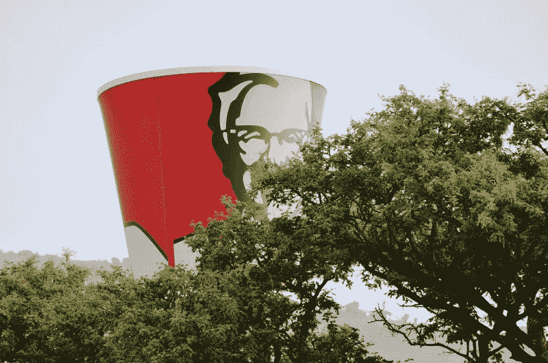

# 百胜中国是快餐中最安全的股票吗？—市场疯人院

> 原文：<https://medium.datadriveninvestor.com/is-yum-china-the-safest-stock-in-fast-food-market-mad-house-d1ca416d62fb?source=collection_archive---------12----------------------->

如今，市场先生押注中国，做空美国。例如，中国最大的快餐运营商**百胜中国(纽约证券交易所:YUMC)** 从 2020 年 1 月 2 日的 49.13 美元涨到 2020 年 7 月 17 日的 52.55 美元。

百胜中国在中华人民共和国经营肯德基、必胜客、Taco 和其他几个快餐品牌。相比之下，**百胜！Brands (NYSE: YUM)** 股价从 2020 年 1 月 2 日的 102.17 美元跌至 2020 年 7 月 13 日的 88.29 美元，再跌至 2020 年 7 月 17 日的 90.57 美元。

好吃！Brands 在中国以外经营肯德基(KFC)、永街、塔可钟等品牌。因此，市场先生为 YUMC 多付了一点，为百胜少付了一点。

# 百胜中国的安全投资者案例

安全投资者支持百胜中国的理由很简单。中国把冠状病毒控制住了，美国；好吃！品牌的核心市场，没有。

2020 年 7 月 17 日，美国在冠状病毒病例(375.1 万)和死亡人数(141，801)方面领先世界，[世界计量机构估计](https://www.worldometers.info/coronavirus/)。相比之下，中国在同一天报告了 83622 例冠状病毒病例和 4634 例死亡。引人注目的是，美国在 2020 年 7 月 17 日报告了 56，226 例新的冠状病毒病例，而中国报告了 10 例新的新冠肺炎病例。

因此，在可预见的未来，美国的百胜餐厅可能会关闭。然而，百胜中国餐厅可能会继续营业并赚钱。

在这种情况下，百胜中国是冠状病毒时代的安全投资。

# 百胜中国的价值投资者案例

价值投资者支持百胜中国的理由很简单。百胜中国在中国 1400 多个城镇经营着 9200 多家餐厅。

引人注目的是，中国有超过 14.39 亿人口，他们都在吃饭。此外，中国是世界第二大经济体，2020 年 5 月国内生产总值(GDP)为 [14.14 万亿](https://www.investopedia.com/insights/worlds-top-economies/)美元。国际货币基金组织预测中国的 GDP 增长率为 5.8%。

中国有几亿人吃得起快餐。中国中产阶级由 4 亿人和 1.4 亿个家庭组成，*中国简报* [估计](#:~:text=1.,third of China's total population.)。因此，大约三分之一的中国人口或 4 亿人有足够的可支配收入购买快餐。

 [## 股票回购以及为什么我们都要为此买单。数据驱动的投资者

### 我们在创纪录的债务负担、地缘政治紧张局势、选举和气候战争的背景下进入 2020 年。连 3 个都没有…

www.datadriveninvestor.com](https://www.datadriveninvestor.com/2020/04/08/stock-buybacks-and-why-we-all-pay-for-them/) 

快餐是发展中国家的人们最先接受的现代奢侈品之一。例如，快餐第一次在美国流行是在 20 世纪 50 年代和 60 年代二战后中产阶级的大规模扩张期间。值得注意的是，他们在上世纪五六十年代创办了肯德基、塔可钟和必胜客。

因此，中国已经具备了快餐繁荣的要素。相比之下，美国可能面临快餐崩溃。解释一下，我认为冠状病毒可能会让一些快餐经营者破产。

# 百胜中国赚钱了吗？

**百胜中国控股有限公司(纽约证券交易所代码:YUMC)** 尽管冠状病毒肆虐，但仍然赚钱。例如，百胜中国在截至 2020 年 3 月 31 日的季度收入为 17.54 亿美元，毛利为 3.71 亿美元。

此外，百胜中国公布同一季度的净利润为 6200 万美元。此外，百胜中国在该季度获得了 6000 万美元的运营现金流。

百胜中国上个季度的期末现金流为 10.57 亿美元。因此，百胜中国在疫情期间产生了现金。

该季度末，百胜中国保留了 15.38 亿美元的现金和短期投资，总资产为 65.77 亿美元。然而，百胜在 2019 年 12 月 31 日报告了 16.57 亿美元的现金和短期投资以及 69.50 亿美元的总资产。

# 百胜中国赚钱少了

百胜中国因为冠状病毒赚钱少了。例如，YUMC 的季度收入从 2019 年 12 月 31 日的 20.29 亿美元下降到三个月后的 17.54 亿美元。

同期，百胜中国的季度毛利从 4.41 亿美元降至 3.71 亿美元。相比之下，百胜中国同期的季度营业收入从 9400 万美元上升至 9700 万美元。相反，百胜中国的季度共同净收入从 2019 年底的 9000 万美元降至 2020 年 3 月的 6200 万美元。

奇怪的是，百胜中国在 2020 年 3 月拥有更多现金，尽管其运营产生的现金较少。具体来说，YUMC 的季度运营现金流从 2019 年 12 月的 1.4 亿美元降至 2020 年 3 月的 6000 万美元。然而，同期，百胜中国的期末现金流从-3.09 亿美元增长至 10.57 亿美元。

# 百胜中国显示快餐将萎缩

我认为，快餐投资者需要注意百胜中国财务中的一个数字。

[Stockrow 估计](https://stockrow.com/YUMC/financials/income/quarterly)百胜中国的收入增长在截至 2020 年 3 月 31 日的季度中下降了-23.87%。相比之下，百胜中国在 2019 年最后一个季度的收入增长为 6.01%。

我认为百胜中国展示了快餐公司在流行病期间的萎缩。反之，**百胜！Brands '(纽约证券交易所:YUM** )的收入在 2020 年的前三个月增长了 0.72%，在 2019 年的最后三个月增长了 8.73%。

我预测百胜餐饮集团下一季度的收入增长将会萎缩。此外，我预计百胜餐饮集团的收入、毛利、营业收入和净收入将在下一季度缩水。这些数字将会减少，因为冠状病毒消灭了百胜。品牌的销售。

此外，我认为由于冠状病毒，百胜餐饮集团在美国的销售不会很快恢复。例如，加州州长加文·纽瑟姆(D-San Francisco)于 2020 年 7 月 13 日关闭了金州的所有室内餐厅服务，以控制新冠肺炎的传播。

令人震惊的是，纽森没有给出餐厅重新开业的日期。因此，百胜餐饮集团和其他快餐店只能在可预见的时间内被外卖。这将有助于淘汰肯德基和必胜客等重点连锁店。然而，它会伤害像塔可钟这样依赖室内餐饮的连锁店。

# 百胜中国是一项安全的投资吗？

归根结底，我预测美国快餐业将迎来糟糕的一年，而中国快餐业将迎来不错的一年。鉴于这一现实，我认为投资者需要调查**百胜中国(纽约证券交易所代码:YUMC)** 。

我认为百胜中国值得调查，因为它在 2020 年 3 月 3 日支付了 12₵季度股息。总的来说，[Dividend.com 估计](https://marketmadhouse.com/is-yum-china-the-safest-stock-in-fast-food/#tm=3-ticker-best-div-capture&r=ES::DividendStock::Stock%23YUMC--NYSE&f_28=true&only=meta,data,thead)百胜中国在 2020 年 7 月 13 日提供 48₵年度股息和 0.93%的股息率。

如果你在寻找一只几乎不受美国冠状病毒危机影响的分红股票，那就去调查百胜中国吧。我认为百胜中国可以帮助你的投资组合接种冠状病毒疫苗。

*原载于 2020 年 7 月 17 日 https://marketmadhouse.com**[*。*](https://marketmadhouse.com/is-yum-china-the-safest-stock-in-fast-food/)*

***访问专家视图—** [**订阅 DDI 英特尔**](https://datadriveninvestor.com/ddi-intel)*