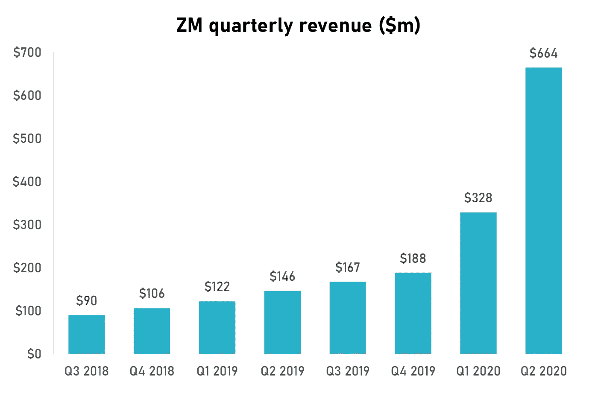
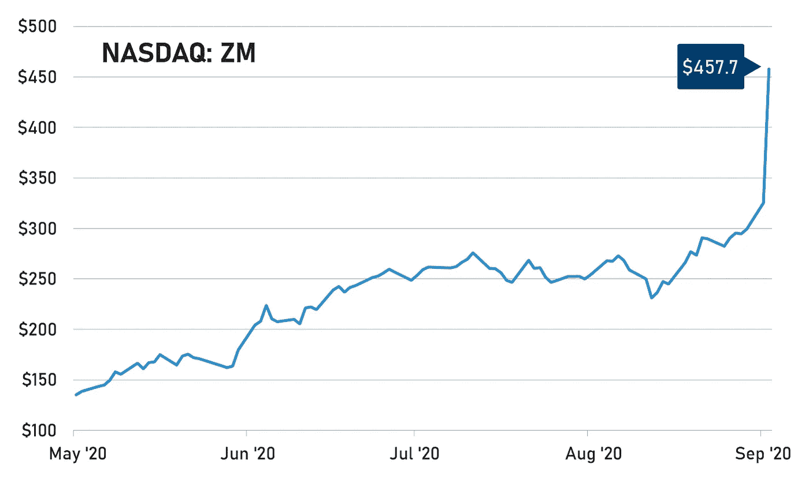

# Zoom 为视频会议军备竞赛做好准备了吗？

> 原文：<https://medium.datadriveninvestor.com/is-zoom-prepared-for-the-video-conferencing-arms-race-d1605ea0b45a?source=collection_archive---------18----------------------->

## 投资者应该警惕来自老牌对手的激烈竞争

Photo by [Charles Deluvio](https://unsplash.com/@charlesdeluvio?utm_source=medium&utm_medium=referral) on [Unsplash](https://unsplash.com?utm_source=medium&utm_medium=referral)

对于 Zoom 的高管来说，这是一个神奇的时刻。没有分析师或记者的刁钻问题，没有让投资者关系团队头疼的奇怪会计决策，也没有让管理层分心的“场外”法律或治理丑闻。这只是一家公司的故事，这家公司发现自己处于技术和文化革命的中心，挺身而出，成为远程工作的英雄。故事的真正英雄——新冠肺炎——几乎不值得一提。这是关于认识到我们的工作方式已经改变。一些企业走在了潮流的前面，而另一些企业注定要落后。

就季度更新而言，这是大多数高管可望而不可及的。Zoom 现在不仅仅是一个不起眼的拟声词，而是一个品牌动词。在过去的六个月里，数以百万计的员工“迅速”加入了在线会议。即使他们碰巧使用了微软团队或 GoToWebinar 等竞争平台，他们也有可能“放大”，就像你可以在 Bing 上“谷歌”一些东西一样。结果也超出了投资者的预期。市场原本预计 6 月份将是一个令人震惊的季度，但这甚至超出了最乐观的估计。与 2019 年同季度相比，[的收入从 1.46 亿美元增加到 6.44 亿美元](https://investors.zoom.us/news-releases/news-release-details/zoom-reports-second-quarter-results-fiscal-year-2021)，增长了 355%，远高于其上一版本中 5 亿美元的变焦指导。

Source: Company reports

根据 Zoom 首席财务官的说法，收入的同比增长主要是由于向新客户提供的订阅，这占增长的约 81%，而向现有客户提供的订阅占增长的约 19%。你不能否认这种结果，市场甚至没有尝试。声明发布后，随着投资者蜂拥而至，Zoom 的[股价跃升 41%](https://www.cnbc.com/2020/09/01/zooms-stock-surges-41percent-on-earnings-adding-over-37-billion-in-value.html)，达到 462.8 美元的高点。该公司现在支持 1300 亿美元的企业估值。经营势头肯定比管理层预期的要好，但这意味着预期年化销售额约为 50 倍，这是自 IPO 以来最贵的市盈率。

Source: Yahoo! Finance

很少有人会怀疑我们的工作方式已经永久性地改变了。如果他们的职业需要他们在现场，也许不是每个人都能够在家(或农舍或海滩)工作，但对我们许多人来说，远程工作是未来。我们可能仍然会去办公室——协作、社交、参加传统的面对面会议——但至少我们的部分工作将远程完成。如果没有疫情，我们就不会开始这项巨大的社会实验。企业会坚持他们所知道的和看起来有效的东西。我们从远程工作中释放出来的价值可能不会出现在资产负债表上，但也不是短暂的。大家都明白，它给我们的灵活性就是货币。我们的工作和生活变得更加轻松和快乐。

 [## 2020 年最佳短期投资选择精选资源|数据驱动型投资者

### 投资是增加你净财富的一个好方法。如果你通过遵循一个严格的…

www.datadriveninvestor.com](https://www.datadriveninvestor.com/2020/03/28/handpicked-resources-for-the-best-short-term-investment-options-of-2020/) 

Zoom 没有预见到这种突然的转变，但它在企业需要的时候出现了。对于那些陷入困境而没有业务连续性计划的人来说，Zoom 是 IT 经理们的首选解决方案，因为他们突然需要解决这个问题。该软件价值 1000 连续性政策。顾客蜂拥而至与其说是该公司销售力量的证明，不如说是幸福环境的产物。这并不是说 Zoom 不配获得成功，只是说投资者应该警惕短期结果。在最近的股价波动中，存在许多短期主义。远程工作趋势是真实的，但 Zoom 不是唯一的游戏。面对更有经验、资本更雄厚的公司的激烈竞争，它需要努力巩固自己的市场地位。他们需要做的正是他们告诫其他企业要做的事情:展望未来。

# 视频会议市场的意外崛起

Zoom 已经证明，它可以利用被俘获的受众，在转化大型企业线索的同时留住客户，快速扩展基础设施，并超越其作为全球品牌的地位。与 2019 年 6 月季度相比，Zoom 的客户群(拥有 10 名或更多员工的用户)从 66，300 增长到 370，200，增长了 458%。Zoom 服务的可访问性和可扩展性意味着它拥有广泛的客户群，涵盖了一系列行业、地区和规模。Zoom 还因其教育客户而闻名，包括超过 100，000 所 K-12 学校。其简单的用户管理以及与 Moodle 和 Canvas 等学习系统的集成(全部以高清视频和音频形式提供)使其非常适合学校。该应用程序的免费版本也有助于 Zoom 建立追随者，并增加其品牌在各地的渗透率。

但是真正的挑战才刚刚开始。Zoom 需要证明自己有能力引领后大流行时代的远程工作革命。这意味着展示创新的能力和兴趣，投资 R&D 和营销，并制定清晰的战略，使其能够利用自己的品牌。虽然它的管理层提供了一个好消息，但这个故事我们已经听过了。如果 Zoom 想要赢得远程工作军备竞赛，它需要开始向前看，并了解竞争将来自哪里。

与上一年相比，销售和营销费用为 1.59 亿美元，是 2019 年同期的两倍。然而，销售和营销费用占收入的比例仅为 24%，低于 2019 年 Q2 的 55%。这些主要包括与人员相关的费用，即销售团队，以及促销活动和数字广告。你不会期望营销费用直接跟随 Zoom 已经看到的非凡的收入增长，但是 Zoom 也不应该由于忽视其营销努力而冒未能支持市场快速增长的风险。早在 2019 年，在疫情出现任何迹象之前，Zoom 的管理层在财报中表示:

> “虽然我们相信我们的平台可以抓住巨大的市场机会，但很难预测客户采用率或我们平台的未来增长率和市场规模。”

这条线现在看起来很奇怪，但它表明 Zoom 准备投入大量资源来建立需求和创造市场。问题是，尽管市场比任何人想象的都要大得多，但需求增长并没有结束。Zoom 现在是一条大鱼，但它也找到了通往广阔海洋的道路。有更大的鱼，有些是高度食肉的，它们正在寻找猎物。他们中的一些人，比如微软，不需要花那么多的钱来营销他们的团队应用程序，因为他们通过 Windows 操作系统来交付它，该操作系统仍然拥有 78%的桌面市场份额。

# 创新或死亡

同样，Zoom 的 R&D 费用在 2019 年 Q2 上大幅增加，从 1500 万美元增加到 4300 万美元，但占收入的比例从 10%下降到 6%。这使该公司或多或少符合科技行业的历史平均水平，但远低于不断增长的软件业务的要求。微软一直将其 T2 研发支出维持在 12%到 15%左右。研发不应该是一个黑盒子，吸收资金，却不能带来真正的创新收益。公司需要运行专注的研发项目，并衡量它们的表现。然而，处于 Zoom 这种位置的公司应该准备好让其研发至少与收入同步增长，现在，考虑到电话会议市场的意外增长，可能会更多。

Zoom 面临着严峻的竞争，它也知道这一点。 [Zoom 选择甲骨文作为云基础设施提供商](https://www.oracle.com/corporate/pressrelease/zoom-selects-oracle-to-support-growth-042820.html)以帮助实现多样化，摆脱 AWS 的一个原因是其他替代者——谷歌 Hangouts 和微软 Azure——都在电话会议领域与 Zoom 竞争。它知道它需要不断改善其用户体验，使其服务更快更流畅，并寻找与其他业务工具集成的方法。它也知道，它必须想办法在一个不断增长的市场中让自己的产品与众不同，这个市场将很快变得异常残酷。微软已经[向挑战](https://www.forbes.com/sites/kateoflahertyuk/2020/08/09/microsoft-teams-declares-battle-with-zoom-with-these-stellar-new-features/#3fc7f4445663)发起了一系列的改进和重要的特性添加，这无疑会导致许多企业考虑转换。

在营销方面，Zoom 需要花费更多来巩固他们的品牌。作为一个品牌领导者的问题在于，你在背后画了一个靶子。客户知道 Zoom，但仅仅是因为他们知道需要视频会议软件。对于老牌企业甚至新进入者来说，有足够的空间提供新的东西来吸引用户。进入门槛并不太高，而外包云基础设施允许软件公司相对容易地进行扩展。Zoom 需要加大投资，以确保其产品能够不断满足客户的期望。虽然 Zoom 确实计划增加在销售和营销方面的投资，但这并不能保证成功。Zoom 的目标是在没有庞大和根深蒂固的产品生态系统以及垂直的云解决方案的情况下，在一个细分市场中占据主导地位。这是一个大问题，如果没有一个运转良好的营销机器，这是不可能的。

Zoom 的股价反应是基于一个已经被告知的短期叙事。如果你还没有搞清楚远程工作是未来的发展方向，那么你可以从 Zoom 的最新成果中学习一些东西。如果你已经意识到新的现实，并正在寻找 Zoom 能够在这个新世界中主宰其竞争对手的证据，那么你还不会加入罗宾汉投资者的行列。

**进入专家视角—** [**订阅 DDI 英特尔**](https://datadriveninvestor.com/ddi-intel)