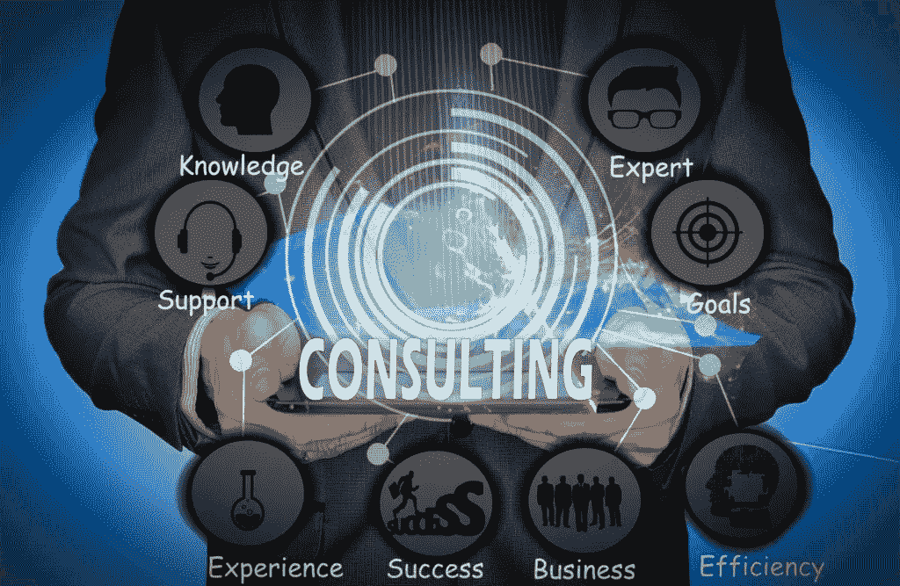
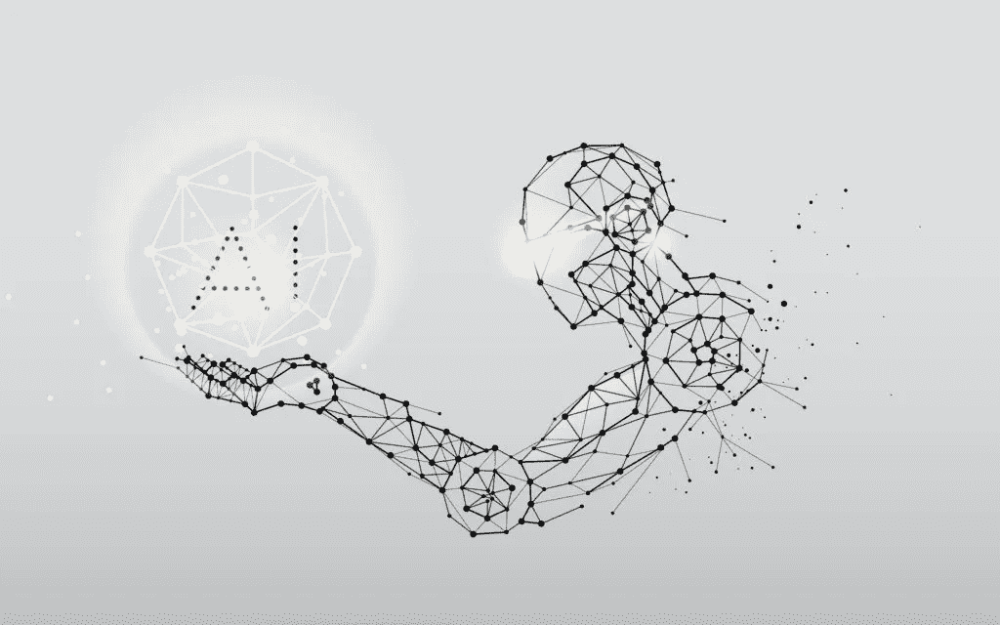

# IT 咨询行业趋势—期待什么以及您的企业为什么需要它

> 原文：<https://medium.datadriveninvestor.com/it-consulting-industry-trends-what-to-expect-and-why-your-business-needs-it-3d0afde4306?source=collection_archive---------9----------------------->

随着技术的进步，新产品和服务出现在市场上，公司需要灵活地采用这些新技术来保持市场竞争力。然而，在众多产品中导航并选择适合自己的产品需要一定的专业知识。Skywell 软件可以为您提供必要的 [IT 咨询服务](https://skywell.software/it-consulting-services/)，以确保您使用正确的商业技术，并获得最高的投资回报。我们收集了顶级咨询行业趋势，以概述市场动态。

# 什么是咨询？

IT 咨询专注于为公司提供使用新技术实现其业务目标的最佳方式的建议。他们将利用自己的专业知识帮助您实施新的 IT 基础设施系统和架构。雇用 IT 顾问时，请确保他们清楚地了解您的业务需求和您未来的发展方向，因为他们将帮助您开发新技术或整合现有产品，以简化流程并使业务运营更加顺畅。

现在我们已经了解了 IT 咨询包含的内容，让我们来看看最新的趋势，看看 IT 咨询如何帮助您利用这些趋势来增加收入和提供更好的客户体验。

 [## 干净的代码在软件开发中至关重要——这就是为什么|数据驱动投资者

### 干净的代码是“容易理解和容易改变的”，它是关于对细节的关注。但是开发人员为什么要担心…

www.datadriveninvestor.com](https://www.datadriveninvestor.com/2020/05/27/clean-code-is-crucial-in-software-development-heres-why/) 

# 物联网

物联网设备非常受欢迎，但随着使用的增加，我们注意到它们的功能越来越多。他们不再需要任何人工协助来解释数据和做出决策。这意味着顾问需要了解物联网设备的功能，研究它们使用的逻辑，并将其应用于解决业务问题。这些设备也是一个很好的数据源，因为它们为客户提供了很好的体验，而且它们通常很容易使用。目前大约有 80 亿台物联网设备在流通，最优秀的顾问会想方设法使用它们来帮助您优化活动和增加收入。

# 云计算

自从亚马逊网络服务(AWS)在 2006 年推出以来，云计算就一直很受欢迎。这使得公司能够全面削减成本，并简化许多流程。我们看到的咨询趋势之一是从所有者向托管者的转变。以前使用物理服务器时，公司拥有自己的硬件，但现在他们需要帮助来确保所有合同 SLA 得到遵守，系统可互操作，以及系统与公司的长期愿景相兼容。

# 大数据

公司收集的数据量每年都在增加，但他们发现理解所有这些数据变得更加困难。他们需要 IT 咨询来解析这些数据，并将其转化为他们可以理解的报告。此外，由于公司希望收集新数据，他们需要创建新技术来收集、组织和分析这些数据。这就是 IT 咨询真正能带来回报的地方，因为他们能告诉你最好的技术和方法。

# 人工智能

人工智能的实际应用不断增加，许多公司正在使用它来做出更合理的商业决策。这是企业主需要了解的技术行业趋势，因为它可以为他们提供宝贵的见解，并帮助他们了解市场的某些细微差别。您还可以利用这项技术为您的客户提供更好的体验。IT 顾问可以帮助你了解人工智能在商业世界中的当前能力，并帮助你获得人工智能必须提供的所有好处。

# 区块链

尽管区块链通常与加密货币联系在一起，但它目前正在被跨行业使用。事实上，我们看到的最大的商业咨询行业趋势之一是理解各种交易的框架。由于区块链提供了更高的效率和安全性，它肯定会被用于保护房地产、会计和其他许多领域的未来交易。

# 外包

美国和欧盟的公司喜欢外包，因为这样可以大幅降低成本，对于咨询行业来说也是如此。如今一个流行的 IT 咨询趋势是雇佣海外顾问，因为他们和你当地市场的顾问具有相同的资格水平和专业知识。通过将项目的细节外包给顾问，你可以专注于你的核心业务职能。话虽如此，与你的咨询提供商建立有效的沟通是非常重要的，每个人都在同一页上。

# 5G

虽然这项技术相对较新，但它肯定会对未来产生巨大影响。当我们考虑技术提供的所有可能性时，他们需要快速的互联网速度才能正常工作，这就是 5G 提供的。虽然这项技术提供了很多潜力，但没有多少公司确切了解它能如何帮助他们。顾问们现在建议公司如何利用这些新速度开发新技术，并改进他们现有的技术。

# 咨询业的未来

目前，科技行业在美国雇佣了 2，385，571 人，你可以预计对顾问的需求将会增加。话虽如此，我们正在进入一个新的 IT 咨询时代。这是因为业务架构本身也在发展。过去，我们有一个“规模效率”的教条，现在变成了“规模学习”。这意味着新的业务架构包括需要新技能和专业知识的互联生态系统，这是当今许多咨询公司的专长。

IT 咨询行业被数字技术改变了，就像雇佣他们的公司一样，咨询机构需要改进他们的服务，为他们的客户提供快速、有利可图和高质量的创新。虽然 IT 顾问需要精通最新技术，但软技能也很重要。请记住，技术来来去去，今天流行的可能是相对快速地做事的老方法。这就是为什么你需要雇佣那些知道如何与团队合作，解决冲突，并拥有优秀沟通技巧的人。

*最初发布于*[*https://sky well . software*](https://skywell.software/blog/it-consulting-industry-trends/)*。*

**访问专家视图—** [**订阅 DDI 英特尔**](https://datadriveninvestor.com/ddi-intel)