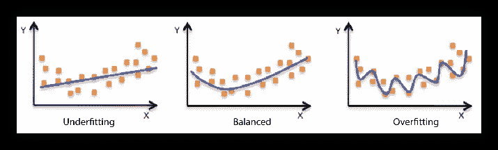

# 看情况…

> 原文：<https://medium.datadriveninvestor.com/it-depends-3d9af77f99f1?source=collection_archive---------6----------------------->

## 如何谈论回归模型与婴儿和我真的不擅长数学的人。

*“如果你不能向一个六岁的孩子解释，你自己也不明白”*

*阿尔伯特·爱因斯坦*

早在我们将数据科学定义为一门学科之前，它就已经塑造了我们的生活，这不是什么秘密。它由多种研究组成，由受过高等教育的人研究和实践多年。这些人，数据科学家，有他们自己的行话，对于非专业人士来说听起来非常奇怪。但是，将数据科学语言翻译成“人类”语言的能力至关重要:如果你做不到这一点，你就无法向市场部门、投资者甚至你的母亲(她可能会很高兴欣赏你项目的酷)解释你工作的重要性。但最重要的是，如果你不能在屏幕上的数字和问题的答案之间画出平行线，**你**就不明白你的模型在告诉你什么。今天，我想回顾一下我们用来描述多元回归模型的一些技术术语，并尝试向那些说“我数学很差，对编码一无所知”的人解释这些术语。

 [## 数据科学和软件工程哪个更有前途？数据驱动的投资者

### 大约一个月前，当我坐在咖啡馆里为一个客户开发网站时，我发现了这个女人…

www.datadriveninvestor.com](https://www.datadriveninvestor.com/2019/01/23/which-is-more-promising-data-science-or-software-engineering/) 

## 最大的问题

想象一下，你的朋友问你“我的新工作能挣多少钱？”。你挠头说‘看情况吧……你受了几年教育？你申请的是哪个职位？办公室在哪里？你打算去哪家公司工作？。你的朋友被这些问题惹恼了，他大喊“你为什么问我这个？！。但是说真的，为什么我们需要知道所有这些来计算一个人会赚多少钱呢？

嗯，这很直观。宠物店的看门人将比谷歌的首席研究员挣得少得多。我们从经验中知道这一点。我们在日常生活中所说的“经验”实际上是一个收集数据的过程，不仅人类可以做到，机器也可以做到。

你为什么不问你的朋友他最喜欢的颜色是什么或者他一生中杀过多少只蚊子？因为这些问题的答案与你的预测无关。蚊子刺杀经历和对颜色的偏好与收入无关。同样，我们凭直觉知道，但实际上，我们知道是因为我们多年来一直在收集数据。

这种对话实际上是选择自变量和因变量的过程——回归模型的面包和黄油。问题的本质是**因变量**，我们试图预测的是什么，在这种情况下，你朋友的收入。数学上，我们可以写成 y = '收入'。你在说明“视情况而定”后提出的问题是你的**自变量:** X =“教育年限”、“职位/资历”、“办公地点”、“公司名称/地位”。

## 我们真正需要知道的是什么？

所以现在你知道关于你朋友最喜欢的颜色和杀死的蚊子数量的信息不会帮助你预测他的收入。但这是否意味着他给你的相关信息越多越好呢？不一定。

数据科学家一直面临着选择正确数量的预测因子的问题。假设你的朋友给了你两条关于办公室位置的信息——实际地址和地理坐标。如果你输入不同的地址，地理坐标也会相应改变。这意味着这两条信息是相互关联的。我们不想那样！如果我们有一些彼此紧密相关的信息，我们将无法判断哪一个对结果有贡献，这是我们试图预测的事情。在统计学和机器学习中，这个问题被称为独立变量的多重共线性。

Illustration by 9GAG

在上面的图像中，从左上角到左下角画的对角线上的肖像是完美相关的，因为它们与它们自己相关。一般来说，我们不希望能够立即从任何其他图片中识别出该人物，以将其用作我们模型中的预测因素之一。

## **你确定吗？**

在问完你的朋友所有这些问题并得到答案后，你需要给他一个数字。因为这对你的朋友很重要，他想相信你的估计，他会问:“你确定吗？”。现在你也需要回答这个问题。

我们都听说过这样的话‘你减肥成功的 80%是你吃的东西’，‘你快乐的 30%只取决于你的基因’，‘你人生成功的 40%取决于你的决心’等等。这些数字表明了你的预测方法，也就是你的模型，有多准确。在统计学中，它被称为 R 平方。因此，如果你进行计算，得到 R 的平方，比如说 0.75，你告诉你的朋友:“根据你告诉我的关于你的教育、职位、公司和办公地点，我 75%确定你的收入将是 XX，XXX 美元”。或者，用专业术语来说:“因变量 y 的方差比例由自变量 X 的 0.75 的 R 平方来解释”。

## 所以，你不是 100%确定？

生活中没有什么事情是可以*百分百准确预测*的。我们认为，如果一个人有患肺癌的遗传倾向，每天抽三包烟，并且住在核电站附近，那么他很可能会患肺癌。但是如果他们没有，并且健康长寿呢？它有助于我们的统计。然而，如果我们试图从华氏温度“预测”摄氏温度，我们将 100%确定，因为我们并没有真正预测任何东西，我们本质上是从一个事物本身计算它。

构建回归模型时，追求最大可能的 R 平方并不总是最佳策略。在某些情况下，即使看起来很小的 R 平方也是有意义的，甚至可能是科学上的突破。想象一下，有人告诉你，你找到一生挚爱的几率有 25%取决于你修指甲的质量:你可能会更频繁地去美甲沙龙。

## 把这些点连接起来

既然人类的思维无法画出比三维更高的图像，那就让我们简化一下我们的问题。想象一下，你正试图只通过你朋友的受教育年限来预测他的工资。这种类型的模型被称为简单线性回归。x 轴是你的预测值，受教育年限，y 轴是你试图预测的收入。您有一个两列十行的表格，每行代表一个您认识的人:

Numbers are random and have nothing to do with reality

以下是创建数值散点图时的样子:

现在的任务是画一条最能描述数据点行为的**直线**:

那么为什么我们要画一条直线而不是连接这些点呢？因为这个游戏(实际上是模型)的目标不仅仅是描述当前的情况，而是将我们一无所知的数据考虑在内。假设我们想知道受过 8 年教育的鲍勃的工资。根据我们目前的模型，受过 8 年教育的人每年可以赚 11 万美元或 12 万美元。一个过度拟合的模型不会给你一个数字，但是一条直线会告诉你最有可能(85%确定)鲍勃每年会赚 110，000 美元。

Illustration by Amazon AWS

虽然，画直线并不是每次都是最佳策略。如果你只有一个预测器，那么线性模型可能是你最好的选择。但是如果一个因变量有 10 个预测值(或者在我们的第一个例子中有 4 个)，那么你可能应该试着画一条更弯曲的线。这个平衡问题在统计学中被称为**偏差-方差权衡**。在这一点上，建立一个好的模型更像是一门艺术而不是科学:你希望它足够通用，能够做出预测，但又不要太通用，以至于输出结果与现实完全脱节。如果你的行业表现为一个受过 15 年教育的人一定会每年赚 200 万美元，这不是一个好的模式。也许这个人只是在自我反省，根本没有高等学位！

## 预测和现实

你如何调整模型的细节是纯数学的，因为我假设读者是我真的不擅长数学的人(或者假装是)，让我们把它们留给另一个讨论，假装我们只是在点之间画线。我们现在知道，我们的模型(线)必须很好地描述当前的情况，但不能太好——我们需要它足够通用，以处理未知数据。你如何知道何时停止“弯曲”你的线条？你怎么知道**这个未知数据会是什么样子？**

让我们假设给你那些未知数据的人不是一个卑鄙的人，不会给你一个关于神童在大学一年后赚了数十亿美元的表格。测试表中的人(未知数据)和你已经有的表中的人非常相似。那么现实和你的模型的预测之间的差异不应该太大:例如，如果鲍勃接受了 8 年的教育，实际上每年赚 115，000 美元，而你的模型说他可能赚 110，000 美元——这还不算太糟糕！

但是如果你没有一个神奇的帮手，有一个未知但相似的数据，你可以用一个技巧来测试你的模型。这个技巧叫做**训练测试分割**，非常简单:你把你的数据分割成两部分，一部分叫训练数据，一部分叫测试数据。为了简单起见，假设您的训练数据是前 8 行，您的测试数据是后两行。你从训练数据中画出点，画出最佳拟合的线(或曲线),画完之后，你画出最后两个点，看看它们离你的线有多远——就这么简单！当然，在现实中，数据科学家正在处理成千上万的行，有时是几百万，但逻辑通常是相同的:80%的行要使用，20%的行要测试。

## 最后

当谈到回归模型时，有很多更可怕的术语，如归一化、多项式、交叉验证等。但是上面提到的那些给出了理解构建和测试模型的过程的一个非常一般的直觉。此外，一些模型能够预测未来会发生什么(圣诞节前后难看的毛衣的价格)，处理多种结果，并预测落入其中一种类别的概率(根据遗传和生活方式选择，此人是否患有癌症)。但那是另一个讨论。