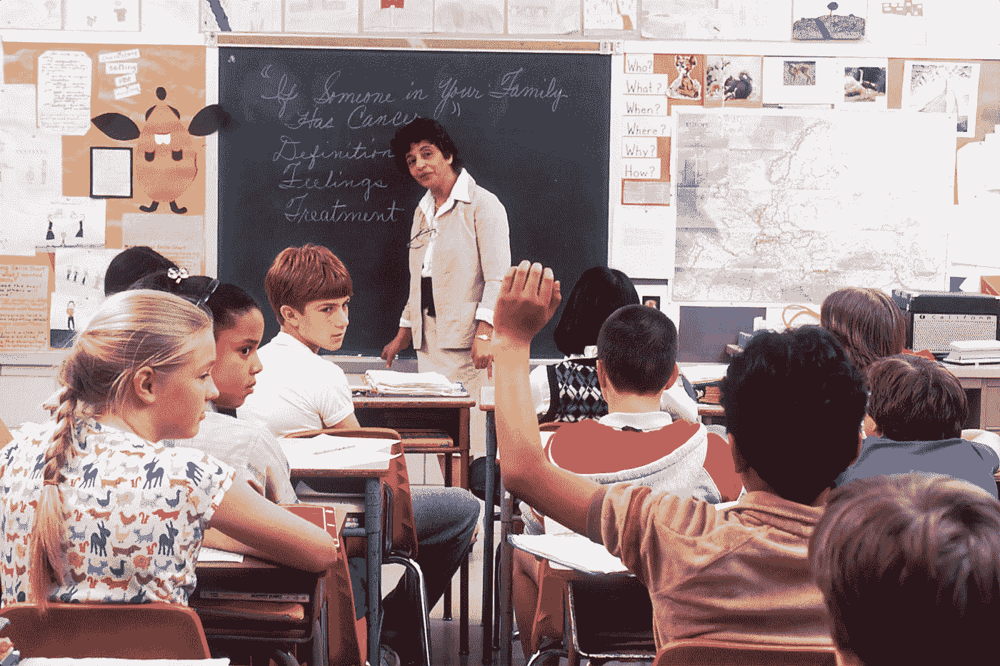

# 你的老师很差劲也没关系

> 原文：<https://medium.datadriveninvestor.com/it-doesnt-matter-that-your-schoolteacher-sucked-4946511ea282?source=collection_archive---------17----------------------->

## 教育出了什么问题，你能做些什么。

Photo by [National Cancer Institute](https://unsplash.com/@nci?utm_source=medium&utm_medium=referral) on [Unsplash](https://unsplash.com?utm_source=medium&utm_medium=referral)

学生们喜欢她。

不是因为她漠不关心，而是因为她关心他们。

她激发了每个学生的潜能。

不是我们所有人都有幸向如此伟大的老师学习。

但这并不是你下半辈子表现不佳的理由。

# 我们还应该有老师吗？

大多数教师在某一特定领域高度专业化。难道我们不应该多向企业家这样的成功人士学习吗？

只有向*成功的*人学习才可能是错误的。

首先，很难定义成功意味着什么，其次，你永远不知道为什么一个人会*成功*。也许她有富裕的父母，也许是正确的基因，也许只是运气。但是话说回来，许多成功的人只是挣得了它，并且知道如何正确地做事。

 [## 良好的生活是习惯的形成|数据驱动的投资者

### 过度思考是过度紧张。仅仅几个简单的习惯就会在一天中产生巨大的影响。那是…

www.datadriveninvestor.com](https://www.datadriveninvestor.com/2020/01/17/a-good-life-is-habit-forming/) 

老师可以给你所有的理论知识，甚至战术。但是只有一个知道你想去哪里的人才能指引你一路走来，并真正与你感同身受。

从老师那里学习基础，但是在实施的时候，寻找一个做了你想要实现的事情的导师。

# 为什么关注事实是错误的

在没有互联网的时候，知道很多事实是很重要的。今天，我们口袋里都有维基百科，死记硬背的价值迅速减少。然而，他们仍然教我们的孩子事实，就像这种变化从未发生过。为什么？

我只能推测是固执和懒惰的混合体。固执是因为它在过去运行良好，不活跃是因为它很容易测试死记硬背。

但在当今快节奏的经济中，更重要的是快速适应并理解不同部分如何相互作用。

有解决办法吗？

# 基于项目的教育

在我看来，基于项目的教育是一条可行之路。

超学习作家斯科特·h·杨在他的书中将直接描述为学习的关键要素之一。通过运用直接，你不用浪费任何时间就能学会你需要的技能。

让我们以学习语言为例。是的，如果你想学语言，有一些有用的应用程序。然而，最后，没有什么比和一个真实的人交谈更好的了。如果你去相应的国家，马上试着说，不需要 app，进步会快很多。这样，你也避免了学习使用这种语言的方式，只有应用程序使用它，很难转移到现实生活中。

项目就是这样做的。

项目缩短了理论学习和实践应用之间的距离。就拿 MBA 学生来说吧。为什么不给他们在学习期间创建弹出窗口的机会呢？学习一些你可以马上使用的东西，比承诺将来某一天会用到你所学的东西要舒服和有效得多。

# 长期目标

我记得当我不得不在学校找工作的时候。

我只知道我必须找份工作。不是因为我想，而是因为我不得不。所以，最后，我挑了一个看起来有点意思的。

相比之下，有人梦想有一天成为一名医生，并明确知道他必须在学校表现出色才有机会。当然，后者会更有动力，从而学到更多，记住更多。

泰·洛佩兹为什么这么成功？

他成功的一部分来自于展示他的豪车、可爱的豪宅和漂亮的女孩。你可以说你想说的，但这是激励年轻人的。我不是说你应该请泰当老师，但是我们的孩子需要榜样。

找一些在同一所学校上学的成功人士，让他们讲述自己的故事。让他们告诉孩子们，放学后学习并没有结束，他们有机会为未来的成功奠定基础。

# 元技能

我们在学校花了很多时间努力学习。然而他们没有教我们怎么做。

学会如何学习是一种元技能。它是成功的基础。你必须首先理解，然后储存，转换新知识，这样你就可以应用它，然后进行实验，直到你足够流利地在各种情况下使用这些经验。

第二个大桶是健康。

关于什么是最健康的营养或最佳锻炼方案，无数的争论正在进行。然而，如果你仔细看看，有一个关于基础的共识。

避免加工食品，去大自然中呆一会儿，避免整天坐着只是一些节约建议。

第三个元技能是控制你的思想。

情绪稳定性，生产力，或者动力，它们都与你控制自己思想的能力有关。我说的不是出家，而是像冥想或正念这样简单的事情。

# 为什么你的老师很烂不重要？

我们都希望十年前开始的我们拥有正确的基因或正确的父母。

你现在正在读这篇文章的事实告诉我，你的方向是正确的。

你的教育不是最好的吗？把它看做沉没成本。你无法让他们回来，根据他们做决定只会伤害你——对你的教育也是一样。但是如果你沉浸在一个领域中，你会在一周内比 99%的人更了解它。

这并不意味着你会这么快掌握一个领域。

但是，就像比尔盖茨说的:*“大多数人* ***高估了自己在* ***一个*******十年后能做的*** *。”****

*想象你开始学习有用的元技能，然后你把注意力集中在一个特定的技能上。十年后，你会成为世界上最优秀的人之一。是的，受过良好教育的人也许可以在九年内做到。但是谁在乎呢？*

*你现在所做的比你的过去重要得多。*

# *外卖*

*重大的变化正在发生。为了给下一代最好的开端，教育必须发展。*

*如果你没有接受最佳教育的特权，那么掌握自己的命运，发展自己的技能，永不放弃进步是非常重要的。*

## *准备好变得无限了吗？*

*如果你想变得无限并大大加快你的学习速度，看看我的小抄:*

*点击此处立即获取备忘单！*