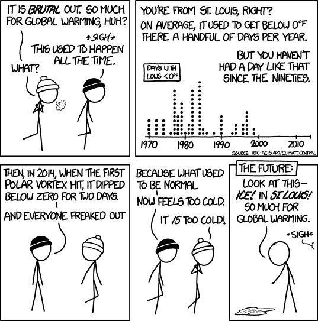

# 当它在你的后院时就很重要了

> 原文：<https://medium.datadriveninvestor.com/it-matters-when-its-in-your-backyard-e3f93953e282?source=collection_archive---------3----------------------->

*气候风险情报，告知当前和未来特定位置的物理风险。*

Foggy Rain forests Photo Credit by [Guy Bowden](https://unsplash.com/@guybowden?utm_source=medium&utm_medium=referral) on [Unsplash](https://unsplash.com?utm_source=medium&utm_medium=referral)

几十年来，科学家们一直警告与气候相关的物理危害的增加。自 2020 年 3 月世界卫生组织报告宣布 COVID a 疫情以来，世界已遭受 100 多起急性身体风险事件的打击，其中许多与气候有关。据 [NOAA](https://www.ncdc.noaa.gov/billions/) 报道，2020 年是连续第六年(2015-2020 年)10 起或更多十亿美元的气候灾难事件影响美国。对气候变化日益增长的认识和关注刺激了研究、开发和测量。今天的气候数据和工具侧重于许多不同的物理方面，但我们可以将 ***气候风险*** 数据大致分类如下:

An abstraction of **climate risk** data categories

*   **历史事件数据目录:**过去的极端物理气候风险事件，包括它们的空间足迹。这些来自公共和商业来源的数据集具有全球覆盖面和精确的空间足迹，因为它们代表了历史事件。
*   **预警数据流:**探测和监测系统，能够对即将发生的极端天气事件(如野火、洪水和龙卷风)的近期影响进行跟踪、预测和预警。这些数据流具有可变的延迟，通常具有有效的时间准确性，但空间分辨率较差，因为这些系统很难精确地定义灾害将在哪里产生影响，因此警告/警报跨越很大的区域。
*   **前瞻性气候预测:**源自综合评估模型(IAMs)和全球气候模型(GCMs)的模拟，如构成 CMIP6 一部分的那些模型，这些预测跨越 [*多种情景*](https://medium.com/datadriveninvestor/is-our-house-on-fire-98919692259c) 的气候风险。数据集通常在一定的空间和时间分辨率范围内可用。它们在回测基准上的表现各不相同，预计总体上会与未来的观测相匹配，即在更长的时间和更大的空间尺度上。

这些数据流中的每一个都服务于特定的用户群体。历史目录服务于研究人员，早期预警系统服务于政府和灾难响应团队，前瞻性气候预测服务于规划相关活动。这些数据集有可能帮助我们的全球社区评估气候风险的社会、环境和金融影响。

 [## 气候变化辩论中的科学与金钱|数据驱动的投资者

### 没有关于气候变化的公开辩论。在我发布文章的媒体上，有成千上万的文章是关于…

www.datadriveninvestor.com](https://www.datadriveninvestor.com/2020/01/30/science-and-money-in-the-climate-change-debate/) 

然而，一个紧迫的问题是，这些数据收集驻留在不同的数据源中，具有不同的节奏，对于不是气候领域专家的人来说，很难访问、汇总和解释。因为数据没有整合或协调，不同的集合不容易相互比较。最重要的是，数据是在全球范围内收集的，然而资产所有权和业务决策却有很强的地方偏向。

# 全球现象的局部影响

Local misunderstandings on global phenomena can occur when we mistake gradual weather changes over a long time horizon for normalcy (Credit: [xkcd](https://assets.climatecentral.org/images/made/1_24_14_News_xkcdextremecold_1050_1062_s_c1_c_c.png))

虽然我们大多数人收听新闻，并假装对全球事务有浓厚的兴趣，但我们在日常生活中做出的大多数决定都是由当地条件决定的，这些条件就在我们身边。当涉及到我们的行动和行为时，没有比我们在火灾、热浪、洪水或飓风等紧急情况下对天气和当地环境的关注更能体现这种地方敏感性的例子了。当你住在被有毒采矿废料污染的水源(河流/湖泊)旁边，或者当我们住在影响我们朋友和家人的严重洪灾区时，我们开始振作起来，注意到过去几年中出现的现象。虽然这些事件直接影响我们的日常生活，但它也让我们意识到影响更多人口的气候风险和环境危害。

严重的物理危害是由地球子系统的全球分布不平衡造成的。正因为如此，气候模型天生就是全球性的。然而，对我们的影响是在本地资产层面。为了规划与气候相关的风险和机遇(可从地理空间分析中看出)，我们需要弥合全球气候模型、近实时环境传感和不同物理资产之间的差距。

# 气候风险情报简介

Climate Risk Intelligence bridges the gap between disparate climate data with global footprints and business decision making at the asset level

新数据源、观测数据、平台、应用程序、监测卫星、数据和云的爆炸式增长，加上变化的速度……使得剔除噪音和理解气候数据变得几乎不可能。为了使气候数据*具有可操作性*，换句话说，我们可以使用这些数据来规划和管理未来的灾难，我们需要整合并推动来自上述不同类别的数据收集之间的协同作用。当气候数据可以帮助实现量化和管理金融和环境风险等目标时，它就变成了 ***智能*** 。这将涉及以下能力:

*   **推动理解:**这需要协调分散的数据收集，使风险分析师能够轻松地询问和理解气候模式和预测，如 [*上一篇文章*](https://medium.com/datadriveninvestor/is-our-house-on-fire-98919692259c) 所述。
*   **增强规划:**提供洞察力，使分析师能够根据他们在全球的位置，轻松快速地评估不同的未来情景将如何影响他们的有形资产。它还能使决策者评估当前和未来的有形风险，保护新的基础设施和不断增长的人类住区。
*   **启用行动:**将这些不同的气候数据源转换到资产级别，允许跨场景定制分组、排序和聚合风险。这使得风险专业人士能够量化对投资组合的财务影响，并明智地管理他们的资产。

正如之前在[关于气候技术的心智模型](https://climatetechvc.substack.com/p/-offering-a-climate-tech-mental-model)中提到的，围绕清洁能源过渡的技术使我们能够走上通往绿色气候情景的道路。大多数应急响应系统都专注于物理危害的短期影响，并帮助“应对”气候变化的近/中期表现。然而，理解和规划气候变化的物理表现需要更深入地研究[气候情景](https://medium.com/datadriveninvestor/is-our-house-on-fire-98919692259c)，并在更长的时间范围和更大的空间区域内更仔细地检查气候变化的影响。

# 关键要点

**放眼全球，立足本地:**气候科学描述的是全球现象，但围绕气候的决策是在本地范围内做出的。气候风险情报可以弥合全球气候数据和对当地资产的实际影响之间的差距。

**数据转换至关重要:**气候风险情报能够通过数据转换使前沿气候科学和大量地理空间数据变得易于理解。

**敬请关注:**下周，我们将深入探讨气候风险情报的一个具体例子，描述洪水影响模拟如何帮助采矿和商品行业以及当地社区。

如果你觉得这份材料有趣，并且关心气候变化，我会很感激你转发给朋友并留下评论。Sust Global 让你轻松跟上前沿气候科学的最新分析和趋势，只需订阅[*Sust Insights*](https://www.sustglobal.com/insights)*。如果您想评估您的资产和业务在未来几年因暴露于极端物理风险而面临的风险，请联系我们的* *试用我们的* [*气候情景分析产品*](https://www.sustglobal.com/about-us) *。*

# 相关阅读

 [## 我们的房子着火了吗？

### 探索气候变化的未来情景

medium.com](https://medium.com/datadriveninvestor/is-our-house-on-fire-98919692259c)  [## 当地行动

### 气候风险情报如何促进地方一级的可持续行动

medium.com](https://medium.com/datadriveninvestor/act-local-85428f674eda)  [## 迈向地理空间 2.0:大规模释放数十亿个垂直市场

### 地理空间技术领域的新范式分析，将产生大规模的商业价值，通过…

medium.com](https://medium.com/sust-insights/https-medium-com-joshjgilbert-approaching-geospatial-2-0-eae02538200) 

**获取专家观点—** [**订阅 DDI 英特尔**](https://datadriveninvestor.com/ddi-intel)