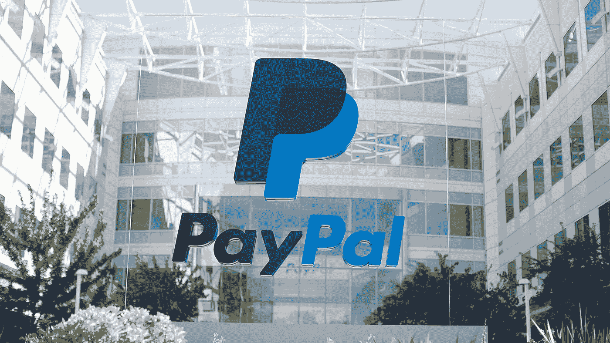

# 或许是时候卖掉贝宝了

> 原文：<https://medium.datadriveninvestor.com/it-might-be-time-to-sell-paypal-496515e38a61?source=collection_archive---------11----------------------->

每股约 180 美元，基本上处于历史最高水平，Paypal 享受了因新冠肺炎疫情爆发而兴起的强劲顺风，但它还能在这里继续交易多久呢？

很明显，由于新冠肺炎病毒的爆发，今天发生了很多事情。这种疫情导致许多热门科技股继续飙升，预期将继续占据市场份额和未来的主导地位。Paypal 是带头冲锋的少数几家公司之一，随着华尔街蜂拥而至，估值似乎并未受到关注。在给定的价格下，Paypal 的远期市盈率达到了近 10 年来的最高水平，我不认为其目前的顺风状况能够证明这样的估值是合理的。

 [## 为什么要在危机中创业？4 个关键原因|数据驱动的投资者

### 在 Tau Ventures，我们有幸每天与数十位企业家交流。鉴于我们对…的关注

www.datadriveninvestor.com](https://www.datadriveninvestor.com/2020/05/10/why-found-a-startup-during-a-crisis-4-key-reasons/) 

看涨者可能会认为，电子商务和在线购物正在发生令人难以置信的转变，从而导致该股的盈利前景更加强劲，但这种顺风可能是短暂的。在 Paypal 占主导地位的欧洲大部分地区，新冠肺炎已经在走下坡路，并受到控制。在美国，尽管案件不断增加，但在如此巨大的政治压力下，经济似乎正在试图恢复正常。不管病毒会持续到明年 1 月还是 1 年后，它最终都会消退，当它消退时，估值会显得有点空洞。Paypal 利用了自己的市场，并从长期的领先地位中获得了回报。该公司资产负债表强劲，净收入为 24.6 亿英镑，比 2018 财年的 20.6 亿英镑同比增加。该公司的指标几乎每个方面都比去年有所改善，而且从五年前开始就一直如此。然而，唯一令人担忧的是，收入增长率开始放缓，在我看来，这相当令人担忧。

Paypal 的大部分收入来自手续费，因此是他们衡量“TPV”或总支付量的指标。投资者应该注意的是，Paypal 的整体 TPV 可能有点误导，因为他们已经决定将 Venmo 纳入其中，而他们的竞争对手 Square 没有这样做。当然，这样做的原因是，这有助于缓解企业目前面临的增长率下降的问题。反对将其与其他支付量混为一谈的原因是，Paypal 不对交易收取一定比例的费用。换句话说，他们在 Venmo 的 P2P(点对点)支付中没有“提成”。因此，Paypal 似乎摆脱了将他们在 TPV 的增长混为一谈的局面，而事实上，他们一直在慢慢努力寻找实现更大增长的方法。这导致 Paypal 不顾一切地收购 Square，并最终收购 Honey Science Corporation。

如今，在收购 Honey 的同时，Paypal 也在进军中国，它正竭尽全力帮助自己更好地定位未来。这对我来说有点令人担忧，随着 Venmo 落后于 Square 的 Cash 应用程序，他们可能需要在其他地方寻找领导地位。随着 TPV 经济增长率的下降，以及全球封锁的结束，这种预期的顺风可能会很短暂。然而，毫无疑问，Paypal 将仍然是一个强大的业务，并在未来十年继续增长，但考虑到估值和业务的有机增长正在急剧放缓，我认为现在是近 50 倍的预期倍数，是时候出售了。

**进入专家视角—** [**订阅 DDI 英特尔**](https://datadriveninvestor.com/ddi-intel)