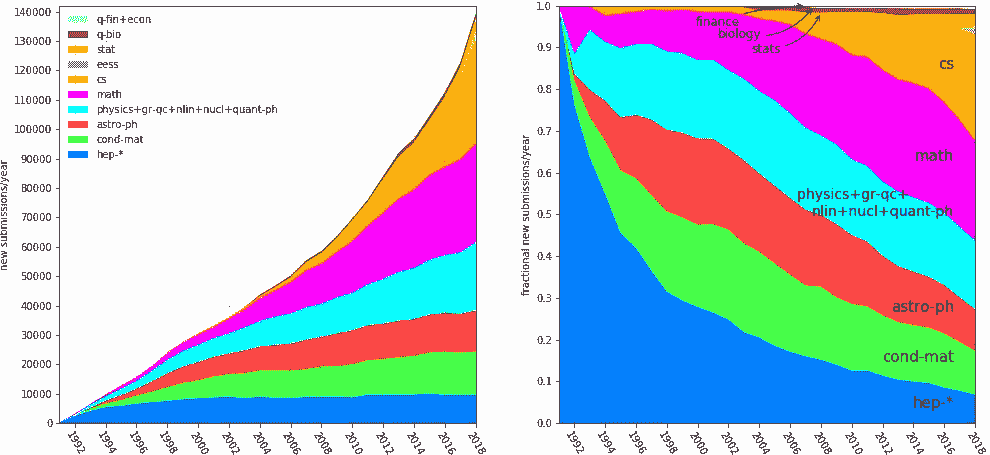

# 需要指出的是——研究界的骗子综合症

> 原文：<https://medium.datadriveninvestor.com/it-needs-to-be-said-imposter-syndrome-in-the-research-community-e84665f640ec?source=collection_archive---------4----------------------->

# 亲爱的研究人员:

封锁结束了，你在排队看电影。你能感觉到兴奋，感觉到你的脉搏加快。是啊！这将是惊人的。由于需求量大，座位先到先得。一名工作人员走过来，尖叫着说现在每个人都可以进去了。突然出现了绝对的混乱。

7 门，几百人。每个人都开始跑。在他们中间，你瘫痪了。我选哪个门？如果…我没被录取呢？当你开始跑步的时候..太晚了。你已经错过了机会。门在你面前砰地关上了。沉默。

[https://goingconcern.com/wp-content/uploads/2018/03/pulte-group-internal-audit-jobs-careers.jpeg](https://goingconcern.com/wp-content/uploads/2018/03/pulte-group-internal-audit-jobs-careers.jpeg)

吓人？欢迎研究。除了，不是四扇门，而是几千扇门。而人呢？我不会透露这个数字，因为担心焦虑会激增。

 [## 认知计算——一套被广泛认为是……

### 作为它的用户，我们已经习惯了科技。这些天几乎没有什么是司空见惯的…

www.datadriveninvestor.com](https://www.datadriveninvestor.com/2020/02/19/cognitive-computing-a-skill-set-widely-considered-to-be-the-most-vital-manifestation-of-artificial-intelligence/) 

由于大量涌入的数据和可用的原始计算，各个领域的研究突然繁荣起来。下面是 1992-2018 年[ [Arxiv](http://arxiv.org) ]上发表的论文图表。(数据来自 arxiv 本身)

[https://static.arxiv.org/static/arxiv.marxdown/0.1/help/stats/2018_by_area/newsubs.png](https://static.arxiv.org/static/arxiv.marxdown/0.1/help/stats/2018_by_area/newsubs.png)

哦，你是计算机科学专业的吗？太好了！想看看 13 万份文件吗？哦，你只关心深度学习？斯坦福海的年度[ [人工智能报告](https://hai.stanford.edu/research/ai-index-2019) ]显示，仅在 2018 年，机器学习方面的论文就“刚刚”超过 7500 篇。哇！只是一个普通的星期一。

你现在有缓慢下沉的感觉吗？我怎样才能到达那里？我做的任何事怎么会对赛场产生影响呢？每天都有人发表一些疯狂的东西。可以从现实世界中剪切粘贴对象的神经网络？【[链接](https://www.androidauthority.com/ar-cut-and-paste-1114757/)】。另一个允许从任何语言翻译成另一种语言？[ [链接](https://arxiv.org/abs/1912.02047)

好吧，现在你已经够害怕了。让我们进入主要部分。我们如何战胜这种恐惧？我们怎么不觉得自己是个骗子？和大多数事情一样，其实挺简单的。不如我们先确定是什么引起的？

1.数据。可悲的是，我们不是计算机。给我 100 张纸我会哭。给一台电脑一百万，它都不会滞后。

2.误传。如果你读过论文/看过代码，你会注意到它几乎从来没有提到制作它花了多长时间。也没有提到花了多少努力。想过吗？

3.还做了什么？这几乎是滑稽可笑的。有多少研究人员自己发表论文？即使他们做了，他们一年能做多少？50?100?200?还是更现实— 2？5?

4.社交媒体。上推特。搜索# [machinelearning](https://twitter.com/hashtag/machinelearning?f=live) 。注意帖子。几分钟后刷新。看看能不能再找到。哭:)

5.公司。我真的很钦佩像谷歌/微软/Neuralink 等公司(不胜枚举)所做的惊人的研究。但有趣的是。我们要考虑多少次参与的人数？你有几个大脑？*(请原谅，时间旅行者)*。

6.时间。这是迄今为止最可悲的。写<insert fancy="" name="">论文花了多长时间？抱歉，我连夜完成的。我是说，超过 730 个夜晚。哎呀。</insert>

你看到模式了吗？如果你还不知道。这完全没问题。几个月后再来看这篇文章。如果你能找到的话。

[https://teacherwise.wordpress.com/2013/07/12/too-many-papers-to-grade-two-solutions/](https://teacherwise.wordpress.com/2013/07/12/too-many-papers-to-grade-two-solutions/)

现在是主要问题。每次打开 arxiv 看到 100 篇论文都是另一种语言的符号，怎么能不哭呢？这里有一些建议。

1.大多数研究都建立在另一个基础上。试着找出不同之处。这使得理解起来容易多了。

2.如果有一百万扇门。你挑哪一个都没关系。没有对错之分。只要你喜欢这个节目。而不是打你的观众朋友。

3.请记住你不是 C-3PO。如果你现在不看那 200 篇论文也没关系。一步一步来。

4.这是比尔。比尔使用像[[Arxiv sanity](http://www.arxiv-sanity.com/)和[[paper scape](https://paperscape.org/)这样的工具来避免陷入困境并能够集中注意力。像比尔一样。

5.你为什么编码？你想干嘛?你想帮助有决心的人吗？创作艺术？解量子方程？发现新星？用希腊语尖叫？嘿慢点。随便挑。坚持下去。

6.4000 万——截至 2020 年的 Github 用户数。【[报告](https://expandedramblings.com/index.php/github-statistics/)】。你只是其中之一。不要试图成为所有。你不能。除非你是托尼·斯塔克。而就算是他也只能 3000 多。(复仇者联盟双关抱歉)

7.求学习。但是要意识到你的极限。

8.分离器。我怎么强调这件事的重要性都不为过。研究和猫迷因一样容易让人分心。坚持你来的目的。

9.别比较了！！人们需要很多年才能达到现在的位置。一夜之间唯一发生的事情就是睡觉。

10.你。是。够了。

我不是“伟人”之一。我也感到不知所措和害怕。我有几个晚上坐在那里思考我是否应该放弃，去寻找更容易的事情。但是有时候我会做一些我想做的东西。像深度学习库(在路上)[ [链接](https://subhadityamukherjee.github.io/deconstructingdl.html)。或者由 DL 提供动力的濒危物种展览[ [链接](https://subhadityamukherjee.github.io/endangered.html) ]。或者像图像恢复器这样简单的东西。这是我意识到我来的目的的时候。我是来离开这个比我发现的更加光明的世界的。以我自己的方式。我可能选不到完美的门。或者在我的帖子上得到一百万个赞。甚至每天起床都面带微笑。

酪我继续。我试着看清我是谁。我认为，当我们都看到这一点，并停止迷失在我们被迫接受的巨大数据流中时，这个社区将成为一个更好的地方。

**谢谢，**

拥有远大梦想的人

更多关于我的事？[ [网站](https://subhadityamukherjee.github.io/) ]

**访问专家视图—** [**订阅 DDI 英特尔**](https://datadriveninvestor.com/ddi-intel)