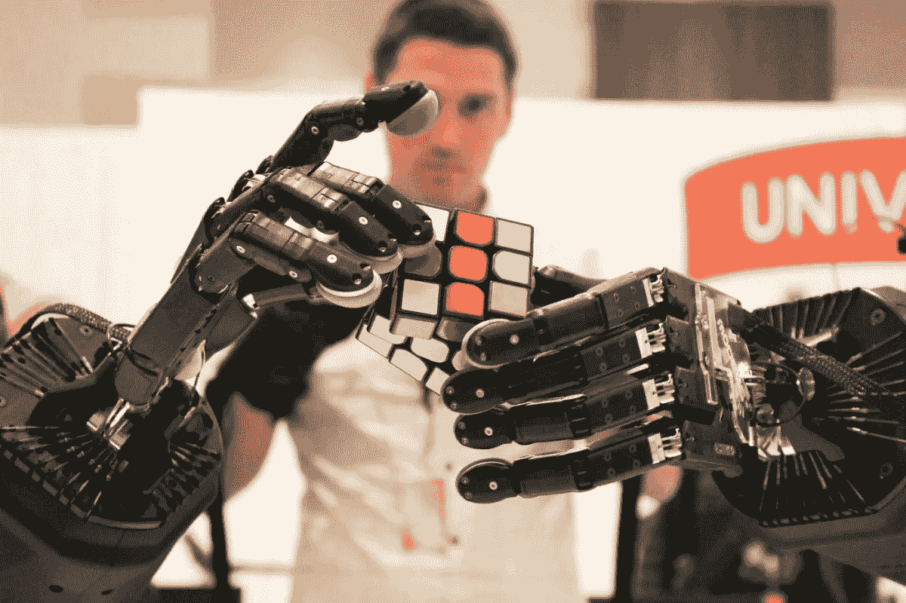
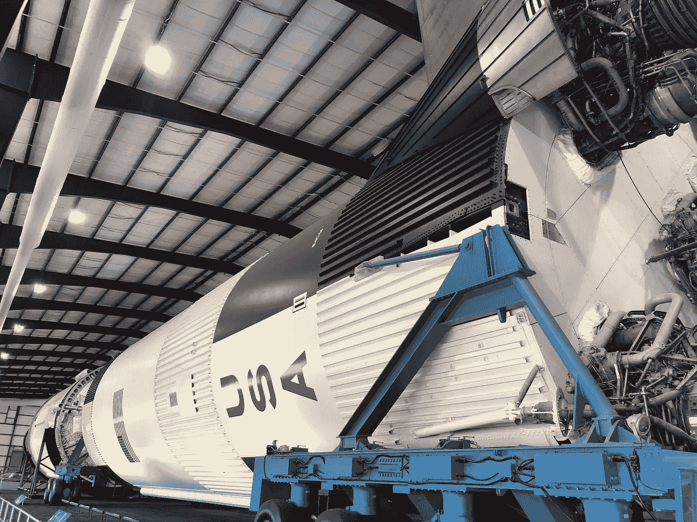
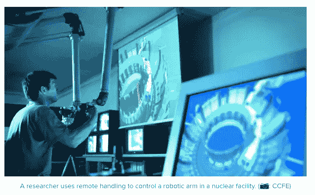
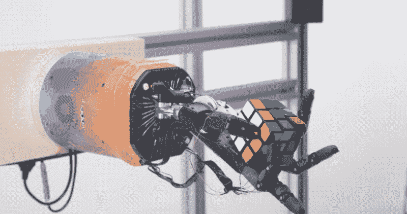

# 部署一个触觉遥控机器人需要一个村庄

> 原文：<https://medium.datadriveninvestor.com/it-takes-a-village-to-deploy-a-tactile-telerobot-d697a8d97cd0?source=collection_archive---------15----------------------->

为了庆祝 MLK 日，我在休斯顿美国宇航局约翰逊航天中心追随凯瑟琳·约翰逊的脚步。五十年前发射阿波罗 11 号成功登月的任务控制室里，她的记忆依然清晰可见。如果没有这位非裔美国先驱的数学天才和她的人机团队，这个历史性的里程碑是不可能实现的。今天，他们的创新精神体现在不同的科学界合作管理国际空间站及其绕地球运行的机器人网络。

本着伟大科学伙伴关系的精神，我回忆起本月早些时候在 CES 上遇到的 Jeremy Fishel 博士，他是[有形研究](http://tangible-research.com/)的创始人。有形研究公司是参与开发触觉控制的人形抓取系统“触觉遥控机器人”的三家机构之一。在尤里卡公园地板上挤满人的隔间里采访他时，他向我介绍了他来自[影子机器人公司](https://www.shadowrobot.com/products/dexterous-hand/)和 [HaptX](https://haptx.com/) 的同事。Fishel 博士指出，“影子机器人公司为灵巧的机器人手提供专业知识和产品，有形研究提供触觉传感和触觉方面的专业知识，HaptX 为触觉手套提供专业知识和产品。完整的系统还包括来自 [SynTouch](http://syntouchllc.com/) (仿生触觉传感器)和通用机器人(机械臂)的硬件。”他兴奋地将三巨头称为“汇聚机器人集团”(CRG)。

费希尔博士与《影子》的里奇·沃克一起获得了全日空航空公司(ANA Holdings)的赞助，作为最终登陆火星的垫脚石。用 ANA 化身部门的 Kevin Kajitani 的话来说，“对于这些先进的化身系统和一般的远程机器人技术，我们只是刚刚开始触及它的表面。除了赞助 1000 万美元的 ANA Avatar XPRIZE 之外，我们还与三家合作公司进行了接洽，寻求能够让我们开发出高性能、直观、通用的 Avatar 手的解决方案。我们相信这项技术将是帮助人类跨越遥远距离进行联系的关键。”ANA 在 6 月份的新闻稿中进一步吹嘘道:“远程操作和远程呈现系统将采用第一只成功传输触觉的机器人手。这项创新技术因其彻底改变行业的潜力而被称为“机器人圣杯”，使即将到来的公开测试成为全日空机器人风险投资的真正里程碑。”CRG 的技术已经展示了一种“前所未有的精确遥控”，机器人手指在距离人类操作员 5000 英里以外的键盘上打字。沃克预测，远程机器人最终将用于执行最危险的人类任务，“我们的远程控制系统可以帮助改变危险环境中的工作，如核退役，我们已经在与英国核机构就这项先进技术的应用进行谈判。”

Fishel 博士透露，这 15 个月的努力中最具挑战性的方面不是技术，而是管理所有的贡献兴趣，“不开玩笑，这比人们想象的要花更多的时间。公司之间的工程师合作得很好，几乎没有任何问题——我们有很多优秀的人在一个非常酷的项目上工作，这个项目检查了很多让工程师开心的选项(我喜欢把自己算在这个组里)。然而，业务关系有时会变得复杂，因为企业有自己的目标和需求。”他继续描述他的外交能力，“当冲突出现时，我们试图接受我们的分歧，并专注于将我们聚集在一起的共同目标。这无疑是一个总和大于部分的故事，所以我认为每个合作伙伴和合作者都认识到这是值得保持的特殊之处。”对于任何创业公司来说，这些人际交往技能对于启动任何企业都是无价的，尤其是以机电一体化为主导的创业公司。

 [## 模式和机器人:复杂的现实|数据驱动的投资者

### 哈耶克的名著《复杂现象理论》(哈耶克，1964)深入探讨了复杂性的话题，并断言…

www.datadriveninvestor.com](https://www.datadriveninvestor.com/2019/03/04/patterns-and-robotics-a-complex-reality/) 

Telerobot 的触觉灵活性只有谷歌的开放式人工智能的 Dactyl 人形手可以与之媲美，它在去年 10 月以单手解决魔方的身体灵活性震惊了机器人世界。该演示促进了人工智能在通过软件解决一系列复杂问题中的应用。正如 Open AI 的彼得·威尔德(Peter Wilnder)解释的那样，“许多机器人可以非常快地解开魔方。他们在那里所做的和我们在这里所做的之间的重要区别是，那些机器人是专门制造的。显然，你不可能用同样的机器人或同样的方法来完成另一项任务。OpenAI 的机器人团队有着非常不同的雄心。我们正试图制造一个通用机器人。就像人类和我们的手可以做很多事情一样，而不仅仅是一项特定的任务，我们正试图建立一个范围更广的东西。”Dactyl 熟练动作的关键是其算法和训练数据，以培养一般的自主性。怀尔德进一步阐述道，“要训练一个真实世界的机器人，去做任何复杂的事情，你需要多年的经验。即使对一个人来说，也需要几年的时间，而人类已经进化了几百万年，拥有了操作手的学习能力。”

今天，解决现实世界问题的上市速度是 CRG 团队远程机器人方法的一个关键区别。远程触觉控制能够在全球范围内立即利用人类的灵活性，而不是依赖深度学习来完成几十年的特定任务。Fishel 博士描述道:“显然，其优势在于系统的触觉反馈和高度灵活性，这使得该系统使用起来非常简单和直观。虽然我不会称之为不公平的优势，但多年来我们一直在说触觉在机器人技术中很重要。但是，一个显而易见的事实是，当你剥夺人类的触觉时，他们灵巧操纵的能力就会大大减弱，所以，没有感觉的机器人显然不会好到哪里去。我们已经用我们的触觉遥控机器人解决了这个问题，因此这些重要的触觉和触觉信息会反馈给操作员。”他继续解释他们的方法，“我们选择遥控机器人而不是自主方法的原因是，人类的智能仍然远远优于人工智能。正如朱迪亚·珀尔(Judea Pearl)正确指出的那样，在人工智能学会正确处理因果关系之前，它只是模式识别，从计算的角度来看，它可能会令人印象深刻，但在一般意义上，它实际上并不智能。”当我追问 Fishel 博士对 OpenAI 作为竞争对手的看法时，他反驳道，“Open AI 正在做令人惊叹的事情，我们不把他们视为竞争对手，而是合作者，特别是当我们转向寻求部分或完全自主和演示教学的应用时。”

人类的灵巧，尤其是手，是人类区别于猿类的身体特征之一。“关于人类的手是否是我们环境中一切事物的最佳末端执行器，或者我们是否只是简单地设计了我们环境中的一切事物来与我们的手很好地配合，存在着很大的争论，”Fishel 博士说。然而，他评论道，“无论你同意哪一种说法，最终结果都是人类的手是与世界互动的一个非常好的工具。”这引出了一个问题——谁将最终在掰手腕中获胜，电子人还是人类？

*立即注册参加下一届机器人实验室活动论坛，主题为* [*【自动化农业:从圣地到黄金之州*](https://www.meetup.com/RobotLab/events/267302463/) *】，2 月 6 日在纽约市举行。*