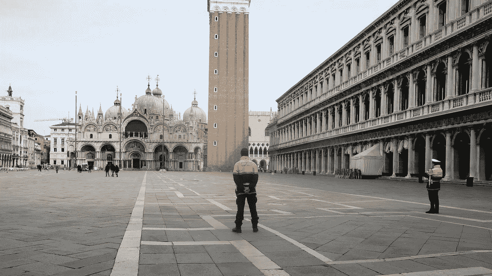
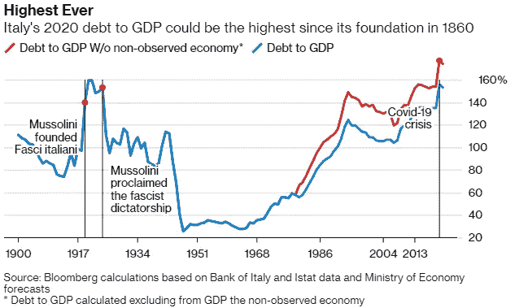
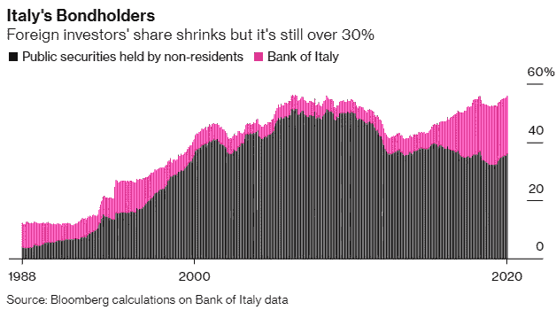
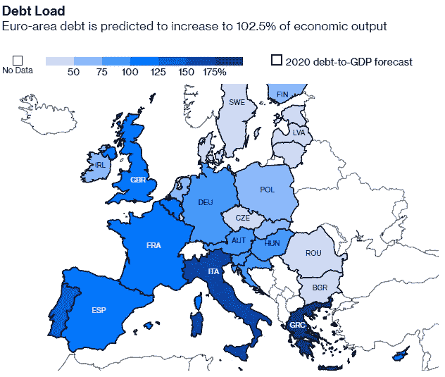
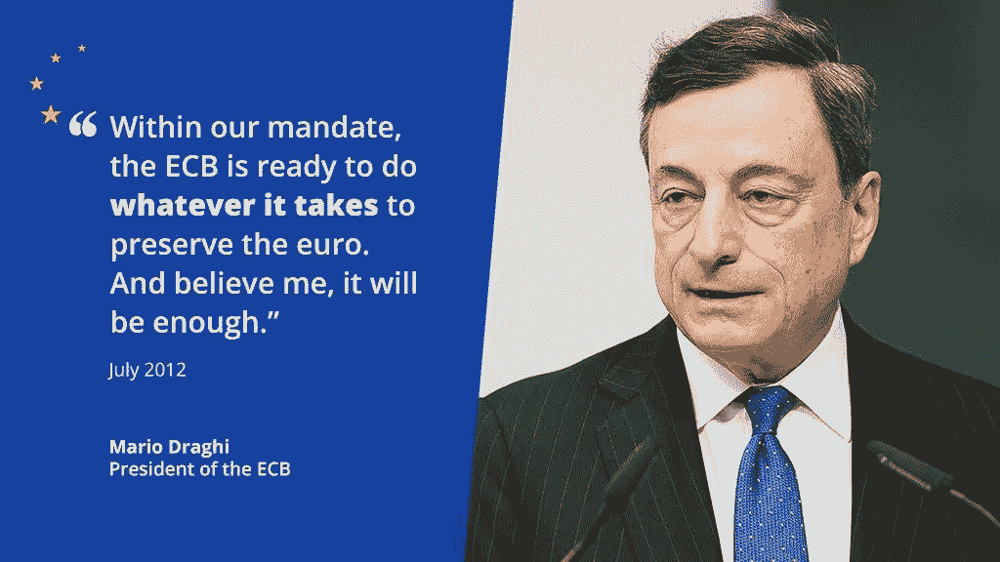
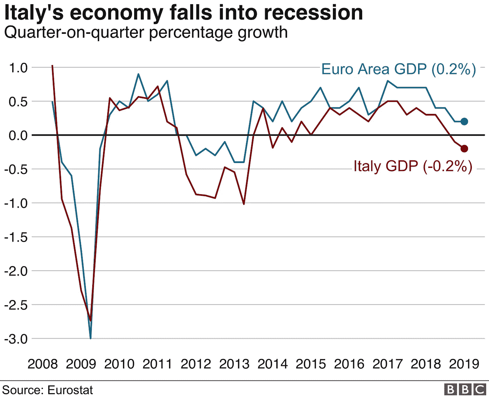
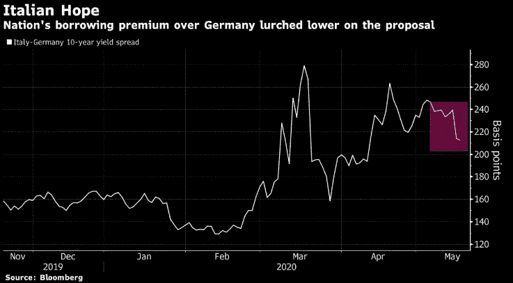
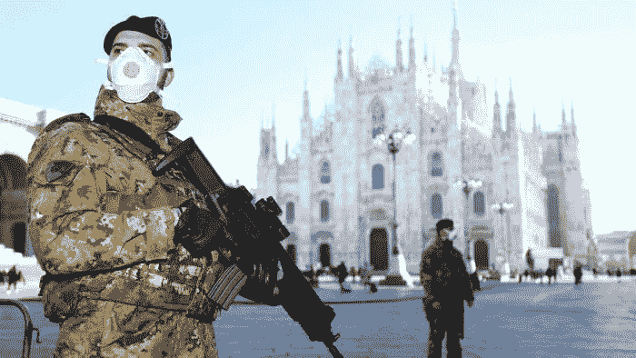

# 意大利隐现的巨额债务

> 原文：<https://medium.datadriveninvestor.com/italys-looming-mountain-of-debt-2e715915b19f?source=collection_archive---------2----------------------->

## 早先的希腊，现在的意大利——我们需要新的债务解决方案和努力工作

St. Mark’s square in Venice, a day after the government announced a national lockdown. (Image: Reuters)

早在 2012 年 5 月，我就为希腊提出了这篇文章的中心论点，当时我有机会拜访了欧洲央行(ECB ),并提出了几个问题——不出所料，这些问题没有得到回答。我的预测是，如果结构性改革无法实现，希腊只能活在借来的时间里。从那时起，这个问题已经被搁置了近三年，在[牛市](https://medium.com/@der_Wille/can-the-bluff-be-called-7e3f9f0b3082)期间，在 2015 年再次理直气壮地抬起它丑陋的头[。现在是 2020 年，在疫情期间，央行的资产负债表和国家债务只会增加。](https://medium.com/@der_Wille/has-the-bluff-been-called-cda77245078c)

随着意大利滑向自墨索里尼以来债务占 GDP 的最高水平，类似的情况也应该适用于意大利。意大利的债务水平已经高于希腊引发 2012 年危机时的水平。对欧盟来说，它继续引发人们对一个没有财政联盟的货币联盟的可行性的质疑，对德国霸权、北方的吝啬和南方的生产率的质疑。很像希腊外交部长尼古拉·科奇亚斯(Nikolaos Kotzias)在 2015 年访问俄罗斯，那次会议实际上被宣传为希腊在欧洲和俄罗斯之间做出决定的一天；意大利对中国的明显倾斜是欧盟内部担忧的一个原因。它是唯一同意加入中国“一带一路”倡议的七国集团成员。

毫无疑问，押注欧盟的灭亡从一开始就是一个失败的策略。布鲁塞尔可能会让危机不断累积，但它最终会渡过难关。但它确实留下了一些挥之不去的怨恨。与意大利相比，希腊对欧盟来说是一个小得多的问题，意大利是欧盟的第三大经济体和创始成员国。

1 **|甜蜜生活**

20 世纪 50 年代初，意大利比第三世界国家好不了多少。战争蹂躏了他们的国家，神圣罗马帝国是如此遥远的记忆，以至于很少有人在历史书上提及它。半个世纪后的 2011 年 11 月，随着意大利债券收益率不断上升，以及对欧盟第三大经济体国际援助的担忧日益加剧，意大利濒临崩溃边缘。

但是，贝卢斯科尼总理出现在镜头前，对任何紧急情况都漠不关心。

> “市场攻击意大利主权债券有点像是一种时尚，”他告诉国内一群满腹狐疑的意大利听众。“餐馆爆满，很难在飞机上预订座位，度假目的地在休息时间都被预订一空。我认为，如果你生活在意大利，你不会注意到意大利正在经历任何类似于深刻危机的事情。”

不到两周之后，他的总理职位被技术官僚马里奥·蒙蒂取代。

然而，贝卢斯科尼挖掘了一些非常真实和有形的东西——意大利仍然是，并且由于欧洲央行的慷慨，很可能仍然是一个生活水平高的富裕国家。大多数意大利人，四分之三的人住在自己的房子里，三分之二的人拥有汽车，六分之一的人每年至少去度假一次。首先，意大利的低生育率给家庭带来了高额的可支配收入。危机，什么危机？不仅仅是游客带来了金钱，所有人都说，普通的意大利人过着极其舒适的生活。

经济形势要黯淡得多——意大利已经远远落后于她的欧洲同行，并且没有自己真正的实力。大约在 20 世纪 50 年代到 80 年代初，意大利在一代人的时间里实现了“大跃进”。从那以后，意大利几乎停滞不前，依靠那一代人创造的中产阶级积累的财富生活。这个社会依靠长辈生产的剩余产品生活。社会学家卢卡·里科尔菲有一个理论；

> 意大利正在转变成一个全新的发达社会，一个不再创造新财富，而是依靠前几代人积累的财富生活的社会。他在《La Societa Signorile di Massa 》(即“中产阶级大众社会”)中写道，意大利已经成为“一个富裕的社会，在这个社会中，经济不再增长，不用工作就能获得剩余收入的公民比工作的人多。”

Image: Bloomberg

意大利人和意大利银行都是意大利债券的狂热购买者——这支撑了房子和他们拥有的其他资产以及他们的养老金的价值。由于收入停滞，年轻人失业率居高不下，意大利普通家庭的资产是其可支配收入的六倍。

> 截至 2020 年 2 月底，三分之一的工作年龄意大利人没有工作。那就是 1300 万不活跃的人。再加上西方老龄化最严重的社会中的 1600 万养老金领取者，你就会开始看到问题的严重性。所有这些甚至发生在新冠肺炎最糟糕的影响和相关的封锁渗透进来之前。

2 **|【不惜一切代价】**

The +175% colour code had to be specially included for Greece. Image: European Commission, Bloomberg

2012 年 10 月，欧洲央行前行长马里奥·德拉吉在伦敦说出了这句名言。读者不应忘记德拉吉是意大利人。在他任职的最初几年，他发表的几乎每一个声明都与那三个词形成鲜明对比，这三个词后来成为他任期的定义。德国报纸甚至给他贴上了荣誉德国人的标签，因为他拒绝放松借款限额或取消对欧盟受金融危机打击最严重的经济体的限制。

> “不惜一切代价”——他拿走了所有的风险和责任。

那次讲话之后，西班牙和意大利的借贷成本大幅下降。还记得贝卢斯科尼在本文前面说过的话吗？按照 2020 年 5 月的情况，意大利严重依赖欧洲央行的紧急债券购买来控制其借贷成本。

Image: Positivemoney Europe

回顾一下欧元区最近的历史，就能明白主权债务危机是如何由一家央行策划的。这家央行的主要目的不是像大多数央行那样，提供有利于增长和就业的条件，而是致力于一个单一目标——价格稳定。与美联储或其他央行相比，欧洲央行遵循单点宣言，旨在提供价格稳定以及就业和增长。

欧洲央行的唯一目标是价格稳定，因为它认为保持长期低利率是解决所有可能困扰欧洲经济的问题的办法——通胀、失业甚至投资者信心低下。欧洲央行设定的低利率使得希腊、葡萄牙和爱尔兰能够以仅比世界安全经济体——美国、英国和德国——高几个基点(1 个基点为 0.01%)的利率借到钱，导致了大金融危机。

对于像希腊和意大利这样的高度社会主义国家来说，这是一笔廉价资金，这些国家的大部分收入来自少数几个行业，主要是航运业和旅游业。像所有社会主义国家一样，大部分资金用于政府支出，即意大利老年人享受的丰厚养老金。疫情现在进一步把意大利变成了一个低收入、高支出——政府支出——的国家。

除了借款，意大利没有办法支付新冠肺炎和封锁引发的成本。无论如何，他们已经这样做了几十年了。这里的关键是，意大利希望要么是“团结债券”，即整个欧元区承担成本，不带任何“附加条件”，即不进行改革或紧缩。奥地利，其第二大贸易伙伴是意大利，一直大声反对。此外，德国和荷兰等国也反对联合发行的想法，而意大利、西班牙和法国支持联合发行。

> 奥地利总理塞巴斯蒂安·库尔茨是意大利政坛的一颗冉冉升起的新星，他告诉意大利要感谢意大利提供的帮助。这位 33 岁的总理在彭博的一次电视采访中说，“如果没有欧盟和像澳大利亚这样的国家的帮助，他们将无法应对这种局面。”。

如果这看起来像是意识形态上的分裂——事实的确如此。反对联合发行的国家预算平衡，债务水平低，经常账户盈余，因此在真正需要的时候——也就是现在——有足够的空间借债。与此相反的阵营是那些养老金体系未改革、结构性衰退、经济缺乏竞争力的国家，这些国家的借贷已经很高，而且几乎没有从过去十年的多重危机中恢复过来。

> 我猜如果你等得够久，那么一场危机就会来临，洗刷掉你的借款罪恶。

这种情况很好地引导我们进入第一套经济学解释和术语:委托代理人和搭便车者。不理解委托代理问题并形成其理论基础，就不可能理解债务过剩。意大利和希腊都是如此，但希腊更是如此，因为他们不久前还面临着主权债务危机。意大利很可能会去那里。如果下一部分开始让你厌烦，请随意跳过！

3 **|意大利债务问题背后的经济原理**

**委托代理难题**:让我们以一个希望从投资者那里借钱的企业家为例。根据常识，投资者知道，企业家努力工作和逃避责任时，成功的概率是不同的。让我们用希腊语(多么富有诗意)，给各种可能性赋予符号。

ƿh =当企业家努力工作时成功的概率；

ƿl =当企业家逃避时成功的概率；

自然是因为创业者的努力增加了成功的概率，我们有；ƿh—ƿl > 0，即δp > 0

假设企业家花了 B 的钱去努力工作。换句话说，因为他的努力让他付出了 B；他的利润减少了相同的数量。企业家是否真的努力工作，是私人信息，比如希腊(还有意大利)的情况，外部投资者不知道希腊的困境，也就是说**希腊没有用外部投资者给她的钱努力工作。**

自然，每一项投资，姑且称之为 I，都是为了获得回报；让我们把这个回报(取决于项目的“成功”)记为 r。

如果我们回顾所有的术语，它们如下:ƿh =企业家努力时的成功概率，ƿl =企业家偷懒时的成功概率，B =企业家的私人利润(代理租金)，I =投资，R =项目成功的回报。

如果不建立一组不等式，上述术语就没有意义。如此建立的不平等应该能够反映现实。

1.  只有企业家投入努力，项目才能成功；因此我们有下面的不等式:ƿhr > I > ƿlr，即当企业家努力工作且项目成功时产生的回报大于投资额，而投资额又大于企业家逃避工作且项目不成功时产生的回报。当ƿh 和ƿl 之间的差距相当大时，这种不平等是真实的，这就是真实世界的运作方式，只有少数例外；
2.  如果ƿh(r-rl)> ƿl(r-rl)+b 给了我们临界条件，企业家将投入努力；rl = R—B/δp，换句话说:b/δp 是企业家为自己赚取的最低金额，如果他有工作的动机的话。

Italy was already doing worse than the Euro Area before the pandemic hit (Image: Eurostat, BBC)

这个结果让我们看到了意大利经济的两个重要阶段:大金融危机之前和之后；

1.  在 GFC 之前，意大利可以以如此低的利率获得货币，以至于他们没有动力将货币用于有利可图的用途，也就是说，这是免费的货币。这是外国投资者用来购买意大利债务的“闲钱”——从而支撑了 T2 的甜蜜生活。
2.  一旦危机席卷了意大利(现在又席卷了疫情)，投资者不仅不想借给他们更多的钱，也拒绝给意大利任何努力工作的激励，也就是说，他们拒绝向意大利支付任何机构租金。这一举措在希腊的情况下更加引人注目，考虑到希腊主权债务危机爆发于 2012 年，即 GFC 爆发几年后，希腊的情况要迅速得多。几乎在一夜之间，希腊从宽松的货币政策转向了紧缩的信贷市场，但没有改变一个基本的方面——T4——在这两种情况下，希腊都没有努力的动力。

The premium of Italian bonds over German ones narrows after Merkel and Macron’s announcement of a recovery fund. Image:Bloomberg

**债务过剩和可能的减记**:债务过剩是指目前的债务持有人被欠了太多的钱，以至于该债务的发行人(在这种情况下是意大利)难以吸引任何新的投资者。这是因为现有债务持有人对发行人希望产生的现金流拥有近乎排他性的要求权，即在未来和债务履行过程中产生的几乎所有资金都是现有债务持有人的独有财产。这正是他们需要欧洲央行购买其债券的原因。

> 如果你的债务占 GDP 的比例是 160%，那么这绝对是你的国家的真实情况！简而言之，出售你的整个经济仍会让你的债务短缺 37.5%，令人震惊。

同样，现实世界强加给我们的一个假设是:ƿh(r—b/δp)—I > 0(无现有债务)ƿh(r—b/δp—d)—I > 0(有优先债务，其中 d 为现有债务)。上述等式表明，项目产生的回报减去代理租金和投资应该是正的，即没有免费的钱。但如果旧债务持有人能够提供进一步的融资，我们就有了不同的条件；ƿh·d·>ƿh(r—b/δp)—I > 0，即欠旧债务持有人的钱超过了一个项目所能产生的回报。

以上两种情况都不理想，唯一的出路是部分减记债务，这是欧洲央行害怕的，也可能永远不会允许的。

4 **|一条可能的出路？**

我们可以继续求解新旧债务之间的均衡，但除非欧洲央行接受部分债务减记，否则它们都无效，即原始投资者现在可以获得的回报不是ƿh(r—b/δp—d)—I，而是ƿh(r—b/δp—d)—I；其中 d 是原始债务减记后所欠的债务，自然，这使得债务更容易使用。

> 意大利现在的问题，以及希腊之前的问题，不再仅仅是借贷成本的问题，而是债务的数量问题。你可以帮助意大利以 2%而不是 4%的利率借款——但是下面堆积如山的债务，远远大于他们的经济，现在才是真正的问题。

欧洲央行一直担心的是**搭便车问题**也就是说，如果一些优先债券持有人进行减记，那么其他优先债券持有人也会从中受益。这刺激了优先债券持有人玩等待游戏，并利用他们的影响力迫使其他优先债券持有人进行减记。就希腊而言，这是欧洲央行的游戏计划:他们迫使持有希腊债务的对冲基金进行减记，而他们自己并不愿意这么做。这样的减记，为未来的投资者释放了现金流，更重要的是，将为希腊提供一笔代理租金，这在危机前和危机后的希腊都没有出现过。这是意大利正在走的道路。

所有这些例子中的隐藏解决方案可能会被证明是最有效的。既然意大利/希腊的代理租金如此之高，为什么不鼓励他们投入更多的资金呢？那肯定会迫使他们更加努力地工作？数学推理也会证明这一点。

如果我们说“a”是希腊自己投入的现金，那么 d =(k-1)a = da = { ƿh(r-b/δp)} a { 1-ƿh(r-b/δp }我们知道，当一个企业家逃避工作时，那么δp 下降，即成功和失败的概率差异非常小。但当企业家试图这样做时，上述等式的价值就会下降，因此投资者会要求企业家给出更高的“A”。用金融术语来说，如果企业家希望进入资本市场，他就会被迫使用低杠杆。

很明显，如果意大利被迫拿出更多自己的钱来冒险，那么债务过剩和低机构租金的问题就可以一蹴而就。与意大利几乎没钱的时候相比，现在这种解决方案更有可能。最激进且政治上不可接受的解决方案将是意大利抵押抵押品。抵押担保品为投资者提供了安全保障，如果债务不能按时偿还，他们可以主张对标的资产的所有权。这几乎是不可接受的。斯里兰卡就是这样把汉班托塔港的控制权拱手让给了中国人。中国已经拥有重要的希腊资产，意大利被视为“一带一路”倡议的欧洲切入点。

提供抵押品不仅能吸引投资者，还能激励借款人努力工作，否则就有失去抵押品的风险，在这种情况下，这将意味着国家的耻辱。鉴于疫情不是他们做的，意大利人会理所当然地拒绝。但这并没有使他们的背信弃义的债务负担之旅，直到这一点上，道德辩护。

5 **|是否退出欧盟？**

有一点是清楚的——在疫情穿越欧洲之旅的最初阶段，缺乏与意大利人的团结已经在意大利人的心灵上留下了印记。每次意大利人需要欧洲的时候，他们都被辜负了，所以感受一下意大利人。1992 年，当里拉和英镑一起遭受重创时，他们被孤立了。2015 年，随着移民危机的爆发，意大利人基本上被孤立了。2020 年，当意大利需要医疗用品时，法国和德国关闭了边境，停止了医疗出口。现在，一个 33 岁的奥地利人给他们讲预算财政。

The military stands guard outside Milan’s cathedral (Image: Reuters)

德国未雨绸缪，拥有健康的债务水平——有些人会说，他们几十年来投资不足，以确保预算平衡，这是法律规定的。他们现在可以借钱来加速经济复苏，但他们那些挥霍无度的邻居应该有这种选择吗？到了紧要关头，德国同意了对希腊的救助。他们还会做同样的事情吗？欧盟是德国最大的贸易伙伴，所以最终他们需要一个稳定的欧盟来稳定他们自己。它们的经常账户盈余含蓄地意味着，它们依赖于全球经济的健康发展。

意大利人也可以满怀渴望地看看英国，看看快速行动计划(意大利的 550 亿欧元计划花了几周时间争论)和更便宜的国家货币能有助于实现什么。意大利不能做的一件事是继续做他们曾经做过的事情。无论是在欧盟和欧元区内部还是外部，他们的未来只能通过经济结构性变革来解决。

尽管存在移民问题，但意大利中产阶级的生活方式只能由数百万低薪的“零工经济”和生活在社会边缘的移民劳工推动。意大利的非正规部门占其经济总量的 12%。它的养老金系统是发达国家中第二贵的——仅次于我另一个最喜欢的打击对象，希腊。

意大利的年轻啃老族人数最多，“不在教育、就业或培训领域”，占欧盟的 24.8%。他们的女性劳动参与率在欧盟是最低的。不断萎缩的劳动人口支撑着西方世界最老的人口。我们之前拜访过的社会学家里科尔菲认为，意大利人在过去 50 年里一直入不敷出。他补充道，

> “看看今天的意大利，我看到了与分层的中世纪惊人的相似之处，当时一小部分贵族依靠他们继承的财富生活，而大多数人辛辛苦苦却没有什么收获，社会流动性几乎不存在。重要的是要记住，除了没有任何工作支持的炫耀性消费之外，中产阶级社会的特点是他们的不可移动性。”

> 在意大利,“少数贵族”由超过 3000 万人组成，而且还在不断增加，然而罗马必须花钱来避免更深的危机。

— — — — — — — — — — — — — — — — — — — — — — — — — — — —

[*别再称之为衰退了——这是‘大封锁’萧条*](/datadriveninvestor/stop-calling-it-a-recession-this-is-the-great-lockdown-depression-2877616977ed)

[*新冠肺炎照亮了英国的衰落*](https://medium.com/discourse/covid-19-shines-a-light-on-britains-decline-b89c616b4b95)

[*【没有出价，心理】*](https://medium.com/datadriveninvestor/no-bids-mental-c09c3ce38d27)

)(我)(们)(都)(不)(知)(道)(,)(我)(们)(还)(不)(知)(道)(,)(我)(们)(还)(不)(知)(道)(,)(我)(们)(还)(不)(知)(道)(,)(我)(们)(还)(不)(知)(道)(,)(我)(们)(还)(不)(知)(道)(,)(我)(们)(还)(不)(知)(道)(。 )(我)(们)(都)(不)(知)(道)(,)(我)(们)(还)(不)(知)(道)(,)(我)(们)(还)(不)(知)(道)(,)(我)(们)(还)(不)(知)(道)(,)(我)(们)(还)(不)(知)(道)(,)(我)(们)(还)(不)(知)(道)(,)(我)(们)(还)(不)(知)(道)(,)(我)(们)(还)(不)(知)(道)(,)(我)(们)(还)(不)(知)(道)(。 )(我)(们)(都)(不)(知)(道)(,)(我)(们)(还)(不)(知)(道)(,)(我)(们)(还)(不)(知)(道)(,)(我)(们)(还)(不)(知)(道)(,)(我)(们)(还)(不)(知)(道)(,)(我)(们)(还)(不)(知)(道)(,)(我)(们)(还)(不)(知)(道)(,)(我)(们)(还)(不)(知)(道)(。 )(我)(们)(都)(不)(知)(道)(,)(我)(们)(还)(不)(知)(道)(,)(我)(们)(还)(不)(知)(道)(,)(我)(们)(还)(不)(知)(道)(,)(我)(们)(还)(不)(知)(道)(,)(我)(们)(还)(不)(知)(道)(,)(我)(们)(还)(不)(知)(道)(,)(我)(们)(还)(不)(知)(道)(。