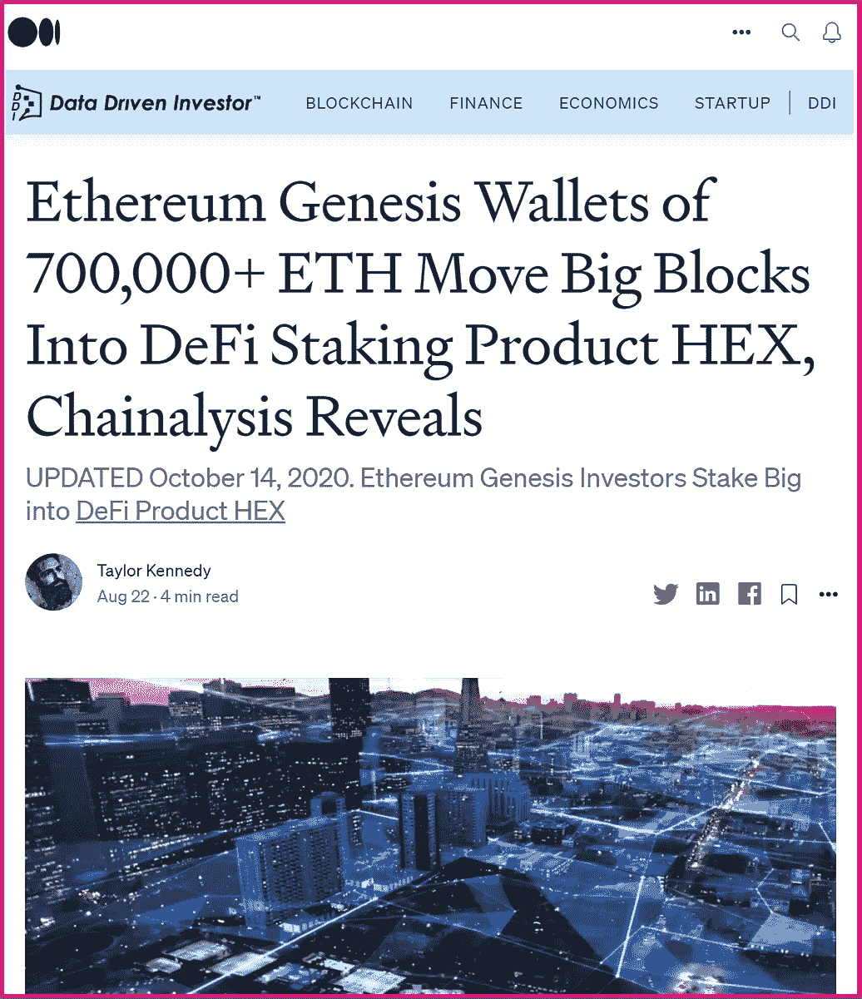

# 比特币被黑？这件事发生了(两次)

> 原文：<https://medium.datadriveninvestor.com/itcoin-unhackable-it-happened-twice-not-blowing-smoke-9e16bcddd5ab?source=collection_archive---------0----------------------->

## 比特币已经被危险地利用了——两次——允许免费铸造无限的 BTC。

M ost 惊讶地得知比特币的(BTC)源代码已经被危险地利用了两次，允许无限免费的[比特币](https://www.google.com/finance/quote/BTC-USD)被铸造。最近一次发生在不到 3 年前，幸运的是被制止了；然而，第一次几乎是灾难性的。还会有下一个吗？

一场 [*公地悲剧*](https://www.investopedia.com/terms/t/tragedy-of-the-commons.asp) 对于比特币来说，它的源代码仍然没有安全审计，这就引出了一个问题:会不会发现另一个通货膨胀漏洞？

# 目前发现的两个比特币膨胀漏洞

🔴2010 年 8 月 15 日的 CVE-2010–5139 病毒导致 1840 亿 BTC 被铸造。紧接着这一事件，核心开发人员**加文·安德里森**和**中本聪**不得不回滚区块链，以便从区块 74638 中清除该交易。

🔴最近，在 2018 年 9 月 17 日，CVE-2018–17144 错误被一名比特币现金(BCH)开发者发现，他在它被坏人利用之前无私地采取了行动。

比特币杂乱的代码和可破解的过去可能是导致这种“可编程货币”没有任何基础设施，也没有任何近期计划的主要因素。

安全至上；事实上，这是加密货币可以拥有的最高效用之一。为什么比特币的源代码没有经过全面的安全审计？

# 被杂凑率忽悠

许多人，包括加密货币领域的几位表面上的领导者，都被更高的散列率意味着更高的安全性的鹦鹉学舌所愚弄。这很容易被推翻:包括比特币在内的加密货币的缺陷主要是软件缺陷。极少数错误与散列率有关(例如 51%的攻击)。因此，你可以拥有巨大的散列率，就像比特币的情况一样，然而，如果代码被利用，散列就无法提供安全性。把它想象成一扇锁着的前门，旁边有一扇大玻璃窗。事实上，通货膨胀漏洞是加密货币可能遭受的最严重的攻击，因为它允许免费无限印刷加密货币。在撰写本文时，已经在比特币中发现了两个通货膨胀漏洞，最近一次发生在不到 3 年前。人们只能希望加密货币领域的领导层会谨慎行事，发起对比特币的全面安全审计。很少有 100%正常运行时间的加密货币有多重安全审计并完美执行，但 [*确实存在*](https://hex.com/) 。

今天，十大加密货币中有更多最初是建立在以太坊(ETH)之上，而不是任何其他区块链基础之上。以太坊以智能合约功能为特色的图灵完整语言提供了卓越的安全性。以太坊的能力极大地促进了区块链科技的发展；其无数的可编程设计功能，加上更好的安全和性能能力，是比特币所缺乏的功能。随着备受期待的 [PulseChain](https://pulsechain.com/) 的推出，世界上最大的免费空投——以太坊的第 1 层完整系统状态分支，运行更快，更便宜，更干净的交易——这是加密货币的一个激动人心的时刻，可以看到进一步的增长和能力。

## 参考资料:

[https://news . bitcoin . com/bit coin-history-part-10-the-1840 亿-BTC-bug/](https://news.bitcoin.com/bitcoin-history-part-10-the-184-billion-btc-bug/)
https://bitcoincore.org/en/2018/09/20/notice/
[https://en.wikipedia.org/wiki/History_of_bitcoin](https://en.wikipedia.org/wiki/History_of_bitcoin)
[https://www . the block crypto . com/post/60517/github-is-backing-up-the-code bases-for-bit coin-core-and-ether eum-under-the-the-arctic-ice-in-sval bard](https://www.theblockcrypto.com/post/60517/github-is-backing-up-the-codebases-for-bitcoin-core-and-ethereum-under-the-arctic-ice-in-svalbard)

# 赌注十六进制&看它倍增

[**打桩工。App**](https://staker.app/invite/PQn8) **让你 100%安全放心地在链上积累财富，并实时看着财富增长:**

**100%正常运行时间
完美运行
零交易对手风险**

你在掌控中。木桩十六进制，看着它繁殖。

# 相关文章

