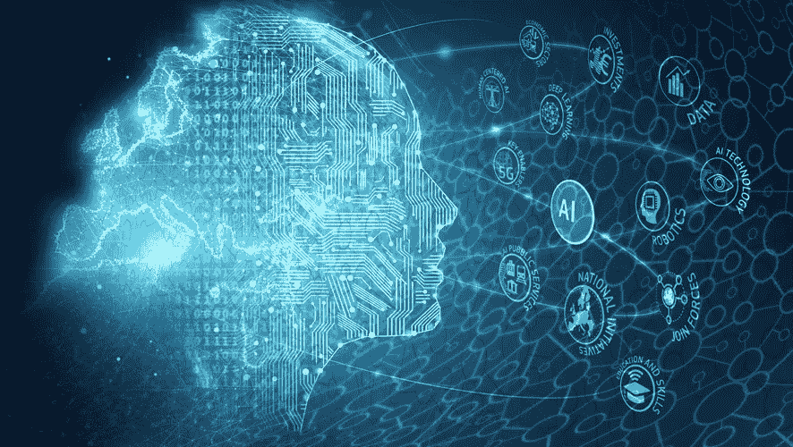

# 现在是晚上 11 点。你知道你的 AI 在哪里，在做什么吗？

> 原文：<https://medium.datadriveninvestor.com/its-11-pm-do-you-where-your-ai-is-and-what-it-s-doing-a0ddc69bc1e6?source=collection_archive---------11----------------------->

德勤在企业报告中的人工智能状况强调了人工智能采用中的道德和监管风险。

随着人工智能在世界各地变得越来越普遍，企业技术领导者已经超越了我们可以利用这项强大的新技术做什么的问题，而是我们这样做将如何影响我们的公司和我们关心的其他事情，如个人隐私、工人工作、独裁政府的滥用、透明度、社会责任、问责制甚至工作本身的未来。

简而言之，一些非常人性化的元素现在已经成为算法的一部分。这可能是德勤刚刚发布的第三份年度企业人工智能状况报告的关键发现，该报告对 9 个国家的 2737 名 IT 和业务线高管进行了调查。考察他们对人工智能技术的看法和实践。

对企业人工智能采用者的研究发现，95%的受访者担心技术的道德风险，超过 56%的人认为，由于新出现的风险，他们的组织正在放缓人工智能技术的采用。

[报告的作者写](https://www2.deloitte.com/us/en/insights/focus/cognitive-technologies/state-of-ai-and-intelligent-automation-in-business-survey.html):

# 尽管人们对他们的人工智能努力充满热情，但采纳者也面临着保留意见。事实上，他们将管理人工智能相关风险列为他们人工智能计划的首要挑战，与数据管理和将人工智能集成到公司流程中的持续困难相关。

# 此外，对于采用者来说，在这些潜在的战略、运营和道德风险的广泛范围内存在令人不安的准备差距。超过一半的采纳者报告对他们的人工智能计划的这些潜在风险有“重大”或“极端”的担忧，而只有十分之四的采纳者认为他们的组织“完全准备好”解决这些问题。

对新兴风险的高度恐惧似乎正在抑制人工智能的采用。四分之一的受访者认为安全问题是最大的道德风险。其他担忧包括人工智能衍生的决策缺乏可解释性和透明度，人工智能驱动的自动化导致工作岗位的减少，以及使用人工智能操纵人们的思维和行为。

 [## AI 和医学影像创业公司？6 大趋势|数据驱动的投资者

### “IBM Watson 健康成像”是医疗保健的未来吗？谷歌详细说明了人工智能对胸部 x 光的分类…

www.datadriveninvestor.com](https://www.datadriveninvestor.com/2020/08/30/ai-and-medical-imaging-startups-6-key-trends/) 

尽管存在这些担忧，但只有大约三分之一的采纳者积极应对风险——36%的人正在制定政策或建立董事会来指导人工智能伦理，同样比例的人说他们正在与外部各方就领先的实践进行合作。

得知德勤是准备伸出援手的外部机构之一，你可能不会感到惊讶。

除了新的企业人工智能报告，该公司最近还推出了德勤人工智能研究所，以收集人工智能方面的最佳思维和最佳实践，以及新的“可信人工智能”框架，以指导组织如何在业务中负责任地和合乎道德地应用人工智能。

该框架将管理与人工智能道德和治理相关的常见风险和挑战，包括公平和公正的使用检查，实施透明和可解释的人工智能，责任和问责制，安全性，可靠性和隐私。德勤人工智能研究所执行董事 Beena Ammanath 说:

# “准备拥抱人工智能的组织必须从把信任放在中心位置开始。我们不仅致力于帮助我们的客户驾驭人工智能道德，还致力于在我们自己的组织内保持道德思维。”

Workday 是一家被称为正确采用道德人工智能的公司，该公司提供基于云的企业软件，用于财务管理和人力资本管理。它致力于一套原则，以确保其人工智能衍生的建议是公正的，并正在实践良好的数据管理。Workday 还将“设计道德控制”嵌入其产品开发流程。Workday 首席隐私官芭芭拉·科斯格罗维说:

# 对于工程师和开发人员来说，将“道德”整合到技术产品中可能感觉很抽象。虽然许多技术公司都在独立研究如何以具体和切实的方式做到这一点，但我们必须打破这些孤岛，分享最佳实践。通过相互协作学习，我们可以提高整个行业的标准——一个好的起点是专注于赢得信任的事情。

# 外卖食品

在所有现代军民两用技术中，或许可以公平地说，人工智能最有潜力既行善又作恶。用于管理工厂车间、自动化繁琐的业务流程、帮助农民提高生产力、支持科学和创新、监控极端天气和气候变化、改善医疗服务、支持安全和数以千计其他有用工具的相同算法，也可以用于入侵和跟踪公民个人的行为。这是执法人员和独裁政权的梦想工具，他们想把他们的膝盖放在人民的脖子上。它还会因无意或有意的内在假设而产生危险的偏差。

而且，它无处不在。德勤报告有趣/不有趣的发现之一是，许多组织不知道他们的组织在多大程度上或在哪里使用人工智能:

# 知道人工智能存在于何处是管理其风险的先决条件。降低风险的一个关键步骤是保持一个组织的所有人工智能模型、算法和系统的正式清单。企业很难跟踪人工智能的所有用途——一家银行“盘点了他们所有使用先进或人工智能算法的模型，发现总数达到惊人的 2 万个。”

这真的很可怕。

**进入专家视角—** [**订阅 DDI 英特尔**](https://datadriveninvestor.com/ddi-intel)