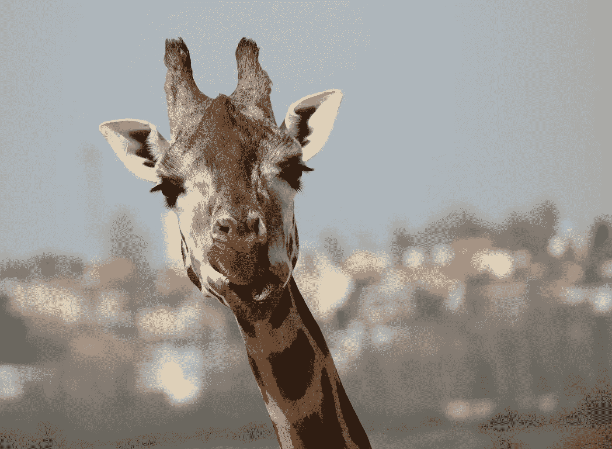

# 这是不可抗拒的错误，但我喜欢它

> 原文：<https://medium.datadriveninvestor.com/its-irresistibly-wrong-but-i-love-it-18d8dd2ba06c?source=collection_archive---------22----------------------->

Thanks Dusan S on Unplash

那个早晨的仪式我不能放弃

我每天都有一个秘密的渴望，不是为了巧克力或奶酪。我不确定我是否应该把它归类为雕刻，因为它很可能会上瘾？

# 我认为这是一种渴望

总之，我喜欢这种感觉。这很痒，但更重要的是，这种挠痒痒的绝对满足感不会消失——讨厌的昆虫叮咬。你知道你不应该，但你不能帮助自己。当你做到的时候，哦，如释重负，多么愉快。短暂，但令人满足。

我也意识到这种感觉伴随着健康警告。如果我把它滑得太深，它有可能导致一些严重的问题和损害。韦恩州立大学的研究人员发现，平均每年有超过 56，000 人因“耳异物”或塞在耳朵里的物体而被送进急诊室，对于 65 岁以下的成年人来说，大约 50%的伤害来自棉耳塞。

 [## 良好的生活是习惯的形成|数据驱动的投资者

### 过度思考是过度紧张。仅仅几个简单的习惯就会在一天中产生巨大的影响。那是…

www.datadriveninvestor.com](https://www.datadriveninvestor.com/2020/01/17/a-good-life-is-habit-forming/) 

对于耳塞粉丝来说，还有更多坏消息，这不是新的医疗建议，而是政府的一项环境公告。今年早些时候，在英国，一项禁止塑料吸管、饮料搅拌器和你的朋友和我的塑料茎棉蕾一次性产品的禁令开始生效。

> 在英国，每年估计有 18 亿个棉花芽被使用，处理掉它们会造成环境问题。

问题是聚丙烯吸管和使用塑料粘合剂来连接花蕾。在美国，棉签市场被棉签主导，他们使用纸基棉签。

环境食品和农村事务部(Defra) EQ0115 报告指出，耳塞正被冲进厕所。一个供水公司的调查提供了对其他一些被冲走的相当有趣的东西的洞察，坦白地说，这让我感到惊讶。

## 壁纸糊

## 牙线

## 一次性马桶刷

当然所有的马桶刷都是一次性的。这不是你想要保留的东西！

无论如何，这是一个傻瓜的游戏，因为我们的耳朵是聪明的东西，会自己清洁。产生的耳垢具有抗菌特性，有大量的医学证据表明，我可能弊大于利，根本没有必要在耳朵里插耳塞。

但是我喜欢这种感觉。所以我要去商店为环境尽自己的一份力，购买零废物的竹棉签，这些竹棉签可以回收利用或制成堆肥。

然而，与维多利亚时代将耳垢用作润唇膏的人相比，我们都有点落后于回收和创造力曲线。

是时候闭上眼睛，噘起嘴来了！

## 访问专家视图— [订阅 DDI 英特尔](https://datadriveninvestor.com/ddi-intel)