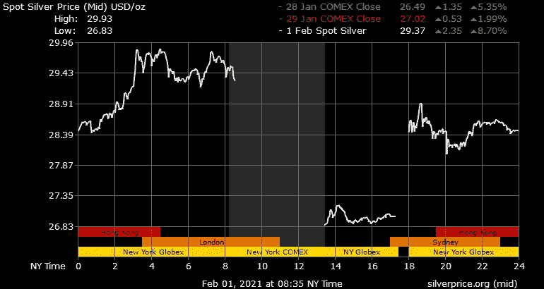
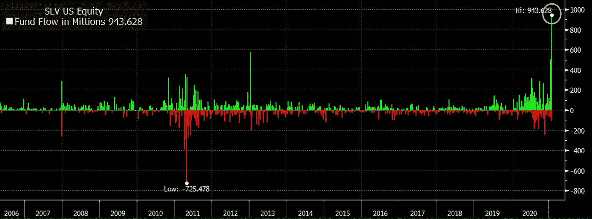
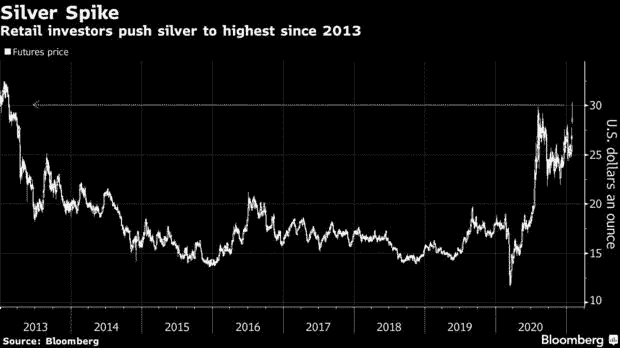
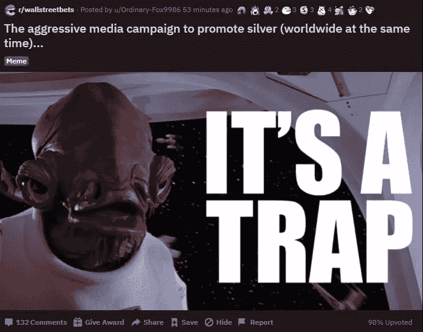
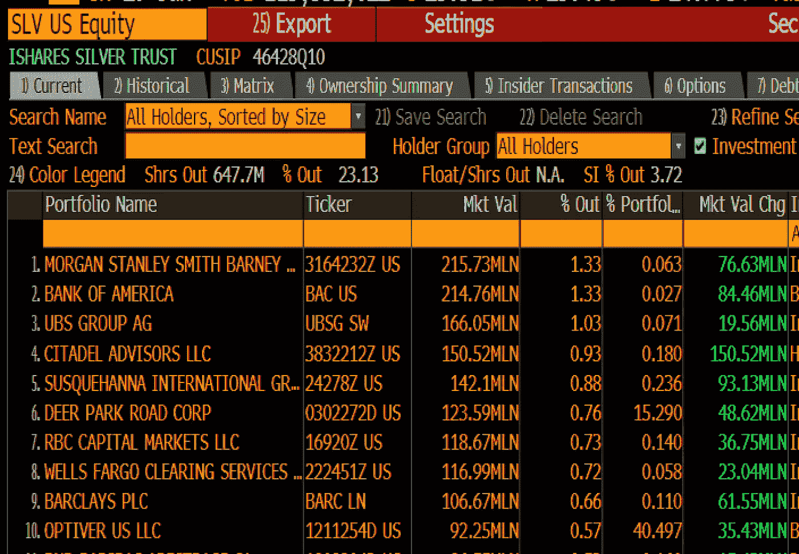

# 这不是 Redditors 泵银

> 原文：<https://medium.datadriveninvestor.com/its-not-redditors-pumping-silver-780300449a6d?source=collection_archive---------23----------------------->

## REDDITORS 转向商品市场？

## Reddit-subforum WallStreetBets 被媒体归因于白银价格的大幅飙升。仔细观察表明他们与此事无关

Spot silver price, 1-day. Source: silverprice.org

二月初，银价大幅上涨。美国东部时间 2 月 1 日 8.30，价格上涨超过 8%。

自 3 月份以来，白银一直呈上升趋势，当时大多数资产市场在柯维德疫情事件和全球经济活动停滞后大幅下挫。

上周开始流传有人试图做空 从而导致大量资金流入白银市场的谣言。

这些谣言导致白银行业几家公司的股价暴涨(见 *$PSLC* 和 *$ACG* )。此外，周五(1 月 29 日)被动型 ETF(交易所交易基金)iShares Silver Trust*($ SLV)*资金流入创纪录。

如下图所示，流入资金接近 10 亿美元。$SLV 追踪银价。

Silver ETF $SLV Fund Flow. Source: Bloomberg

## 媒体叙事:另一个由 Reddit 引发的投机泡沫

大多数媒体——从关注金融市场的媒体到广泛的“主流媒体”——都在报道类似的重点。

[彭博](https://www.bloomberg.com/news/articles/2021-01-31/silver-spikes-at-the-week-s-open-as-reddit-hordes-pile-in-again)展示了白银期货价格的下图，并写道:

> “白银最初的上涨可以追溯到 Reddit 的华尔街赌注论坛。上周的一篇帖子宣称，这种金属是“世界上最大的空头”，并鼓励交易员涌入 iShares trust，以此作为与大银行挂钩的一种方式。(彭博，2021 年 2 月 1 日)

Source: Bloomberg

他们进一步承认，不知道它是否确实是由 Redditors 驱动的，尽管标题暗示了这一点。

美国消费者新闻与商业频道在他们的头版以同样的角度刊登了一篇报道。Redditors 旨在挤压那些卖空白银的人，导致美元 SLV 价格飙升。

他们甚至声称讨论板的用户应对周末 Twitter 上的#silversqueeze 潮流标签负责。

同样，他们进一步深入讨论了这些主张，并对下一节中提出的观点进行了简要总结。

这些故事都提到了 GameStop(GME)和 AMC Entertainment(AMC)等股票的剧烈价格波动，将这些华尔街赌注(WSB)的最爱的购买热潮与白银的行为联系起来。

 [## GameStop 热潮会让散户投资者抓狂

### 随着次级 Reddit WallStreetBets 接受激进卖空者，一些对冲基金无论结果如何都在获利

medium.com](https://medium.com/datadriveninvestor/the-gamestop-craze-will-screw-retail-investors-fea762111434) 

关注面更广的媒体，如《泰晤士报》( The Times )( T1 ),对白银市场的发展报道较少。

## 华尔街赌注的情绪

与人们从媒体获得的印象相反，似乎没有什么迹象表明，白银相关资产的流入主要来自 WSB 用户。

使用该委员会的 Redditors 对所谓的白银紧缩提出了警告，承认购买大型商品市场的机会成本 GameStop 和 co .的资金减少。

上周末，论坛上充斥着大量的僵尸程序，向论坛发送大量的白银挤压信息。很可能是 Reddit 上负责这些机器人的同一批人也去 Twitter 上创造了 WSB 确实在银色列车上的印象。

据内部人士称，WSB 的版主在周末删除了超过 95%的帖子。

Example of popular posts at WSB. Screenshot by author. Source: Reddit subforum /wallstreetbets

许多成员甚至更进一步，推测机器人的起源。一些人指责持有巨额多头头寸的对冲基金试图在董事会内外达成共识，这将推动散户投资者进入白银市场。

对冲基金目前净做多 2.15 亿盎司白银期货，相当于超过 62 亿美元。

此外，包括对冲基金在内的机构投资者似乎有望从银价上涨中获益。如下图所示，SLV ETF 的最大持有者包括摩根士丹利(Morgan Stanley)和瑞银(UBS)等华尔街巨头中的 Citadel。

Holders of $SLV as of February 1\. Source: Bloomberg

其他人认为，Melvin Capital 甚至做市商 Citadel 等对冲基金仍持有 GameStop 的大量空头头寸，希望散户投资者将资金重新配置到其他资产，以避免遭受重大损失。

尚不完全清楚是什么导致了银价的大幅上涨。鉴于市场的规模、WSB 的情绪以及机构对该资产的头寸，Redditors 似乎不太可能是主要驱动因素。

 [## 罗宾汉将“你的”股票借给卖空者(并保留所有收益)

### 零佣金交易平台如何在幕后赚钱

medium.com](https://medium.com/datadriveninvestor/robinhood-lends-your-shares-to-short-sellers-and-keeps-all-the-proceeds-78353ca33fb9)  [## 特殊目的收购公司是新的黑人

### IPO 替代方案已经大规模回归，投资者的兴趣将使派对持续到 2021 年

medium.com](https://medium.com/datadriveninvestor/spac-is-the-new-black-296947838e2e)