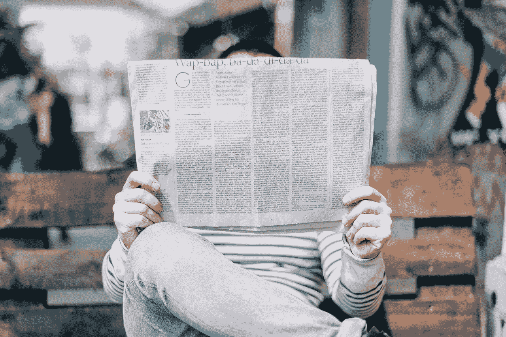

# 并不是消息不灵通的人不读书。这是他们所读到的。

> 原文：<https://medium.datadriveninvestor.com/its-not-that-the-ill-informed-don-t-read-it-s-what-they-read-6bc7aedecbdc?source=collection_archive---------10----------------------->

Image by [StockSnap](https://pixabay.com/users/StockSnap-894430/?utm_source=link-attribution&utm_medium=referral&utm_campaign=image&utm_content=2566677) from [Pixabay](https://pixabay.com/?utm_source=link-attribution&utm_medium=referral&utm_campaign=image&utm_content=2566677)

我每天阅读很多东西。新闻。专栏文章。政治和法律评论。非小说类书籍。作为执业律师，这是工作的一部分。我认为自己是一个相当聪明、见多识广的人。所以，很自然地，我过去把公民的无知归因于缺乏阅读——如果人们读得越多，他们就会越有见识。

但是我观察得越多，我就不再认为这是完全正确的。与其说孤陋寡闻*不*读书；他们读的是《T4》。

我认识的一些最坚定的阴谋论者做了大量的阅读。他们花几个小时研究像*布莱巴特*、*世界网日报*这样的网站上的废话，或者他们从 [QAnon](https://en.wikipedia.org/wiki/QAnon) 或 InfoWars 这样的中心重定向到的内容。问题似乎在于批判性思维技能的萎缩，这种技能让人们能够将事实和令人信服的分析与纯粹的宣传区分开来。这就是为什么 48%的美国人发现在使用社交媒体时很难区分真假，其中 16%的人觉得“非常难”这就是为什么读书的人会成为古怪的、“疯狂的”信仰的牺牲品。民主党人[吃小孩](https://www.businessinsider.com/qanon-book-pro-trump-conspiracy-amazon-charts-2019-3)。希拉里·克林顿参与了[仪式性的恶魔残害儿童](https://www.snopes.com/fact-check/hillary-clinton-snuff-film/)同时经营着一个[精英恋童癖](https://www.snopes.com/news/2018/09/02/roots-pedophile-ring-conspiracy-theories/)贩卖儿童的团伙。这就是为什么一个叫 Rein Lively 的女人进入了一个目标，并捣毁了商店的整个面具展示。

正如 NBC 新闻记者 Ben Collins 在他最近的[文章](https://www.nbcnews.com/tech/tech-news/how-qanon-rode-pandemic-new-heights-fueled-viral-anti-mask-n1236695?cid=sm_npd_nn_fb_ma&fbclid=IwAR0a3zEoH3srvFv58pnBo8Ple11_2e8wLH6x9hDp_tgqk9V4RCr4u9kEcMw)中解释的那样，他为 NBC 新闻报道虚假信息、极端主义和互联网，

> “在她爆发前的几周，由于疫情，她被关在家里，失去了工作，赖因·莱弗利通过潜入脸书和 Instagram 上充满阴谋的兔子洞，加剧了她的孤立和恐惧的感觉，来填补她本该与朋友一起闲逛和给客户发电子邮件的时间。
> 
> 一些人发现自己相信关于比尔·盖茨、5G 无线技术、疫苗和口罩的精心策划的阴谋论，研究人员表示，这些阴谋论部分是由一种算法和共享社区成员推动的，这些成员将所有理论组合在一起。
> 
> 几天后，他们开始相信唐纳德·特朗普总统正在发动一场秘密战争，从控制美国政府的崇拜撒旦的食婴者阴谋中拯救被贩运的儿童。"

很悲哀，真的。这样的人与邪教中的信徒没有什么不同。在这个不确定和焦虑的时代，阅读成了人们的一种逃避。国际出版商协会主席雨果·塞泽尔说:“世界各地的自我封闭现象导致了阅读的繁荣。然而，这也意味着那些不太倾向于评论*他们正在阅读的*却想要感觉自己是少数几个“知道内情”的人特别容易变得激进。

唐纳德·特朗普吸引的正是这些人。当事实“有待讨论”或被视为“假新闻”，而宣传只是“替代事实”时，就不可能进行富有成效的讨论。这是特朗普竞选活动蓬勃发展的领域。当人们缺乏辨别现实的批判性思维技能时，他们就会陷入一派胡言。

话虽如此，我们如何解决这个问题——尤其是在选举年，我们民主的未来悬而未决。我们是否应该尝试去接触这些人，其中一些是我们自己的家人？还是我们的努力用在别处更好？

就我个人而言，我的策略一直是在我看到虚假信息的地方挑战虚假信息，在我看到虚假信息的时候挑战 T2，从针对民主党副总统候选人参议员卡玛拉·哈里斯的种族主义出生地怀疑阴谋到新冠肺炎的骗局。作为千禧一代，我将社交媒体作为一种教育工具。根据我的心情和对任何一天胡言乱语的容忍度，我可能会选择与那些愿意辩论的人交往，而不仅仅是“向唱诗班布道”。作为一个来自社会保守的[、福音派背景的人，今天是一个自由派](https://www.huffpost.com/entry/from-march-for-life-to-womens-strike-my-journey-from_b_58890f6ee4b06558f8e94dcf)[犹太人](https://blogs.timesofisrael.com/reaffirming-my-choice-of-judaism-one-year-later/)，我亲身体会到人们根深蒂固的信仰*是可以改变的。然而，这个人必须愿意从一个诚实和诚信的地方参与进来，并对追求真理的新信息持开放态度，无论它可能导致什么。一些人不愿意去那里，如果这意味着抛弃他们曾经奉为“福音”的信仰。我们必须知道何时介入，何时止损和换挡。有很多见多识广的人如此“清醒”,以至于他们认为没有人赢得了他们的选票。也许，我们可以和他们讲道理。*

但是，我们不要假设更多的阅读是公民无知的解药。在这里，质量胜过数量。所以，下次你想告诉你的反面具、吹捧亚历克斯·琼斯的叔叔“拿起一本书”时，推荐一本你亲自审阅过的可能会更好。